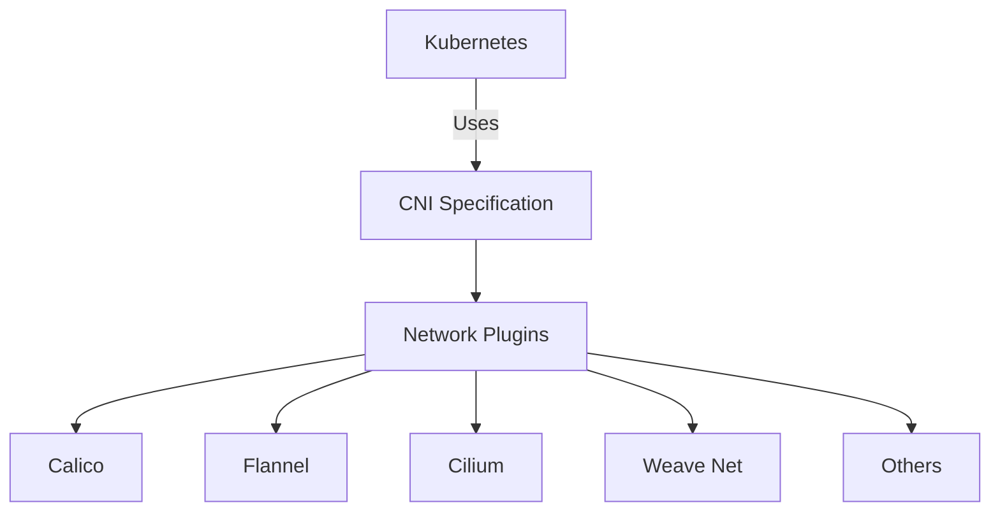
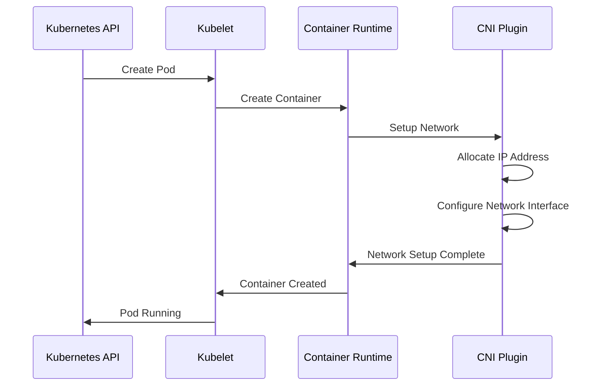

# Kubernetes Network Plugins

## Introduction

In a Kubernetes cluster, networking is a critical component that enables communication between pods, services, and external resources. Kubernetes network plugins, commonly known as Container Network Interface (CNI) plugins, provide the underlying networking capabilities that make this communication possible.

Network plugins implement the Kubernetes networking model, which specifies that:
- All pods can communicate with all other pods without NAT
- All nodes can communicate with all pods without NAT
- The IP that a pod sees itself as is the same IP that others see it as

In this guide, we'll explore various Kubernetes network plugins, how they work, and when to use each one.

## What are Container Network Interface (CNI) Plugins?

CNI is a specification and set of libraries for writing plugins to configure network interfaces in Linux containers. Kubernetes uses CNI plugins to set up networking for pods running on a cluster.



When a pod is scheduled on a node, the kubelet calls the CNI plugin to allocate an IP address and set up the necessary networking for the container.

## Common Kubernetes Network Plugins

Let's explore some of the most popular network plugins used in Kubernetes environments:

### 1. Flannel

Flannel is one of the simplest and most widely used network plugins for Kubernetes.

#### Key Features:
- Easy to set up and manage
- Provides a layer 3 IPv4 network
- Uses overlay networks to encapsulate packets
- Good choice for beginners and simple deployments

#### Installation Example:

```bash
# Apply the Flannel manifest from the official repository
kubectl apply -f https://raw.githubusercontent.com/flannel-io/flannel/master/Documentation/kube-flannel.yml

# Verify the installation
kubectl get pods -n kube-system | grep flannel
```

Output:
```
kube-flannel-ds-amd64-2c8kh    1/1     Running   0          45s
kube-flannel-ds-amd64-j9zk5    1/1     Running   0          45s
kube-flannel-ds-amd64-qmqz6    1/1     Running   0          45s
```

### 2. Calico

Calico is a networking and security solution that provides highly scalable networking capabilities.

#### Key Features:
- High performance with minimal overhead
- Advanced network policy capabilities
- Supports BGP for routing without overlay networks
- Excellent choice for production environments requiring network policies

#### Installation Example:

```bash
# Install Calico operator
kubectl create -f https://docs.projectcalico.org/manifests/tigera-operator.yaml

# Install Calico custom resources
kubectl create -f https://docs.projectcalico.org/manifests/custom-resources.yaml

# Verify the installation
kubectl get pods -n calico-system
```

Output:
```
NAME                                       READY   STATUS    RESTARTS   AGE
calico-kube-controllers-7b8458594b-6xcv8   1/1     Running   0          2m
calico-node-dlskj                          1/1     Running   0          2m
calico-node-k8zxs                          1/1     Running   0          2m
calico-node-tgcx2                          1/1     Running   0          2m
calico-typha-7cf97c5d6d-kdsjh              1/1     Running   0          2m
```

### 3. Cilium

Cilium is a CNI plugin focused on providing networking, security, and observability for container workloads.

#### Key Features:
- Uses eBPF for high-performance networking and security
- Layer 3-7 security and visibility
- Kubernetes network policies support
- Advanced features like load balancing and encryption

#### Installation Example:

```bash
# Install Cilium CLI
curl -L --remote-name-all https://github.com/cilium/cilium-cli/releases/latest/download/cilium-linux-amd64.tar.gz
sudo tar xzvfC cilium-linux-amd64.tar.gz /usr/local/bin
rm cilium-linux-amd64.tar.gz

# Install Cilium on the cluster
cilium install

# Verify the installation
cilium status
```

Output:
```
    /¯¯\
 /¯¯\__/¯¯\    Cilium:         OK
 \__/¯¯\__/    Operator:       OK
 /¯¯\__/¯¯\    Hubble:         disabled
 \__/¯¯\__/    ClusterMesh:    disabled
    \__/

DaemonSet         cilium             Desired: 3, Ready: 3/3, Available: 3/3
Deployment        cilium-operator    Desired: 1, Ready: 1/1, Available: 1/1
```

### 4. Weave Net

Weave Net is a CNI plugin that creates a virtual network for connecting Docker containers across multiple hosts.

#### Key Features:
- Simple setup with minimal configuration
- Automatic IP address allocation
- Built-in DNS for service discovery
- Network encryption capabilities

#### Installation Example:

```bash
# Apply the Weave Net manifest
kubectl apply -f "https://cloud.weave.works/k8s/net?k8s-version=$(kubectl version | base64 | tr -d '
')"

# Verify the installation
kubectl get pods -n kube-system | grep weave
```

Output:
```
weave-net-1jkl6   2/2     Running   0          45s
weave-net-7vcxz   2/2     Running   0          45s
weave-net-jqp8n   2/2     Running   0          45s
```

## How Network Plugins Work

Let's explore how network plugins work in Kubernetes:

1. **Pod Creation**: When a pod is created, Kubernetes calls the container runtime (like containerd or Docker).

2. **CNI Invocation**: The container runtime invokes the configured CNI plugin.

3. **Network Configuration**: The CNI plugin:
   - Allocates an IP address for the pod
   - Sets up the network interface in the pod's network namespace
   - Configures routes, iptables rules, etc.

4. **Connectivity**: The pod can now communicate with other pods, services, and the external world based on the networking rules.



## Choosing the Right Network Plugin

Selecting the appropriate network plugin depends on your specific requirements:

| Plugin | Best For | Key Strength | Limitations |
|--------|----------|--------------|-------------|
| Flannel | Simple deployments, beginners | Ease of use | Limited network policy support |
| Calico | Production environments, advanced security | Network policies, performance | More complex to configure |
| Cilium | Security-focused applications, microservices | Deep visibility, eBPF | Steeper learning curve |
| Weave Net | Multi-cloud, hybrid deployments | Simplicity with features | Performance overhead with encryption |

Consider the following factors when choosing a network plugin:

1. **Performance Requirements**: If your workloads are network-intensive, plugins like Calico or Cilium may offer better performance.

2. **Security Needs**: If you need advanced network policies, consider Calico or Cilium.

3. **Scalability**: For large clusters, ensure your chosen plugin can handle the scale.

4. **Ease of Management**: For smaller teams or simpler deployments, Flannel or Weave Net might be easier to manage.

## Practical Example: Network Policy Implementation

Let's walk through a practical example of implementing network policies with Calico:

1. First, verify Calico is running on your cluster:

```bash
kubectl get pods -n calico-system
```

2. Create a simple namespace for our test application:

```bash
kubectl create namespace network-policy-demo
```

3. Deploy a sample application:

```bash
cat <<EOF | kubectl apply -f -
apiVersion: apps/v1
kind: Deployment
metadata:
  name: nginx
  namespace: network-policy-demo
spec:
  selector:
    matchLabels:
      app: nginx
  replicas: 2
  template:
    metadata:
      labels:
        app: nginx
    spec:
      containers:
      - name: nginx
        image: nginx:1.14.2
        ports:
        - containerPort: 80
---
apiVersion: v1
kind: Service
metadata:
  name: nginx
  namespace: network-policy-demo
spec:
  ports:
  - port: 80
    targetPort: 80
  selector:
    app: nginx
EOF
```

4. Create a network policy to allow traffic only from pods with the label `access: allowed`:

```bash
cat <<EOF | kubectl apply -f -
apiVersion: networking.k8s.io/v1
kind: NetworkPolicy
metadata:
  name: nginx-policy
  namespace: network-policy-demo
spec:
  podSelector:
    matchLabels:
      app: nginx
  ingress:
  - from:
    - podSelector:
        matchLabels:
          access: allowed
    ports:
    - protocol: TCP
      port: 80
EOF
```

5. Test the policy by creating two pods, one with the required label and one without:

```bash
# Create allowed pod
cat <<EOF | kubectl apply -f -
apiVersion: v1
kind: Pod
metadata:
  name: allowed-pod
  namespace: network-policy-demo
  labels:
    access: allowed
spec:
  containers:
  - name: busybox
    image: busybox
    command: ["sleep", "3600"]
EOF

# Create denied pod
cat <<EOF | kubectl apply -f -
apiVersion: v1
kind: Pod
metadata:
  name: denied-pod
  namespace: network-policy-demo
spec:
  containers:
  - name: busybox
    image: busybox
    command: ["sleep", "3600"]
EOF
```

6. Test connectivity:

```bash
# From allowed pod - this should work
kubectl exec -n network-policy-demo allowed-pod -- wget -O- --timeout=5 nginx

# From denied pod - this should fail
kubectl exec -n network-policy-demo denied-pod -- wget -O- --timeout=5 nginx
```

Expected output from allowed pod:
```
<!DOCTYPE html>
<html>
<head>
<title>Welcome to nginx!</title>
...
</html>
```

Expected output from denied pod:
```
wget: download timed out
command terminated with exit code 1
```

This example demonstrates how network plugins like Calico can implement Kubernetes network policies to secure your cluster.

## Troubleshooting Network Plugin Issues

Common network plugin issues and how to troubleshoot them:

### 1. Pod Stuck in ContainerCreating State

Check if the CNI plugin is properly installed:

```bash
# Check CNI plugin pods
kubectl get pods -n kube-system | grep cni

# Check logs of plugin pods
kubectl logs -n kube-system <plugin-pod-name>
```

### 2. Pods Cannot Communicate

Check if pods have proper IP addresses:

```bash
# Get pod IP addresses
kubectl get pods -o wide

# Check connectivity from a debug pod
kubectl run tmp-shell --rm -i --tty --image nicolaka/netshoot -- /bin/bash
```

Inside the debug pod:
```bash
# Ping another pod
ping <pod-ip>

# Check routes
ip route

# Trace network path
traceroute <pod-ip>
```

### 3. Services Not Accessible

Verify kube-proxy is functioning:

```bash
# Check kube-proxy status
kubectl get pods -n kube-system | grep kube-proxy

# Check kube-proxy logs
kubectl logs -n kube-system <kube-proxy-pod-name>
```

## Summary

Kubernetes network plugins (CNI plugins) are essential components that enable container networking within Kubernetes clusters. They implement the Kubernetes networking model and provide various features like IP address management, network isolation, and security policies.

Key takeaways:
1. CNI plugins follow a standardized interface to configure container networking
2. Popular plugins include Flannel, Calico, Cilium, and Weave Net
3. Choose the right plugin based on your performance, security, and management requirements
4. Network policies provide security and isolation between workloads
5. Troubleshooting network issues often involves checking plugin installation, pod connectivity, and service functionality

By understanding how network plugins work and how to choose the right one for your needs, you can build more robust and secure Kubernetes clusters.

## Additional Resources

To deepen your knowledge of Kubernetes networking and CNI plugins:

1. Explore the official Kubernetes documentation on [network plugins](https://kubernetes.io/docs/concepts/extend-kubernetes/compute-storage-net/network-plugins/)
2. Learn more about [network policies](https://kubernetes.io/docs/concepts/services-networking/network-policies/)
3. Review the [CNI specification](https://github.com/containernetworking/cni/blob/master/SPEC.md)
4. Experiment with different network plugins in a test cluster

## Exercises

1. **Basic**: Install Flannel on a test Kubernetes cluster and deploy a simple application to verify connectivity.

2. **Intermediate**: Compare the performance of Flannel and Calico by running network benchmarks between pods.

3. **Advanced**: Implement network policies that allow specific microservices to communicate only with authorized services in a multi-tier application.

4. **Expert**: Create a custom CNI plugin configuration that combines features from multiple plugins to meet specific requirements for your application.