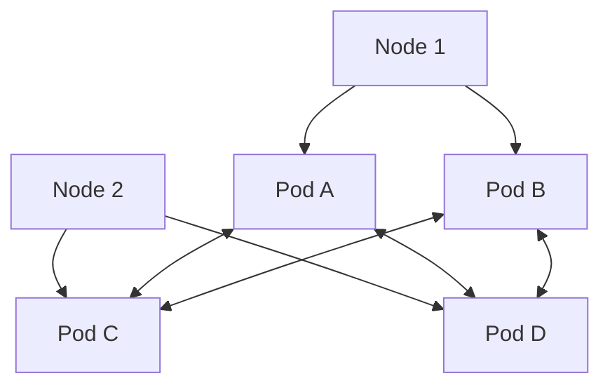

# Kubernetes Network Troubleshooting

## Introduction

Networking is one of the most complex aspects of Kubernetes. When applications misbehave or become unreachable, the network layer is often the first suspect. This guide will walk you through the fundamentals of Kubernetes networking and provide practical approaches to diagnosing and resolving common networking issues.

By the end of this guide, you'll understand how Kubernetes networking works under the hood and have a toolkit of commands and strategies to effectively troubleshoot network problems in your clusters.

## Understanding Kubernetes Networking Fundamentals

Before diving into troubleshooting, it's important to understand the basics of how Kubernetes networking operates.

### The Kubernetes Networking Model

Kubernetes follows these fundamental networking principles:

- Every Pod gets its own unique IP address
- Pods can communicate with all other pods without NAT
- Nodes can communicate with all pods without NAT
- A pod's self-perceived IP is the same as how others see it



### Networking Components

The key components in Kubernetes networking are:

1. **Pod Network**: Connects pods across nodes
2. **Service Network**: Provides stable endpoints for pods
3. **Cluster DNS**: Enables service discovery
4. **Network Policies**: Control traffic between pods
5. **Ingress Controllers**: Manage external HTTP/HTTPS routes
6. **Container Network Interface (CNI)**: Plugin that implements the network

## Common Kubernetes Network Issues

Let's explore the most common networking issues you might encounter in a Kubernetes environment.

### 1. Pod-to-Pod Communication Failures

When pods can't communicate with each other, it's usually due to:

- Misconfigured CNI plugins
- Network policies blocking traffic
- Routing problems between nodes
- Incorrect DNS resolution

### 2. Service Connectivity Problems

Services act as stable endpoints for pod access. Issues might include:

- Incorrect selector labels
- Misconfigured service ports
- Endpoints not registering
- kube-proxy issues

### 3. DNS Resolution Failures

CoreDNS (or other DNS providers) can experience problems:

- CoreDNS pods not running properly
- Misconfigured DNS Policy for pods
- DNS timeouts or intermittent failures
- Incorrect DNS service configuration

### 4. External Traffic Issues

External access problems often relate to:

- Misconfigured Ingress resources
- LoadBalancer provisioning failures
- NodePort accessibility issues
- Network policy restrictions

## Essential Troubleshooting Tools

Let's get familiar with the key tools you'll use for network troubleshooting in Kubernetes.

### Basic Kubernetes Commands

```bash
# Check pod status and IP addresses
kubectl get pods -o wide

# Check service details
kubectl get service <service-name>

# View endpoint details for a service
kubectl get endpoints <service-name>

# Describe resources for detailed information
kubectl describe pod <pod-name>
kubectl describe service <service-name>
```

### Network Diagnosis Tools

Most of these tools can be run from a temporary debug pod if they're not available in your workload pods:

```bash
# Create a temporary debug pod
kubectl run network-debug --rm -it --image=nicolaka/netshoot -- /bin/bash
```

Inside this pod, you can use:

```bash
# Test connectivity to other pods or services
ping <ip-address>
curl <service-name>:<port>

# DNS lookup
nslookup <service-name>
dig <service-name>.<namespace>.svc.cluster.local

# Trace network paths
traceroute <ip-address>

# Monitor network traffic
tcpdump -i any port <port-number>
```

## Step-by-Step Troubleshooting Approach

Let's walk through a systematic process for diagnosing network issues in Kubernetes.

### Step 1: Verify Pod Status

First, check if all pods are running correctly:

```bash
kubectl get pods -o wide
```

Expected output:
```
NAME                     READY   STATUS    RESTARTS   AGE   IP           NODE
nginx-75f59d57b4-xd7bz   1/1     Running   0          1h    10.244.1.4   worker-1
web-app-9f8b7c6d5-2s1f3  1/1     Running   0          2h    10.244.2.5   worker-2
```

If pods are in pending or crashloopbackoff status, they won't be accessible on the network.

### Step 2: Check Service Configuration

Verify your service is properly configured:

```bash
kubectl get service <service-name>
```

Expected output:
```
NAME       TYPE        CLUSTER-IP      EXTERNAL-IP   PORT(S)    AGE
web-app    ClusterIP   10.96.145.123   <none>        8080/TCP   3h
```

Then check if endpoints are properly associated:

```bash
kubectl get endpoints <service-name>
```

Expected output:
```
NAME       ENDPOINTS                            AGE
web-app    10.244.2.5:8080                      3h
```

If no endpoints are listed, your service selector may not match any pods.

### Step 3: Test Network Connectivity

Create a debug pod to test connectivity:

```bash
kubectl run debug-pod --rm -it --image=busybox -- /bin/sh
```

Once inside, test connectivity to your service:

```bash
# Try to reach a service
wget -O- http://web-app:8080

# Try to reach a pod directly
wget -O- http://10.244.2.5:8080

# Check DNS resolution
nslookup web-app
```

Expected output for DNS resolution:
```
Server:    10.96.0.10
Address 1: 10.96.0.10 kube-dns.kube-system.svc.cluster.local

Name:      web-app
Address 1: 10.96.145.123 web-app.default.svc.cluster.local
```

### Step 4: Examine Network Policies

Network policies can restrict traffic between pods:

```bash
kubectl get networkpolicies
kubectl describe networkpolicy <policy-name>
```

Look for any policies that might be blocking communication between your pods or services.

### Step 5: Check CNI Plugin Status

Verify your Container Network Interface (CNI) plugin is functioning correctly:

```bash
# For Calico
kubectl get pods -n kube-system | grep calico

# For Flannel
kubectl get pods -n kube-system | grep flannel

# For Weave
kubectl get pods -n kube-system | grep weave
```

All CNI plugin pods should be in the Running state.

### Step 6: Analyze Pod Logs

Check logs for any networking-related errors:

```bash
kubectl logs <pod-name>
kubectl logs -n kube-system <cni-pod-name>
```

## Real-World Troubleshooting Scenarios

Let's walk through some common real-world scenarios and how to troubleshoot them.

### Scenario 1: Service Not Accessible

**Problem**: A newly deployed service isn't reachable from other pods.

**Investigation**:

1. Check if service and endpoints exist:

```bash
kubectl get svc my-service
kubectl get endpoints my-service
```

2. If no endpoints are visible, verify your service selector matches pod labels:

```bash
kubectl describe svc my-service
kubectl get pods --show-labels | grep <app-label>
```

3. Test direct pod connectivity to rule out service issues:

```bash
kubectl run debug --rm -it --image=busybox -- /bin/sh
# Inside the pod
wget -O- http://<pod-ip>:<port>
```

**Solution**: In many cases, the issue is a mismatch between service selectors and pod labels. Update either the service selector or pod labels to match.

### Scenario 2: DNS Resolution Failures

**Problem**: Pods can't resolve service names.

**Investigation**:

1. Check CoreDNS pods status:

```bash
kubectl get pods -n kube-system | grep coredns
```

2. Test DNS resolution from a debug pod:

```bash
kubectl run debug --rm -it --image=busybox -- /bin/sh
# Inside the pod
nslookup kubernetes.default.svc.cluster.local
nslookup <your-service>.<namespace>.svc.cluster.local
```

3. Verify the kube-dns service is running:

```bash
kubectl get svc -n kube-system | grep kube-dns
```

4. Check CoreDNS configuration:

```bash
kubectl -n kube-system get configmap coredns -o yaml
```

**Solution**: Often the issue is related to CoreDNS pods not running correctly. Restart them or check if they have sufficient resources.

### Scenario 3: Intermittent Connection Issues

**Problem**: Network connections between pods occasionally fail.

**Investigation**:

1. Check for resource constraints:

```bash
kubectl top nodes
kubectl top pods
```

2. Monitor network connections over time:

```bash
# In a debug pod with netshoot
watch -n1 "netstat -an | grep ESTABLISHED | wc -l"
```

3. Check for packet loss:

```bash
# In a debug pod
ping -c 100 <destination-ip> | grep loss
```

**Solution**: This is often caused by resource constraints or CNI plugin issues. Upgrade your CNI plugin version or allocate more resources to worker nodes.

## Advanced Network Troubleshooting

For persistent or complex issues, consider these advanced techniques:

### Packet Capturing

To analyze traffic at a low level:

```bash
# Install tcpdump if needed
apt-get update && apt-get install -y tcpdump

# Capture packets on a specific interface
tcpdump -i eth0 port 80 -w capture.pcap
```

### Tracing Network Paths

To see how traffic flows between pods:

```bash
# Install traceroute if needed
apt-get update && apt-get install -y traceroute

# Trace the route to a destination
traceroute <destination-ip>
```

### Analyzing Iptables Rules

Kubernetes services rely on iptables:

```bash
# Get iptables rules
iptables-save | grep <service-ip>
```

### Network Plugin Debugging

Each CNI plugin offers specific debugging tools:

```bash
# Calico
calicoctl node status
calicoctl get ippool

# Flannel
cat /run/flannel/subnet.env

# Weave
weave status
```

## Best Practices for Kubernetes Network Management

To minimize networking issues, follow these best practices:

1. **Use Network Policies**: Implement network policies to control traffic flow and improve security
2. **Monitor Network Metrics**: Set up monitoring for network latency, packet loss, and connection counts
3. **Choose the Right CNI Plugin**: Select a CNI plugin that aligns with your performance and feature requirements
4. **Document Network Architecture**: Maintain documentation of your network setup, including CIDR ranges
5. **Regularly Update CNI Plugins**: Keep network plugins updated to benefit from bug fixes and performance improvements
6. **Plan IP Address Management**: Ensure sufficient IP address space for pod and service growth

## Summary

Kubernetes networking can be complex, but with a systematic troubleshooting approach, you can identify and resolve issues efficiently. Remember these key points:

- Understand the Kubernetes networking model and components
- Use a methodical, step-by-step approach to isolate problems
- Leverage the right tools for diagnosis (kubectl, debug pods, network utilities)
- Check configurations at every level (pods, services, DNS, CNI)
- Consider network policies and security implications

By applying these techniques, you'll be better equipped to maintain reliable network connectivity in your Kubernetes clusters.

## Additional Resources

- [Kubernetes Networking Documentation](https://kubernetes.io/docs/concepts/cluster-administration/networking/)
- [Kubernetes Services Documentation](https://kubernetes.io/docs/concepts/services-networking/service/)
- [Kubernetes Network Policies](https://kubernetes.io/docs/concepts/services-networking/network-policies/)

## Practice Exercises

1. Deploy a multi-tier application with frontend, backend, and database services, then verify connectivity between all components.
2. Intentionally misconfigure a service selector and practice troubleshooting to identify and fix the issue.
3. Implement a network policy that restricts pod communication, then test and verify the policy works as expected.
4. Set up a debug pod with network tools and practice diagnosing DNS and service connectivity issues.