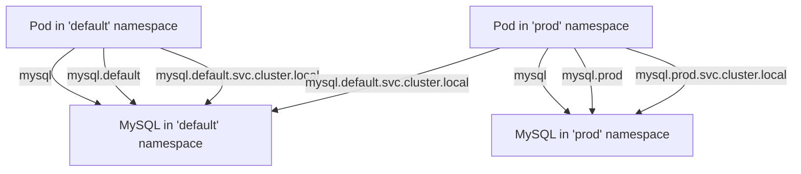

# Kubernetes DNS

## Introduction

When you're running applications in a Kubernetes cluster with dozens or hundreds of services, how do they find each other? This is where Kubernetes DNS comes into play. The Kubernetes DNS system provides a way for your applications to discover and communicate with each other using simple, human-readable names instead of having to track IP addresses that change frequently.

In this tutorial, we'll dive into how Kubernetes handles DNS resolution, how to configure it, and how to troubleshoot common DNS-related issues. By the end, you'll understand how DNS enables service discovery in Kubernetes, a critical component for building resilient, cloud-native applications.

## How Kubernetes DNS Works

### DNS Basics

Before diving into Kubernetes DNS, let's quickly review what DNS (Domain Name System) is. DNS is like a phonebook for the internet - it translates human-readable domain names (like `google.com`) into IP addresses that computers use to identify each other (like `142.250.190.78`).

### CoreDNS in Kubernetes

Kubernetes comes with a built-in DNS service, typically powered by [CoreDNS](https://coredns.io/), which runs as a set of pods in the `kube-system` namespace. This service creates DNS records for Kubernetes resources, allowing pods to find and communicate with each other using names rather than IP addresses.

```bash
$ kubectl get deployments -n kube-system -l k8s-app=kube-dns
NAME      READY   UP-TO-DATE   AVAILABLE   AGE
coredns   2/2     2            2           45d
```

### DNS Records in Kubernetes

Kubernetes automatically creates several types of DNS records:

1. **Pod DNS Records** - For each pod
2. **Service DNS Records** - For each service
3. **SRV Records** - For named ports

Let's examine how these work in practice.

## Service Discovery with DNS

### Service DNS Records

When you create a Kubernetes Service, it automatically gets assigned a DNS name following this pattern:
```
<service-name>.<namespace>.svc.cluster.local
```

For example, if you have a service called `web-frontend` in the `default` namespace, it can be accessed at:
```
web-frontend.default.svc.cluster.local
```

But within the same namespace, you can simply use the service name:
```
web-frontend
```

Let's see this in action with an example:

```yaml
apiVersion: v1
kind: Service
metadata:
  name: mysql
spec:
  ports:
  - port: 3306
  selector:
    app: mysql
```

After deploying this service, any pod in the same namespace can connect to MySQL using just `mysql` as the hostname. Pods in other namespaces would use `mysql.default.svc.cluster.local`.

### Pod DNS Records

Pods also get DNS records, but their format is a bit different:
```
<pod-ip-with-dashes>.<namespace>.pod.cluster.local
```

For example, a pod with IP `10.244.1.4` in the `backend` namespace would have the DNS name:
```
10-244-1-4.backend.pod.cluster.local
```

### Namespaces and DNS

Namespaces provide isolation in Kubernetes, and this extends to DNS as well. Services in different namespaces can have the same name without conflicts, as their fully qualified DNS names will be different.



## Configuring Pod DNS Settings

### DNS Policy

You can control how a pod resolves DNS by setting the `dnsPolicy` field in the pod specification:

```yaml
apiVersion: v1
kind: Pod
metadata:
  name: dns-example
spec:
  containers:
  - name: dns-example
    image: nginx
  dnsPolicy: ClusterFirst
```

Kubernetes supports four DNS policies:

1. **ClusterFirst** (Default): Queries that don't match the cluster domain suffix are forwarded to the upstream nameserver inherited from the node.
2. **Default**: The pod inherits the name resolution configuration from the node it runs on.
3. **ClusterFirstWithHostNet**: For pods running with hostNetwork.
4. **None**: Allows you to customize DNS settings using the `dnsConfig` field.

### Custom DNS Settings

For more control, you can use the `dnsConfig` field:

```yaml
apiVersion: v1
kind: Pod
metadata:
  name: dns-custom-example
spec:
  containers:
  - name: dns-custom-example
    image: nginx
  dnsPolicy: "None"
  dnsConfig:
    nameservers:
      - 1.1.1.1
      - 8.8.8.8
    searches:
      - ns1.svc.cluster.local
      - my.dns.search.suffix
    options:
      - name: ndots
        value: "2"
      - name: edns0
```

## Practical Examples

### Example 1: A Multi-Service Application

Imagine we're building a simple web application with a frontend, backend API, and a database. Here's how service discovery works:

```yaml
apiVersion: v1
kind: Service
metadata:
  name: frontend
spec:
  selector:
    app: frontend
  ports:
  - port: 80
---
apiVersion: v1
kind: Service
metadata:
  name: api
spec:
  selector:
    app: api
  ports:
  - port: 8080
---
apiVersion: v1
kind: Service
metadata:
  name: db
spec:
  selector:
    app: postgres
  ports:
  - port: 5432
```

Now, the frontend can connect to the API service using the URL `http://api:8080`, and the API service can connect to the database using `db:5432`. No hard-coded IP addresses needed!

### Example 2: Cross-Namespace Communication

Let's say we have a monitoring service in the `monitoring` namespace that needs to collect metrics from applications in various other namespaces.

```yaml
apiVersion: v1
kind: Pod
metadata:
  name: metrics-collector
  namespace: monitoring
spec:
  containers:
  - name: collector
    image: metrics-collector:v1
    env:
    - name: FRONTEND_URL
      value: "http://frontend.default.svc.cluster.local"
    - name: API_URL
      value: "http://api.default.svc.cluster.local:8080"
    - name: DB_URL 
      value: "postgres://db.default.svc.cluster.local:5432"
```

The metrics collector can reach services in other namespaces using their fully qualified domain names.

## Troubleshooting Kubernetes DNS

When DNS issues occur, they can be challenging to diagnose. Here are some common troubleshooting steps:

### 1. Check CoreDNS Pods

First, ensure the DNS service itself is running correctly:

```bash
$ kubectl get pods -n kube-system -l k8s-app=kube-dns
NAME                       READY   STATUS    RESTARTS   AGE
coredns-558bd4d5db-d9hkw   1/1     Running   0          5d
coredns-558bd4d5db-qbdv2   1/1     Running   0          5d
```

### 2. Test DNS Resolution from a Pod

You can run a temporary pod to test DNS resolution:

```bash
$ kubectl run dnsutils --image=gcr.io/kubernetes-e2e-test-images/dnsutils:1.3 --rm -it -- bash
If you don't see a command prompt, try pressing enter.
root@dnsutils:/# nslookup kubernetes.default.svc.cluster.local
Server:         10.96.0.10
Address:        10.96.0.10#53

Name:   kubernetes.default.svc.cluster.local
Address: 10.96.0.1
```

### 3. Check CoreDNS Configuration

Examine the CoreDNS configuration (stored in a ConfigMap):

```bash
$ kubectl get configmap -n kube-system coredns -o yaml
```

### 4. Look at Pod DNS Configuration

Inspect the `/etc/resolv.conf` file inside a problematic pod:

```bash
$ kubectl exec -it my-pod -- cat /etc/resolv.conf
nameserver 10.96.0.10
search default.svc.cluster.local svc.cluster.local cluster.local
options ndots:5
```

## Advanced Topics

### Customizing the DNS Service

You can customize the CoreDNS deployment by modifying its ConfigMap:

```yaml
apiVersion: v1
kind: ConfigMap
metadata:
  name: coredns
  namespace: kube-system
data:
  Corefile: |
    .:53 {
        errors
        health {
           lameduck 5s
        }
        ready
        kubernetes cluster.local in-addr.arpa ip6.arpa {
           pods insecure
           fallthrough in-addr.arpa ip6.arpa
           ttl 30
        }
        prometheus :9153
        forward . /etc/resolv.conf
        cache 30
        loop
        reload
        loadbalance
    }
```

### DNS for ExternalName Services

Kubernetes services of type `ExternalName` create a CNAME record, allowing you to access external services using internal DNS names:

```yaml
apiVersion: v1
kind: Service
metadata:
  name: external-database
  namespace: default
spec:
  type: ExternalName
  externalName: database.example.com
```

Now, pods in your cluster can connect to `external-database` and will be redirected to `database.example.com`.

### Headless Services

For stateful applications, you might need DNS records for individual pods. Headless services (with `clusterIP: None`) enable this:

```yaml
apiVersion: v1
kind: Service
metadata:
  name: cassandra
spec:
  clusterIP: None
  selector:
    app: cassandra
  ports:
  - port: 9042
```

This creates DNS entries for each pod selected by the service:
```
pod-name.cassandra.default.svc.cluster.local
```

## Summary

Kubernetes DNS is a fundamental component for service discovery in Kubernetes clusters. It allows your applications to find and communicate with each other using simple, human-readable names instead of IP addresses.

Key takeaways:
- Services get DNS records following the pattern `<service-name>.<namespace>.svc.cluster.local`
- Within the same namespace, you can use just the service name
- DNS respects namespace boundaries, providing isolation between environments
- You can customize DNS settings for pods using `dnsPolicy` and `dnsConfig`
- CoreDNS is the default DNS provider in modern Kubernetes clusters

By leveraging DNS for service discovery, you can build applications that are resilient to the dynamic nature of Kubernetes, where pods can be rescheduled and receive new IP addresses at any time.

## Further Resources

- [Kubernetes DNS for Services and Pods](https://kubernetes.io/docs/concepts/services-networking/dns-pod-service/)
- [CoreDNS Official Documentation](https://coredns.io/manual/toc/)
- [Deep Dive into Kubernetes DNS](https://blog.opstree.com/2020/04/08/a-deep-dive-into-kubernetes-dns/)

## Exercises

1. Deploy a simple two-tier application (web frontend and database) and configure them to communicate using DNS names.
2. Create a headless service and observe the DNS records created for the pods.
3. Set up a service in one namespace and try to access it from a pod in another namespace.
4. Modify the DNS settings of a pod to use a custom resolver like Google's `8.8.8.8`.
5. Use an ExternalName service to create a DNS alias for an external API that your application needs to connect to.