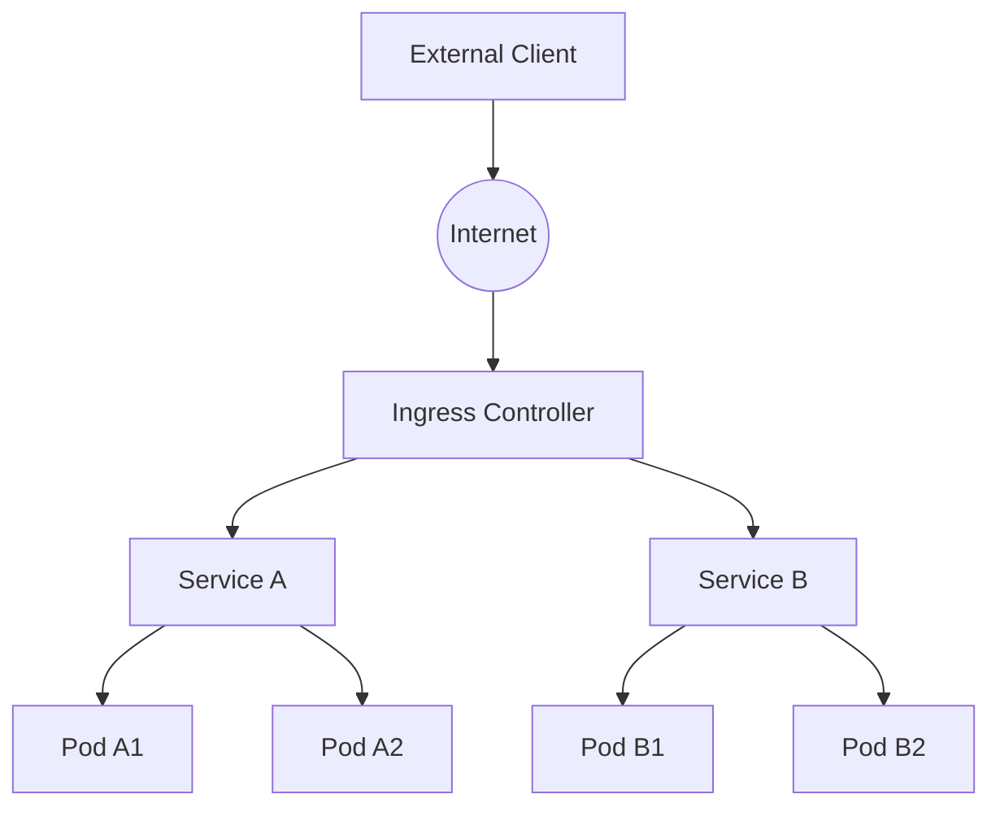

# Kubernetes Ingress

## Introduction

When running applications in Kubernetes, you'll often need to expose them to the outside world. While Services provide basic network connectivity, Ingress offers a more powerful way to route external HTTP/HTTPS traffic to your services.

In this tutorial, you'll learn what Ingress is, how it works, and how to implement it in your Kubernetes cluster. By the end, you'll be able to set up sophisticated routing rules for your applications.

## What is Kubernetes Ingress?

Ingress is a Kubernetes API object that manages external access to services within a cluster, typically HTTP/HTTPS traffic. It provides:

- **Load balancing**: Distribute incoming traffic across multiple backends
- **SSL/TLS termination**: Handle secure connections
- **Name-based virtual hosting**: Route traffic to different services based on hostnames
- **Path-based routing**: Direct requests to services based on URL paths

Here's how Ingress fits into the Kubernetes networking model:



## How Ingress Works

Ingress in Kubernetes consists of two components:

1. **Ingress Resource**: A Kubernetes API object that defines routing rules
2. **Ingress Controller**: Software that evaluates and processes the rules

### Ingress Resource

An Ingress resource is a YAML definition that specifies how external HTTP/HTTPS traffic should be routed to services within your cluster.

### Ingress Controller

The Ingress controller is the component that actually routes traffic according to the rules defined in your Ingress resources. Kubernetes doesn't come with an Ingress controller by default - you need to choose and install one such as:

- NGINX Ingress Controller
- HAProxy Ingress
- Traefik
- AWS ALB Ingress Controller
- GCE Ingress Controller

## Setting Up Your First Ingress

Let's walk through creating a basic Ingress setup:

### Step 1: Install an Ingress Controller

First, you need to install an Ingress controller. We'll use NGINX Ingress Controller as it's widely used:

```bash
# Using Helm
helm repo add ingress-nginx https://kubernetes.github.io/ingress-nginx
helm repo update
helm install ingress-nginx ingress-nginx/ingress-nginx

# Alternative: using kubectl
kubectl apply -f https://raw.githubusercontent.com/kubernetes/ingress-nginx/controller-v1.8.1/deploy/static/provider/cloud/deploy.yaml
```

### Step 2: Create Backend Services

Let's create two sample applications that we'll route traffic to:

```yaml
# app1-deployment.yaml
apiVersion: apps/v1
kind: Deployment
metadata:
  name: app1
spec:
  replicas: 2
  selector:
    matchLabels:
      app: app1
  template:
    metadata:
      labels:
        app: app1
    spec:
      containers:
      - name: app1
        image: nginx
        ports:
        - containerPort: 80
        volumeMounts:
        - name: html-volume
          mountPath: /usr/share/nginx/html
      volumes:
      - name: html-volume
        configMap:
          name: app1-html
---
apiVersion: v1
kind: ConfigMap
metadata:
  name: app1-html
data:
  index.html: |
    <!DOCTYPE html>
    <html>
    <body>
      <h1>App 1</h1>
      <p>This is the first application</p>
    </body>
    </html>
---
apiVersion: v1
kind: Service
metadata:
  name: app1-service
spec:
  selector:
    app: app1
  ports:
  - port: 80
    targetPort: 80
```

```yaml
# app2-deployment.yaml
apiVersion: apps/v1
kind: Deployment
metadata:
  name: app2
spec:
  replicas: 2
  selector:
    matchLabels:
      app: app2
  template:
    metadata:
      labels:
        app: app2
    spec:
      containers:
      - name: app2
        image: nginx
        ports:
        - containerPort: 80
        volumeMounts:
        - name: html-volume
          mountPath: /usr/share/nginx/html
      volumes:
      - name: html-volume
        configMap:
          name: app2-html
---
apiVersion: v1
kind: ConfigMap
metadata:
  name: app2-html
data:
  index.html: |
    <!DOCTYPE html>
    <html>
    <body>
      <h1>App 2</h1>
      <p>This is the second application</p>
    </body>
    </html>
---
apiVersion: v1
kind: Service
metadata:
  name: app2-service
spec:
  selector:
    app: app2
  ports:
  - port: 80
    targetPort: 80
```

Apply these configurations:

```bash
kubectl apply -f app1-deployment.yaml
kubectl apply -f app2-deployment.yaml
```

### Step 3: Create an Ingress Resource

Now, let's create an Ingress resource that routes traffic to our services:

```yaml
# my-ingress.yaml
apiVersion: networking.k8s.io/v1
kind: Ingress
metadata:
  name: my-ingress
  annotations:
    nginx.ingress.kubernetes.io/rewrite-target: /
spec:
  rules:
  - host: app1.example.com    # Replace with your actual domain
    http:
      paths:
      - path: /
        pathType: Prefix
        backend:
          service:
            name: app1-service
            port:
              number: 80
  - host: app2.example.com    # Replace with your actual domain
    http:
      paths:
      - path: /
        pathType: Prefix
        backend:
          service:
            name: app2-service
            port:
              number: 80
  # Path-based routing example
  - http:
      paths:
      - path: /app1
        pathType: Prefix
        backend:
          service:
            name: app1-service
            port:
              number: 80
      - path: /app2
        pathType: Prefix
        backend:
          service:
            name: app2-service
            port:
              number: 80
```

Apply this configuration:

```bash
kubectl apply -f my-ingress.yaml
```

Let's check the status of our Ingress:

```bash
kubectl get ingress
```

Output:
```
NAME         CLASS    HOSTS                                 ADDRESS        PORTS   AGE
my-ingress   <none>   app1.example.com,app2.example.com     192.168.0.1    80      2m
```

## Types of Ingress Configurations

### 1. Host-based Routing

Routes traffic to different services based on the hostname:

```yaml
apiVersion: networking.k8s.io/v1
kind: Ingress
metadata:
  name: host-based-routing
spec:
  rules:
  - host: service1.example.com
    http:
      paths:
      - path: /
        pathType: Prefix
        backend:
          service:
            name: service1
            port:
              number: 80
  - host: service2.example.com
    http:
      paths:
      - path: /
        pathType: Prefix
        backend:
          service:
            name: service2
            port:
              number: 80
```

### 2. Path-based Routing

Routes traffic to different services based on the URL path:

```yaml
apiVersion: networking.k8s.io/v1
kind: Ingress
metadata:
  name: path-based-routing
spec:
  rules:
  - http:
      paths:
      - path: /service1
        pathType: Prefix
        backend:
          service:
            name: service1
            port:
              number: 80
      - path: /service2
        pathType: Prefix
        backend:
          service:
            name: service2
            port:
              number: 80
```

### 3. TLS/SSL Configuration

Secures your endpoints with TLS:

```yaml
apiVersion: networking.k8s.io/v1
kind: Ingress
metadata:
  name: tls-example
spec:
  tls:
  - hosts:
    - secure.example.com
    secretName: tls-secret
  rules:
  - host: secure.example.com
    http:
      paths:
      - path: /
        pathType: Prefix
        backend:
          service:
            name: secure-service
            port:
              number: 80
```

To create the TLS secret:

```bash
# First, generate a self-signed certificate
openssl req -x509 -nodes -days 365 -newkey rsa:2048 -keyout tls.key -out tls.crt -subj "/CN=secure.example.com"

# Create the Kubernetes secret
kubectl create secret tls tls-secret --key tls.key --cert tls.crt
```

## Advanced Ingress Features

### Annotations

Ingress controllers support various features through annotations. Here are some examples for NGINX Ingress Controller:

```yaml
apiVersion: networking.k8s.io/v1
kind: Ingress
metadata:
  name: ingress-with-annotations
  annotations:
    # Rate limiting
    nginx.ingress.kubernetes.io/rate-limit-rps: "10"
    
    # Session affinity
    nginx.ingress.kubernetes.io/affinity: "cookie"
    
    # CORS configuration
    nginx.ingress.kubernetes.io/enable-cors: "true"
    
    # URL rewriting
    nginx.ingress.kubernetes.io/rewrite-target: /$2
spec:
  rules:
  - host: example.com
    http:
      paths:
      - path: /service1(/|$)(.*)
        pathType: Prefix
        backend:
          service:
            name: service1
            port:
              number: 80
```

### Canary Deployments

You can use annotations to implement canary releases (gradually rolling out changes):

```yaml
apiVersion: networking.k8s.io/v1
kind: Ingress
metadata:
  name: canary-ingress
  annotations:
    nginx.ingress.kubernetes.io/canary: "true"
    nginx.ingress.kubernetes.io/canary-weight: "20"
spec:
  rules:
  - host: example.com
    http:
      paths:
      - path: /
        pathType: Prefix
        backend:
          service:
            name: new-service-version
            port:
              number: 80
```

This configuration sends 20% of traffic to the new version.

## Real-world Example: Multi-Service Web Application

Let's consider a more complete example for a typical web application with multiple components:

```yaml
apiVersion: networking.k8s.io/v1
kind: Ingress
metadata:
  name: web-app-ingress
  annotations:
    nginx.ingress.kubernetes.io/ssl-redirect: "true"
spec:
  tls:
  - hosts:
    - mywebapp.com
    secretName: mywebapp-tls
  rules:
  - host: mywebapp.com
    http:
      paths:
      - path: /
        pathType: Prefix
        backend:
          service:
            name: frontend-service
            port:
              number: 80
      - path: /api
        pathType: Prefix
        backend:
          service:
            name: api-service
            port:
              number: 8080
      - path: /admin
        pathType: Prefix
        backend:
          service:
            name: admin-panel-service
            port:
              number: 80
      - path: /static
        pathType: Prefix
        backend:
          service:
            name: static-content-service
            port:
              number: 80
```

This Ingress routes:
- Main website requests to the frontend service
- API requests to a dedicated API service
- Admin panel requests to an admin service
- Static content to a static content service

## Troubleshooting Ingress

If you're having issues with your Ingress configuration, try these troubleshooting steps:

### 1. Check Ingress Status

```bash
kubectl get ingress
kubectl describe ingress your-ingress-name
```

Look for events and the Address field which should show the IP or hostname of your Ingress controller.

### 2. Check Ingress Controller Logs

```bash
# For NGINX Ingress Controller
kubectl logs -n ingress-nginx deployment/ingress-nginx-controller
```

### 3. Verify Backend Services

Make sure your services are running and reachable:

```bash
kubectl get svc
kubectl describe svc your-service-name
```

### 4. Test Direct Service Access

Check if the issue is with your services or the Ingress:

```bash
# Port-forward to test a service directly
kubectl port-forward svc/your-service-name 8080:80
# Then access http://localhost:8080 in your browser
```

### 5. Check DNS Configuration

If using hostname-based routing, ensure your DNS is configured correctly or add entries to your local hosts file for testing.

## Best Practices

1. **Use namespaces**: Organize your Ingress resources and related components in namespaces
2. **Implement TLS**: Always secure your external endpoints with TLS
3. **Set resource limits**: Configure resource requests and limits for your Ingress controller
4. **Monitor your Ingress**: Set up monitoring and alerting for your Ingress controller
5. **Use annotations wisely**: Understand the annotations supported by your chosen Ingress controller
6. **Consider IngressClass**: Use IngressClass to specify which Ingress controller should implement your Ingress

## Summary

Kubernetes Ingress provides a powerful way to manage external access to your services. In this tutorial, you've learned:

- What Ingress is and how it works within Kubernetes networking
- How to set up an Ingress controller and define Ingress resources
- Various Ingress configurations including host-based routing, path-based routing, and TLS
- Advanced features like annotations and canary deployments
- Troubleshooting techniques and best practices

With these skills, you can now implement sophisticated routing for your Kubernetes applications and expose them securely to the internet.

## Further Learning

To deepen your understanding of Kubernetes Ingress, you might want to explore:

- Different Ingress controllers and their specific features
- Service Mesh technologies like Istio that provide advanced traffic management
- Kubernetes Gateway API, which is the next evolution of Ingress

## Practice Exercises

1. Set up an Ingress controller in your local Kubernetes cluster (you can use Minikube or kind)
2. Create an Ingress that routes to at least two different backend services
3. Implement TLS termination for your Ingress
4. Try implementing a canary deployment using Ingress annotations
5. Configure rate limiting for one of your services