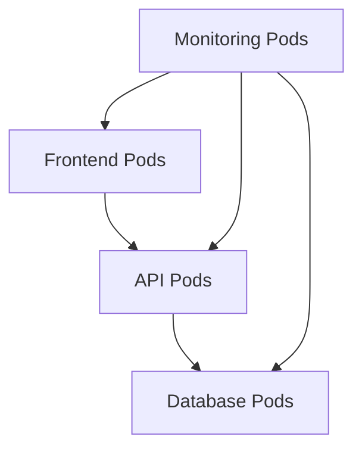
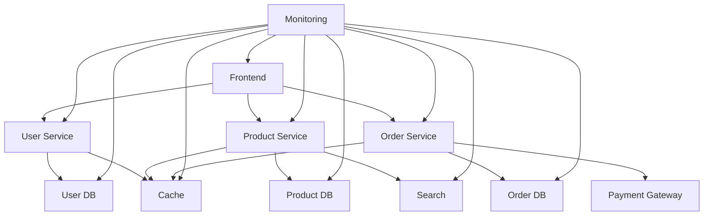

# Kubernetes NetworkPolicy

## Introduction

In a Kubernetes cluster, pods communicate with each other by default, regardless of which namespace they're in. This open communication model is simple but poses security challenges in production environments. **Kubernetes NetworkPolicy** provides a solution by allowing you to define rules that control the traffic flow between pods, effectively creating a network firewall for your applications.

Think of NetworkPolicy as a virtual firewall that helps you implement the principle of least privilege for network communication in your Kubernetes cluster. By defining which pods can talk to each other and on which ports, you can significantly enhance your application's security posture.

## Understanding NetworkPolicy Basics

### What is a NetworkPolicy?

A NetworkPolicy is a Kubernetes resource that specifies how groups of pods are allowed to communicate with each other and with other network endpoints. These policies use labels to select pods and define rules which specify what traffic is allowed to and from those pods.

### Default Behavior

Before diving into NetworkPolicy configurations, it's important to understand the default network behavior in Kubernetes:

1. **Without NetworkPolicies**: All pods can communicate with all other pods within the cluster.
2. **With NetworkPolicies**: Pods only accept the connections that are explicitly allowed by a NetworkPolicy that selects them.

### Prerequisites

To use NetworkPolicies, your Kubernetes cluster must have a network plugin that supports NetworkPolicy implementation. Some popular options include:

- Calico
- Cilium
- Antrea
- Weave Net

:::info
If you're using a managed Kubernetes service like GKE, EKS, or AKS, check the documentation to ensure NetworkPolicy support is enabled.
:::

## Basic NetworkPolicy Structure

A NetworkPolicy resource includes the following key components:

```yaml
apiVersion: networking.k8s.io/v1
kind: NetworkPolicy
metadata:
  name: example-policy
  namespace: default
spec:
  podSelector:
    matchLabels:
      role: db
  policyTypes:
  - Ingress
  - Egress
  ingress:
  - from:
    - podSelector:
        matchLabels:
          role: frontend
    ports:
    - protocol: TCP
      port: 3306
  egress:
  - to:
    - podSelector:
        matchLabels:
          role: monitoring
    ports:
    - protocol: TCP
      port: 8080
```

Let's break down the main parts:

1. **podSelector**: Determines which pods the policy applies to
2. **policyTypes**: Specifies whether the policy applies to ingress (incoming) traffic, egress (outgoing) traffic, or both
3. **ingress**: Rules for incoming connections
4. **egress**: Rules for outgoing connections

## Common NetworkPolicy Use Cases

Let's explore some practical scenarios where NetworkPolicies prove useful:

### 1. Default Deny All Traffic

One common pattern is to first lock down all traffic in a namespace and then selectively allow the communications you need. Here's how to deny all ingress traffic to pods in a namespace:

```yaml
apiVersion: networking.k8s.io/v1
kind: NetworkPolicy
metadata:
  name: default-deny-ingress
  namespace: secure-namespace
spec:
  podSelector: {}  # Empty podSelector matches all pods
  policyTypes:
  - Ingress
```

This policy selects all pods in the `secure-namespace` and denies all ingress traffic to them.

### 2. Allow Traffic Only From Specific Pods

This example allows database pods to receive traffic only from backend pods:

```yaml
apiVersion: networking.k8s.io/v1
kind: NetworkPolicy
metadata:
  name: db-access-policy
  namespace: default
spec:
  podSelector:
    matchLabels:
      app: database
  policyTypes:
  - Ingress
  ingress:
  - from:
    - podSelector:
        matchLabels:
          app: backend
    ports:
    - protocol: TCP
      port: 5432
```

### 3. Allow Traffic From Other Namespaces

You can allow pods from specific namespaces to access your services:

```yaml
apiVersion: networking.k8s.io/v1
kind: NetworkPolicy
metadata:
  name: allow-from-monitoring
  namespace: production
spec:
  podSelector:
    matchLabels:
      app: api
  policyTypes:
  - Ingress
  ingress:
  - from:
    - namespaceSelector:
        matchLabels:
          purpose: monitoring
    ports:
    - protocol: TCP
      port: 8080
```

### 4. Restrict External Traffic

You can also control which pods can communicate with external IPs:

```yaml
apiVersion: networking.k8s.io/v1
kind: NetworkPolicy
metadata:
  name: restrict-external-traffic
  namespace: default
spec:
  podSelector:
    matchLabels:
      app: webserver
  policyTypes:
  - Egress
  egress:
  - to:
    - ipBlock:
        cidr: 10.0.0.0/16
    ports:
    - protocol: TCP
      port: 443
```

## Building a Multi-Tier Application Network Security

Let's consider a practical example of implementing network policies for a typical three-tier web application:



Here's how we might set up NetworkPolicies for this architecture:

### Step 1: Create a default deny policy for each namespace

```yaml
apiVersion: networking.k8s.io/v1
kind: NetworkPolicy
metadata:
  name: default-deny-all
  namespace: application
spec:
  podSelector: {}
  policyTypes:
  - Ingress
  - Egress
```

### Step 2: Allow Frontend to API communication

```yaml
apiVersion: networking.k8s.io/v1
kind: NetworkPolicy
metadata:
  name: frontend-to-api
  namespace: application
spec:
  podSelector:
    matchLabels:
      app: api
  policyTypes:
  - Ingress
  ingress:
  - from:
    - podSelector:
        matchLabels:
          app: frontend
    ports:
    - protocol: TCP
      port: 8080
```

### Step 3: Allow API to Database communication

```yaml
apiVersion: networking.k8s.io/v1
kind: NetworkPolicy
metadata:
  name: api-to-database
  namespace: application
spec:
  podSelector:
    matchLabels:
      app: database
  policyTypes:
  - Ingress
  ingress:
  - from:
    - podSelector:
        matchLabels:
          app: api
    ports:
    - protocol: TCP
      port: 5432
```

### Step 4: Allow Monitoring to all components

```yaml
apiVersion: networking.k8s.io/v1
kind: NetworkPolicy
metadata:
  name: monitoring-access
  namespace: application
spec:
  podSelector:
    matchLabels:
      app: frontend
  policyTypes:
  - Ingress
  ingress:
  - from:
    - podSelector:
        matchLabels:
          app: monitoring
    ports:
    - protocol: TCP
      port: 9090
---
apiVersion: networking.k8s.io/v1
kind: NetworkPolicy
metadata:
  name: monitoring-to-api
  namespace: application
spec:
  podSelector:
    matchLabels:
      app: api
  policyTypes:
  - Ingress
  ingress:
  - from:
    - podSelector:
        matchLabels:
          app: monitoring
    ports:
    - protocol: TCP
      port: 9090
---
apiVersion: networking.k8s.io/v1
kind: NetworkPolicy
metadata:
  name: monitoring-to-db
  namespace: application
spec:
  podSelector:
    matchLabels:
      app: database
  policyTypes:
  - Ingress
  ingress:
  - from:
    - podSelector:
        matchLabels:
          app: monitoring
    ports:
    - protocol: TCP
      port: 9090
```

## Advanced NetworkPolicy Features

### Combining Multiple Selectors

You can create complex rules by combining different selectors:

```yaml
apiVersion: networking.k8s.io/v1
kind: NetworkPolicy
metadata:
  name: complex-policy
  namespace: default
spec:
  podSelector:
    matchLabels:
      app: web
  policyTypes:
  - Ingress
  ingress:
  - from:
    - podSelector:
        matchLabels:
          role: frontend
      namespaceSelector:
        matchLabels:
          env: production
    ports:
    - protocol: TCP
      port: 80
```

This policy allows ingress traffic to pods with label `app: web` from pods with label `role: frontend` only if they're in a namespace labeled `env: production`.

### Using ipBlock for External Traffic

You can specify CIDR ranges for external traffic:

```yaml
apiVersion: networking.k8s.io/v1
kind: NetworkPolicy
metadata:
  name: allow-specific-ips
spec:
  podSelector:
    matchLabels:
      app: api
  policyTypes:
  - Ingress
  ingress:
  - from:
    - ipBlock:
        cidr: 172.17.0.0/16
        except:
        - 172.17.1.0/24
```

### Combining Multiple Rules

You can specify multiple ingress or egress rules:

```yaml
apiVersion: networking.k8s.io/v1
kind: NetworkPolicy
metadata:
  name: multi-rule-policy
spec:
  podSelector:
    matchLabels:
      app: web
  policyTypes:
  - Ingress
  ingress:
  - from:
    - podSelector:
        matchLabels:
          role: frontend
    ports:
    - protocol: TCP
      port: 80
  - from:
    - podSelector:
        matchLabels:
          role: monitoring
    ports:
    - protocol: TCP
      port: 9090
```

## Troubleshooting NetworkPolicies

NetworkPolicies can be challenging to troubleshoot. Here are some common issues and solutions:

### Issue 1: Policy Not Being Applied

**Symptoms:**
- Pods can still communicate despite NetworkPolicy restrictions

**Solutions:**
- Verify your network plugin supports NetworkPolicies
- Check pod labels match the podSelector in your policy
- Ensure the policy is in the correct namespace

### Issue 2: Unexpected Blocked Traffic

**Symptoms:**
- Traffic that should be allowed is being blocked

**Solutions:**
- Use `kubectl describe networkpolicy <policy-name>` to check the policy configuration
- Verify the labels on your pods with `kubectl get pods --show-labels`
- Check if multiple NetworkPolicies are creating conflicting rules

### Debugging Tools

Some useful commands for debugging NetworkPolicies:

```bash
# List all NetworkPolicies
kubectl get networkpolicies --all-namespaces

# Describe a specific NetworkPolicy
kubectl describe networkpolicy <policy-name> -n <namespace>

# Check pod labels
kubectl get pods --show-labels -n <namespace>

# Test connectivity between pods using a temporary debug pod
kubectl run -it --rm debug --image=nicolaka/netshoot -- /bin/bash
```

## Best Practices for NetworkPolicies

1. **Start with default deny policies** for both ingress and egress, then selectively allow required traffic
2. **Use clear, descriptive policy names** that indicate their function
3. **Label pods and namespaces consistently** to make NetworkPolicy targeting easier
4. **Document your network architecture** including which services need to communicate
5. **Test policies in a non-production environment** before applying to production
6. **Implement policies incrementally** and monitor for unexpected issues
7. **Use namespaceSelectors** to control cross-namespace communication
8. **Limit external traffic** with ipBlock selectors where possible

## Real-World Example: E-commerce Application

Let's implement NetworkPolicies for a more complex e-commerce application with the following components:

- Frontend (web, mobile-api)
- Backend services (user-service, product-service, order-service)
- Databases (user-db, product-db, order-db)
- Supporting services (cache, search, payment-gateway)

Here's a visual representation of our desired network flow:



Let's implement a few key NetworkPolicies for this architecture:

### 1. Frontend Access Policy

```yaml
apiVersion: networking.k8s.io/v1
kind: NetworkPolicy
metadata:
  name: frontend-access
  namespace: ecommerce
spec:
  podSelector:
    matchLabels:
      app: frontend
  policyTypes:
  - Ingress
  ingress:
  - from:
    - ipBlock:
        cidr: 0.0.0.0/0
    ports:
    - protocol: TCP
      port: 80
    - protocol: TCP
      port: 443
```

### 2. Backend Service Access

```yaml
apiVersion: networking.k8s.io/v1
kind: NetworkPolicy
metadata:
  name: backend-access
  namespace: ecommerce
spec:
  podSelector:
    matchExpressions:
    - {key: app, operator: In, values: [user-service, product-service, order-service]}
  policyTypes:
  - Ingress
  ingress:
  - from:
    - podSelector:
        matchLabels:
          app: frontend
    ports:
    - protocol: TCP
      port: 8080
  - from:
    - podSelector:
        matchLabels:
          app: monitoring
    ports:
    - protocol: TCP
      port: 9090
```

### 3. Database Access Policy

```yaml
apiVersion: networking.k8s.io/v1
kind: NetworkPolicy
metadata:
  name: user-db-access
  namespace: ecommerce
spec:
  podSelector:
    matchLabels:
      app: user-db
  policyTypes:
  - Ingress
  ingress:
  - from:
    - podSelector:
        matchLabels:
          app: user-service
    ports:
    - protocol: TCP
      port: 5432
  - from:
    - podSelector:
        matchLabels:
          app: monitoring
    ports:
    - protocol: TCP
      port: 9090
```

Similar policies would be created for product-db and order-db with their respective services.

## Summary

Kubernetes NetworkPolicies provide a powerful mechanism for controlling network traffic between pods in your cluster. By implementing these policies, you can:

- Enhance security by limiting communication paths
- Enforce the principle of least privilege for network access
- Isolate environments and create defense in depth
- Comply with security requirements and regulations

When working with NetworkPolicies, remember these key points:

1. NetworkPolicies are namespace-scoped resources
2. They're additive - multiple policies applied to the same pods are combined
3. They require a compatible network plugin in your Kubernetes cluster
4. Default behavior is to allow all traffic until NetworkPolicies are applied

By thoughtfully designing your NetworkPolicies to match your application's communication patterns, you can significantly improve your Kubernetes cluster's security posture without sacrificing functionality.

## Additional Resources

For further learning about Kubernetes NetworkPolicies, check out:

- [Kubernetes Network Policy Documentation](https://kubernetes.io/docs/concepts/services-networking/network-policies/)
- [Network Policy Editor](https://editor.cilium.io) - A visual tool for creating NetworkPolicies
- [Kubernetes Security Best Practices](https://kubernetes.io/docs/concepts/security/overview/)

## Exercises

1. Create a NetworkPolicy that denies all ingress and egress traffic in a namespace, then add exceptions for DNS resolution.
2. Implement NetworkPolicies for a microservices application with at least three services that communicate with each other.
3. Create a NetworkPolicy that allows incoming traffic only from pods in a specific namespace and from a specific CIDR range.
4. Design NetworkPolicies for a multi-environment deployment (dev, staging, production) where services in staging can talk to dev but not to production.
5. Implement NetworkPolicies for an application that needs to make external API calls to specific endpoints only.