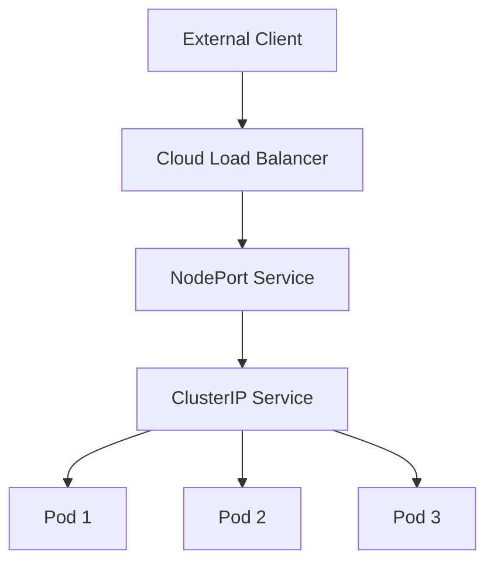

# Kubernetes LoadBalancer

## Introduction

When deploying applications in Kubernetes, making them accessible outside the cluster is a common requirement. Kubernetes offers several ways to expose your applications, with the LoadBalancer Service type being one of the most powerful options for production environments.

A LoadBalancer Service is a Kubernetes resource that provisions an external load balancer in your cloud environment (like AWS, GCP, or Azure), configures it to send traffic to your Service, and exposes it with an external IP address. This provides a straightforward way to route external traffic to your applications running inside Kubernetes.

## How LoadBalancer Services Work

To understand LoadBalancer Services, let's first review the Kubernetes Service types hierarchy:

1. **ClusterIP** (default): Exposes the Service on an internal IP within the cluster
2. **NodePort**: Exposes the Service on each Node's IP at a static port
3. **LoadBalancer**: Exposes the Service externally using a cloud provider's load balancer
4. **ExternalName**: Maps the Service to a DNS name

The LoadBalancer Service type builds on the NodePort Service type. When you create a LoadBalancer Service:

1. Kubernetes creates a ClusterIP Service
2. It then creates a NodePort Service that routes to the ClusterIP Service
3. Finally, it interacts with the cloud provider's API to provision an external load balancer that routes to the NodePort Service



## When to Use a LoadBalancer

LoadBalancer Services are ideal when:

- You need a public, stable IP address for your service
- You want built-in load balancing capabilities
- You're running in a cloud environment that supports automatic load balancer provisioning
- You need to expose a service externally in a production environment

## Implementing a LoadBalancer Service

Let's look at how to create a LoadBalancer Service to expose a simple web application.

### Step 1: Deploy an Application

First, let's create a simple web application deployment:

```yaml
apiVersion: apps/v1
kind: Deployment
metadata:
  name: web-app
spec:
  replicas: 3
  selector:
    matchLabels:
      app: web-app
  template:
    metadata:
      labels:
        app: web-app
    spec:
      containers:
      - name: web-app
        image: nginx:latest
        ports:
        - containerPort: 80
```

Save this as `web-app-deployment.yaml` and apply it:

```bash
kubectl apply -f web-app-deployment.yaml
```

### Step 2: Create a LoadBalancer Service

Now, create a LoadBalancer Service to expose your application:

```yaml
apiVersion: v1
kind: Service
metadata:
  name: web-app-lb
spec:
  type: LoadBalancer
  ports:
  - port: 80
    targetPort: 80
    protocol: TCP
  selector:
    app: web-app
```

Save this as `web-app-loadbalancer.yaml` and apply it:

```bash
kubectl apply -f web-app-loadbalancer.yaml
```

### Step 3: Verify the Service

Check the Service status:

```bash
kubectl get services
```

Output:
```
NAME         TYPE           CLUSTER-IP      EXTERNAL-IP     PORT(S)        AGE
kubernetes   ClusterIP      10.96.0.1       <none>          443/TCP        24h
web-app-lb   LoadBalancer   10.96.150.12    34.123.456.78   80:30234/TCP   2m
```

The `EXTERNAL-IP` field shows the IP address assigned by your cloud provider's load balancer. If it displays `<pending>`, wait a few minutes for the load balancer to be provisioned.

### Step 4: Access Your Application

Once the external IP is available, you can access your application using that IP:

```bash
curl http://34.123.456.78
```

Or simply open the IP in a web browser.

## Advanced Configuration Options

### Health Checks

Cloud providers use health checks to determine if your backend pods are healthy. You can configure these using annotations:

```yaml
apiVersion: v1
kind: Service
metadata:
  name: web-app-lb
  annotations:
    service.beta.kubernetes.io/aws-load-balancer-healthcheck-interval: '10'
    service.beta.kubernetes.io/aws-load-balancer-healthcheck-path: '/healthz'
spec:
  type: LoadBalancer
  ports:
  - port: 80
    targetPort: 80
  selector:
    app: web-app
```

The annotations above are specific to AWS. Different cloud providers use different annotations.

### Session Affinity

You can ensure that all requests from a single client are sent to the same pod using session affinity:

```yaml
apiVersion: v1
kind: Service
metadata:
  name: web-app-lb
spec:
  type: LoadBalancer
  sessionAffinity: ClientIP
  ports:
  - port: 80
    targetPort: 80
  selector:
    app: web-app
```

### Internal Load Balancer

In many cloud providers, you can create an internal load balancer (not exposed to the internet) using annotations:

```yaml
apiVersion: v1
kind: Service
metadata:
  name: internal-app
  annotations:
    service.beta.kubernetes.io/aws-load-balancer-internal: "true"
spec:
  type: LoadBalancer
  ports:
  - port: 80
    targetPort: 80
  selector:
    app: internal-app
```

## LoadBalancer Implementations

### Cloud Provider Load Balancers

Each cloud provider implements the LoadBalancer Service type differently:

- **AWS**: Provisions an Elastic Load Balancer (ELB) or Network Load Balancer (NLB)
- **GCP**: Creates a Cloud Load Balancer
- **Azure**: Sets up an Azure Load Balancer
- **DigitalOcean**: Provisions a DigitalOcean Load Balancer

### On-Premise Solutions

For on-premise Kubernetes clusters, you can use:

- **MetalLB**: A load-balancer implementation for bare metal Kubernetes clusters
- **OpenELB**: An open-source load balancer implementation designed for bare metal environments

Let's look at a simple MetalLB configuration:

```yaml
apiVersion: v1
kind: ConfigMap
metadata:
  namespace: metallb-system
  name: config
data:
  config: |
    address-pools:
    - name: default
      protocol: layer2
      addresses:
      - 192.168.1.240-192.168.1.250
```

This configures MetalLB to assign IP addresses from the specified range to LoadBalancer Services.

## Common Issues and Troubleshooting

### Pending External IP

If your service's external IP remains in the `<pending>` state:

1. Verify your cloud provider credentials and configuration
2. Check if you've reached your load balancer quota
3. Look for error messages in the cloud controller manager logs:

```bash
kubectl logs -n kube-system -l k8s-app=cloud-controller-manager
```

### High Latency

If you notice high latency or connection issues:

1. Check the health check settings
2. Ensure your pods are distributed across multiple availability zones
3. Verify that your application is responding properly to health checks

## Real-World Example: High-Availability Web Application

Let's deploy a complete high-availability web application with a database backend:

### Frontend Deployment and Service

```yaml
apiVersion: apps/v1
kind: Deployment
metadata:
  name: frontend
spec:
  replicas: 3
  selector:
    matchLabels:
      app: frontend
  template:
    metadata:
      labels:
        app: frontend
    spec:
      containers:
      - name: frontend
        image: my-frontend-app:latest
        ports:
        - containerPort: 80
        readinessProbe:
          httpGet:
            path: /healthz
            port: 80
          initialDelaySeconds: 5
          periodSeconds: 10
---
apiVersion: v1
kind: Service
metadata:
  name: frontend-lb
  annotations:
    service.beta.kubernetes.io/aws-load-balancer-type: "nlb"
    service.beta.kubernetes.io/aws-load-balancer-cross-zone-load-balancing-enabled: "true"
spec:
  type: LoadBalancer
  ports:
  - port: 80
    targetPort: 80
  selector:
    app: frontend
```

### Backend Deployment and Service

```yaml
apiVersion: apps/v1
kind: Deployment
metadata:
  name: backend
spec:
  replicas: 3
  selector:
    matchLabels:
      app: backend
  template:
    metadata:
      labels:
        app: backend
    spec:
      containers:
      - name: backend
        image: my-backend-app:latest
        ports:
        - containerPort: 8080
---
apiVersion: v1
kind: Service
metadata:
  name: backend
spec:
  type: ClusterIP  # Only frontend needs external exposure
  ports:
  - port: 8080
    targetPort: 8080
  selector:
    app: backend
```

## Summary

Kubernetes LoadBalancer Services provide a powerful way to expose your applications to the outside world when running in cloud environments. They:

- Leverage cloud provider load balancers for high availability and reliability
- Distribute traffic across multiple pods
- Provide a stable external IP address
- Simplify external access configuration

While LoadBalancer Services are primarily designed for cloud environments, solutions like MetalLB bring similar functionality to on-premise clusters.

When designing your Kubernetes network architecture, consider whether you need the full capabilities of a LoadBalancer Service or if other options like Ingress controllers might be more appropriate for your use case.

## Additional Resources

- [Kubernetes Services Documentation](https://kubernetes.io/docs/concepts/services-networking/service/)
- [Cloud Provider LoadBalancer Configuration](https://kubernetes.io/docs/concepts/services-networking/service/#loadbalancer)
- [MetalLB for On-Premise Clusters](https://metallb.universe.tf/)

## Exercises

1. Deploy a simple web application and expose it using a LoadBalancer Service.
2. Configure session affinity and observe the behavior when repeatedly accessing the service.
3. If using a cloud provider, explore the various annotations available for customizing your load balancer.
4. Create an internal load balancer and verify that it's not accessible from the internet.
5. Set up MetalLB in a local Kubernetes cluster (like Minikube or Kind) and test LoadBalancer functionality.