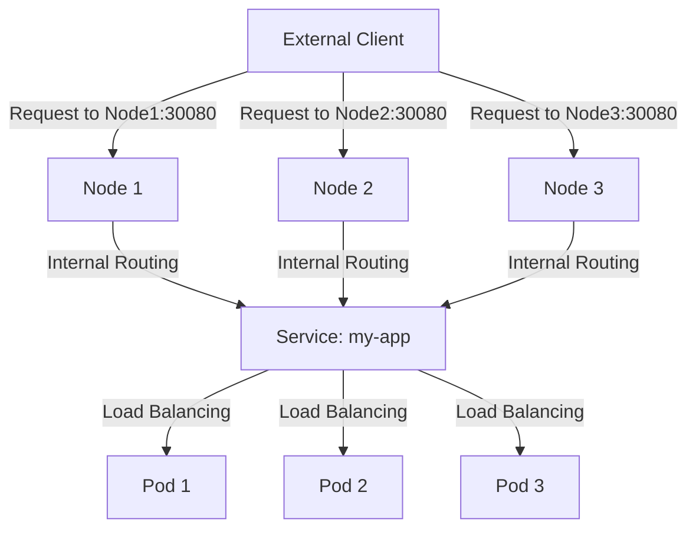

# Kubernetes NodePort

## Introduction

When deploying applications in Kubernetes, one of the fundamental challenges is making your services accessible outside the cluster. Kubernetes offers several ways to expose your services, and **NodePort** is one of the simplest approaches.

NodePort is a service type in Kubernetes that exposes an application running in pods to the outside world by opening a specific port on all nodes in the cluster. This allows external traffic to reach your service through any node's IP address on the designated port.

## Understanding NodePort

### What is a NodePort Service?

A NodePort service is a way to expose your application to external traffic by:

1. Assigning a static port on each node's IP
2. Routing external traffic that hits that port to the appropriate pods
3. Making your service accessible through `<NodeIP>:<NodePort>`

### How NodePort Works

When you create a NodePort service, Kubernetes:

1. Allocates a port from a configured range (default: 30000-32767)
2. Maps that port on every node to your service
3. Routes any traffic coming to that port to the underlying pods

Let's visualize this with a diagram:



## Creating a NodePort Service

### Basic Syntax

Here's the basic YAML configuration for a NodePort service:

```yaml
apiVersion: v1
kind: Service
metadata:
  name: my-service
spec:
  type: NodePort
  selector:
    app: my-app
  ports:
    - port: 80          # Port exposed internally in the cluster
      targetPort: 8080  # Port your application is listening on in the pod
      nodePort: 30080   # Port exposed on each node (optional, Kubernetes will assign one if not specified)
```

### Step-by-Step Example

Let's create a simple web application and expose it using a NodePort service:

1. First, deploy a sample application:

```yaml
apiVersion: apps/v1
kind: Deployment
metadata:
  name: hello-app
spec:
  replicas: 3
  selector:
    matchLabels:
      app: hello-app
  template:
    metadata:
      labels:
        app: hello-app
    spec:
      containers:
      - name: hello-container
        image: nginx
        ports:
        - containerPort: 80
```

2. Create a NodePort service to expose it:

```yaml
apiVersion: v1
kind: Service
metadata:
  name: hello-service
spec:
  type: NodePort
  selector:
    app: hello-app
  ports:
  - port: 80
    targetPort: 80
    nodePort: 30080
```

3. Apply both configurations:

```bash
kubectl apply -f deployment.yaml
kubectl apply -f service.yaml
```

4. Verify the service:

```bash
kubectl get services
```

Example output:

```
NAME            TYPE        CLUSTER-IP      EXTERNAL-IP   PORT(S)        AGE
hello-service   NodePort    10.96.123.456   <none>        80:30080/TCP   5s
kubernetes      ClusterIP   10.96.0.1       <none>        443/TCP        7d
```

5. Access your application:
   - Find the IP address of any node: `kubectl get nodes -o wide`
   - Access the application using `http://<node-ip>:30080`

## Port Definitions Explained

Understanding the three port types is crucial:

- **port**: The port exposed internally within the cluster (other pods use this to access your service)
- **targetPort**: The port your application is listening on inside the pod
- **nodePort**: The port exposed on each node's IP address (must be between 30000-32767 by default)

## Practical Use Cases

### When to Use NodePort

NodePort is ideal for:

1. **Development and testing**: Quick exposure of services during development
2. **Simple setups**: Small clusters without complex load balancing requirements
3. **On-premises deployments**: When you don't have cloud providers' load balancer integration

### Example: Multi-tier Application

Let's consider a multi-tier application with a frontend and backend:

```yaml
---
apiVersion: apps/v1
kind: Deployment
metadata:
  name: frontend
spec:
  replicas: 2
  selector:
    matchLabels:
      app: frontend
  template:
    metadata:
      labels:
        app: frontend
    spec:
      containers:
      - name: frontend
        image: my-frontend-app
        ports:
        - containerPort: 3000
---
apiVersion: v1
kind: Service
metadata:
  name: frontend-service
spec:
  type: NodePort
  selector:
    app: frontend
  ports:
  - port: 80
    targetPort: 3000
    nodePort: 30080
---
apiVersion: apps/v1
kind: Deployment
metadata:
  name: backend
spec:
  replicas: 2
  selector:
    matchLabels:
      app: backend
  template:
    metadata:
      labels:
        app: backend
    spec:
      containers:
      - name: backend
        image: my-backend-app
        ports:
        - containerPort: 8080
---
apiVersion: v1
kind: Service
metadata:
  name: backend-service
spec:
  type: ClusterIP  # Internal service, no external exposure needed
  selector:
    app: backend
  ports:
  - port: 8080
    targetPort: 8080
```

In this example, only the frontend is exposed via NodePort, while the backend remains internal.

## Advantages and Limitations

### Advantages

- **Simplicity**: Easy to set up and understand
- **Consistency**: Works the same in all Kubernetes environments
- **Direct access**: Provides direct node-level access

### Limitations

- **Port range restriction**: Limited to ports 30000-32767 by default
- **Security considerations**: Opens ports on all nodes
- **External load balancing**: Requires additional setup for load balancing across nodes
- **Node IP changes**: If node IPs change, clients need updating

## Best Practices

1. **Avoid hardcoding nodePort values** when possible, let Kubernetes assign them
2. **Use a firewall** to restrict access to NodePort services
3. **Consider alternatives** like LoadBalancer or Ingress for production workloads
4. **Document nodePort allocations** to avoid conflicts in your cluster

## Troubleshooting NodePort Services

If your NodePort service isn't accessible, check:

1. **Service is running**: `kubectl get svc`
2. **Endpoints exist**: `kubectl get endpoints <service-name>`
3. **Pod health**: `kubectl get pods -l app=<app-label>`
4. **Network policies**: Ensure they're not blocking traffic
5. **Firewall rules**: Verify that the nodePort is accessible

Example debugging commands:

```bash
# Check the service
kubectl describe service hello-service

# Check if endpoints exist
kubectl get endpoints hello-service

# Check if pods are running and ready
kubectl get pods -l app=hello-app

# Test connection from within the cluster
kubectl run test-connection --image=busybox --rm -it -- wget -O- http://hello-service
```

## Summary

NodePort is a straightforward way to expose Kubernetes services externally by opening a specific port on all nodes in the cluster. While it has limitations for production use cases, it's an excellent solution for development, testing, and simple deployments.

Key takeaways:

- NodePort exposes services on a specific port across all nodes
- Port range is typically 30000-32767
- It's one of three main service exposure methods in Kubernetes (alongside ClusterIP and LoadBalancer)
- Ideal for development but may need supplementing with other solutions for production

## Further Learning

To deepen your understanding of Kubernetes networking:

1. Explore other service types: ClusterIP and LoadBalancer
2. Learn about Ingress controllers for HTTP-based routing
3. Study Kubernetes Network Policies for fine-grained traffic control

### Practice Exercises

1. Deploy a stateless application and expose it using NodePort
2. Create a multi-tier application with different service types
3. Configure a NodePort service with multiple port mappings
4. Set up health checks for your NodePort service