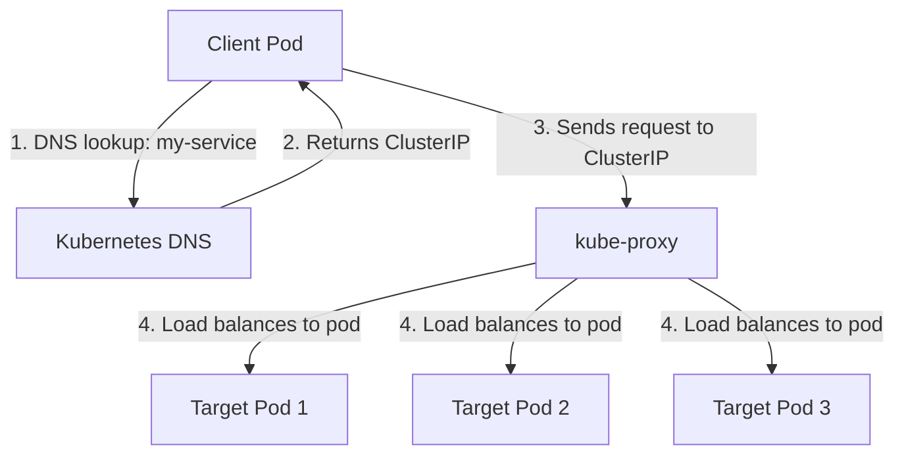

# Understanding Kubernetes ClusterIP Services

## Introduction

When deploying applications in Kubernetes, a critical question arises: How do different parts of your application communicate with each other? This is where Kubernetes Services come into play, with **ClusterIP** being the default and most common service type.

ClusterIP creates a stable, internal IP address that enables communication between different components of your application **within** the cluster. Think of it as an internal load balancer - it routes traffic to a set of pods based on label selectors.

In this tutorial, we'll dive deep into ClusterIP services, understand how they work, and explore practical examples to solidify your understanding.

## What is a ClusterIP Service?

A ClusterIP service:

- Creates a **virtual IP** within the cluster
- Is **only accessible within the cluster**
- Routes traffic to a set of pods using label selectors
- Provides a stable endpoint for pod-to-pod communication
- Automatically load balances requests across all pods matching the selector

## How ClusterIP Works

When you create a ClusterIP service, Kubernetes:

1. Assigns a unique virtual IP address from the service CIDR range
2. Updates the internal DNS to map the service name to this IP address
3. Configures `kube-proxy` on all nodes to create forwarding rules
4. Distributes traffic to all pods matching the service's selector

Here's a visual representation:



## Creating a ClusterIP Service

Let's create a simple example to demonstrate ClusterIP in action.

First, let's deploy a basic web application with multiple replicas:

```yaml
apiVersion: apps/v1
kind: Deployment
metadata:
  name: web-app
spec:
  replicas: 3
  selector:
    matchLabels:
      app: web
  template:
    metadata:
      labels:
        app: web
    spec:
      containers:
      - name: nginx
        image: nginx:latest
        ports:
        - containerPort: 80
```

Now, let's create a ClusterIP service to make this application accessible within the cluster:

```yaml
apiVersion: v1
kind: Service
metadata:
  name: web-service
spec:
  type: ClusterIP      # This is actually optional as ClusterIP is the default
  selector:
    app: web           # This targets pods with label app=web
  ports:
  - port: 80           # Port exposed by the service
    targetPort: 80     # Port on the pods to forward to
```

Apply these configurations to your cluster:

```bash
kubectl apply -f deployment.yaml
kubectl apply -f service.yaml
```

## Verifying Your ClusterIP Service

After creating the service, you can verify it with:

```bash
kubectl get services
```

Output:
```
NAME          TYPE        CLUSTER-IP       EXTERNAL-IP   PORT(S)   AGE
kubernetes    ClusterIP   10.96.0.1        <none>        443/TCP   24h
web-service   ClusterIP   10.104.132.179   <none>        80/TCP    10s
```

Notice that:
- Your service has been assigned a ClusterIP (in this example, 10.104.132.179)
- The `EXTERNAL-IP` is `<none>` because ClusterIP services are only accessible within the cluster

## Accessing the ClusterIP Service

You can access your ClusterIP service from any pod in the cluster in several ways:

### 1. Using the ClusterIP directly

```bash
# From any pod in the cluster
curl 10.104.132.179
```

### 2. Using the service name (recommended)

```bash
# From any pod in the cluster
curl web-service
```

Kubernetes automatically sets up DNS resolution for services, so you can use the service name instead of the IP address.

### 3. Using the fully qualified domain name (FQDN)

```bash
# From any pod in the cluster
curl web-service.default.svc.cluster.local
```

This format follows: `service-name.namespace.svc.cluster.local`

## Practical Example: Multi-Tier Application

Let's see a more practical example of using ClusterIP in a multi-tier application with a frontend, backend, and database.

First, let's create the database tier:

```yaml
apiVersion: apps/v1
kind: Deployment
metadata:
  name: mysql
spec:
  selector:
    matchLabels:
      app: mysql
  template:
    metadata:
      labels:
        app: mysql
    spec:
      containers:
      - name: mysql
        image: mysql:5.7
        env:
        - name: MYSQL_ROOT_PASSWORD
          value: "password"
        ports:
        - containerPort: 3306
---
apiVersion: v1
kind: Service
metadata:
  name: mysql-service
spec:
  selector:
    app: mysql
  ports:
  - port: 3306
    targetPort: 3306
```

Next, let's create the backend service:

```yaml
apiVersion: apps/v1
kind: Deployment
metadata:
  name: backend
spec:
  replicas: 2
  selector:
    matchLabels:
      app: backend
  template:
    metadata:
      labels:
        app: backend
    spec:
      containers:
      - name: backend
        image: my-backend:latest
        env:
        - name: DB_HOST
          value: "mysql-service"  # Using the database service name
        ports:
        - containerPort: 8080
---
apiVersion: v1
kind: Service
metadata:
  name: backend-service
spec:
  selector:
    app: backend
  ports:
  - port: 80
    targetPort: 8080
```

Finally, let's create the frontend:

```yaml
apiVersion: apps/v1
kind: Deployment
metadata:
  name: frontend
spec:
  replicas: 3
  selector:
    matchLabels:
      app: frontend
  template:
    metadata:
      labels:
        app: frontend
    spec:
      containers:
      - name: frontend
        image: my-frontend:latest
        env:
        - name: API_URL
          value: "http://backend-service"  # Using the backend service name
        ports:
        - containerPort: 80
---
apiVersion: v1
kind: Service
metadata:
  name: frontend-service
spec:
  selector:
    app: frontend
  ports:
  - port: 80
    targetPort: 80
  type: LoadBalancer  # This would be different - typically ClusterIP+Ingress or LoadBalancer
```

Notice how:
1. The backend uses `mysql-service` as the database hostname
2. The frontend uses `backend-service` as the API URL
3. We use ClusterIP for internal communication (database and backend services)
4. Only the frontend service would typically be exposed externally

## Targeting Specific Ports

You can expose multiple ports with a single ClusterIP service:

```yaml
apiVersion: v1
kind: Service
metadata:
  name: multi-port-service
spec:
  selector:
    app: my-app
  ports:
  - name: http
    port: 80
    targetPort: 8080
  - name: https
    port: 443
    targetPort: 8443
  - name: metrics
    port: 9000
    targetPort: 9090
```

When addressing multiple ports, you need to use the port name when forwarding:

```bash
kubectl port-forward service/multi-port-service 8080:http
```

## Headless Services - A Special Type of ClusterIP

A headless service is a ClusterIP service with `clusterIP: None`. Instead of load balancing, it returns the IP addresses of all pods directly.

This is useful when:
- You need direct pod-to-pod communication
- You're using a stateful application that manages its own load balancing
- You need to discover all pods in a service

```yaml
apiVersion: v1
kind: Service
metadata:
  name: headless-service
spec:
  clusterIP: None  # This makes it headless
  selector:
    app: stateful-app
  ports:
  - port: 80
    targetPort: 80
```

With a headless service, a DNS lookup will return multiple A records, one for each pod.

## Common Issues and Troubleshooting

### 1. Service not routing traffic

Check that:
- The service selector matches your pod labels
- Pods are running and ready
- The targetPort matches the containerPort

```bash
# Check if pods match the selector
kubectl get pods --selector=app=web

# Check the endpoints created by the service
kubectl get endpoints web-service
```

### 2. Service is accessible from some pods but not others

This might indicate a network policy issue. Check if any NetworkPolicy resources are restricting traffic.

### 3. Cannot resolve service by name

Verify that:
- The Kubernetes DNS service is running
- You're using the correct name and namespace

```bash
# Check if CoreDNS is running
kubectl get pods -n kube-system -l k8s-app=kube-dns

# Test DNS resolution from a debugging pod
kubectl run -it --rm debug --image=busybox -- nslookup web-service
```

## When to Use ClusterIP

Use ClusterIP when:
- You need pod-to-pod communication within the cluster
- You're building a multi-tier application
- You want to expose a service to other services but not externally
- You need a stable endpoint regardless of pod changes

Do NOT use ClusterIP when:
- You need to access the service from outside the cluster (use NodePort, LoadBalancer, or Ingress instead)
- You need direct pod-to-pod communication without load balancing (use a headless service)

## Summary

ClusterIP services are the foundation of Kubernetes networking. They provide:

- Stable internal endpoints for your applications
- Automatic load balancing across pods
- Service discovery through DNS
- Isolation from external networks

By understanding ClusterIP services, you've taken a significant step in mastering Kubernetes networking concepts. As you build more complex applications, you'll find ClusterIP services essential for connecting your application components together.

## Additional Resources

- [Kubernetes Services Official Documentation](https://kubernetes.io/docs/concepts/services-networking/service/)
- [Kubernetes DNS for Services and Pods](https://kubernetes.io/docs/concepts/services-networking/dns-pod-service/)

## Practice Exercises

1. Create a two-tier application with a frontend and backend, using a ClusterIP service to connect them.
2. Modify the previous exercise to include a database tier.
3. Create a headless service and observe how it behaves differently from a regular ClusterIP service.
4. Test different service discovery methods (IP, DNS name, FQDN) and observe the results.
5. Try creating a ClusterIP service with multiple ports and access each port from another pod.