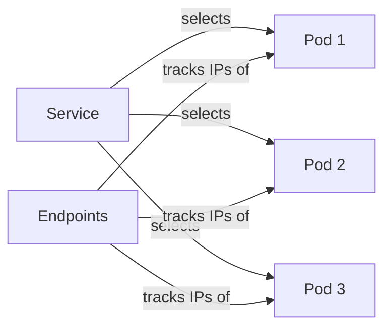

# Kubernetes Endpoints

## Introduction

Kubernetes Endpoints are a fundamental networking resource that play a crucial role in how services discover and communicate with pods. While Services provide a stable abstraction layer for accessing applications, Endpoints are the actual implementation detail that tracks the IP addresses and ports of all pods that match a Service's selector.

In this guide, we'll explore:
- What Endpoints are and how they work
- How Endpoints relate to Services
- Manual vs automatic Endpoint management
- Common troubleshooting scenarios
- Real-world applications of Endpoints

## What are Kubernetes Endpoints?

Endpoints in Kubernetes are API objects that keep track of the network addresses (IP:port pairs) of pods matching a Service's selector. When you create a Service with a selector, Kubernetes automatically creates and maintains an Endpoints object with the same name.

The Endpoints object contains a list of all available pod IP addresses and ports that the Service can send traffic to. The kube-proxy component on each node uses this information to set up the necessary rules for routing traffic.

Let's visualize this relationship:



## How Endpoints Work with Services

When a client sends a request to a Service, here's what happens behind the scenes:

1. The Service receives the request (via its ClusterIP, NodePort, etc.)
2. The Service looks up the associated Endpoints object
3. The Service routes the request to one of the IP:port pairs listed in the Endpoints
4. The request reaches the actual pod

Let's examine this with a simple example:

```yaml
apiVersion: v1
kind: Service
metadata:
  name: my-service
spec:
  selector:
    app: my-app
  ports:
  - port: 80
    targetPort: 8080
```

When you create this Service, Kubernetes automatically creates an Endpoints object named `my-service` that keeps track of all pods with the label `app: my-app`. You can view these Endpoints using:

```bash
kubectl get endpoints my-service
```

The output might look like:

```
NAME         ENDPOINTS                                            AGE
my-service   10.244.0.5:8080,10.244.0.6:8080,10.244.1.7:8080     1m
```

Each IP:port combination represents a pod that matches the Service's selector.

## Inspecting Endpoints

Let's explore some commands to inspect and understand Endpoints:

```bash
# List all endpoints in the current namespace
kubectl get endpoints

# Get detailed information about a specific endpoint
kubectl describe endpoints my-service

# Output endpoint information in YAML format
kubectl get endpoints my-service -o yaml
```

Here's what the YAML output might look like:

```yaml
apiVersion: v1
kind: Endpoints
metadata:
  name: my-service
  namespace: default
subsets:
- addresses:
  - ip: 10.244.0.5
    nodeName: worker-node-1
    targetRef:
      kind: Pod
      name: my-app-pod-1
      namespace: default
  - ip: 10.244.0.6
    nodeName: worker-node-1
    targetRef:
      kind: Pod
      name: my-app-pod-2
      namespace: default
  - ip: 10.244.1.7
    nodeName: worker-node-2
    targetRef:
      kind: Pod
      name: my-app-pod-3
      namespace: default
  ports:
  - port: 8080
    protocol: TCP
```

## Manual Endpoint Management

While Kubernetes automatically manages Endpoints for Services with selectors, you can also create Endpoints manually. This is useful for:

1. Pointing a Service to external resources
2. Creating complex routing rules
3. Testing and development scenarios

To manually manage Endpoints, you need to:

1. Create a Service **without** a selector
2. Create an Endpoints resource with the same name as the Service

Here's an example:

```yaml
# Service without selector
apiVersion: v1
kind: Service
metadata:
  name: external-service
spec:
  ports:
  - port: 80
```

```yaml
# Manually created Endpoints
apiVersion: v1
kind: Endpoints
metadata:
  name: external-service
subsets:
- addresses:
  - ip: 192.168.1.100
  - ip: 192.168.1.101
  ports:
  - port: 8080
```

In this example, `external-service` will route traffic to the external IPs `192.168.1.100` and `192.168.1.101`.

## EndpointSlices: The Evolution of Endpoints

For larger clusters, the traditional Endpoints API can become a bottleneck. Kubernetes introduced EndpointSlices to address this:

```yaml
apiVersion: discovery.k8s.io/v1
kind: EndpointSlice
metadata:
  name: my-service-abc
  labels:
    kubernetes.io/service-name: my-service
addressType: IPv4
ports:
  - name: http
    protocol: TCP
    port: 8080
endpoints:
  - addresses:
    - "10.244.0.5"
  - addresses:
    - "10.244.0.6"
```

EndpointSlices divide the network endpoints into smaller, more manageable groups, reducing the size of updates and improving performance in large clusters.

## Real-World Applications

### Example 1: Blue-Green Deployments

You can use manual Endpoint management for blue-green deployments:

```bash
# Create a service
kubectl apply -f - <<EOF
apiVersion: v1
kind: Service
metadata:
  name: my-app
spec:
  ports:
  - port: 80
    targetPort: 8080
EOF

# Initially point to "blue" deployment
kubectl apply -f - <<EOF
apiVersion: v1
kind: Endpoints
metadata:
  name: my-app
subsets:
- addresses:
  - ip: 10.244.0.5  # Blue deployment pod IP
  - ip: 10.244.0.6  # Blue deployment pod IP
  ports:
  - port: 8080
EOF

# Later, switch to "green" deployment
kubectl apply -f - <<EOF
apiVersion: v1
kind: Endpoints
metadata:
  name: my-app
subsets:
- addresses:
  - ip: 10.244.1.7  # Green deployment pod IP
  - ip: 10.244.1.8  # Green deployment pod IP
  ports:
  - port: 8080
EOF
```

### Example 2: Multi-Cluster Services

You can create a Service in one cluster that points to pods in another cluster:

```yaml
# In Cluster 1
apiVersion: v1
kind: Service
metadata:
  name: remote-service
spec:
  ports:
  - port: 80
    targetPort: 8080

---
apiVersion: v1
kind: Endpoints
metadata:
  name: remote-service
subsets:
- addresses:
  - ip: 10.10.10.1  # IP from Cluster 2
  - ip: 10.10.10.2  # IP from Cluster 2
  ports:
  - port: 8080
```

## Common Troubleshooting Scenarios

### No Endpoints Available

If you find that your Service has no endpoints, check:

```bash
kubectl describe endpoints my-service
```

If you see `<none>` or empty endpoints, verify:

1. Your Service selector matches pod labels
2. Your pods are running and ready
3. Your pods have the correct ports exposed

Example fix:

```bash
# Check pod labels
kubectl get pods --show-labels

# Update Service selector if needed
kubectl patch service my-service -p '{"spec":{"selector":{"app":"correct-label"}}}'
```

### Endpoints Not Updated

If pods come up but aren't added to Endpoints:

```bash
# Check pod readiness
kubectl get pods -o wide

# Check Service and Endpoints
kubectl get svc,endpoints
```

Ensure pods are passing readiness probes, as only Ready pods are added to Endpoints.

## Practical Exercise: Creating a Headless Service with Endpoints

Let's create a stateful application with a headless service to understand how Endpoints work in this scenario:

```yaml
# Create a StatefulSet
apiVersion: apps/v1
kind: StatefulSet
metadata:
  name: web
spec:
  serviceName: "nginx"
  replicas: 3
  selector:
    matchLabels:
      app: nginx
  template:
    metadata:
      labels:
        app: nginx
    spec:
      containers:
      - name: nginx
        image: nginx:1.20
        ports:
        - containerPort: 80
          name: web

---
# Create a headless service
apiVersion: v1
kind: Service
metadata:
  name: nginx
spec:
  clusterIP: None
  selector:
    app: nginx
  ports:
  - port: 80
    name: web
```

After applying, check the Endpoints:

```bash
kubectl get endpoints nginx
```

You should see something like:

```
NAME    ENDPOINTS                                      AGE
nginx   10.244.0.5:80,10.244.0.6:80,10.244.1.7:80     30s
```

With a headless service, each pod gets a DNS entry like:
- web-0.nginx.default.svc.cluster.local
- web-1.nginx.default.svc.cluster.local
- web-2.nginx.default.svc.cluster.local

This allows clients to connect to specific pods directly.

## Summary

Kubernetes Endpoints are a critical component of the Kubernetes networking system, providing the actual implementation details for service discovery. They:

- Track the IP addresses and ports of all pods matching a Service's selector
- Are automatically managed by Kubernetes but can also be manually configured
- Enable advanced networking scenarios like external service integration
- Have evolved to include EndpointSlices for better scalability

Understanding Endpoints gives you deeper insight into how Kubernetes networking works under the hood and allows you to implement more complex networking patterns when needed.

## Additional Resources

- [Kubernetes Official Documentation on Services and Endpoints](https://kubernetes.io/docs/concepts/services-networking/service/)
- [EndpointSlices Documentation](https://kubernetes.io/docs/concepts/services-networking/endpoint-slices/)
- [Kubernetes Network Model](https://kubernetes.io/docs/concepts/cluster-administration/networking/)

## Practice Exercises

1. Create a Service without a selector and manually manage its Endpoints
2. Set up a Service that points to external resources (like a database outside the cluster)
3. Implement a simple blue-green deployment using manual Endpoint management
4. Debug a scenario where a Service has no Endpoints (create a deliberate mismatch in selectors)
5. Explore how EndpointSlices work in a larger cluster (requires multiple pods)