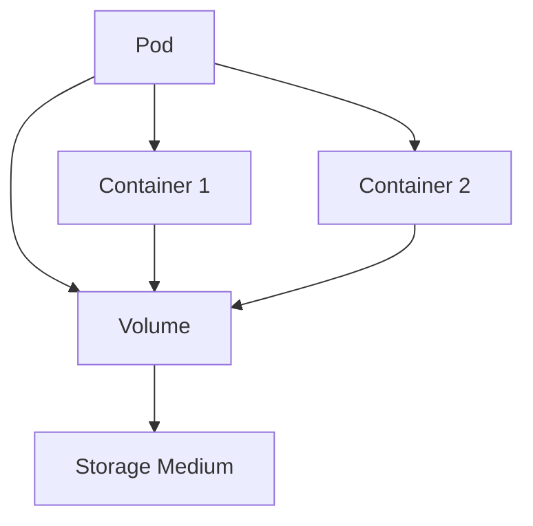

# Kubernetes Volumes

## Introduction

When working with containers in Kubernetes, one of the challenges you'll face is managing data that needs to persist beyond the lifecycle of a pod. Containers are ephemeral by nature, meaning any data stored inside a container is lost when the container is terminated or restarted.

Kubernetes Volumes solve this problem by providing a way to store data outside the container, making it accessible to containers in a pod and allowing it to survive container restarts. Volumes are a crucial part of Kubernetes storage architecture, enabling stateful applications to run reliably in a containerized environment.

## Understanding Kubernetes Volumes

### What is a Volume?

A volume in Kubernetes is simply a directory that is accessible to all containers in a pod. This directory is backed by a storage medium that you define, such as a local disk, a network-attached storage (NAS), or a cloud provider's storage service.



### Why Do We Need Volumes?

1. **Data Persistence**: Containers are ephemeral, but volumes can persist data beyond the lifecycle of a container.
2. **Data Sharing**: Volumes enable multiple containers in a pod to share data.
3. **Separation of Concerns**: Volumes separate storage concerns from application code.

## Types of Kubernetes Volumes

Kubernetes supports several types of volumes, each serving different use cases. Here are some common ones:

### emptyDir

An `emptyDir` volume is created when a pod is assigned to a node and exists as long as the pod is running on that node. As the name suggests, it starts empty and all containers in the pod can read and write files in it. When the pod is removed, the data in the `emptyDir` is deleted permanently.

```yaml
apiVersion: v1
kind: Pod
metadata:
  name: example-pod
spec:
  containers:
  - name: container-1
    image: nginx
    volumeMounts:
    - mountPath: /cache
      name: cache-volume
  volumes:
  - name: cache-volume
    emptyDir: {}
```

**Use case**: Temporary storage, sharing files between containers in the same pod.

### hostPath

A `hostPath` volume mounts a file or directory from the host node's filesystem into the pod. This is not suitable for most applications as it creates dependencies on the specific node, but it can be useful for certain system-level pods.

```yaml
apiVersion: v1
kind: Pod
metadata:
  name: test-pd
spec:
  containers:
  - image: nginx
    name: test-container
    volumeMounts:
    - mountPath: /test-pd
      name: test-volume
  volumes:
  - name: test-volume
    hostPath:
      path: /data
      type: Directory
```

**Use case**: Accessing node's filesystem, system-level applications.

### persistentVolumeClaim (PVC)

A `persistentVolumeClaim` is a request for storage by a user that can be fulfilled by a `PersistentVolume`. This abstraction allows users to consume storage resources without knowing the details of the underlying storage infrastructure.

```yaml
apiVersion: v1
kind: PersistentVolumeClaim
metadata:
  name: mysql-pvc
spec:
  accessModes:
    - ReadWriteOnce
  resources:
    requests:
      storage: 1Gi
  storageClassName: standard
---
apiVersion: v1
kind: Pod
metadata:
  name: mysql-pod
spec:
  containers:
  - image: mysql:5.7
    name: mysql
    env:
    - name: MYSQL_ROOT_PASSWORD
      value: "password"
    volumeMounts:
    - name: mysql-storage
      mountPath: /var/lib/mysql
  volumes:
  - name: mysql-storage
    persistentVolumeClaim:
      claimName: mysql-pvc
```

**Use case**: Production workloads that require persistent data storage.

### configMap and secret

These special volume types are used to inject configuration data and sensitive information into pods.

```yaml
apiVersion: v1
kind: ConfigMap
metadata:
  name: app-config
data:
  app.properties: |
    app.name=MyApp
    app.environment=development
---
apiVersion: v1
kind: Pod
metadata:
  name: config-pod
spec:
  containers:
  - name: app
    image: myapp:1.0
    volumeMounts:
    - name: config-volume
      mountPath: /etc/config
  volumes:
  - name: config-volume
    configMap:
      name: app-config
```

**Use case**: Injecting configuration and secrets into applications.

## Volume Lifecycle

Understanding the lifecycle of volumes is essential:

1. **Volume Creation**: Volumes are created when defined in the pod specification.
2. **Volume Mounting**: Containers mount volumes at specified paths.
3. **Volume Usage**: Containers read from and write to the mounted volumes.
4. **Volume Cleanup**: When a pod is deleted, the volume cleanup depends on the volume type:
   - `emptyDir` volumes are deleted
   - `persistentVolumeClaim` volumes are retained (depending on the reclaim policy)

## Persistent Volumes and Claims

For most production workloads, you'll want to use the Persistent Volume system, which provides an API for users and administrators to abstract storage details. This system has two key API resources:

### PersistentVolume (PV)

A PersistentVolume is a storage resource in the cluster, provisioned by an administrator or dynamically provisioned using Storage Classes.

```yaml
apiVersion: v1
kind: PersistentVolume
metadata:
  name: example-pv
spec:
  capacity:
    storage: 10Gi
  accessModes:
    - ReadWriteOnce
  persistentVolumeReclaimPolicy: Retain
  storageClassName: standard
  hostPath:
    path: /data/pv1
```

### PersistentVolumeClaim (PVC)

A PersistentVolumeClaim is a request for storage by a user, which is bound to a PersistentVolume.

```yaml
apiVersion: v1
kind: PersistentVolumeClaim
metadata:
  name: example-pvc
spec:
  accessModes:
    - ReadWriteOnce
  resources:
    requests:
      storage: 5Gi
  storageClassName: standard
```

### Storage Classes

Storage Classes enable dynamic provisioning of PersistentVolumes:

```yaml
apiVersion: storage.k8s.io/v1
kind: StorageClass
metadata:
  name: fast
provisioner: kubernetes.io/aws-ebs
parameters:
  type: gp2
reclaimPolicy: Delete
```

## Practical Example: Deploying a Stateful Application

Let's deploy a simple database application that requires persistent storage.

### Step 1: Create a Storage Class

```yaml
apiVersion: storage.k8s.io/v1
kind: StorageClass
metadata:
  name: fast
provisioner: kubernetes.io/gce-pd
parameters:
  type: pd-ssd
```

### Step 2: Create a Persistent Volume Claim

```yaml
apiVersion: v1
kind: PersistentVolumeClaim
metadata:
  name: postgres-pvc
spec:
  accessModes:
    - ReadWriteOnce
  resources:
    requests:
      storage: 5Gi
  storageClassName: fast
```

### Step 3: Deploy PostgreSQL using the PVC

```yaml
apiVersion: apps/v1
kind: Deployment
metadata:
  name: postgres
spec:
  replicas: 1
  selector:
    matchLabels:
      app: postgres
  template:
    metadata:
      labels:
        app: postgres
    spec:
      containers:
      - name: postgres
        image: postgres:13
        env:
        - name: POSTGRES_PASSWORD
          value: "mysecretpassword"
        ports:
        - containerPort: 5432
        volumeMounts:
        - name: postgres-storage
          mountPath: /var/lib/postgresql/data
      volumes:
      - name: postgres-storage
        persistentVolumeClaim:
          claimName: postgres-pvc
```

### Step 4: Verify the Setup

```bash
kubectl get pvc
# Output
NAME           STATUS   VOLUME                 CAPACITY   ACCESS MODES   STORAGECLASS   AGE
postgres-pvc   Bound    pvc-abc123...          5Gi        RWO            fast           2m

kubectl get pods
# Output
NAME                       READY   STATUS    RESTARTS   AGE
postgres-abcdef123-xyz     1/1     Running   0          1m
```

## Volume Mount Options

You can customize how volumes are mounted with these options:

### ReadOnly Mount

```yaml
volumeMounts:
- name: config-volume
  mountPath: /etc/config
  readOnly: true
```

### Mount Subpath

Mount a specific file or directory from a volume:

```yaml
volumeMounts:
- name: config-volume
  mountPath: /etc/app/config.properties
  subPath: config.properties
```

## Best Practices

1. **Use PersistentVolumes for stateful applications**: For any application that needs to store data, use PVs and PVCs.

2. **Use appropriate access modes**: Different storage types support different access modes (ReadWriteOnce, ReadOnlyMany, ReadWriteMany).

3. **Set resource requests appropriately**: Request only the storage you need to avoid wasting resources.

4. **Use StorageClasses for dynamic provisioning**: This allows for automatic creation of PersistentVolumes when PVCs are created.

5. **Consider backup strategies**: Volumes aren't automatically backed up - implement appropriate backup strategies.

6. **Use volume health monitoring**: Monitor the health of your volumes to ensure they're functioning correctly.

## Common Issues and Troubleshooting

### Volume Mount Failures

If a pod fails to start due to volume mount issues:

```bash
kubectl describe pod <pod-name>
```

Look for events related to volume mounting issues.

### PVC Stuck in Pending State

```bash
kubectl describe pvc <pvc-name>
```

Check if there are available PVs that match the PVC's requirements.

### Volume Full

If a volume becomes full, the pod may experience unexpected behavior:

```bash
kubectl exec -it <pod-name> -- df -h
```

## Summary

Kubernetes Volumes provide a flexible way to manage storage in containerized applications:

- They enable data persistence beyond the lifecycle of containers
- Different volume types serve different use cases
- The Persistent Volume system provides an abstraction layer for storage
- Storage Classes enable dynamic provisioning

By understanding and properly implementing volumes, you can build reliable stateful applications in Kubernetes.

## Additional Resources

- [Kubernetes Official Documentation on Volumes](https://kubernetes.io/docs/concepts/storage/volumes/)
- [Persistent Volumes](https://kubernetes.io/docs/concepts/storage/persistent-volumes/)
- [Storage Classes](https://kubernetes.io/docs/concepts/storage/storage-classes/)

## Practice Exercises

1. Create a pod with an `emptyDir` volume and two containers that share data through it.
2. Set up a MySQL database with persistent storage using PVCs.
3. Create a custom StorageClass and use it to dynamically provision volumes.
4. Implement a backup solution for a stateful application running in Kubernetes.