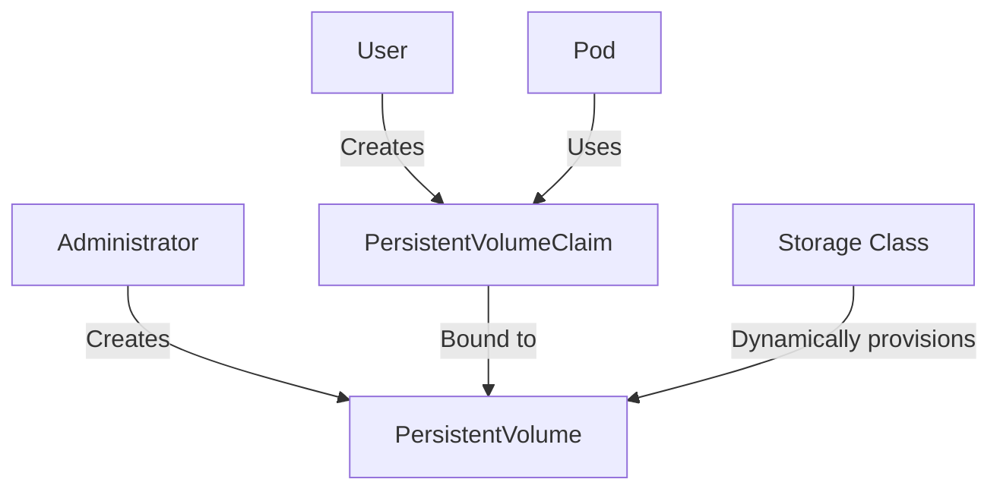

# Understanding Kubernetes PersistentVolumes

## Introduction

When running applications in Kubernetes, you'll often need to store data that persists even when pods are restarted, rescheduled, or deleted. This is where **PersistentVolumes** come into play. They are a critical component of Kubernetes storage architecture that allows applications to access and store data independently of the pod lifecycle.

In this guide, we'll explore Kubernetes PersistentVolumes (PVs), understand how they work together with PersistentVolumeClaims (PVCs), and learn how to implement persistent storage in your Kubernetes applications.

## What is a PersistentVolume?

A PersistentVolume (PV) is a piece of storage in the cluster that has been provisioned by an administrator or dynamically provisioned using Storage Classes. It's a resource in the cluster just like a node is a cluster resource.

Key characteristics of PersistentVolumes:

- They exist independently of pods
- They have a lifecycle independent of any individual pod
- They represent physical storage resources in your infrastructure
- They can be provisioned statically by cluster administrators or dynamically via Storage Classes

## PersistentVolumes vs Regular Volumes

Before diving deeper, let's understand how PersistentVolumes differ from regular Kubernetes volumes:

| Regular Volumes | PersistentVolumes |
|-----------------|-------------------|
| Tied to pod lifecycle | Independent of pod lifecycle |
| Defined in pod specification | Cluster-level resources |
| Lost when pod is deleted | Persist after pod deletion |
| Limited reusability | Can be reused by different pods |

## How PersistentVolumes Work with PersistentVolumeClaims

PersistentVolumes work with another Kubernetes resource called **PersistentVolumeClaim** (PVC). This two-part system separates the concerns of storage provisioning from storage consumption:



1. **PersistentVolume (PV)**: A cluster resource provisioned by administrators or dynamically by the system
2. **PersistentVolumeClaim (PVC)**: A request for storage by a user/application
3. **Binding**: When a PVC is created, Kubernetes binds it to a suitable PV based on requirements

## PersistentVolume Lifecycle

PersistentVolumes have their own lifecycle that consists of several phases:

1. **Provisioning**: Creating the PV (static or dynamic)
2. **Binding**: Connecting a PVC to a PV
3. **Using**: Pods access storage via the PVC
4. **Releasing**: PVC is deleted, but PV still exists
5. **Reclaiming**: Preparing the PV for reuse (based on reclaim policy)

## PersistentVolume Reclaim Policies

When a PVC is deleted, the PV that was bound to it isn't automatically deleted. Instead, it enters the "Released" state and what happens next depends on the reclaim policy:

- **Retain**: The PV is kept as-is with its data. It must be manually reclaimed by an administrator.
- **Delete**: The PV and its associated storage resource are automatically deleted.
- **Recycle**: (Deprecated) Basic scrub (`rm -rf /thevolume/*`) before making it available again.

## Creating a Static PersistentVolume

Let's create a simple PersistentVolume that uses a hostPath (local directory on the node) for storage:

```yaml
apiVersion: v1
kind: PersistentVolume
metadata:
  name: task-pv-volume
  labels:
    type: local
spec:
  storageClassName: manual
  capacity:
    storage: 10Gi
  accessModes:
    - ReadWriteOnce
  hostPath:
    path: "/mnt/data"
```

In this example:
- We've named our PV `task-pv-volume`
- We've set its capacity to 10Gi
- We've set the access mode to `ReadWriteOnce` (can be mounted by a single node for reading and writing)
- We've specified a path on the host to store the data

## Access Modes for PersistentVolumes

PersistentVolumes support different access modes:

- **ReadWriteOnce (RWO)**: Volume can be mounted as read-write by a single node
- **ReadOnlyMany (ROX)**: Volume can be mounted read-only by many nodes
- **ReadWriteMany (RWX)**: Volume can be mounted as read-write by many nodes
- **ReadWriteOncePod (RWOP)**: Volume can be mounted as read-write by a single pod (Kubernetes v1.22+)

It's important to note that not all storage types support all access modes.

## Creating a PersistentVolumeClaim

To use a PersistentVolume, we need to create a PersistentVolumeClaim:

```yaml
apiVersion: v1
kind: PersistentVolumeClaim
metadata:
  name: task-pv-claim
spec:
  storageClassName: manual
  accessModes:
    - ReadWriteOnce
  resources:
    requests:
      storage: 3Gi
```

In this example:
- We've named our PVC `task-pv-claim`
- We've specified that we want to use the `manual` storage class (same as our PV)
- We've requested 3Gi of storage (which is less than the 10Gi our PV provides)
- We've specified the same access mode as our PV

## Using a PersistentVolumeClaim in a Pod

Now that we have a PVC, we can use it in a pod:

```yaml
apiVersion: v1
kind: Pod
metadata:
  name: task-pv-pod
spec:
  volumes:
    - name: task-pv-storage
      persistentVolumeClaim:
        claimName: task-pv-claim
  containers:
    - name: task-pv-container
      image: nginx
      ports:
        - containerPort: 80
          name: "http-server"
      volumeMounts:
        - mountPath: "/usr/share/nginx/html"
          name: task-pv-storage
```

In this example:
- We've created a pod that uses our PVC
- We've mounted the PVC to the path `/usr/share/nginx/html` in the container
- The nginx container will now be able to read and write to this path, and the data will persist even if the pod is deleted

## Dynamic Provisioning with StorageClasses

So far, we've been working with static provisioning where an administrator creates PVs manually. But Kubernetes also supports dynamic provisioning using StorageClasses:

```yaml
apiVersion: storage.k8s.io/v1
kind: StorageClass
metadata:
  name: standard
provisioner: kubernetes.io/aws-ebs
parameters:
  type: gp2
reclaimPolicy: Retain
allowVolumeExpansion: true
```

With a StorageClass in place, users can simply create PVCs without worrying about PVs:

```yaml
apiVersion: v1
kind: PersistentVolumeClaim
metadata:
  name: dynamic-pvc
spec:
  storageClassName: standard
  accessModes:
    - ReadWriteOnce
  resources:
    requests:
      storage: 5Gi
```

Kubernetes will automatically provision a PV that matches the requirements.

## Real-World Example: WordPress with MySQL

Let's see a practical example of using PersistentVolumes for a WordPress site with MySQL database:

```yaml
apiVersion: v1
kind: PersistentVolumeClaim
metadata:
  name: mysql-pvc
spec:
  storageClassName: standard
  accessModes:
    - ReadWriteOnce
  resources:
    requests:
      storage: 10Gi
---
apiVersion: v1
kind: PersistentVolumeClaim
metadata:
  name: wordpress-pvc
spec:
  storageClassName: standard
  accessModes:
    - ReadWriteOnce
  resources:
    requests:
      storage: 5Gi
---
apiVersion: v1
kind: Pod
metadata:
  name: mysql
spec:
  containers:
    - name: mysql
      image: mysql:5.7
      env:
        - name: MYSQL_ROOT_PASSWORD
          value: password
        - name: MYSQL_DATABASE
          value: wordpress
      ports:
        - containerPort: 3306
          name: mysql
      volumeMounts:
        - name: mysql-data
          mountPath: /var/lib/mysql
  volumes:
    - name: mysql-data
      persistentVolumeClaim:
        claimName: mysql-pvc
---
apiVersion: v1
kind: Pod
metadata:
  name: wordpress
spec:
  containers:
    - name: wordpress
      image: wordpress:latest
      env:
        - name: WORDPRESS_DB_HOST
          value: mysql
        - name: WORDPRESS_DB_PASSWORD
          value: password
      ports:
        - containerPort: 80
          name: wordpress
      volumeMounts:
        - name: wordpress-data
          mountPath: /var/www/html
  volumes:
    - name: wordpress-data
      persistentVolumeClaim:
        claimName: wordpress-pvc
```

In this example:
- We create two PVCs: one for MySQL and one for WordPress
- Both pods use their respective PVCs to store data
- If either pod is deleted, the data will persist in the PVs

## Monitoring PersistentVolumes

You can monitor PersistentVolumes and PersistentVolumeClaims using kubectl:

```bash
# List all PersistentVolumes
kubectl get pv

# Output example:
# NAME             CAPACITY   ACCESS MODES   RECLAIM POLICY   STATUS   CLAIM                   STORAGECLASS   REASON   AGE
# task-pv-volume   10Gi       RWO            Retain           Bound    default/task-pv-claim   manual                  1h
```

```bash
# List all PersistentVolumeClaims
kubectl get pvc

# Output example:
# NAME            STATUS   VOLUME           CAPACITY   ACCESS MODES   STORAGECLASS   AGE
# task-pv-claim   Bound    task-pv-volume   10Gi       RWO            manual         1h
```

```bash
# Get detailed information about a specific PV
kubectl describe pv task-pv-volume
```

## Common Issues and Troubleshooting

### PVC Stuck in Pending State

If your PVC is stuck in the "Pending" state, it means Kubernetes can't find a suitable PV to bind it to. Check:

1. **Storage Classes match**: Make sure the PVC's `storageClassName` matches an existing Storage Class
2. **Access Modes**: Ensure the requested access mode is supported by available PVs
3. **Capacity**: Verify that you're not requesting more storage than available PVs provide

### Unable to Delete a PV

If you can't delete a PV, it might be because:

1. **PV is still bound to a PVC**: Delete the PVC first
2. **Reclaim policy is set to "Retain"**: You may need to manually delete the underlying storage resource

## Best Practices for Using PersistentVolumes

1. **Use StorageClasses for dynamic provisioning** to reduce administrative overhead
2. **Set appropriate reclaim policies** based on your needs
3. **Consider using Helm charts** for complex applications that require persistent storage
4. **Use labels and selectors** to help with PV/PVC matching
5. **Monitor storage usage** to avoid running out of space
6. **Consider using StatefulSets** for applications that require stable, persistent storage with predictable names

## Summary

PersistentVolumes provide a way to manage storage in Kubernetes that's independent of the pod lifecycle. They allow applications to store data persistently, even when pods are deleted or rescheduled. The PV and PVC system separates the concerns of storage provisioning from consumption, making it easier to manage storage resources in a Kubernetes cluster.

Key points to remember:
- PVs are cluster resources that represent physical storage
- PVCs are requests for those resources
- StorageClasses enable dynamic provisioning
- Reclaim policies determine what happens to storage when a PVC is deleted
- PVs support different access modes for different use cases

## Exercises

1. Create a PersistentVolume and PersistentVolumeClaim manually, then use it in a pod running a simple application that writes to a file.
2. Set up dynamic provisioning using a StorageClass on a cloud provider (like AWS, GCP, or Azure).
3. Create a StatefulSet that uses PersistentVolumeClaims, and observe how Kubernetes handles storage when pods are deleted and recreated.
4. Experiment with different reclaim policies and observe their behavior when PVCs are deleted.

## Additional Resources

- [Kubernetes Documentation on PersistentVolumes](https://kubernetes.io/docs/concepts/storage/persistent-volumes/)
- [StorageClasses in Kubernetes](https://kubernetes.io/docs/concepts/storage/storage-classes/)
- [StatefulSets and Persistent Storage](https://kubernetes.io/docs/tutorials/stateful-application/basic-stateful-set/)
- [Dynamic Volume Provisioning](https://kubernetes.io/docs/concepts/storage/dynamic-provisioning/)