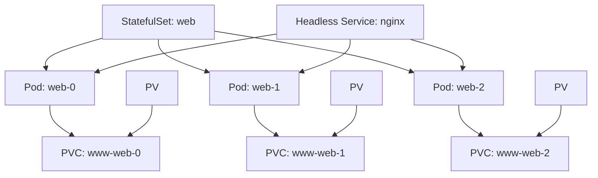

# Understanding Kubernetes StatefulSets

## Introduction

When working with Kubernetes, most deployments handle stateless applications quite well. But what happens when your applications need to maintain state, require stable network identifiers, or need ordered deployment and scaling? That's where StatefulSets come in.

StatefulSets are a Kubernetes workload API object designed specifically for managing stateful applications. Unlike Deployments and ReplicaSets which treat pods as interchangeable, StatefulSets maintain a sticky identity for each pod they manage. These pods are created from the same specification, but are not interchangeable: each has a persistent identifier that it maintains across any rescheduling.

## Why StatefulSets?

Before diving into how StatefulSets work, let's understand why they're necessary:

1. **Stable, unique network identifiers** - Each pod in a StatefulSet gets a consistent hostname based on the StatefulSet name and the pod's ordinal index
2. **Stable, persistent storage** - StatefulSets can use PersistentVolumes for storage that survives pod rescheduling
3. **Ordered, graceful deployment and scaling** - Pods are created and terminated in order, ensuring proper initialization and cleanup
4. **Ordered, automated rolling updates** - Updates to the StatefulSet can be rolled out in a defined order

These features make StatefulSets ideal for applications like databases (MySQL, PostgreSQL, MongoDB), key-value stores (Redis, Etcd), and other systems that require stable network identities and persistent storage.

## Understanding StatefulSet Components

A StatefulSet configuration typically includes:

1. **Headless Service** - Provides network identity to the pods
2. **StatefulSet resource** - Defines the pod template and desired replicas
3. **PersistentVolumeClaims** - For persistent storage (optional but common)

Let's examine each of these in detail.

### Headless Service

A headless service (a service with `clusterIP: None`) allows direct DNS addressing of individual pods. This gives each pod in your StatefulSet a predictable DNS name following this pattern:

```
<pod-name>.<service-name>.<namespace>.svc.cluster.local
```

For example, if your StatefulSet is named "web" with a headless service "web-svc", the pods would be addressable as:
- web-0.web-svc.default.svc.cluster.local
- web-1.web-svc.default.svc.cluster.local
- web-2.web-svc.default.svc.cluster.local

### StatefulSet Resource

The StatefulSet resource defines how many replicas you want, how they should be configured, and how updates should be handled.

### PersistentVolumeClaims

StatefulSets can define volumeClaimTemplates that automatically create PersistentVolumeClaims (PVCs) for each pod. This ensures each pod gets its own storage that persists even if the pod is rescheduled to a different node.

## StatefulSets vs Deployments

Let's compare StatefulSets with the more common Deployments:

| Feature | Deployment | StatefulSet |
|---------|------------|-------------|
| Pod Identity | Interchangeable | Stable, unique identifiers |
| Pod Creation/Deletion | Parallel | Sequential, ordered |
| Network Identity | Service with random names | Predictable pod hostname and DNS |
| Storage | Typically ephemeral | Persistent with unique storage per pod |
| Use Case | Stateless applications | Stateful applications |

## Creating Your First StatefulSet

Let's create a simple StatefulSet running Nginx with persistent storage. We'll break this down into the necessary components.

### 1. Headless Service

First, create a headless service to provide network identity:

```yaml
apiVersion: v1
kind: Service
metadata:
  name: nginx
  labels:
    app: nginx
spec:
  ports:
  - port: 80
    name: web
  clusterIP: None  # This makes it a headless service
  selector:
    app: nginx
```

### 2. StatefulSet Definition

Next, create the StatefulSet that uses this service:

```yaml
apiVersion: apps/v1
kind: StatefulSet
metadata:
  name: web
spec:
  serviceName: "nginx"
  replicas: 3
  selector:
    matchLabels:
      app: nginx
  template:
    metadata:
      labels:
        app: nginx
    spec:
      containers:
      - name: nginx
        image: nginx:1.20
        ports:
        - containerPort: 80
          name: web
        volumeMounts:
        - name: www
          mountPath: /usr/share/nginx/html
  volumeClaimTemplates:
  - metadata:
      name: www
    spec:
      accessModes: [ "ReadWriteOnce" ]
      resources:
        requests:
          storage: 1Gi
```

### 3. Apply the Configuration

Save these configurations to `headless-service.yaml` and `statefulset.yaml` respectively, then apply them to your cluster:

```bash
kubectl apply -f headless-service.yaml
kubectl apply -f statefulset.yaml
```

### 4. Watch the Pods Being Created

You can observe the sequential creation of pods:

```bash
kubectl get pods -w
```

Output:
```
NAME    READY   STATUS    RESTARTS   AGE
web-0   1/1     Running   0          1m
web-1   0/1     Pending   0          0s
web-1   0/1     Pending   0          1s
web-1   0/1     ContainerCreating   0          1s
web-1   1/1     Running   0          40s
web-2   0/1     Pending   0          0s
web-2   0/1     Pending   0          1s
web-2   0/1     ContainerCreating   0          1s
web-2   1/1     Running   0          38s
```

Notice how pods are created sequentially, with each pod starting only after the previous one is ready.

## Unique Pod Identities

Let's verify that each pod has a stable network identity:

```bash
for i in 0 1 2; do kubectl exec web-$i -- hostname; done
```

Output:
```
web-0
web-1
web-2
```

And we can check DNS resolution:

```bash
kubectl run -it --rm debug --image=busybox -- nslookup web-0.nginx
```

Output:
```
Server:    10.96.0.10
Address 1: 10.96.0.10 kube-dns.kube-system.svc.cluster.local

Name:      web-0.nginx
Address 1: 10.244.1.12 web-0.nginx.default.svc.cluster.local
```

## Handling StatefulSet Updates

When updating a StatefulSet, there are several strategies available:

1. **RollingUpdate** (default): Update one pod at a time, in reverse order (from N-1 to 0)
2. **OnDelete**: Don't update the pods automatically; wait for them to be deleted manually

You can specify the update strategy in your StatefulSet definition:

```yaml
spec:
  updateStrategy:
    type: RollingUpdate
    rollingUpdate:
      partition: 2  # Only update pods with ordinal >= 2
```

With a partition, you can perform a staged update, first testing changes on higher-ordinal pods before rolling them out to all pods.

## Scaling StatefulSets

You can scale a StatefulSet up or down using:

```bash
kubectl scale statefulset web --replicas=5
```

When scaling up, new pods are created sequentially with predictable names (web-3, web-4).
When scaling down, pods are terminated in reverse order (highest ordinal index first).

## Persistent Storage with StatefulSets

A key feature of StatefulSets is their ability to maintain persistent storage. Let's see how this works by writing some data to our Nginx pods:

```bash
# Write a custom index.html to each pod
for i in 0 1 2; do
  kubectl exec web-$i -- sh -c 'echo "Hello from $(hostname)" > /usr/share/nginx/html/index.html'
done

# Verify the content
for i in 0 1 2; do
  kubectl exec web-$i -- cat /usr/share/nginx/html/index.html
done
```

Output:
```
Hello from web-0
Hello from web-1
Hello from web-2
```

Now, let's delete a pod and see if the data persists after it's rescheduled:

```bash
kubectl delete pod web-1
kubectl get pods # Wait for web-1 to be recreated
kubectl exec web-1 -- cat /usr/share/nginx/html/index.html
```

Output:
```
Hello from web-1
```

The data persists because it's stored on a PersistentVolume that remains bound to the pod even when the pod is rescheduled.

## Real-World Example: Deploying a MongoDB Replica Set

Let's look at a more practical example: deploying a MongoDB replica set using StatefulSets.

### 1. Create the Headless Service

```yaml
apiVersion: v1
kind: Service
metadata:
  name: mongodb
  labels:
    app: mongodb
spec:
  ports:
  - port: 27017
    name: mongodb
  clusterIP: None
  selector:
    app: mongodb
```

### 2. Create the StatefulSet

```yaml
apiVersion: apps/v1
kind: StatefulSet
metadata:
  name: mongodb
spec:
  serviceName: "mongodb"
  replicas: 3
  selector:
    matchLabels:
      app: mongodb
  template:
    metadata:
      labels:
        app: mongodb
    spec:
      terminationGracePeriodSeconds: 10
      containers:
      - name: mongodb
        image: mongo:4.4
        command:
        - mongod
        - "--replSet"
        - rs0
        - "--bind_ip_all"
        ports:
        - containerPort: 27017
          name: mongodb
        volumeMounts:
        - name: data
          mountPath: /data/db
  volumeClaimTemplates:
  - metadata:
      name: data
    spec:
      accessModes: [ "ReadWriteOnce" ]
      resources:
        requests:
          storage: 1Gi
```

### 3. Initialize the Replica Set

After all pods are running, we need to initialize the MongoDB replica set:

```bash
# Connect to the first pod
kubectl exec -it mongodb-0 -- mongo

# Inside the mongo shell, initialize the replica set
rs.initiate({
  _id: "rs0",
  members: [
    { _id: 0, host: "mongodb-0.mongodb:27017" },
    { _id: 1, host: "mongodb-1.mongodb:27017" },
    { _id: 2, host: "mongodb-2.mongodb:27017" }
  ]
})

# Check replica set status
rs.status()
```

This initializes a MongoDB replica set that leverages the stable network identities provided by the StatefulSet.

## Common StatefulSet Challenges and Solutions

### 1. Pod Stuck in Terminating State

If a pod is stuck in Terminating state, it might be due to the pod's PVC not being deleted:

```bash
# Force delete the pod
kubectl delete pod <pod-name> --grace-period=0 --force
```

### 2. Data Migration Between Pods

Moving data between StatefulSet pods can be challenging. You might need to use dedicated tools or scripts for your specific application.

### 3. StatefulSet Pods Not Scheduling

If pods are stuck in Pending state, check:
- If there are enough resources in your cluster
- If your PVC can be bound (storage class issues)
- Node selector constraints

```bash
kubectl describe pod <pod-name>
```

## Advanced StatefulSet Patterns

### 1. Pod Management Policy

By default, StatefulSets create pods sequentially. You can change this behavior:

```yaml
spec:
  podManagementPolicy: Parallel  # Default is OrderedReady
```

The `Parallel` policy creates all pods in parallel, which can speed up deployment but doesn't guarantee ordered creation.

### 2. Using Init Containers for Setup

Init containers can perform setup tasks before the main container starts:

```yaml
spec:
  template:
    spec:
      initContainers:
      - name: init-myservice
        image: busybox:1.28
        command: ['sh', '-c', "until nslookup myservice; do echo waiting for myservice; sleep 2; done"]
```

### 3. Pod Disruption Budgets

To ensure high availability during maintenance, use Pod Disruption Budgets:

```yaml
apiVersion: policy/v1
kind: PodDisruptionBudget
metadata:
  name: mongodb-pdb
spec:
  minAvailable: 2
  selector:
    matchLabels:
      app: mongodb
```

## Visualizing StatefulSet Architecture

Let's visualize how StatefulSets organize their components:



## When to Use StatefulSets vs Other Controllers

Use StatefulSets when:
- Your application requires stable network identifiers
- Your application needs persistent storage
- Your application requires ordered deployment, scaling, and updates
- You're running distributed systems like databases, message brokers, or distributed key-value stores

Consider Deployments when:
- Your application is stateless
- You don't need stable identifiers or ordered deployment
- You want simple scaling and updates

Consider DaemonSets when:
- You need to run one instance of a pod on each node (like monitoring agents)

## Summary

StatefulSets are a powerful Kubernetes resource designed specifically for stateful applications. They provide:

- Stable, predictable pod identities
- Ordered deployment and scaling
- Persistent storage that survives pod rescheduling
- Stable network identities through headless services

While they require more configuration than Deployments, StatefulSets are essential for running stateful applications like databases, key-value stores, and other distributed systems in Kubernetes.

## Additional Resources

- [Kubernetes Official Documentation on StatefulSets](https://kubernetes.io/docs/concepts/workloads/controllers/statefulset/)
- [Running MongoDB on Kubernetes with StatefulSets](https://kubernetes.io/blog/2017/01/running-mongodb-on-kubernetes-with-statefulsets/)
- [StatefulSet Basics Tutorial](https://kubernetes.io/docs/tutorials/stateful-application/basic-stateful-set/)

## Exercises

1. Deploy a 3-node Redis cluster using StatefulSets
2. Implement a MySQL primary-replica setup with StatefulSets
3. Create a StatefulSet for a simple web application that writes session data to persistent storage
4. Practice upgrading a StatefulSet with different update strategies
5. Implement backup and restore procedures for a StatefulSet-managed database