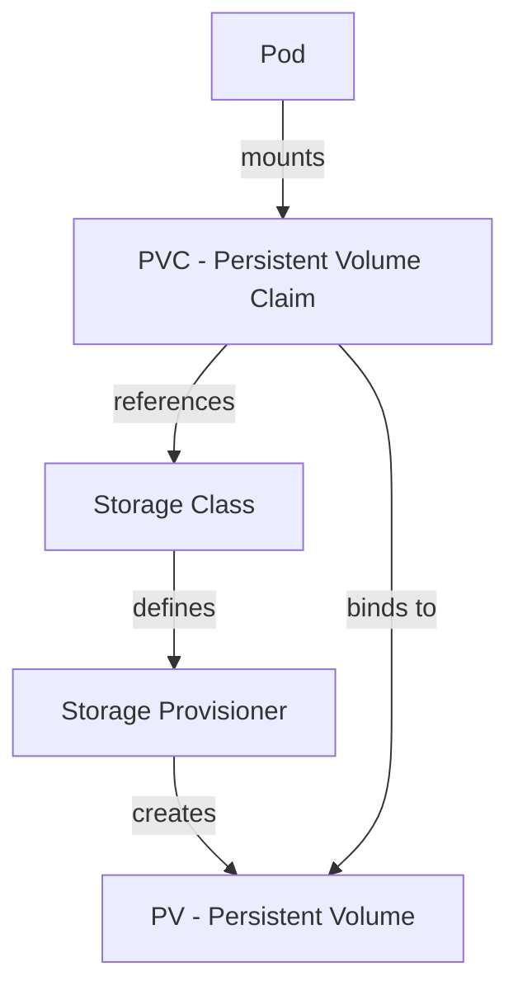

# Kubernetes Storage Provisioning

## Introduction

When deploying applications in Kubernetes, one of the challenges you'll face is managing persistent storage. Unlike traditional applications where data might be stored directly on a server's hard drive, containerized applications in Kubernetes need a more flexible approach to storage that works with their ephemeral nature.

Kubernetes Storage Provisioning solves this problem by providing a way to dynamically create and manage storage resources that containers can use, regardless of the underlying infrastructure. This enables your applications to maintain their data even if containers are restarted, rescheduled, or even when your entire cluster needs to be rebuilt.

In this guide, we'll explore how Kubernetes handles storage provisioning, the key components involved, and how to set it up for your applications.

## The Storage Provisioning Process

Before diving into details, let's understand the big picture of how storage works in Kubernetes:



The process involves several components working together:

1. **Storage Classes** define the types of storage available
2. **Persistent Volume Claims (PVCs)** request storage
3. **Persistent Volumes (PVs)** provide the actual storage resources
4. **Storage Provisioners** create the underlying storage

Let's explore each of these components in detail.

## Storage Classes

A Storage Class provides a way to describe the "classes" of storage offered by the cluster administrator. Different classes might map to quality-of-service levels, backup policies, or arbitrary policies determined by the administrator.

Here's a simple example of a Storage Class definition:

```yaml
apiVersion: storage.k8s.io/v1
kind: StorageClass
metadata:
  name: standard
provisioner: kubernetes.io/aws-ebs
parameters:
  type: gp2
reclaimPolicy: Delete
allowVolumeExpansion: true
```

This Storage Class:
- Uses the AWS EBS provisioner
- Creates gp2 (General Purpose SSD) volumes
- Deletes the volume when the associated PVC is deleted
- Allows volumes to be expanded after creation

### Common Parameters

Storage Class parameters vary depending on the provisioner, but commonly include:

- Type of storage (SSD, HDD)
- Zone/region information
- Encryption settings
- Performance characteristics

## Persistent Volume Claims (PVCs)

A PVC is a request for storage by a user. It's similar to a Pod in that Pods consume node resources and PVCs consume PV resources. Claims can request specific size and access modes.

Here's an example PVC:

```yaml
apiVersion: v1
kind: PersistentVolumeClaim
metadata:
  name: my-app-data
spec:
  storageClassName: standard
  accessModes:
    - ReadWriteOnce
  resources:
    requests:
      storage: 10Gi
```

This PVC:
- Requests 10GB of storage
- Uses the "standard" Storage Class we defined earlier
- Requires ReadWriteOnce access (can be mounted as read-write by a single node)

## Persistent Volumes (PVs)

A PV is a piece of storage in the cluster that has been provisioned by an administrator or dynamically provisioned using Storage Classes.

PVs can be provisioned in two ways:

1. **Static Provisioning**: An administrator creates PVs in advance
2. **Dynamic Provisioning**: PVs are created automatically via Storage Classes when a PVC is created

Here's what a dynamically provisioned PV might look like:

```yaml
apiVersion: v1
kind: PersistentVolume
metadata:
  name: pv-0a6d9
  annotations:
    pv.kubernetes.io/provisioned-by: kubernetes.io/aws-ebs
spec:
  capacity:
    storage: 10Gi
  accessModes:
    - ReadWriteOnce
  persistentVolumeReclaimPolicy: Delete
  storageClassName: standard
  awsElasticBlockStore:
    volumeID: vol-01234567890abcdef
    fsType: ext4
```

## Dynamic Provisioning in Action

Let's walk through a complete example of dynamic provisioning:

### Step 1: Create a Storage Class

```yaml
apiVersion: storage.k8s.io/v1
kind: StorageClass
metadata:
  name: fast
provisioner: kubernetes.io/gce-pd
parameters:
  type: pd-ssd
```

Apply this with:

```bash
kubectl apply -f storage-class.yaml
```

Output:
```
storageclass.storage.k8s.io/fast created
```

### Step 2: Create a PVC

```yaml
apiVersion: v1
kind: PersistentVolumeClaim
metadata:
  name: mongodb-data
spec:
  storageClassName: fast
  accessModes:
    - ReadWriteOnce
  resources:
    requests:
      storage: 30Gi
```

Apply with:

```bash
kubectl apply -f mongodb-pvc.yaml
```

Output:
```
persistentvolumeclaim/mongodb-data created
```

### Step 3: Check the PVC and PV

```bash
kubectl get pvc
```

Output:
```
NAME           STATUS   VOLUME                                     CAPACITY   ACCESS MODES   STORAGECLASS   AGE
mongodb-data   Bound    pvc-e20e974c-4c11-11e9-9a1d-42010a800002   30Gi       RWO            fast           45s
```

```bash
kubectl get pv
```

Output:
```
NAME                                       CAPACITY   ACCESS MODES   RECLAIM POLICY   STATUS   CLAIM                  STORAGECLASS   REASON   AGE
pvc-e20e974c-4c11-11e9-9a1d-42010a800002   30Gi       RWO            Delete           Bound    default/mongodb-data   fast                    42s
```

### Step 4: Use the PVC in a Pod

```yaml
apiVersion: v1
kind: Pod
metadata:
  name: mongodb
spec:
  containers:
  - name: mongodb
    image: mongo
    volumeMounts:
    - name: mongodb-data
      mountPath: /data/db
  volumes:
  - name: mongodb-data
    persistentVolumeClaim:
      claimName: mongodb-data
```

Apply with:

```bash
kubectl apply -f mongodb-pod.yaml
```

Output:
```
pod/mongodb created
```

Now MongoDB will store its data on the persistent volume. If the pod is deleted and recreated, it will still have access to the same data.

## Storage Provisioners

The actual storage creation is handled by provisioners, which are plugins that create volumes on the underlying infrastructure. Kubernetes comes with many built-in provisioners:

- `kubernetes.io/aws-ebs` - AWS Elastic Block Store
- `kubernetes.io/gce-pd` - Google Compute Engine Persistent Disk
- `kubernetes.io/azure-disk` - Azure Disk
- `kubernetes.io/cinder` - OpenStack Cinder
- `kubernetes.io/nfs` - NFS

Additionally, there are external provisioners maintained by the community:

- Ceph
- GlusterFS
- VMware vSphere
- NetApp
- Many others

## StatefulSets and Storage

StatefulSets are designed to work with stateful applications and they have special handling for storage:

```yaml
apiVersion: apps/v1
kind: StatefulSet
metadata:
  name: web
spec:
  selector:
    matchLabels:
      app: nginx
  serviceName: "nginx"
  replicas: 3
  template:
    metadata:
      labels:
        app: nginx
    spec:
      containers:
      - name: nginx
        image: nginx
        volumeMounts:
        - name: www
          mountPath: /usr/share/nginx/html
  volumeClaimTemplates:
  - metadata:
      name: www
    spec:
      accessModes: [ "ReadWriteOnce" ]
      storageClassName: "fast"
      resources:
        requests:
          storage: 1Gi
```

The `volumeClaimTemplates` field automatically creates a PVC for each pod in the StatefulSet, with names like `www-web-0`, `www-web-1`, etc.

## Advanced Topics

### Storage Capacity Tracking

Kubernetes v1.24+ supports storage capacity tracking, which helps the scheduler make better decisions about where to place pods based on available storage:

```yaml
apiVersion: storage.k8s.io/v1
kind: StorageClass
metadata:
  name: example-sc
provisioner: example.com/provisioner
parameters:
  type: fast
volumeBindingMode: WaitForFirstConsumer
```

The `WaitForFirstConsumer` mode delays volume binding until a pod using the PVC is created.

### Volume Snapshots

For backup and restore operations, Kubernetes supports volume snapshots:

```yaml
apiVersion: snapshot.storage.k8s.io/v1
kind: VolumeSnapshot
metadata:
  name: data-snapshot
spec:
  volumeSnapshotClassName: standard-snapclass
  source:
    persistentVolumeClaimName: mongodb-data
```

### Storage Migration

When you need to move data between storage classes or providers, you can use a migration process:

1. Create a new PVC with the desired storage class
2. Create a migration pod that mounts both the old and new PVCs
3. Copy data from the old volume to the new volume
4. Update your application to use the new PVC

## Best Practices

1. **Always use Storage Classes** even if you only have one type of storage, as it provides a layer of abstraction.

2. **Set appropriate resource requests** to avoid over-provisioning or under-provisioning storage.

3. **Use labels and annotations** to keep track of your PVs and PVCs.

4. **Consider access modes carefully** - ReadWriteOnce is most common, but some applications require ReadWriteMany.

5. **Plan for backups** using volume snapshots or other backup solutions.

6. **Monitor storage usage** to identify potential issues before they become problems.

7. **Test storage performance** to ensure it meets your application requirements.

8. **Document your storage architecture** so team members understand how it's designed.

## Troubleshooting Common Issues

### PVC Stuck in Pending State

If your PVC is stuck in the "Pending" state, check:

```bash
kubectl describe pvc <pvc-name>
```

Common reasons include:
- No storage class specified
- Storage class doesn't exist
- Storage provider has issues
- No available storage capacity

### Pod Can't Mount Volume

If a pod can't mount a volume, check:

```bash
kubectl describe pod <pod-name>
```

Look for events related to volume mounting. Common issues include:
- PVC not bound
- Access mode mismatch
- Node doesn't have access to the storage

## Summary

Kubernetes Storage Provisioning provides a flexible, infrastructure-agnostic way to manage persistent storage for containerized applications. By using Storage Classes, PVCs, and PVs together, you can create a storage architecture that's both scalable and maintainable.

Key takeaways:
- Storage Classes define the types of storage available
- PVCs request storage from the cluster
- PVs provide the actual storage resources
- Dynamic provisioning automates PV creation
- StatefulSets have specialized storage handling for stateful applications

## Additional Resources

Here are some exercises to deepen your understanding:

1. Create a Storage Class for a different storage provider than what we've shown.
2. Set up a StatefulSet with a database application using dynamic storage provisioning.
3. Implement a backup solution using volume snapshots.
4. Create a storage migration plan for moving data between storage classes.
5. Research storage solutions for specific cloud providers or on-premise environments.

The official Kubernetes documentation on storage is also an excellent resource for further reading: https://kubernetes.io/docs/concepts/storage/

## Conclusion

Storage provisioning is a critical aspect of running stateful applications in Kubernetes. With the concepts and examples provided in this guide, you're now equipped to design and implement storage solutions for your Kubernetes applications that are both resilient and efficient.

As you continue your Kubernetes journey, remember that storage needs often evolve with your applications, so regularly revisit your storage architecture to ensure it continues to meet your requirements.