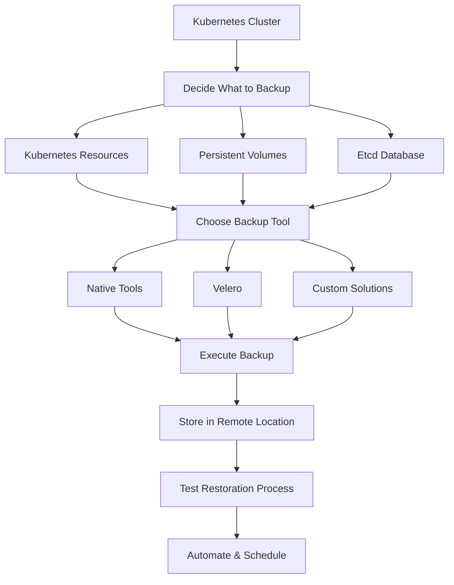

# Kubernetes Backup Solutions

## Introduction

When running production workloads on Kubernetes, protecting your data against accidental deletion, corruption, or cluster failures becomes critical. Kubernetes backup solutions provide mechanisms to create, store, and restore copies of your cluster resources and persistent data to ensure business continuity and disaster recovery capabilities.

In this guide, we'll explore various backup strategies for Kubernetes, examine popular backup tools, and walk through practical examples of implementing backup solutions in your Kubernetes environment.

## Why Backup Kubernetes?

Kubernetes is designed with resilience in mind, but it's not immune to failures:

- **Accidental deletions**: A mistyped `kubectl delete` command can wipe out important resources
- **Application bugs**: Code errors might corrupt application data
- **Infrastructure failures**: Underlying hardware or cloud provider issues can affect cluster availability
- **Security incidents**: Ransomware or malicious actors might target your environment
- **Compliance requirements**: Many industries require regular backups for regulatory compliance

## What to Backup in Kubernetes

A comprehensive Kubernetes backup strategy should consider:

1. **Kubernetes objects/resources**: Deployments, StatefulSets, ConfigMaps, Secrets, etc.
2. **Persistent volumes**: Data stored by your applications
3. **Etcd**: The cluster's state database
4. **Custom resource definitions (CRDs)**: Extensions to the Kubernetes API

## Backup Approaches and Tools

### 1. Native Kubernetes Tools

#### Resource YAML Export

The simplest backup method is exporting Kubernetes resource definitions using `kubectl`:

```bash
# Backup all resources in the default namespace
kubectl get all -o yaml > k8s-backup.yaml

# Backup specific resource types across all namespaces
kubectl get deployments,services,configmaps -A -o yaml > k8s-resources.yaml
```

**Pros**:
- Simple to implement
- No additional tools required

**Cons**:
- Doesn't back up data in persistent volumes
- Manual process prone to errors
- Doesn't scale well for large clusters

### 2. Etcd Snapshots

Since etcd stores the entire state of your Kubernetes cluster, backing it up provides a complete point-in-time snapshot:

```bash
# Create an etcd snapshot
ETCDCTL_API=3 etcdctl --endpoints=https://127.0.0.1:2379 \
  --cacert=/etc/kubernetes/pki/etcd/ca.crt \
  --cert=/etc/kubernetes/pki/etcd/server.crt \
  --key=/etc/kubernetes/pki/etcd/server.key \
  snapshot save /backup/etcd-snapshot-$(date +%Y-%m-%d_%H:%M:%S).db
```

**Pros**:
- Backs up the entire cluster state
- Official and well-documented approach

**Cons**:
- Doesn't include persistent volume data
- Requires direct access to etcd
- Restoration can be complex

### 3. Purpose-Built Kubernetes Backup Tools

Several specialized tools have been developed to address Kubernetes backup challenges:

#### Velero (formerly Heptio Ark)

[Velero](https://velero.io) is one of the most popular Kubernetes backup solutions that can:
- Back up cluster resources
- Back up persistent volumes
- Perform scheduled backups
- Migrate resources between clusters

**Basic Setup Example**:

```bash
# Install Velero with AWS S3 storage backend
velero install \
  --provider aws \
  --plugins velero/velero-plugin-for-aws:v1.5.0 \
  --bucket backup-bucket \
  --backup-location-config region=us-west-2 \
  --secret-file ./credentials-velero
```

**Performing a Backup with Velero**:

```bash
# Back up the entire cluster
velero backup create full-cluster-backup

# Back up specific namespaces
velero backup create backup-app1 --include-namespaces app1

# Back up using labels
velero backup create backup-app-tier --selector tier=application
```

**Restoring from a Backup**:

```bash
# List available backups
velero backup get

# Restore a specific backup
velero restore create --from-backup full-cluster-backup
```

#### Kasten K10

[Kasten K10](https://www.kasten.io/) is an enterprise-grade solution offering:
- Application-centric backup policies
- Data transformation capabilities
- Multi-cloud support
- Enhanced security features

#### Stash

[Stash](https://stash.run/) is a Kubernetes native backup solution that:
- Supports database workloads
- Uses CRDs to define backup operations
- Integrates well with operators

### 4. Volume Snapshots

Kubernetes supports the Volume Snapshot API, allowing you to create snapshots of persistent volumes:

```yaml
# Create a VolumeSnapshotClass
apiVersion: snapshot.storage.k8s.io/v1
kind: VolumeSnapshotClass
metadata:
  name: csi-hostpath-snapclass
driver: hostpath.csi.k8s.io
deletionPolicy: Delete
```

```yaml
# Create a VolumeSnapshot
apiVersion: snapshot.storage.k8s.io/v1
kind: VolumeSnapshot
metadata:
  name: database-snapshot
spec:
  volumeSnapshotClassName: csi-hostpath-snapclass
  source:
    persistentVolumeClaimName: database-pvc
```

**Pros**:
- Native Kubernetes API
- Integrates with CSI drivers
- Storage-efficient

**Cons**:
- Requires CSI driver support
- Not all storage providers support snapshots
- Doesn't backup Kubernetes resources

## Backup Strategies and Best Practices

### 3-2-1 Backup Strategy

Follow the 3-2-1 rule for critical workloads:
- Keep at least 3 copies of your data
- Store 2 backup copies on different storage media
- Keep 1 backup copy offsite (different region/provider)

### Backup Flow Diagram



### Testing Your Backups

Untested backups are potentially worthless. Regularly validate your backup strategy by:

1. Creating a test environment
2. Restoring backups to the test environment
3. Verifying application functionality
4. Measuring restoration time

**Example Testing Script**:

```bash
#!/bin/bash
# Simple backup verification script

# Create a test namespace
kubectl create namespace backup-test

# Restore the latest backup to test namespace
velero restore create --from-backup latest-backup --namespace-mappings default:backup-test

# Wait for restoration to complete
sleep 60

# Check if critical deployments are running
kubectl get deployments -n backup-test

# Run application verification tests
./verify-app-functionality.sh -n backup-test

# Clean up test namespace
kubectl delete namespace backup-test
```

### Implementing a Backup Schedule

Automated, scheduled backups ensure consistent protection:

```yaml
# Velero scheduled backup example
apiVersion: velero.io/v1
kind: Schedule
metadata:
  name: daily-app-backup
  namespace: velero
spec:
  schedule: "0 1 * * *"  # Daily at 1am
  template:
    includedNamespaces:
    - app-namespace
    includedResources:
    - '*'
    includeClusterResources: true
    snapshotVolumes: true
    ttl: 720h  # 30 days
```

## Real-World Example: Backing Up a WordPress Deployment

Let's implement a complete backup solution for a WordPress site running on Kubernetes:

### Step 1: Deploy WordPress with Persistent Storage

```yaml
# wordpress-deployment.yaml
apiVersion: v1
kind: PersistentVolumeClaim
metadata:
  name: wordpress-pvc
spec:
  accessModes:
    - ReadWriteOnce
  resources:
    requests:
      storage: 10Gi
---
apiVersion: apps/v1
kind: Deployment
metadata:
  name: wordpress
  labels:
    app: wordpress
spec:
  replicas: 1
  selector:
    matchLabels:
      app: wordpress
  template:
    metadata:
      labels:
        app: wordpress
    spec:
      containers:
      - name: wordpress
        image: wordpress:latest
        ports:
        - containerPort: 80
          name: wordpress
        volumeMounts:
        - name: wordpress-data
          mountPath: /var/www/html
        env:
        - name: WORDPRESS_DB_HOST
          value: mysql
        - name: WORDPRESS_DB_PASSWORD
          valueFrom:
            secretKeyRef:
              name: mysql-pass
              key: password
      volumes:
      - name: wordpress-data
        persistentVolumeClaim:
          claimName: wordpress-pvc
```

### Step 2: Install Velero with a Storage Provider

```bash
# Install Velero with MinIO (S3-compatible storage)
velero install \
  --provider aws \
  --plugins velero/velero-plugin-for-aws:v1.5.0 \
  --bucket velero \
  --secret-file ./credentials-velero \
  --use-volume-snapshots=true \
  --backup-location-config region=minio,s3ForcePathStyle="true",s3Url=http://minio.velero.svc:9000
```

### Step 3: Create a Backup Schedule

```yaml
# wordpress-backup-schedule.yaml
apiVersion: velero.io/v1
kind: Schedule
metadata:
  name: wordpress-daily-backup
spec:
  schedule: "0 2 * * *"  # Daily at 2am
  template:
    includedNamespaces:
    - default
    labelSelector:
      matchLabels:
        app: wordpress
    snapshotVolumes: true
    storageLocation: default
    volumeSnapshotLocations:
    - default
    ttl: 336h  # 14 days
```

Apply the schedule:

```bash
kubectl apply -f wordpress-backup-schedule.yaml
```

### Step 4: Verify Backup Creation

```bash
# Check backup status
velero backup get

# Describe a specific backup
velero backup describe wordpress-daily-backup-20230815020000
```

### Step 5: Test Restoration

```bash
# Create a test namespace
kubectl create namespace wordpress-test

# Restore WordPress to test namespace
velero restore create --from-backup wordpress-daily-backup-20230815020000 \
  --namespace-mappings default:wordpress-test

# Verify the restoration
kubectl get all -n wordpress-test
```

## Alternative Approaches for Database Backups

For database-heavy applications, consider combining Kubernetes backups with database-native backup solutions:

### Database Sidecar Container Pattern

```yaml
# Database with backup sidecar
apiVersion: apps/v1
kind: Deployment
metadata:
  name: postgres-with-backup
spec:
  replicas: 1
  selector:
    matchLabels:
      app: postgres
  template:
    metadata:
      labels:
        app: postgres
    spec:
      containers:
      - name: postgres
        image: postgres:14
        volumeMounts:
        - name: postgres-data
          mountPath: /var/lib/postgresql/data
      - name: backup
        image: postgres:14
        command: ["/bin/sh"]
        args: ["-c", "while true; do pg_dump -U postgres -d mydb > /backups/db-$(date +%Y-%m-%d_%H-%M).sql; sleep 86400; done"]
        volumeMounts:
        - name: backup-volume
          mountPath: /backups
      volumes:
      - name: postgres-data
        persistentVolumeClaim:
          claimName: postgres-pvc
      - name: backup-volume
        persistentVolumeClaim:
          claimName: backup-pvc
```

## Summary

Kubernetes backup solutions are essential for protecting your containerized applications from data loss and enabling disaster recovery. Key points to remember:

1. **Comprehensive strategy**: Back up both Kubernetes resources and persistent data
2. **Purpose-built tools**: Use specialized tools like Velero for Kubernetes-aware backups
3. **Regular testing**: Validate your backups through periodic restoration tests
4. **Automation**: Schedule backups to run automatically
5. **Consider application specifics**: Database workloads might need additional backup mechanisms

By implementing a robust backup strategy, you can ensure your Kubernetes applications remain resilient against data loss and operational disruptions.

## Additional Resources

- [Velero Documentation](https://velero.io/docs/)
- [Kubernetes Volume Snapshots](https://kubernetes.io/docs/concepts/storage/volume-snapshots/)
- [Etcd Backup and Restore](https://kubernetes.io/docs/tasks/administer-cluster/configure-upgrade-etcd/#backing-up-an-etcd-cluster)

## Exercises

1. Set up Velero in a test Kubernetes cluster and create a manual backup of a namespace.
2. Configure a scheduled backup for a stateful application using a tool of your choice.
3. Perform a disaster recovery simulation by deleting a deployment and restoring it from backup.
4. Design a backup strategy for a multi-database application that includes MySQL, MongoDB, and Redis.
5. Implement a backup verification pipeline that automatically tests restored applications.