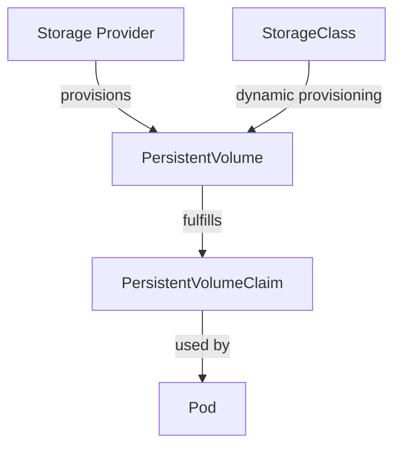

# Kubernetes PersistentVolumeClaims

## Introduction

When deploying applications in Kubernetes, one of the key challenges is managing data that needs to persist beyond the lifecycle of a pod. Containers are ephemeral by nature - when a pod is deleted or recreated, any data stored within the container is lost. This is where **PersistentVolumeClaims (PVCs)** come into play.

PersistentVolumeClaims provide a way for users to "claim" durable storage resources without knowing the details of the underlying storage infrastructure. They serve as a request for storage by a user that can be fulfilled by a matching PersistentVolume (PV).

In this tutorial, we'll explore:
- What PersistentVolumeClaims are and why they're important
- How PVCs relate to PersistentVolumes
- How to create and use PVCs in your applications
- Common patterns and best practices

## Understanding the Storage Hierarchy

Before diving into PVCs, let's understand how they fit into Kubernetes' storage model:



1. **Storage Provider**: Physical storage (Cloud disks, NFS servers, etc.)
2. **PersistentVolume (PV)**: Represents a piece of storage in the cluster
3. **PersistentVolumeClaim (PVC)**: A request for storage by a user
4. **StorageClass**: Enables dynamic provisioning of PVs
5. **Pod**: Uses the PVC to access storage

## What is a PersistentVolumeClaim?

A PersistentVolumeClaim is a request for storage by a user. It's similar to how a Pod requests CPU and memory resources. PVCs request specific size, access modes, and optionally storage classes.

Key characteristics of PVCs:
- **Namespace-bound**: PVCs exist within a specific namespace
- **Portable**: The same PVC can be used across different pods
- **Persistent**: Data in a PVC survives pod restarts and rescheduling

## Creating a PersistentVolumeClaim

Let's create a basic PVC that requests 1GB of storage:

```yaml
apiVersion: v1
kind: PersistentVolumeClaim
metadata:
  name: my-first-pvc
  namespace: default
spec:
  accessModes:
    - ReadWriteOnce
  resources:
    requests:
      storage: 1Gi
```

Breaking this down:
- `accessModes`: Defines how the volume can be mounted
  - `ReadWriteOnce`: Can be mounted as read-write by a single node
  - `ReadOnlyMany`: Can be mounted read-only by many nodes
  - `ReadWriteMany`: Can be mounted as read-write by many nodes
- `resources.requests.storage`: The amount of storage requested

To create this PVC, save it to a file (e.g., `my-pvc.yaml`) and run:

```bash
kubectl apply -f my-pvc.yaml
```

You can check the status of your PVC with:

```bash
kubectl get pvc my-first-pvc
```

Example output:
```
NAME          STATUS    VOLUME                                    CAPACITY   ACCESS MODES   STORAGECLASS   AGE
my-first-pvc  Pending   pvc-e20e974c-84a9-11e9-8c30-42010a800002  1Gi        RWO            standard       5s
```

If the status is `Pending`, it means Kubernetes is trying to find or provision a PersistentVolume that matches the claim.

## Using StorageClasses with PVCs

StorageClasses allow you to define different "classes" of storage with varying performance characteristics and policies. By specifying a StorageClass in your PVC, you can dynamically provision volumes that match your needs.

Here's how to create a PVC with a specific StorageClass:

```yaml
apiVersion: v1
kind: PersistentVolumeClaim
metadata:
  name: fast-storage-pvc
spec:
  storageClassName: fast
  accessModes:
    - ReadWriteOnce
  resources:
    requests:
      storage: 5Gi
```

For this to work, a StorageClass named "fast" must exist in your cluster. You can view available StorageClasses with:

```bash
kubectl get storageclass
```

## Using a PVC in a Pod

Once your PVC is bound to a PV, you can use it in a Pod by referencing it in the Pod specification:

```yaml
apiVersion: v1
kind: Pod
metadata:
  name: pvc-demo-pod
spec:
  containers:
    - name: app
      image: nginx
      volumeMounts:
        - mountPath: "/usr/share/nginx/html"
          name: my-volume
  volumes:
    - name: my-volume
      persistentVolumeClaim:
        claimName: my-first-pvc
```

This mounts the storage claimed by `my-first-pvc` to the path `/usr/share/nginx/html` in the container.

## Real-World Example: Database with Persistent Storage

Let's look at a practical example of using a PVC with a PostgreSQL database:

1. First, create a PVC for the database:

```yaml
apiVersion: v1
kind: PersistentVolumeClaim
metadata:
  name: postgres-pvc
spec:
  accessModes:
    - ReadWriteOnce
  resources:
    requests:
      storage: 10Gi
```

2. Then create a PostgreSQL deployment using this PVC:

```yaml
apiVersion: apps/v1
kind: Deployment
metadata:
  name: postgres
spec:
  replicas: 1
  selector:
    matchLabels:
      app: postgres
  template:
    metadata:
      labels:
        app: postgres
    spec:
      containers:
        - name: postgres
          image: postgres:13
          env:
            - name: POSTGRES_PASSWORD
              value: mysecretpassword
            - name: PGDATA
              value: /var/lib/postgresql/data/pgdata
          ports:
            - containerPort: 5432
          volumeMounts:
            - name: postgres-storage
              mountPath: /var/lib/postgresql/data
      volumes:
        - name: postgres-storage
          persistentVolumeClaim:
            claimName: postgres-pvc
```

With this setup, the PostgreSQL data will persist even if the pod is deleted and recreated. If the node fails, the pod will be rescheduled to another node, and the data will still be accessible.

## Working with Existing PVCs

You can manage your PVCs using several kubectl commands:

```bash
# List all PVCs in current namespace
kubectl get pvc

# Get detailed information about a PVC
kubectl describe pvc my-first-pvc

# Delete a PVC
kubectl delete pvc my-first-pvc
```

Be careful when deleting PVCs, as this might lead to data loss depending on your storage configuration and reclaim policy.

## PVC Lifecycle and Reclaim Policies

When you're done with a PVC, what happens to the underlying PersistentVolume depends on its **reclaim policy**:

1. **Retain**: The PV and its data are kept, but the PV is not available for reuse
2. **Delete**: The PV and its associated storage are deleted
3. **Recycle**: (Deprecated) The volume's contents are deleted, but the volume itself is kept

The reclaim policy is set on the PersistentVolume, not the PVC.

## PVC Expansion

Kubernetes supports expanding PVCs if the StorageClass has `allowVolumeExpansion: true`. To expand a PVC, edit its resource request:

```yaml
apiVersion: v1
kind: PersistentVolumeClaim
metadata:
  name: my-first-pvc
spec:
  accessModes:
    - ReadWriteOnce
  resources:
    requests:
      storage: 2Gi  # Changed from 1Gi to 2Gi
```

Apply the change:

```bash
kubectl apply -f my-pvc.yaml
```

Note that shrinking PVCs is not supported and depends on the underlying storage provider.

## Advanced Concepts

### Using Selector in PVCs

You can use selectors to bind to specific PVs:

```yaml
apiVersion: v1
kind: PersistentVolumeClaim
metadata:
  name: pvc-with-selector
spec:
  accessModes:
    - ReadWriteOnce
  resources:
    requests:
      storage: 1Gi
  selector:
    matchLabels:
      environment: production
```

This PVC will only bind to PVs with the label `environment: production`.

### PVC Data Sources

You can create a PVC pre-populated with data from a snapshot:

```yaml
apiVersion: v1
kind: PersistentVolumeClaim
metadata:
  name: clone-pvc
spec:
  accessModes:
    - ReadWriteOnce
  resources:
    requests:
      storage: 10Gi
  dataSource:
    name: pvc-snapshot
    kind: VolumeSnapshot
    apiGroup: snapshot.storage.k8s.io
```

This creates a PVC populated with data from the VolumeSnapshot named "pvc-snapshot".

## Common Challenges and Solutions

### PVC Stuck in "Pending" State

If your PVC is stuck in "Pending", it usually means:
1. No available PV matches your requirements
2. The StorageClass doesn't exist
3. The dynamic provisioner is not working

Solution: Check events with `kubectl describe pvc <name>` to see the reason.

### Data Loss When Deleting PVCs

By default, when using a StorageClass with the Delete reclaim policy, deleting a PVC also deletes the data.

Solution: Consider using the Retain reclaim policy for important data or implement backup strategies.

### Performance Issues

If your application is experiencing slow storage performance:

Solution: Consider using a different StorageClass with better performance characteristics.

## Summary

PersistentVolumeClaims are a crucial part of managing stateful applications in Kubernetes. They provide:

- A way to request storage resources without knowing infrastructure details
- Persistence for your application data beyond pod lifecycles
- Flexibility to use different types of storage via StorageClasses

By understanding how to create and use PVCs, you can build robust, stateful applications in Kubernetes that safely store and access persistent data.

## Additional Resources

- [Kubernetes Documentation: PersistentVolumes](https://kubernetes.io/docs/concepts/storage/persistent-volumes/)
- [Kubernetes Documentation: Storage Classes](https://kubernetes.io/docs/concepts/storage/storage-classes/)
- [Kubernetes Documentation: Volume Snapshots](https://kubernetes.io/docs/concepts/storage/volume-snapshots/)

## Exercises

1. Create a PVC with 2Gi of storage and mount it to a simple web server pod.
2. Deploy a MySQL database with persistent storage using a PVC.
3. Create two pods that share the same PVC with ReadWriteMany access mode (requires a compatible storage provider).
4. Experiment with different StorageClasses in your cluster and observe the differences.
5. Implement a backup solution for your PVC data using VolumeSnapshots.