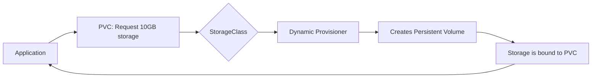

# Understanding Kubernetes StorageClass

## Introduction

When working with applications in Kubernetes that need persistent storage, one of the most powerful concepts you'll encounter is the **StorageClass**. Think of StorageClass as a blueprint that defines what kind of storage your applications can request and use.

In this guide, we'll explore how StorageClass works, why it's crucial for storage management in Kubernetes, and how to implement it effectively in your clusters.

## What is a StorageClass?

A StorageClass is a Kubernetes resource that:

- Defines different "classes" or types of storage available in your cluster
- Automates the provisioning of Persistent Volumes
- Enables dynamic storage allocation based on application needs
- Abstracts the underlying storage provider details

In simpler terms, StorageClass lets you define and categorize different storage options (like SSD vs. HDD, or local vs. cloud storage) that your applications can then request without needing to know the technical details about how that storage is provisioned.



## Why StorageClass Matters

Before StorageClass existed, Kubernetes administrators had to:

1. Manually create all storage volumes
2. Pre-provision storage for all possible application needs
3. Maintain tight coordination between application developers and infrastructure teams

StorageClass solves these problems by:

- **Automating storage provisioning**: When an application needs storage, it's created on-demand
- **Standardizing storage options**: Teams can choose from pre-defined storage types
- **Separating concerns**: Developers request storage without needing to understand the infrastructure details
- **Enabling self-service**: Applications can get the storage they need without admin intervention

## StorageClass Anatomy

Let's examine the structure of a StorageClass definition:

```yaml
apiVersion: storage.k8s.io/v1
kind: StorageClass
metadata:
  name: fast-storage
provisioner: kubernetes.io/aws-ebs
parameters:
  type: gp2
  fsType: ext4
reclaimPolicy: Delete
allowVolumeExpansion: true
volumeBindingMode: WaitForFirstConsumer
```

Let's break down the key fields:

- **provisioner**: Defines which volume plugin to use for provisioning the storage
- **parameters**: Configuration options for the specified provisioner
- **reclaimPolicy**: Determines what happens to a volume when its claim is deleted
- **allowVolumeExpansion**: Controls whether volumes can be expanded after creation
- **volumeBindingMode**: Controls when volume binding and dynamic provisioning occurs

## Creating Your First StorageClass

Let's create a simple StorageClass for your cluster:

```yaml
apiVersion: storage.k8s.io/v1
kind: StorageClass
metadata:
  name: standard
provisioner: kubernetes.io/hostpath
reclaimPolicy: Delete
```

Save this as `standard-storage-class.yaml` and apply it to your cluster:

```bash
kubectl apply -f standard-storage-class.yaml
```

To verify your StorageClass was created:

```bash
kubectl get storageclass
```

Output:
```
NAME       PROVISIONER                  AGE
standard   kubernetes.io/hostpath       5s
```

## Setting a Default StorageClass

In many clusters, you'll want to designate one StorageClass as the default:

```yaml
apiVersion: storage.k8s.io/v1
kind: StorageClass
metadata:
  name: standard
  annotations:
    storageclass.kubernetes.io/is-default-class: "true"
provisioner: kubernetes.io/hostpath
reclaimPolicy: Delete
```

When a StorageClass is marked as default, any PersistentVolumeClaim that doesn't specify a StorageClass will automatically use this one.

## Common Provisioners

Different environments support different provisioners:

| Environment | Common Provisioners |
|-------------|---------------------|
| AWS | kubernetes.io/aws-ebs |
| GCP | kubernetes.io/gce-pd |
| Azure | kubernetes.io/azure-disk |
| On-premise | kubernetes.io/no-provisioner, kubernetes.io/hostpath |
| OpenStack | kubernetes.io/cinder |
| vSphere | kubernetes.io/vsphere-volume |

## Using StorageClass in PersistentVolumeClaims

Once you've defined a StorageClass, your applications can request storage through PersistentVolumeClaims (PVCs):

```yaml
apiVersion: v1
kind: PersistentVolumeClaim
metadata:
  name: my-app-data
spec:
  accessModes:
    - ReadWriteOnce
  resources:
    requests:
      storage: 10Gi
  storageClassName: fast-storage
```

When this PVC is created, Kubernetes will:

1. Check which StorageClass is requested (`fast-storage`)
2. Use the provisioner defined in that StorageClass to create a new volume
3. Bind the newly created volume to this claim
4. Make the storage available to any Pod that references this PVC

## Reclaim Policies

The `reclaimPolicy` field controls what happens to a PersistentVolume when its claim is deleted:

- **Delete**: The volume is automatically deleted (default behavior)
- **Retain**: The volume and its data are kept until manually deleted
- **Recycle**: Basic scrub (`rm -rf /thevolume/*`) before making available again (deprecated)

Choose based on your data importance:

```yaml
apiVersion: storage.k8s.io/v1
kind: StorageClass
metadata:
  name: critical-data
provisioner: kubernetes.io/aws-ebs
parameters:
  type: gp2
reclaimPolicy: Retain
```

## Volume Binding Modes

The `volumeBindingMode` field controls when volume binding and dynamic provisioning occurs:

- **Immediate**: Volume is provisioned as soon as the PVC is created (default)
- **WaitForFirstConsumer**: Volume is provisioned only when a Pod using the PVC is created

```yaml
apiVersion: storage.k8s.io/v1
kind: StorageClass
metadata:
  name: local-storage
provisioner: kubernetes.io/no-provisioner
volumeBindingMode: WaitForFirstConsumer
```

The `WaitForFirstConsumer` mode is particularly useful for local storage or when you want to ensure the volume is created in the same topology domain (like zone or node) as the Pod that will use it.

## Real-World Example: Stateful Application

Let's see how all these concepts come together with a real-world example of deploying a MongoDB database:

1. First, define a StorageClass for database storage:

```yaml
apiVersion: storage.k8s.io/v1
kind: StorageClass
metadata:
  name: mongodb-storage
provisioner: kubernetes.io/aws-ebs
parameters:
  type: io1
  iopsPerGB: "50"
  fsType: ext4
reclaimPolicy: Retain
allowVolumeExpansion: true
```

2. Create a PersistentVolumeClaim using this StorageClass:

```yaml
apiVersion: v1
kind: PersistentVolumeClaim
metadata:
  name: mongodb-data
spec:
  accessModes:
    - ReadWriteOnce
  resources:
    requests:
      storage: 20Gi
  storageClassName: mongodb-storage
```

3. Deploy MongoDB using this PVC:

```yaml
apiVersion: apps/v1
kind: StatefulSet
metadata:
  name: mongodb
spec:
  serviceName: "mongodb"
  replicas: 1
  selector:
    matchLabels:
      app: mongodb
  template:
    metadata:
      labels:
        app: mongodb
    spec:
      containers:
      - name: mongodb
        image: mongo:4.4
        ports:
        - containerPort: 27017
        volumeMounts:
        - name: mongodb-data
          mountPath: /data/db
      volumes:
      - name: mongodb-data
        persistentVolumeClaim:
          claimName: mongodb-data
```

This configuration:
- Creates a high-performance storage class optimized for databases
- Provisions a 20GB volume with that storage class
- Deploys MongoDB using the provisioned storage
- Ensures data is retained even if the PVC is deleted

## Advanced StorageClass Features

### Storage Class Parameters

Different provisioners support different parameters. Here are some examples:

**AWS EBS:**
```yaml
apiVersion: storage.k8s.io/v1
kind: StorageClass
metadata:
  name: aws-fast
provisioner: kubernetes.io/aws-ebs
parameters:
  type: gp3
  iopsPerGB: "10"
  encrypted: "true"
```

**GCE Persistent Disk:**
```yaml
apiVersion: storage.k8s.io/v1
kind: StorageClass
metadata:
  name: gce-ssd
provisioner: kubernetes.io/gce-pd
parameters:
  type: pd-ssd
  replication-type: none
```

### Volume Expansion

If you need to increase volume size after creation, use the `allowVolumeExpansion` parameter:

```yaml
apiVersion: storage.k8s.io/v1
kind: StorageClass
metadata:
  name: expandable-storage
provisioner: kubernetes.io/aws-ebs
parameters:
  type: gp2
allowVolumeExpansion: true
```

With this setting, you can edit an existing PVC to request more storage:

```yaml
apiVersion: v1
kind: PersistentVolumeClaim
metadata:
  name: my-claim
spec:
  accessModes:
    - ReadWriteOnce
  resources:
    requests:
      storage: 20Gi  # Previously was 10Gi
  storageClassName: expandable-storage
```

### Mount Options

You can specify mount options for volumes:

```yaml
apiVersion: storage.k8s.io/v1
kind: StorageClass
metadata:
  name: nfs-slow
provisioner: kubernetes.io/nfs
mountOptions:
  - hard
  - nfsvers=4.1
```

## Troubleshooting StorageClass Issues

Here are some common issues and solutions:

1. **PVC remains in "Pending" state**:
   - Check if a provisioner for the StorageClass exists in your cluster
   - Verify permissions for the provisioning service account
   - Check if the requested storage size is available

2. **Volume not mounting to Pod**:
   - Ensure accessModes match between PV and PVC
   - Check if the node has access to the storage backend
   - Look for errors in the kubelet logs

3. **Default StorageClass not being used**:
   - Verify the annotation is correctly set
   - Only one StorageClass should be marked as default
   - Restart the kube-controller-manager if changes don't take effect

## Summary

Kubernetes StorageClass is a powerful abstraction that simplifies storage management in your clusters. By understanding and implementing StorageClasses effectively, you can:

- Automate storage provisioning
- Standardize storage options across your organization
- Separate concerns between developers and infrastructure teams
- Enable self-service for application teams

StorageClass forms the foundation of stateful application deployments in Kubernetes, and mastering it is essential for running production-grade applications that require persistent storage.

## Exercise: Create Your Own Storage Solution

Try these exercises to reinforce your learning:

1. Create a StorageClass for local development using the `hostPath` provisioner
2. Deploy a simple stateful application (like MySQL) using your StorageClass
3. Experiment with different reclaim policies and observe the behavior
4. Create multiple StorageClasses with different performance characteristics
5. Implement a default StorageClass and verify it works with PVCs that don't specify a class

## Additional Resources

To learn more about Kubernetes storage, check out:

- [Kubernetes official documentation on Storage Classes](https://kubernetes.io/docs/concepts/storage/storage-classes/)
- [Persistent Volumes and Claims](https://kubernetes.io/docs/concepts/storage/persistent-volumes/)
- [Dynamic Volume Provisioning](https://kubernetes.io/docs/concepts/storage/dynamic-provisioning/)
- [Container Storage Interface (CSI)](https://kubernetes.io/docs/concepts/storage/volumes/#csi)