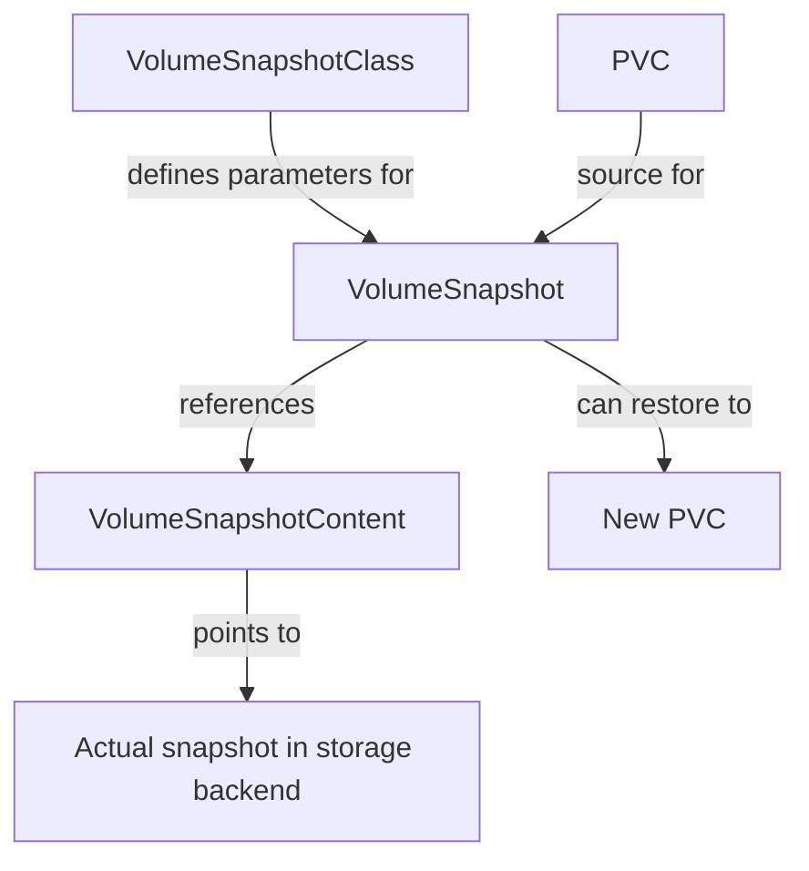

# Kubernetes VolumeSnapshot

## Introduction

In the world of Kubernetes, managing storage effectively is crucial for maintaining application state and data persistence. While Persistent Volumes (PVs) and Persistent Volume Claims (PVCs) provide a way to manage storage resources, there's often a need to create point-in-time copies of these volumes for backup, disaster recovery, or environment cloning purposes.

This is where **VolumeSnapshots** come into play. Introduced as an alpha feature in Kubernetes 1.12 and reaching beta in version 1.17, VolumeSnapshots allow you to create snapshots of Persistent Volumes that can later be used to create new volumes or restore existing ones.

## Understanding VolumeSnapshots

### What is a VolumeSnapshot?

A VolumeSnapshot is a Kubernetes API resource that represents a point-in-time copy of a volume in a cluster. It's similar to how you might take a snapshot of a virtual machine disk - it captures the state of the volume at a specific moment.

### Key Components

The VolumeSnapshot feature consists of several API resources:

1. **VolumeSnapshot**: Represents a request for a snapshot of a volume
2. **VolumeSnapshotContent**: Represents an actual snapshot in the storage system
3. **VolumeSnapshotClass**: Defines parameters for snapshot creation, similar to StorageClass

### The VolumeSnapshot Architecture

The relationship between these components is similar to the PV-PVC model in Kubernetes:



## Prerequisites

Before you can use VolumeSnapshots, ensure your cluster meets these requirements:

1. Kubernetes version 1.17 or later (for beta support)
2. A CSI driver that supports volume snapshots
3. The VolumeSnapshot CRDs and snapshot controller installed

### Installing the VolumeSnapshot CRDs and Controller

The snapshot CRDs and controller don't come pre-installed with Kubernetes. You'll need to install them separately:

```bash
# Install Snapshot CRDs
kubectl apply -f https://raw.githubusercontent.com/kubernetes-csi/external-snapshotter/v4.1.1/client/config/crd/snapshot.storage.k8s.io_volumesnapshotclasses.yaml
kubectl apply -f https://raw.githubusercontent.com/kubernetes-csi/external-snapshotter/v4.1.1/client/config/crd/snapshot.storage.k8s.io_volumesnapshotcontents.yaml
kubectl apply -f https://raw.githubusercontent.com/kubernetes-csi/external-snapshotter/v4.1.1/client/config/crd/snapshot.storage.k8s.io_volumesnapshots.yaml

# Install Snapshot Controller
kubectl apply -f https://raw.githubusercontent.com/kubernetes-csi/external-snapshotter/v4.1.1/deploy/kubernetes/snapshot-controller/rbac-snapshot-controller.yaml
kubectl apply -f https://raw.githubusercontent.com/kubernetes-csi/external-snapshotter/v4.1.1/deploy/kubernetes/snapshot-controller/setup-snapshot-controller.yaml
```

## Working with VolumeSnapshots

Let's walk through the process of creating and using VolumeSnapshots in Kubernetes.

### Step 1: Create a VolumeSnapshotClass

First, define a VolumeSnapshotClass that will be used when creating snapshots:

```yaml
apiVersion: snapshot.storage.k8s.io/v1
kind: VolumeSnapshotClass
metadata:
  name: csi-hostpath-snapclass
driver: hostpath.csi.k8s.io  # This should match your CSI driver
deletionPolicy: Delete
parameters:
  # CSI driver specific parameters
```

In this example:
- `driver` specifies the CSI driver that handles the snapshot
- `deletionPolicy` determines what happens to the snapshot content when the snapshot is deleted
- `parameters` are specific to your CSI driver

### Step 2: Create a VolumeSnapshot

Now, let's create a snapshot of an existing PVC:

```yaml
apiVersion: snapshot.storage.k8s.io/v1
kind: VolumeSnapshot
metadata:
  name: my-app-snapshot
spec:
  volumeSnapshotClassName: csi-hostpath-snapclass
  source:
    persistentVolumeClaimName: my-app-data
```

This YAML creates a snapshot of the PVC named `my-app-data` using the snapshot class we defined.

Let's check the status of our snapshot:

```bash
kubectl get volumesnapshot
```

Output:
```
NAME             READYTOUSE   SOURCEPVC     SOURCESNAPSHOTCONTENT   RESTORESIZE   SNAPSHOTCLASS            SNAPSHOTCONTENT                                    CREATIONTIME   AGE
my-app-snapshot   true         my-app-data                           1Gi           csi-hostpath-snapclass   snapcontent-620d9015-7a5c-47a1-8230-2de48d12c0a2   2m17s          2m25s
```

### Step 3: Restore from a VolumeSnapshot

To restore data from a snapshot, create a PVC that references the snapshot:

```yaml
apiVersion: v1
kind: PersistentVolumeClaim
metadata:
  name: my-app-data-restored
spec:
  accessModes:
    - ReadWriteOnce
  storageClassName: csi-hostpath-sc
  resources:
    requests:
      storage: 1Gi
  dataSource:
    name: my-app-snapshot
    kind: VolumeSnapshot
    apiGroup: snapshot.storage.k8s.io
```

In this example:
- We're creating a new PVC named `my-app-data-restored`
- The `dataSource` field references our snapshot
- The storage class should be compatible with the snapshot class

Once created, this PVC will be pre-populated with the data from the snapshot.

## Practical Examples

Let's look at some real-world scenarios where VolumeSnapshots are useful.

### Example 1: Database Backup and Restore

Imagine you're running a PostgreSQL database in Kubernetes and want to create a regular backup workflow.

1. First, let's create a VolumeSnapshotClass:

```yaml
apiVersion: snapshot.storage.k8s.io/v1
kind: VolumeSnapshotClass
metadata:
  name: postgres-snapshot-class
driver: ebs.csi.aws.com  # Example for AWS EBS CSI driver
deletionPolicy: Retain
```

2. Create a CronJob to take regular snapshots:

```yaml
apiVersion: batch/v1
kind: CronJob
metadata:
  name: postgres-backup
spec:
  schedule: "0 2 * * *"  # Run at 2 AM every day
  jobTemplate:
    spec:
      template:
        spec:
          serviceAccountName: snapshot-creator  # Service account with proper permissions
          containers:
          - name: snapshot-creator
            image: bitnami/kubectl:latest
            command:
            - /bin/sh
            - -c
            - |
              cat <<EOF | kubectl apply -f -
              apiVersion: snapshot.storage.k8s.io/v1
              kind: VolumeSnapshot
              metadata:
                name: postgres-snapshot-$(date +%Y%m%d)
              spec:
                volumeSnapshotClassName: postgres-snapshot-class
                source:
                  persistentVolumeClaimName: postgres-data
              EOF
          restartPolicy: OnFailure
```

3. To restore from a snapshot, create a new PVC and deploy a temporary PostgreSQL instance:

```yaml
apiVersion: v1
kind: PersistentVolumeClaim
metadata:
  name: postgres-data-restored
spec:
  accessModes:
    - ReadWriteOnce
  storageClassName: gp2
  resources:
    requests:
      storage: 20Gi
  dataSource:
    name: postgres-snapshot-20230301  # The specific snapshot to restore
    kind: VolumeSnapshot
    apiGroup: snapshot.storage.k8s.io
```

### Example 2: Development Environment Cloning

Another common use case is creating development or testing environments that use real production data.

1. Take a snapshot of the production volume:

```yaml
apiVersion: snapshot.storage.k8s.io/v1
kind: VolumeSnapshot
metadata:
  name: prod-data-snapshot
spec:
  volumeSnapshotClassName: csi-snapclass
  source:
    persistentVolumeClaimName: production-data
```

2. Create a development environment using this snapshot:

```yaml
apiVersion: v1
kind: PersistentVolumeClaim
metadata:
  name: dev-environment-data
  namespace: development
spec:
  accessModes:
    - ReadWriteOnce
  storageClassName: standard
  resources:
    requests:
      storage: 10Gi
  dataSource:
    name: prod-data-snapshot
    kind: VolumeSnapshot
    apiGroup: snapshot.storage.k8s.io
```

## Best Practices

When working with VolumeSnapshots, keep these best practices in mind:

1. **Application Consistency**: For databases and stateful applications, ensure data is in a consistent state before taking a snapshot (e.g., using database commands to flush data to disk)

2. **Retention Policy**: Implement a policy to manage snapshot lifecycle - keeping too many snapshots can increase storage costs

3. **Validation**: Regularly validate that your snapshots can actually be restored successfully

4. **Documentation**: Document the restoration process for emergencies

5. **Automation**: Automate snapshot creation, validation, and cleanup

## Common Issues and Troubleshooting

### Snapshot Creation Fails

If your snapshot creation fails, check:

1. Is your CSI driver installed and working?
```bash
kubectl get csidrivers
```

2. Does your CSI driver support snapshots?
```bash
kubectl get volumesnapshotclasses
```

3. Check the VolumeSnapshot status and events:
```bash
kubectl describe volumesnapshot my-app-snapshot
```

### Restoration Fails

If restoring from a snapshot fails:

1. Verify the snapshot is ready to use:
```bash
kubectl get volumesnapshot my-app-snapshot -o jsonpath='{.status.readyToUse}'
```

2. Check if the StorageClass is compatible with the snapshot

3. Examine the PVC events:
```bash
kubectl describe pvc my-app-data-restored
```

## Summary

Kubernetes VolumeSnapshots provide a powerful and standardized way to create point-in-time copies of persistent volumes in your cluster. They enable crucial operations like backup, restore, and cloning of stateful data.

In this guide, we've covered:
- The concept and architecture of VolumeSnapshots
- How to set up the necessary components
- Creating and using snapshots
- Real-world practical examples
- Best practices and troubleshooting tips

As Kubernetes continues to mature as a platform for stateful workloads, features like VolumeSnapshots become increasingly important for data management and protection strategies.

## Additional Resources

- [Kubernetes Documentation on Volume Snapshots](https://kubernetes.io/docs/concepts/storage/volume-snapshots/)
- [CSI Snapshotter Documentation](https://github.com/kubernetes-csi/external-snapshotter)
- [Kubernetes Storage SIG](https://github.com/kubernetes/community/tree/master/sig-storage)

## Exercises

1. Create a VolumeSnapshot of a PVC in your development cluster and verify it was created successfully.

2. Create a new PVC from your snapshot and verify that the data was restored correctly.

3. Experiment with different CSI drivers and their snapshot capabilities (if available in your environment).

4. Create a script or CronJob that takes daily snapshots of an important PVC and implements a retention policy (e.g., keep snapshots for 7 days).

5. Set up a disaster recovery scenario: deliberately "corrupt" data in a PVC, then restore it from a snapshot.