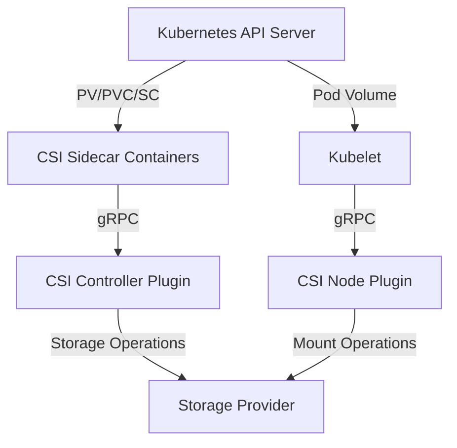

# Kubernetes CSI (Container Storage Interface)

## Introduction

The Container Storage Interface (CSI) is a standard that defines how container orchestration systems like Kubernetes interact with storage systems. Before CSI, adding support for new storage systems to Kubernetes required changes to the core Kubernetes codebase. CSI solves this problem by providing a clean interface between Kubernetes and storage providers, allowing them to develop plugins independently of the Kubernetes codebase.

In this guide, we'll explore what CSI is, how it works, and how to use it in your Kubernetes clusters. Whether you're using a cloud provider's storage solution or managing your own storage infrastructure, understanding CSI will help you manage persistent storage in Kubernetes more effectively.

## What is the Container Storage Interface?

CSI is an API specification that standardizes how container orchestrators (like Kubernetes) communicate with storage providers. It was developed as a collaboration between Kubernetes, Mesos, and Cloud Foundry.

CSI provides three main benefits:

1. **Decoupled Development**: Storage vendors can develop and maintain their plugins without modifying the Kubernetes codebase.
2. **Improved Security**: Storage plugins run as separate containers with limited permissions, reducing the attack surface.
3. **Feature Parity**: CSI enables storage features that weren't previously possible with in-tree plugins.

## How CSI Works

CSI operates through a set of standardized APIs that define how storage can be provisioned, attached, mounted, and unmounted within Kubernetes. 

### CSI Architecture

A CSI plugin typically consists of three components:

1. **Controller Plugin**: Handles volume operations like create/delete and attach/detach.
2. **Node Plugin**: Handles node-specific operations like mount/unmount.
3. **Identity Plugin**: Provides identification information about the plugin.

These components communicate with Kubernetes through specific gRPC calls defined in the CSI specification.



## CSI Components in Kubernetes

Kubernetes includes several components to facilitate the use of CSI plugins:

1. **CSI Controller**: Manages the lifecycle of volumes.
2. **External Provisioner**: Creates and deletes volumes based on PersistentVolumeClaims.
3. **External Attacher**: Attaches and detaches volumes from nodes.
4. **Node Driver Registrar**: Registers the CSI driver with the kubelet.
5. **Liveness Probe**: Monitors the health of the CSI driver.

## Setting Up a CSI Driver

Let's walk through the process of setting up a CSI driver in your Kubernetes cluster using a simple example.

### Step 1: Deploy the CSI Driver

Most CSI drivers can be installed using YAML manifests or Helm charts. Here's a simplified example of deploying a CSI driver:

```yaml
# csi-driver.yaml
kind: DaemonSet
apiVersion: apps/v1
metadata:
  name: csi-node-driver
spec:
  selector:
    matchLabels:
      app: csi-node-driver
  template:
    metadata:
      labels:
        app: csi-node-driver
    spec:
      containers:
        - name: csi-node-driver
          image: example-csi-driver:v1.0.0
          securityContext:
            privileged: true
          volumeMounts:
            - mountPath: /var/lib/kubelet
              name: kubelet-dir
      volumes:
        - name: kubelet-dir
          hostPath:
            path: /var/lib/kubelet
```

Apply this configuration:

```bash
kubectl apply -f csi-driver.yaml
```

### Step 2: Create a StorageClass

Create a StorageClass that uses your CSI driver:

```yaml
# storage-class.yaml
apiVersion: storage.k8s.io/v1
kind: StorageClass
metadata:
  name: csi-example-sc
provisioner: example.csi.k8s.io # This should match your CSI driver's name
parameters:
  type: ssd
  fsType: ext4
```

Apply the StorageClass:

```bash
kubectl apply -f storage-class.yaml
```

### Step 3: Create a PersistentVolumeClaim

Now you can create a PersistentVolumeClaim that references your StorageClass:

```yaml
# pvc.yaml
apiVersion: v1
kind: PersistentVolumeClaim
metadata:
  name: csi-example-pvc
spec:
  accessModes:
    - ReadWriteOnce
  resources:
    requests:
      storage: 10Gi
  storageClassName: csi-example-sc
```

Apply the PVC:

```bash
kubectl apply -f pvc.yaml
```

### Step 4: Use the PVC in a Pod

Finally, you can use the PVC in a Pod:

```yaml
# pod.yaml
apiVersion: v1
kind: Pod
metadata:
  name: csi-example-pod
spec:
  containers:
    - name: app
      image: nginx
      volumeMounts:
        - mountPath: /data
          name: data-volume
  volumes:
    - name: data-volume
      persistentVolumeClaim:
        claimName: csi-example-pvc
```

Apply the Pod configuration:

```bash
kubectl apply -f pod.yaml
```

You can verify that everything is working by checking the status of your PVC and Pod:

```bash
kubectl get pvc csi-example-pvc
kubectl get pod csi-example-pod
```

## Real-World Examples

Let's look at some popular CSI drivers and how they're used in real-world scenarios.

### AWS EBS CSI Driver

The AWS EBS CSI Driver allows Kubernetes to use Amazon EBS volumes for persistent storage:

```yaml
# aws-ebs-storageclass.yaml
apiVersion: storage.k8s.io/v1
kind: StorageClass
metadata:
  name: ebs-sc
provisioner: ebs.csi.aws.com
parameters:
  type: gp3
  encrypted: "true"
volumeBindingMode: WaitForFirstConsumer
```

### GCE Persistent Disk CSI Driver

For Google Cloud, you can use the GCE Persistent Disk CSI Driver:

```yaml
# gce-pd-storageclass.yaml
apiVersion: storage.k8s.io/v1
kind: StorageClass
metadata:
  name: gce-pd-sc
provisioner: pd.csi.storage.gke.io
parameters:
  type: pd-standard
  replication-type: none
volumeBindingMode: WaitForFirstConsumer
```

### Local Storage CSI Driver

For development or specific use cases, you might use a local storage CSI driver:

```yaml
# local-storage-class.yaml
apiVersion: storage.k8s.io/v1
kind: StorageClass
metadata:
  name: local-storage
provisioner: kubernetes.io/no-provisioner
volumeBindingMode: WaitForFirstConsumer
```

## Advanced CSI Features

CSI enables several advanced storage features in Kubernetes:

### Volume Snapshots

CSI allows you to create snapshots of your volumes:

```yaml
# snapshot-class.yaml
apiVersion: snapshot.storage.k8s.io/v1
kind: VolumeSnapshotClass
metadata:
  name: csi-example-snapclass
driver: example.csi.k8s.io
deletionPolicy: Delete
```

Creating a snapshot:

```yaml
# snapshot.yaml
apiVersion: snapshot.storage.k8s.io/v1
kind: VolumeSnapshot
metadata:
  name: my-snapshot
spec:
  volumeSnapshotClassName: csi-example-snapclass
  source:
    persistentVolumeClaimName: csi-example-pvc
```

### Volume Resizing

CSI also enables volume resizing. You can update your PVC to request more storage:

```yaml
# pvc-resize.yaml
apiVersion: v1
kind: PersistentVolumeClaim
metadata:
  name: csi-example-pvc
spec:
  accessModes:
    - ReadWriteOnce
  resources:
    requests:
      storage: 20Gi # Increased from 10Gi
  storageClassName: csi-example-sc
```

### Volume Cloning

You can clone existing volumes:

```yaml
# clone-pvc.yaml
apiVersion: v1
kind: PersistentVolumeClaim
metadata:
  name: cloned-pvc
spec:
  accessModes:
    - ReadWriteOnce
  resources:
    requests:
      storage: 10Gi
  dataSource:
    kind: PersistentVolumeClaim
    name: csi-example-pvc
  storageClassName: csi-example-sc
```

## Monitoring and Troubleshooting CSI

### Checking CSI Driver Status

To check the status of your CSI drivers:

```bash
kubectl get pods -n kube-system | grep csi
```

### Viewing CSI Driver Logs

To view logs for a CSI driver:

```bash
kubectl logs -n kube-system <csi-driver-pod-name>
```

### Common Issues and Solutions

1. **Volume Attachment Failure**:
   - Check if the CSI attacher is running
   - Verify node access to the storage system
   - Check storage provider credentials

2. **Volume Provisioning Failure**:
   - Verify that the provisioner is running
   - Check storage capacity and quotas
   - Review storage provider permissions

3. **Mount Failures**:
   - Check if the CSI node plugin is running
   - Verify filesystem compatibility
   - Check node-level storage access

## Summary

The Container Storage Interface (CSI) is a crucial component of Kubernetes storage that:

1. Standardizes how Kubernetes interacts with storage providers
2. Allows storage vendors to develop plugins independently
3. Enables advanced storage features like snapshots, resizing, and cloning
4. Improves security by running storage plugins in isolated containers

Understanding CSI is essential for managing persistent storage in Kubernetes, whether you're using cloud provider storage or on-premises solutions.

## Additional Resources

- [Kubernetes CSI Documentation](https://kubernetes.io/docs/concepts/storage/volumes/#csi)
- [CSI Specification on GitHub](https://github.com/container-storage-interface/spec)
- [CSI Drivers List](https://kubernetes-csi.github.io/docs/drivers.html)

## Exercises

1. Install a CSI driver for your favorite cloud provider in a test cluster.
2. Create a PersistentVolumeClaim and use it in a StatefulSet.
3. Create a volume snapshot and restore from it.
4. Try resizing a volume and observe the changes in your pod.
5. Explore the differences between various CSI drivers by comparing their parameters and features.