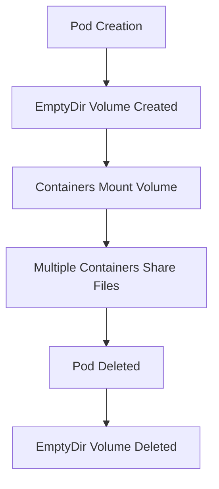

# Kubernetes EmptyDir

## Introduction

EmptyDir is one of the simplest volume types available in Kubernetes. As the name suggests, it's initially an empty directory created when a Pod is assigned to a node, and exists as long as that Pod is running on that node. All containers in the Pod can read and write to the same files in the EmptyDir volume, making it useful for sharing files between containers within a Pod.

EmptyDir volumes serve as temporary storage and are ideal for scenarios where you need:
- Scratch space (like for disk-based merge sorts)
- Checkpointing a long computation for recovery from crashes
- Holding files that a content-manager container fetches while a webserver container serves the data

Let's explore how EmptyDir works and when you should use it.

## How EmptyDir Works

<div className="info-box">
  <strong>Key Point:</strong> EmptyDir volumes are created when a Pod is assigned to a node and deleted permanently when the Pod is removed from the node.
</div>

Here's how EmptyDir volumes work in Kubernetes:



When a Pod is removed from a node for any reason, the data in the EmptyDir is deleted permanently. This means:
- If a Pod crashes but the node is healthy, the data survives
- If a Pod is evicted or deleted, the data is lost
- If a node fails, the data is lost

## Creating an EmptyDir Volume

Let's see how to define an EmptyDir volume in a Pod manifest:

```yaml
apiVersion: v1
kind: Pod
metadata:
  name: example-emptydir
spec:
  containers:
  - name: container-1
    image: nginx
    volumeMounts:
    - mountPath: /cache
      name: cache-volume
  - name: container-2
    image: busybox
    command: ["/bin/sh"]
    args: ["-c", "while true; do echo $(date) >> /data/date.log; sleep 5; done"]
    volumeMounts:
    - mountPath: /data
      name: cache-volume
  volumes:
  - name: cache-volume
    emptyDir: {}
```

In this example:
1. We define a Pod with two containers
2. Both containers mount the same EmptyDir volume, but at different paths
3. `container-1` mounts it at `/cache`
4. `container-2` mounts it at `/data` and writes the current date to a log file
5. Both containers can access the same files, just through different paths

## Configuration Options

EmptyDir offers a few configuration options:

### Medium

You can specify the storage medium used for the EmptyDir:

```yaml
volumes:
- name: cache-volume
  emptyDir:
    medium: Memory
```

Options include:
- Default (omitted): Uses the node's disk storage
- `Memory`: Uses a tmpfs (RAM-backed filesystem), which is faster but consumes node memory and counts against the Pod's memory limit

### Size Limit

You can limit the size of an EmptyDir volume (Kubernetes v1.8+):

```yaml
volumes:
- name: cache-volume
  emptyDir:
    sizeLimit: 500Mi
```

This creates a volume with a maximum size of 500 MiB. Note that enforcement depends on the underlying storage driver.

## Practical Examples

### Example 1: Shared Cache Between Containers

This example demonstrates using EmptyDir as a shared cache between a content downloader and a web server:

```yaml
apiVersion: v1
kind: Pod
metadata:
  name: content-cache-pod
spec:
  containers:
  - name: content-downloader
    image: alpine
    command: ["/bin/sh"]
    args:
      - "-c"
      - "while true; do wget -q -O /content/data.json https://api.example.com/data; sleep 300; done"
    volumeMounts:
    - mountPath: /content
      name: content-volume
  - name: web-server
    image: nginx
    ports:
    - containerPort: 80
    volumeMounts:
    - mountPath: /usr/share/nginx/html
      name: content-volume
  volumes:
  - name: content-volume
    emptyDir: {}
```

In this Pod:
1. The `content-downloader` container retrieves data every 5 minutes
2. The data is saved to the shared EmptyDir volume
3. The `web-server` container serves the content from the same volume

### Example 2: Sidecar Log Processing

EmptyDir can be used to collect and process logs:

```yaml
apiVersion: v1
kind: Pod
metadata:
  name: log-processor
spec:
  containers:
  - name: app
    image: my-app
    volumeMounts:
    - name: log-storage
      mountPath: /var/log/app
  - name: log-processor
    image: log-processor
    volumeMounts:
    - name: log-storage
      mountPath: /input/logs
      readOnly: true
  volumes:
  - name: log-storage
    emptyDir: {}
```

Here:
1. The main app writes logs to the EmptyDir volume
2. The sidecar container processes these logs in real-time
3. This pattern works because both containers share access to the same files

### Example 3: Disk-Based Merge Sort

For memory-intensive operations, you can use EmptyDir as scratch space:

```yaml
apiVersion: v1
kind: Pod
metadata:
  name: sort-pod
spec:
  containers:
  - name: sorter
    image: data-processor
    command: ["./sort-large-file.sh", "/input/data.txt", "/scratch", "/output/sorted.txt"]
    volumeMounts:
    - name: input-volume
      mountPath: /input
    - name: scratch-volume
      mountPath: /scratch
    - name: output-volume
      mountPath: /output
  volumes:
  - name: input-volume
    configMap:
      name: input-data
  - name: scratch-volume
    emptyDir:
      sizeLimit: 10Gi
  - name: output-volume
    persistentVolumeClaim:
      claimName: output-data-pvc
```

In this example, EmptyDir serves as temporary scratch space for a merge sort algorithm that needs disk space to process data chunks.

## Best Practices

When using EmptyDir volumes:

1. **Remember data is temporary**: Never use EmptyDir for data you can't afford to lose.

2. **Set resource limits**: For memory-backed EmptyDir, remember the storage counts against your Pod's memory limit.

3. **Consider sizeLimit**: Prevent a single Pod from consuming too much node disk space.

4. **Use readiness probes**: For shared data scenarios, ensure the producer container is ready before the consumer container tries to use the data.

5. **Security considerations**: EmptyDir data is readable by all containers in the Pod, so don't use it for sensitive information unless all containers in the Pod are trusted.

## When to Use EmptyDir vs Other Volume Types

| Use Case                            | Recommended Volume Type       |
|-------------------------------------|-------------------------------|
| Temporary scratch space             | EmptyDir                      |
| Sharing data between containers     | EmptyDir                      |
| Data that must survive Pod restarts | PersistentVolume              |
| Configuration files                 | ConfigMap                     |
| Sensitive data                      | Secret                        |
| Read-only content                   | ConfigMap or PersistentVolume |

## Summary

EmptyDir provides a simple and effective way to share temporary storage between containers in a Pod. It's perfect for scratch space, sharing data between containers, and handling transient data that doesn't need to survive Pod termination.

Remember that EmptyDir volumes:
- Are created when a Pod is assigned to a node
- Are initially empty
- Can be mounted by all containers in the Pod
- Persist even if a container crashes
- Are deleted permanently when the Pod is removed from the node

## Exercises

1. Create a Pod with two containers that share an EmptyDir volume. Have one container write a timestamp every 10 seconds and the other container run a simple web server that displays the latest timestamp.

2. Modify the example to use a memory-backed EmptyDir volume and observe any performance differences.

3. Implement a sidecar pattern where one container generates logs and another container processes those logs using an EmptyDir volume.

## Additional Resources

- [Kubernetes Documentation on Volumes](https://kubernetes.io/docs/concepts/storage/volumes/#emptydir)
- [Kubernetes Patterns: The Sidecar Pattern](https://kubernetes.io/blog/2015/06/the-distributed-system-toolkit-patterns/)
- [Kubernetes Storage Options](https://kubernetes.io/docs/concepts/storage/storage-classes/)