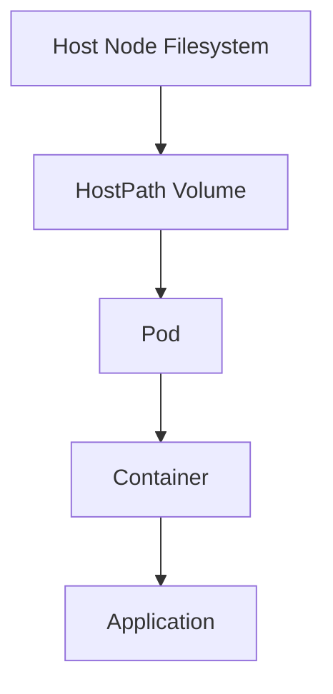

# Kubernetes HostPath

## Introduction

When working with Kubernetes, managing data persistence is a crucial aspect of application deployment. Kubernetes offers several storage solutions, and one of the simplest is the **HostPath** volume type.

A HostPath volume mounts a file or directory from the host node's filesystem into your pod. While this might seem like a straightforward solution, it comes with specific considerations and limitations that are important to understand, especially from a security perspective.

In this guide, we'll explore how HostPath volumes work, when to use them, and best practices for implementation.

## What is a HostPath Volume?

A HostPath volume mounts a file or directory from the host node's filesystem into your pod. This allows containers within the pod to read and write files on the host filesystem.



## When to Use HostPath

HostPath volumes are typically used in scenarios where:

1. You need to access the host's filesystem from within a container
2. You need to persist data between pod restarts on the same node
3. You're running single-node development clusters
4. You need to access node-level logs, metrics, or system files

**Important Note**: HostPath volumes are generally **not recommended** for production multi-node clusters as they create a tight coupling between pods and specific nodes.

## Basic HostPath Configuration

Here's a simple example of a pod that uses a HostPath volume:

```yaml
apiVersion: v1
kind: Pod
metadata:
  name: test-hostpath
spec:
  containers:
  - name: test-container
    image: nginx
    volumeMounts:
    - mountPath: /test-data
      name: test-volume
  volumes:
  - name: test-volume
    hostPath:
      path: /data
      type: Directory
```

In this example:

- We create a pod with one container running the nginx image
- We define a volume named `test-volume` that references a HostPath
- The HostPath points to the `/data` directory on the host node
- We mount this volume at `/test-data` inside the container

## HostPath Types

The `type` field in hostPath configuration is optional but useful for validation. The available types are:

| Type | Description |
|------|-------------|
| `DirectoryOrCreate` | Directory will be created if it doesn't exist |
| `Directory` | Directory must exist |
| `FileOrCreate` | File will be created if it doesn't exist |
| `File` | File must exist |
| `Socket` | UNIX socket must exist |
| `CharDevice` | Character device must exist |
| `BlockDevice` | Block device must exist |

Let's see an example using `DirectoryOrCreate`:

```yaml
apiVersion: v1
kind: Pod
metadata:
  name: test-hostpath-create
spec:
  containers:
  - name: test-container
    image: nginx
    volumeMounts:
    - mountPath: /test-data
      name: test-volume
  volumes:
  - name: test-volume
    hostPath:
      path: /data/directory
      type: DirectoryOrCreate
```

With this configuration, if `/data/directory` doesn't exist on the host node, Kubernetes will create it automatically.

## Practical Example: Node Monitoring Agent

Let's look at a practical example where HostPath volumes are commonly used - a node monitoring agent that needs to access system metrics.

```yaml
apiVersion: v1
kind: Pod
metadata:
  name: node-monitoring-agent
spec:
  containers:
  - name: monitoring-agent
    image: monitoring/agent:latest
    volumeMounts:
    - mountPath: /host/proc
      name: proc
      readOnly: true
    - mountPath: /host/sys
      name: sys
      readOnly: true
  volumes:
  - name: proc
    hostPath:
      path: /proc
  - name: sys
    hostPath:
      path: /sys
```

In this example:
1. We create a monitoring agent pod
2. We mount the host's `/proc` and `/sys` directories as read-only volumes
3. This gives the monitoring agent access to system metrics without allowing it to modify them

## Security Considerations

HostPath volumes can pose significant security risks in a production environment:

1. **Limited to a Single Node**: Data persisted via HostPath is only available on that specific node. If a pod gets rescheduled to another node, it will not have access to the previously stored data.

2. **No Access Controls**: Any pod with the appropriate hostPath configuration can access potentially sensitive files on the host system.

3. **Root Privileges**: By default, many containers run as root, which means they can read and write to any file in the mounted HostPath volume, potentially compromising the host system.

To mitigate these risks:

- Use `readOnly: true` for sensitive mounts
- Implement [Pod Security Standards](https://kubernetes.io/docs/concepts/security/pod-security-standards/) to restrict HostPath usage
- Consider using more secure alternatives for production environments

## Restricting HostPath with PodSecurityPolicies

In a production environment, you may want to restrict which paths can be used with HostPath volumes. This can be done using PodSecurityPolicies (although these are deprecated in newer Kubernetes versions and are being replaced by Pod Security Standards):

```yaml
apiVersion: policy/v1beta1
kind: PodSecurityPolicy
metadata:
  name: restricted-hostpath
spec:
  allowedHostPaths:
  - pathPrefix: "/data"
  # Other policy specifications...
```

## When Not to Use HostPath

HostPath should be avoided in the following scenarios:

1. **Multi-node production clusters**: HostPath volumes tie pods to specific nodes, which goes against Kubernetes' principle of pod mobility.

2. **Shared storage needs**: If multiple pods need to access the same data, consider using a PersistentVolume with a suitable storage class instead.

3. **Critical application data**: For important data that needs to be backed up and protected, use a proper storage solution with backup capabilities.

## Alternatives to HostPath

For production environments, consider these alternatives:

1. **PersistentVolumes and PersistentVolumeClaims**: For durable storage that's independent of pod and node lifecycle

2. **EmptyDir**: For temporary storage tied to the pod lifecycle

3. **ConfigMap and Secret**: For configuration data and sensitive information

4. **Cloud Provider Storage Solutions**: For managed storage options with additional features

Let's look at a quick comparison:

| Storage Type | Persistence | Node Dependency | Multi-Pod Access | Use Case |
|--------------|------------|-----------------|-----------------|----------|
| HostPath | Yes | Yes | No | Development, Node-level access |
| EmptyDir | Pod lifetime | No | No | Temporary storage |
| PersistentVolume | Yes | No | Yes (with ReadWriteMany) | Production data storage |
| ConfigMap | Yes | No | Yes | Configuration data |

## Step-by-Step Example: Log Collection

Let's walk through a complete example of using HostPath for a log collection scenario:

1. First, we'll create a simple application that writes logs:

```yaml
apiVersion: v1
kind: Pod
metadata:
  name: log-producer
spec:
  containers:
  - name: log-producer
    image: busybox
    args:
    - /bin/sh
    - -c
    - >
      while true;
      do
        echo "$(date) - Application log entry" >> /var/log/app.log;
        sleep 10;
      done
    volumeMounts:
    - name: log-volume
      mountPath: /var/log
  volumes:
  - name: log-volume
    hostPath:
      path: /var/log/pods
      type: DirectoryOrCreate
```

2. Next, we can create a log collector pod that accesses these logs:

```yaml
apiVersion: v1
kind: Pod
metadata:
  name: log-collector
spec:
  containers:
  - name: log-collector
    image: fluentd:latest
    volumeMounts:
    - name: log-volume
      mountPath: /var/log/pods
      readOnly: true
  volumes:
  - name: log-volume
    hostPath:
      path: /var/log/pods
```

In this example:
1. The first pod continuously writes logs to a file
2. The file is stored on the host node at `/var/log/pods`
3. The second pod mounts the same directory and can read the logs
4. The logs persist even if the log-producer pod restarts

## Troubleshooting HostPath Issues

Common issues with HostPath volumes include:

1. **Permission denied errors**: Ensure the container has appropriate permissions to access the host path.

   Solution: Check the permissions on the host directory or run the container with the appropriate security context.

   ```yaml
   securityContext:
     runAsUser: 1000
     fsGroup: 2000
   ```

2. **Path doesn't exist**: If you're getting "path does not exist" errors and you're not using a `*OrCreate` type.

   Solution: Either manually create the path on the node or use a `DirectoryOrCreate` or `FileOrCreate` type.

3. **Pod scheduling issues**: Pods using HostPath may fail to schedule if the path doesn't exist on all nodes.

   Solution: Use node selectors or node affinity to ensure pods schedule to appropriate nodes:

   ```yaml
   nodeSelector:
     kubernetes.io/hostname: node-01
   ```

## Summary

HostPath volumes provide a simple way to access the host node's filesystem from within a Kubernetes pod. They are useful for development environments, node-level operations, and specific use cases where containers need access to the host's filesystem.

However, HostPath volumes come with significant limitations and security concerns that make them generally unsuitable for production multi-node clusters. In production environments, consider using PersistentVolumes, cloud storage solutions, or other Kubernetes-native storage options.

Remember these key points:
- HostPath volumes are node-specific
- They provide no isolation between pods
- They can pose security risks if not properly configured
- They're primarily intended for specialized use cases and development environments

## Additional Resources

To learn more about Kubernetes storage options, check out these resources:

- [Kubernetes Volumes Documentation](https://kubernetes.io/docs/concepts/storage/volumes/)
- [Kubernetes Storage Classes](https://kubernetes.io/docs/concepts/storage/storage-classes/)
- [Pod Security Standards](https://kubernetes.io/docs/concepts/security/pod-security-standards/)

## Exercises

1. Create a pod with a HostPath volume that persists data across pod restarts.
2. Modify the pod to use different HostPath types and observe the behavior.
3. Implement a secure HostPath configuration using appropriate security contexts.
4. Create two pods that share data using HostPath and observe the limitations.
5. Compare the performance of HostPath with EmptyDir for a simple application.