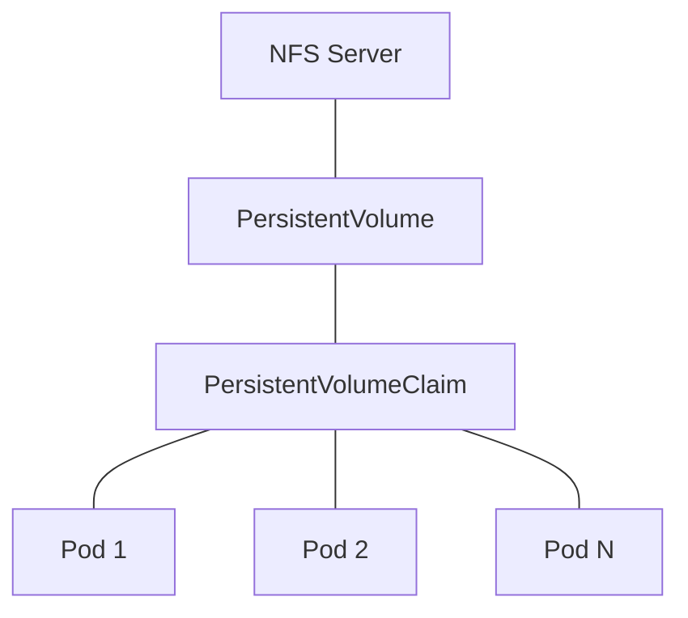

# Kubernetes NFS: Persistent Storage with Network File System

## Introduction

When running applications in Kubernetes, managing persistent storage is a crucial consideration. Containers are ephemeral by nature - when a pod is deleted or restarted, any data stored within the container is lost. This is where persistent volumes come into play, and Network File System (NFS) is one of the most common and straightforward storage solutions for Kubernetes clusters.

NFS allows you to share files and directories between multiple nodes in a Kubernetes cluster. It provides a way for pods to access shared storage regardless of which node they're scheduled on, ensuring data persistence and availability.

In this guide, we'll explore how to set up and use NFS storage in Kubernetes, from basic concepts to practical implementations.

## Prerequisites

Before you dive into NFS with Kubernetes, you should have:

- A working Kubernetes cluster
- Basic knowledge of Kubernetes concepts (pods, deployments, services)
- An NFS server accessible from your Kubernetes nodes

## Understanding NFS in Kubernetes

### What is NFS?

Network File System (NFS) is a distributed file system protocol that allows a user on a client computer to access files over a network as if they were stored locally. It was originally developed by Sun Microsystems in the 1980s and remains widely used today.

### How Kubernetes Uses NFS

Kubernetes integrates with NFS through several resource types:

1. **PersistentVolume (PV)**: A piece of storage in the cluster provisioned by an administrator
2. **PersistentVolumeClaim (PVC)**: A request for storage by a user
3. **StorageClass**: Provides a way to describe the "classes" of storage offered

With NFS, you define a PersistentVolume that points to your NFS server, then create a PersistentVolumeClaim to use that storage in your pods.

## Basic NFS Architecture in Kubernetes



The diagram shows the relationship between an NFS server, PersistentVolume, PersistentVolumeClaim, and multiple pods consuming the same storage.

## Setting Up NFS for Kubernetes

### Step 1: Set Up an NFS Server

First, you need an NFS server. This can be an external server or a pod within your Kubernetes cluster. Here's a simple example of setting up an NFS server on a Ubuntu machine:

```bash
# Install NFS server
sudo apt-get update
sudo apt-get install nfs-kernel-server -y

# Create a directory to share
sudo mkdir -p /mnt/nfs_share
sudo chown nobody:nogroup /mnt/nfs_share
sudo chmod 777 /mnt/nfs_share

# Configure NFS exports
echo "/mnt/nfs_share *(rw,sync,no_subtree_check,no_root_squash)" | sudo tee -a /etc/exports
sudo exportfs -a
sudo systemctl restart nfs-kernel-server
```

### Step 2: Install NFS Client on Kubernetes Nodes

Your Kubernetes nodes need the NFS client packages to mount NFS volumes:

```bash
# For Ubuntu/Debian
sudo apt-get install nfs-common -y

# For CentOS/RHEL
sudo yum install nfs-utils -y
```

### Step 3: Create a PersistentVolume

Now, create a PersistentVolume that points to your NFS server:

```yaml
apiVersion: v1
kind: PersistentVolume
metadata:
  name: nfs-pv
spec:
  capacity:
    storage: 10Gi
  accessModes:
    - ReadWriteMany
  persistentVolumeReclaimPolicy: Retain
  nfs:
    server: <NFS-SERVER-IP>
    path: /mnt/nfs_share
```

Save this to a file named `nfs-pv.yaml` and apply it:

```bash
kubectl apply -f nfs-pv.yaml
```

### Step 4: Create a PersistentVolumeClaim

Next, create a PersistentVolumeClaim to request storage from the PersistentVolume:

```yaml
apiVersion: v1
kind: PersistentVolumeClaim
metadata:
  name: nfs-pvc
spec:
  accessModes:
    - ReadWriteMany
  resources:
    requests:
      storage: 5Gi
```

Save this to a file named `nfs-pvc.yaml` and apply it:

```bash
kubectl apply -f nfs-pvc.yaml
```

### Step 5: Use the PVC in a Pod

Finally, create a pod that uses the PersistentVolumeClaim:

```yaml
apiVersion: v1
kind: Pod
metadata:
  name: nfs-test
spec:
  containers:
  - name: web-server
    image: nginx
    volumeMounts:
    - name: nfs-volume
      mountPath: /usr/share/nginx/html
  volumes:
  - name: nfs-volume
    persistentVolumeClaim:
      claimName: nfs-pvc
```

Save this to a file named `nfs-pod.yaml` and apply it:

```bash
kubectl apply -f nfs-pod.yaml
```

## Verifying Your NFS Setup

You can verify that your NFS setup is working correctly by creating a file in the mounted directory and checking that it's available on the NFS server:

```bash
# Execute a command in the pod
kubectl exec -it nfs-test -- bash

# Create a test file in the mounted directory
echo "Hello from Kubernetes!" > /usr/share/nginx/html/test.txt

# Exit the pod
exit

# Check the file on the NFS server
cat /mnt/nfs_share/test.txt
# Output: Hello from Kubernetes!
```

## Understanding Access Modes

NFS supports different access modes in Kubernetes:

1. **ReadWriteOnce (RWO)**: The volume can be mounted as read-write by a single node
2. **ReadOnlyMany (ROX)**: The volume can be mounted read-only by many nodes
3. **ReadWriteMany (RWX)**: The volume can be mounted as read-write by many nodes

NFS is one of the few volume types that support ReadWriteMany, making it ideal for scenarios where multiple pods need to share the same storage.

## Dynamic Provisioning with NFS

While basic NFS setup requires manual creation of PersistentVolumes, you can also set up dynamic provisioning using an NFS provisioner like `nfs-subdir-external-provisioner`.

### Installing the NFS Subdir External Provisioner

You can install the NFS provisioner using Helm:

```bash
# Add the chart repository
helm repo add nfs-subdir-external-provisioner https://kubernetes-sigs.github.io/nfs-subdir-external-provisioner

# Install the chart
helm install nfs-provisioner nfs-subdir-external-provisioner/nfs-subdir-external-provisioner \
  --set nfs.server=<NFS-SERVER-IP> \
  --set nfs.path=/mnt/nfs_share
```

### Create a StorageClass

The provisioner creates a default StorageClass, but you can also create your own:

```yaml
apiVersion: storage.k8s.io/v1
kind: StorageClass
metadata:
  name: managed-nfs-storage
provisioner: k8s-sigs.io/nfs-subdir-external-provisioner
parameters:
  archiveOnDelete: "false"
```

Save this to a file named `nfs-storage-class.yaml` and apply it:

```bash
kubectl apply -f nfs-storage-class.yaml
```

### Create a PVC Using the StorageClass

Now you can create a PVC that uses this StorageClass for dynamic provisioning:

```yaml
apiVersion: v1
kind: PersistentVolumeClaim
metadata:
  name: dynamic-nfs-pvc
spec:
  accessModes:
    - ReadWriteMany
  storageClassName: managed-nfs-storage
  resources:
    requests:
      storage: 1Gi
```

Save this to a file named `dynamic-nfs-pvc.yaml` and apply it:

```bash
kubectl apply -f dynamic-nfs-pvc.yaml
```

## Real-World Example: Deploying a Stateful Application

Let's deploy a WordPress application that uses NFS for persistent storage:

### Step 1: Create PersistentVolumeClaims

```yaml
apiVersion: v1
kind: PersistentVolumeClaim
metadata:
  name: wp-content-pvc
spec:
  accessModes:
    - ReadWriteMany
  storageClassName: managed-nfs-storage
  resources:
    requests:
      storage: 5Gi
```

### Step 2: Create a WordPress Deployment

```yaml
apiVersion: apps/v1
kind: Deployment
metadata:
  name: wordpress
  labels:
    app: wordpress
spec:
  replicas: 3
  selector:
    matchLabels:
      app: wordpress
  template:
    metadata:
      labels:
        app: wordpress
    spec:
      containers:
      - name: wordpress
        image: wordpress:latest
        ports:
        - containerPort: 80
        env:
        - name: WORDPRESS_DB_HOST
          value: wordpress-mysql
        - name: WORDPRESS_DB_PASSWORD
          valueFrom:
            secretKeyRef:
              name: mysql-pass
              key: password
        volumeMounts:
        - name: wordpress-content
          mountPath: /var/www/html/wp-content
      volumes:
      - name: wordpress-content
        persistentVolumeClaim:
          claimName: wp-content-pvc
```

### Step 3: Create a Service

```yaml
apiVersion: v1
kind: Service
metadata:
  name: wordpress
spec:
  selector:
    app: wordpress
  ports:
  - port: 80
    targetPort: 80
  type: LoadBalancer
```

Apply all these configurations:

```bash
kubectl apply -f wordpress-pvc.yaml
kubectl apply -f wordpress-deployment.yaml
kubectl apply -f wordpress-service.yaml
```

This example demonstrates a real-world use case where multiple WordPress pods share the same content directory via NFS, allowing them to serve the same site while being distributed across nodes.

## Common Issues and Troubleshooting

### Permission Issues

One common issue with NFS is permission problems. If your pods can't write to the NFS volume:

1. Check the permissions on the NFS server directory:
```bash
ls -la /mnt/nfs_share
```

2. Make sure the NFS export options are correct:
```bash
cat /etc/exports
```

3. Consider using `no_root_squash` in your NFS exports if your application requires root access.

### Connection Issues

If pods can't connect to the NFS server:

1. Verify that the NFS server is running:
```bash
sudo systemctl status nfs-kernel-server
```

2. Check that the NFS port is open (usually 2049):
```bash
sudo netstat -tunlp | grep 2049
```

3. Ensure network policies allow traffic to the NFS server.

### Volume Mount Failures

If the volume fails to mount:

1. Check pod events:
```bash
kubectl describe pod <pod-name>
```

2. Look for mount errors in the node's system logs:
```bash
sudo journalctl -u kubelet
```

## Best Practices for NFS in Kubernetes

1. **Set appropriate resource limits**: Ensure your NFS server has sufficient resources to handle the expected load.

2. **Consider redundancy**: For production environments, consider using a redundant NFS solution or a cloud-based alternative.

3. **Monitor NFS performance**: Set up monitoring for your NFS server to detect performance issues early.

4. **Use ReadWriteMany wisely**: While NFS supports multiple writers, be cautious with applications that might cause write conflicts.

5. **Set up backups**: NFS doesn't provide automatic backups; ensure you have a backup strategy for your NFS data.

6. **Security considerations**: NFS v3 doesn't encrypt traffic; consider using a VPN or NFS v4 with Kerberos for sensitive data.

## Summary

NFS provides a simple and effective way to share persistent storage across pods and nodes in a Kubernetes cluster. By following the steps in this guide, you can:

- Set up an NFS server
- Create PersistentVolumes and PersistentVolumeClaims
- Use NFS storage in your pods
- Deploy stateful applications with shared storage
- Troubleshoot common NFS issues

While NFS has its limitations, particularly around performance and security, it remains a popular choice for many Kubernetes deployments due to its simplicity and wide support.

## Exercises

1. Set up an NFS server and configure it for use with Kubernetes.
2. Create a StatefulSet that uses NFS for persistent storage.
3. Deploy a multi-replica web application that shares session data via NFS.
4. Configure dynamic provisioning with the NFS provisioner and create multiple PVCs.
5. Research and compare NFS performance with other storage solutions like GlusterFS or Ceph.

## Additional Resources

- [Kubernetes Documentation on Volumes](https://kubernetes.io/docs/concepts/storage/volumes/)
- [NFS External Provisioner GitHub Repository](https://github.com/kubernetes-sigs/nfs-subdir-external-provisioner)
- [Linux NFS Documentation](https://linux-nfs.org/wiki/index.php/Main_Page)
- [Kubernetes Storage Classes](https://kubernetes.io/docs/concepts/storage/storage-classes/)