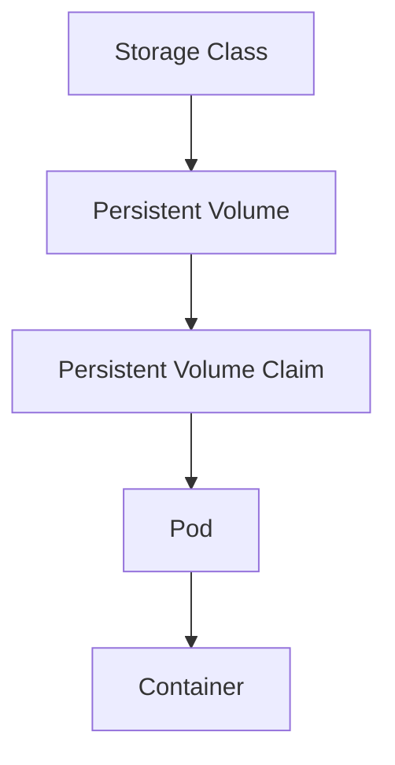

# Kubernetes Cloud Storage

## Introduction

In containerized environments, managing data persistence is critical. While containers are ephemeral by design (they can be created, destroyed, and replaced dynamically), applications often need to store and access data persistently. Kubernetes provides robust mechanisms for handling storage needs, and when combined with cloud providers' storage options, it becomes a powerful solution for managing application data.

Kubernetes Cloud Storage integrates cloud provider storage services with your Kubernetes clusters, allowing you to leverage scalable, reliable storage infrastructure for your containerized applications.

## Understanding Cloud Storage in Kubernetes

### Core Concepts

Before diving into cloud-specific implementations, let's understand the fundamental Kubernetes storage concepts:

1. **Volumes**: A directory accessible to all containers in a pod
2. **Persistent Volumes (PV)**: Cluster resources that provide storage
3. **Persistent Volume Claims (PVC)**: Requests for storage by users
4. **Storage Classes**: Define different "classes" of storage with various capabilities



### Cloud Storage Integration

Kubernetes supports various cloud providers' storage solutions through its Container Storage Interface (CSI) and built-in volume plugins. These allow Kubernetes to create and manage cloud storage resources dynamically.

## Cloud Provider Storage Options

### AWS (Amazon Web Services)

AWS offers multiple storage solutions that integrate with Kubernetes:

1. **Amazon EBS (Elastic Block Store)**
   - Block-level storage volumes for EC2 instances
   - Suitable for databases, file systems, and applications requiring raw block-level storage

2. **Amazon EFS (Elastic File System)**
   - Fully managed NFS file system
   - Allows multiple pods to access the same storage simultaneously

#### Example: Using AWS EBS with Kubernetes

First, create a StorageClass for AWS EBS:

```yaml
apiVersion: storage.k8s.io/v1
kind: StorageClass
metadata:
  name: ebs-sc
provisioner: kubernetes.io/aws-ebs
parameters:
  type: gp2
  fsType: ext4
reclaimPolicy: Retain
```

Next, create a PVC that uses this StorageClass:

```yaml
apiVersion: v1
kind: PersistentVolumeClaim
metadata:
  name: ebs-claim
spec:
  accessModes:
    - ReadWriteOnce
  storageClassName: ebs-sc
  resources:
    requests:
      storage: 5Gi
```

Finally, use this PVC in a pod:

```yaml
apiVersion: v1
kind: Pod
metadata:
  name: app-with-ebs
spec:
  containers:
  - name: app
    image: nginx
    volumeMounts:
    - mountPath: "/data"
      name: ebs-volume
  volumes:
  - name: ebs-volume
    persistentVolumeClaim:
      claimName: ebs-claim
```

### Google Cloud Platform (GCP)

GCP provides these storage options for Kubernetes:

1. **Persistent Disk**
   - Block storage for GCE instances
   - Available as standard (HDD) or SSD variants

2. **Filestore**
   - Managed file storage service
   - Provides NFS-based shared storage

#### Example: Using GCP Persistent Disk with Kubernetes

Create a StorageClass for GCP Persistent Disk:

```yaml
apiVersion: storage.k8s.io/v1
kind: StorageClass
metadata:
  name: gce-pd-sc
provisioner: kubernetes.io/gce-pd
parameters:
  type: pd-standard
  fsType: ext4
```

Create a PVC:

```yaml
apiVersion: v1
kind: PersistentVolumeClaim
metadata:
  name: gce-pd-claim
spec:
  accessModes:
    - ReadWriteOnce
  storageClassName: gce-pd-sc
  resources:
    requests:
      storage: 10Gi
```

Use the PVC in a pod:

```yaml
apiVersion: v1
kind: Pod
metadata:
  name: app-with-gce-pd
spec:
  containers:
  - name: app
    image: mongodb
    volumeMounts:
    - mountPath: "/data/db"
      name: gce-pd-volume
  volumes:
  - name: gce-pd-volume
    persistentVolumeClaim:
      claimName: gce-pd-claim
```

### Microsoft Azure

Azure provides these storage options for Kubernetes:

1. **Azure Disk**
   - Block storage similar to AWS EBS or GCP Persistent Disk
   - Supports Premium (SSD) and Standard (HDD) tiers

2. **Azure File**
   - SMB file share service
   - Good for cross-platform shared storage needs

#### Example: Using Azure Disk with Kubernetes

Create a StorageClass for Azure Disk:

```yaml
apiVersion: storage.k8s.io/v1
kind: StorageClass
metadata:
  name: azure-disk-sc
provisioner: kubernetes.io/azure-disk
parameters:
  storageaccounttype: Premium_LRS
  kind: Managed
```

Create a PVC:

```yaml
apiVersion: v1
kind: PersistentVolumeClaim
metadata:
  name: azure-disk-claim
spec:
  accessModes:
    - ReadWriteOnce
  storageClassName: azure-disk-sc
  resources:
    requests:
      storage: 5Gi
```

Use the PVC in a pod:

```yaml
apiVersion: v1
kind: Pod
metadata:
  name: app-with-azure-disk
spec:
  containers:
  - name: app
    image: mysql
    env:
    - name: MYSQL_ROOT_PASSWORD
      value: "password123"
    volumeMounts:
    - mountPath: "/var/lib/mysql"
      name: azure-disk-volume
  volumes:
  - name: azure-disk-volume
    persistentVolumeClaim:
      claimName: azure-disk-claim
```

## Best Practices for Kubernetes Cloud Storage

### 1. Use Storage Classes Effectively

Define appropriate storage classes for different types of applications:

```yaml
apiVersion: storage.k8s.io/v1
kind: StorageClass
metadata:
  name: fast-storage
provisioner: kubernetes.io/aws-ebs
parameters:
  type: gp3
  iops: "3000"
  throughput: "125"
---
apiVersion: storage.k8s.io/v1
kind: StorageClass
metadata:
  name: standard-storage
provisioner: kubernetes.io/aws-ebs
parameters:
  type: gp2
```

### 2. Implement Proper Volume Sizing

Allocate sufficient but not excessive storage for your applications:

```yaml
apiVersion: v1
kind: PersistentVolumeClaim
metadata:
  name: database-storage
spec:
  accessModes:
    - ReadWriteOnce
  storageClassName: fast-storage
  resources:
    requests:
      storage: 20Gi
```

### 3. Configure Appropriate Access Modes

Choose the correct access mode for your storage needs:
- `ReadWriteOnce` (RWO): Volume can be mounted as read-write by a single node
- `ReadOnlyMany` (ROX): Volume can be mounted read-only by many nodes
- `ReadWriteMany` (RWX): Volume can be mounted as read-write by many nodes

### 4. Set Up Storage Monitoring

Monitor your storage usage to avoid unexpected costs or running out of space:

```yaml
apiVersion: v1
kind: Pod
metadata:
  name: volume-metrics
spec:
  containers:
  - name: metrics
    image: prom/node-exporter
    args:
    - "--path.procfs=/host/proc"
    - "--path.sysfs=/host/sys"
    - "--collector.filesystem.ignored-mount-points=^/(dev|proc|sys|var/lib/docker/.+)($|/)"
    volumeMounts:
    - name: proc
      mountPath: /host/proc
    - name: sys
      mountPath: /host/sys
  volumes:
  - name: proc
    hostPath:
      path: /proc
  - name: sys
    hostPath:
      path: /sys
```

## Real-World Example: Stateful Web Application

Let's implement a stateful web application with a database using Kubernetes cloud storage.

### Database Deployment

```yaml
apiVersion: apps/v1
kind: StatefulSet
metadata:
  name: mysql
spec:
  selector:
    matchLabels:
      app: mysql
  serviceName: mysql
  replicas: 1
  template:
    metadata:
      labels:
        app: mysql
    spec:
      containers:
      - name: mysql
        image: mysql:5.7
        env:
        - name: MYSQL_ROOT_PASSWORD
          valueFrom:
            secretKeyRef:
              name: mysql-secrets
              key: password
        ports:
        - name: mysql
          containerPort: 3306
        volumeMounts:
        - name: data
          mountPath: /var/lib/mysql
  volumeClaimTemplates:
  - metadata:
      name: data
    spec:
      accessModes: [ "ReadWriteOnce" ]
      storageClassName: "fast-storage"
      resources:
        requests:
          storage: 10Gi
```

### Web Application Deployment

```yaml
apiVersion: apps/v1
kind: Deployment
metadata:
  name: web-app
spec:
  replicas: 3
  selector:
    matchLabels:
      app: web-app
  template:
    metadata:
      labels:
        app: web-app
    spec:
      containers:
      - name: web-app
        image: my-web-app:latest
        ports:
        - containerPort: 80
        volumeMounts:
        - name: uploads
          mountPath: /app/uploads
      volumes:
      - name: uploads
        persistentVolumeClaim:
          claimName: uploads-pvc
---
apiVersion: v1
kind: PersistentVolumeClaim
metadata:
  name: uploads-pvc
spec:
  accessModes:
    - ReadWriteMany
  storageClassName: "efs-sc"
  resources:
    requests:
      storage: 5Gi
```

## Common Challenges and Solutions

### Challenge 1: Slow Storage Performance

**Solution:** Use appropriate storage classes for your workload needs:
- CPU/memory-intensive applications typically need faster storage
- Choose SSD-based storage for databases and I/O intensive workloads

### Challenge 2: Storage Costs

**Solution:** Implement proper storage tiering:

```yaml
apiVersion: storage.k8s.io/v1
kind: StorageClass
metadata:
  name: archival-storage
provisioner: kubernetes.io/aws-ebs
parameters:
  type: sc1  # Cold storage, cheaper but slower
```

### Challenge 3: Data Migration Between Cloud Providers

**Solution:** Use Kubernetes-native backup solutions like Velero:

```bash
# Install Velero with AWS plugins
velero install \
    --provider aws \
    --plugins velero/velero-plugin-for-aws:v1.2.0 \
    --bucket backup-bucket \
    --backup-location-config region=us-west-2 \
    --snapshot-location-config region=us-west-2 \
    --secret-file ./credentials-velero

# Create a backup
velero backup create app-backup --include-namespaces app-namespace

# Restore in another cluster
velero restore create --from-backup app-backup
```

## Summary

Kubernetes Cloud Storage provides a powerful way to integrate persistent storage solutions from major cloud providers into your containerized applications. By leveraging these capabilities, you can:

- Ensure data persistence across container restarts and pod rescheduling
- Scale storage resources independently of compute resources
- Implement appropriate storage solutions for different workload requirements
- Take advantage of cloud providers' managed storage services

When choosing a cloud storage solution for Kubernetes, consider:
- Performance requirements
- Access patterns (single or multi-node read/write)
- Cost considerations
- Data backup and disaster recovery needs

By understanding the core concepts of Kubernetes storage and how they integrate with cloud providers, you can design resilient and efficient applications that properly handle persistent data.

## Additional Resources

- **Kubernetes Documentation**: The official [Kubernetes documentation on storage](https://kubernetes.io/docs/concepts/storage/)
- **Cloud Provider Documentation**:
  - [AWS EBS CSI Driver](https://github.com/kubernetes-sigs/aws-ebs-csi-driver)
  - [GCP Persistent Disk CSI Driver](https://github.com/kubernetes-sigs/gcp-compute-persistent-disk-csi-driver)
  - [Azure Disk CSI Driver](https://github.com/kubernetes-sigs/azuredisk-csi-driver)

## Exercises

1. Create a StorageClass and PVC for your cloud provider, and mount it in a simple web server pod.
2. Set up a StatefulSet with persistent storage for a database application.
3. Implement a backup solution for your Kubernetes persistent volumes.
4. Configure different storage classes for different types of applications, and test the performance differences.
5. Create a multi-container pod that shares persistent storage using a volume.