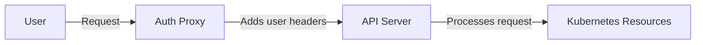

# Kubernetes Authentication

## Introduction

Authentication is a critical first step in Kubernetes security. Before a user or service can interact with your Kubernetes cluster, they must prove their identity through authentication. This verification process ensures that only authorized individuals and services can access your cluster resources.

In this guide, we'll explore the various authentication mechanisms Kubernetes offers, understand how they work, and see practical examples of implementing them in real-world scenarios.

## Authentication vs. Authorization

Before diving into authentication details, let's clarify two related but distinct concepts:

- **Authentication (AuthN)**: Verifies the identity of a user or service ("Who are you?")
- **Authorization (AuthZ)**: Determines what an authenticated user is allowed to do ("What can you do?")

This guide focuses on authentication, but both are essential parts of Kubernetes security.

## How Authentication Works in Kubernetes

When you attempt to interact with a Kubernetes cluster, your request goes through the Kubernetes API server, which handles all authentication processes.


Kubernetes doesn't store user accounts like traditional systems. Instead, it relies on external sources to validate identities through various authentication strategies.

## Authentication Strategies

Kubernetes supports several authentication methods that can be used simultaneously:

### 1. X.509 Client Certificates

Certificate-based authentication is the most common method for authenticating users in Kubernetes.

#### How it works:

1. Generate a private key
2. Create a certificate signing request (CSR)
3. Have the CSR signed by the Kubernetes Certificate Authority (CA)
4. Use the certificate for authentication

#### Practical Example:

Generate a private key for a new user:

```bash
openssl genrsa -out jane.key 2048
```

Create a certificate signing request:

```bash
openssl req -new -key jane.key -out jane.csr -subj "/CN=jane/O=engineering"
```

Sign the certificate with your Kubernetes CA:

```bash
openssl x509 -req -in jane.csr -CA /path/to/ca.crt -CAkey /path/to/ca.key \
-CAcreateserial -out jane.crt -days 365
```

Configure kubectl to use this certificate:

```bash
kubectl config set-credentials jane \
  --client-certificate=jane.crt \
  --client-key=jane.key

kubectl config set-context jane-context \
  --cluster=your-cluster \
  --user=jane

kubectl config use-context jane-context
```

The certificates contain information about the user's identity, including:
- Common Name (CN): The username
- Organization (O): The group the user belongs to

### 2. Service Account Tokens

Service accounts are used by pods to authenticate with the Kubernetes API. They're ideal for applications running inside the cluster.

#### How to create a service account:

```bash
kubectl create serviceaccount pipeline-deployer
```

Output:
```
serviceaccount/pipeline-deployer created
```

#### Using service accounts with pods:

```yaml
apiVersion: v1
kind: Pod
metadata:
  name: deployment-bot
spec:
  serviceAccountName: pipeline-deployer
  containers:
  - name: deployer
    image: deployment-image:v1
```

Kubernetes automatically mounts a token into the pod at `/var/run/secrets/kubernetes.io/serviceaccount/token`, which applications can use to authenticate.

### 3. OpenID Connect (OIDC)

OIDC allows integration with external identity providers like Google, Azure AD, Okta, or Auth0, enabling single sign-on capabilities.

#### How it works:

1. User authenticates with the identity provider
2. Identity provider issues a JSON Web Token (JWT)
3. User presents the JWT to Kubernetes
4. Kubernetes validates the token with the provider

#### Configuration example:

To configure the API server to use OIDC, add these flags:

```yaml
--oidc-issuer-url=https://accounts.google.com
--oidc-client-id=<your-client-id>
--oidc-username-claim=email
--oidc-groups-claim=groups
```

### 4. Webhook Token Authentication

This method allows using external authentication services through webhooks.

#### Configuration example:

Create a webhook configuration file:

```yaml
# webhook-config.yaml
apiVersion: v1
kind: Config
clusters:
- name: auth-webhook
  cluster:
    server: https://auth.example.com/authenticate
users:
- name: kube-apiserver
  user:
    client-certificate: /path/to/cert.pem
    client-key: /path/to/key.pem
current-context: webhook
contexts:
- context:
    cluster: auth-webhook
    user: kube-apiserver
  name: webhook
```

Configure the API server:

```bash
--authentication-token-webhook-config-file=/path/to/webhook-config.yaml
--authentication-token-webhook-cache-ttl=2m
```

### 5. Authentication Proxy

You can place an authenticating proxy in front of the API server. The proxy adds user information to request headers.



## Best Practices for Kubernetes Authentication

1. **Use short-lived certificates**: Regularly rotate credentials to minimize risk.

2. **Implement least privilege**: Provide only necessary access to users and services.

3. **Enable RBAC**: Always use Role-Based Access Control alongside authentication.

4. **Audit authentication**: Regularly review who has access to your cluster.

5. **Consider a centralized identity solution**: For larger organizations, manage identities with OIDC integration.

6. **Secure service accounts**: Limit permissions and only mount tokens where needed.

## Real-world Scenario: Setting Up GitHub Actions with Kubernetes

Let's say you want to set up a CI/CD pipeline with GitHub Actions to deploy to your Kubernetes cluster:

1. Create a dedicated service account:

```bash
kubectl create serviceaccount github-actions
```

2. Create a limited role for deployments:

```yaml
apiVersion: rbac.authorization.k8s.io/v1
kind: Role
metadata:
  namespace: production
  name: deployment-manager
rules:
- apiGroups: ["apps"]
  resources: ["deployments"]
  verbs: ["get", "list", "watch", "update", "patch"]
```

3. Bind the role to the service account:

```bash
kubectl create rolebinding github-actions-binding \
  --role=deployment-manager \
  --serviceaccount=default:github-actions \
  --namespace=production
```

4. Get the service account token:

```bash
SECRET_NAME=$(kubectl get serviceaccount github-actions -o jsonpath='{.secrets[0].name}')
TOKEN=$(kubectl get secret $SECRET_NAME -o jsonpath='{.data.token}' | base64 --decode)
echo $TOKEN
```

5. Add this token as a GitHub Actions secret and use it in your workflow:

```yaml
name: Deploy to Kubernetes
on:
  push:
    branches: [ main ]
jobs:
  deploy:
    runs-on: ubuntu-latest
    steps:
    - uses: actions/checkout@v3
    - name: Deploy to Kubernetes
      uses: actions-hub/kubectl@master
      env:
        KUBE_CONFIG: ${{ secrets.KUBE_CONFIG }}
        KUBE_TOKEN: ${{ secrets.KUBE_TOKEN }}
      with:
        args: apply -f deployment.yaml
```

## Troubleshooting Authentication Issues

If you encounter authentication problems, try these steps:

1. **Check certificate validity**:

```bash
openssl x509 -in ~/.kube/my-cert.crt -text -noout
```

2. **Verify service account token**:

```bash
kubectl get serviceaccount my-serviceaccount -o yaml
```

3. **Test auth with verbose logging**:

```bash
kubectl get pods --v=10
```

4. **Check API server logs**:

```bash
kubectl logs -n kube-system kube-apiserver-minikube
```

## Summary

Kubernetes authentication is the foundation of cluster security. The platform offers multiple authentication strategies that can be combined to meet your specific requirements. Key points to remember:

- Authentication verifies identity before access is granted
- Multiple authentication methods can be used simultaneously
- Certificate-based authentication is common for users
- Service accounts are designed for in-cluster workloads
- OIDC enables integration with external identity providers

By implementing proper authentication, you create the first line of defense for your Kubernetes clusters, ensuring that only legitimate users and services can interact with your resources.

## Additional Resources

Here are some resources to deepen your understanding of Kubernetes authentication:

- [Kubernetes Official Documentation on Authentication](https://kubernetes.io/docs/reference/access-authn-authz/authentication/)
- [CNCF Kubernetes Security Best Practices](https://www.cncf.io/blog/2020/07/31/kubernetes-security-best-practices/)

## Exercises

1. Set up certificate-based authentication for a new user with restricted permissions.
2. Create a service account and configure a pod to use it.
3. If you have access to an identity provider (Google, GitHub, etc.), try setting up OIDC authentication.
4. Audit your cluster to identify all service accounts and their permissions.