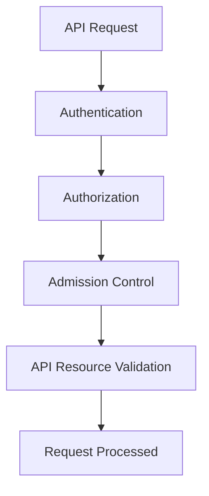

# Kubernetes Authorization

## Introduction

In the world of Kubernetes security, authorization plays a crucial role in controlling what authenticated users can do within your cluster. While **authentication** verifies _who_ you are, **authorization** determines _what_ you're allowed to do.

Think of authorization as the bouncer at a club who checks your ID (authentication) and then decides which areas of the club you can access based on your VIP status (authorization).

In this guide, we'll explore Kubernetes authorization mechanisms, with a special focus on Role-Based Access Control (RBAC), the most commonly used authorization mode in production clusters.

## Authorization Modes in Kubernetes

Kubernetes supports several authorization modules:

1. **RBAC** (Role-Based Access Control)
2. **ABAC** (Attribute-Based Access Control)
3. **Node Authorization**
4. **Webhook Mode**

Each request to the Kubernetes API server goes through the following stages:



Let's examine each authorization mode in detail.

## RBAC (Role-Based Access Control)

RBAC is the industry-standard approach for managing permissions in Kubernetes. It works by binding **roles** (which contain permissions) to **subjects** (users, groups, or service accounts).

### Key RBAC Concepts

- **Role**: Defines permissions within a namespace
- **ClusterRole**: Defines cluster-wide permissions
- **RoleBinding**: Links a Role to subjects in a namespace
- **ClusterRoleBinding**: Links a ClusterRole to subjects across the cluster

### Creating a Basic Role

Let's create a Role that grants read access to pods in the "development" namespace:

```yaml
apiVersion: rbac.authorization.k8s.io/v1
kind: Role
metadata:
  namespace: development
  name: pod-reader
rules:
- apiGroups: [""]  # The core API group
  resources: ["pods"]
  verbs: ["get", "watch", "list"]
```

### Binding the Role to a User

Now, let's create a RoleBinding that grants this role to a user named "jane":

```yaml
apiVersion: rbac.authorization.k8s.io/v1
kind: RoleBinding
metadata:
  name: read-pods
  namespace: development
subjects:
- kind: User
  name: jane
  apiGroup: rbac.authorization.k8s.io
roleRef:
  kind: Role
  name: pod-reader
  apiGroup: rbac.authorization.k8s.io
```

### Verifying Access

Jane can now verify her access by running:

```bash
kubectl auth can-i get pods --namespace development --as jane
```

Output:
```
yes
```

But if she tries to create pods:

```bash
kubectl auth can-i create pods --namespace development --as jane
```

Output:
```
no
```

### ClusterRoles and ClusterRoleBindings

For permissions that apply cluster-wide or to non-namespaced resources, you need ClusterRoles:

```yaml
apiVersion: rbac.authorization.k8s.io/v1
kind: ClusterRole
metadata:
  name: node-reader
rules:
- apiGroups: [""]
  resources: ["nodes"]
  verbs: ["get", "list", "watch"]
```

And bind it with a ClusterRoleBinding:

```yaml
apiVersion: rbac.authorization.k8s.io/v1
kind: ClusterRoleBinding
metadata:
  name: read-nodes
subjects:
- kind: Group
  name: system:monitoring
  apiGroup: rbac.authorization.k8s.io
roleRef:
  kind: ClusterRole
  name: node-reader
  apiGroup: rbac.authorization.k8s.io
```

## ABAC (Attribute-Based Access Control)

ABAC defines policies using JSON objects. It's more flexible but harder to manage than RBAC, which is why it's less commonly used.

A simple ABAC policy might look like:

```json
{
  "apiVersion": "abac.authorization.kubernetes.io/v1beta1",
  "kind": "Policy",
  "spec": {
    "user": "alice",
    "namespace": "production",
    "resource": "pods",
    "readonly": true
  }
}
```

To enable ABAC, you need to start the API server with the `--authorization-mode=ABAC` flag and provide a policy file with `--authorization-policy-file=policy.json`.

## Node Authorization

Node authorization is a special-purpose authorization mode that specifically authorizes API requests made by kubelets. It works based on the pods scheduled to run on each node.

Node authorization is enabled by starting the API server with `--authorization-mode=Node`.

## Webhook Mode

Webhook mode allows for external services to determine authorization decisions. When enabled, Kubernetes makes a request to an external REST service with details of the request, and the service decides whether to authorize it.

To configure webhook mode, you'll need to specify the details in a kubeconfig file:

```yaml
# clusters refers to the remote service
clusters:
- name: name-of-remote-authz-service
  cluster:
    server: https://authz-service.example.com/authorize

# users refers to the API server's webhook configuration
users:
- name: name-of-api-server
  user:
    client-certificate: /path/to/cert.pem
    client-key: /path/to/key.pem

# kubeconfig files require a context, which is a cluster, user, and namespace
current-context: webhook
contexts:
- context:
    cluster: name-of-remote-authz-service
    user: name-of-api-server
  name: webhook
```

## Authorization Best Practices

1. **Follow the Principle of Least Privilege**: Grant only the permissions necessary for a user or application to perform its function.

2. **Use RBAC Over ABAC**: RBAC is easier to manage, audit, and understand.

3. **Group Related Permissions**: Create roles that group related permissions rather than creating many granular roles.

4. **Use Service Accounts for Applications**: Don't use user credentials for applications.

5. **Regularly Audit Permissions**: Regularly review who has what permissions in your cluster.

Let's create an audit script to help with this:

```bash
#!/bin/bash
# Script to list all RoleBindings and ClusterRoleBindings

echo "=== Cluster Role Bindings ==="
kubectl get clusterrolebindings -o wide

echo -e "
=== Role Bindings by Namespace ==="
for ns in $(kubectl get namespaces -o jsonpath='{.items[*].metadata.name}'); do
  echo -e "
Namespace: $ns"
  kubectl get rolebindings -n $ns -o wide
done
```

## Practical Example: Setting Up Team Access

Let's say your company has three teams - Development, Operations, and Security - and you want to set up appropriate permissions for each.

### 1. Create Namespaces

```bash
kubectl create namespace dev
kubectl create namespace prod
```

### 2. Create Team-Specific Roles

For developers (namespace-specific access):

```yaml
apiVersion: rbac.authorization.k8s.io/v1
kind: Role
metadata:
  namespace: dev
  name: developer
rules:
- apiGroups: ["", "apps", "batch"]
  resources: ["pods", "deployments", "replicasets", "jobs"]
  verbs: ["create", "get", "list", "update", "delete"]
- apiGroups: [""]
  resources: ["configmaps", "secrets"]
  verbs: ["get", "list"]
```

For operations (cluster-wide access):

```yaml
apiVersion: rbac.authorization.k8s.io/v1
kind: ClusterRole
metadata:
  name: operations
rules:
- apiGroups: [""]
  resources: ["nodes", "persistentvolumes"]
  verbs: ["get", "list", "watch"]
- apiGroups: ["", "apps", "batch"]
  resources: ["pods", "deployments", "daemonsets", "statefulsets", "jobs"]
  verbs: ["get", "list", "watch", "create", "update", "patch", "delete"]
```

For security team (audit access):

```yaml
apiVersion: rbac.authorization.k8s.io/v1
kind: ClusterRole
metadata:
  name: security-auditor
rules:
- apiGroups: ["*"]
  resources: ["*"]
  verbs: ["get", "list", "watch"]
```

### 3. Create RoleBindings and ClusterRoleBindings

```yaml
apiVersion: rbac.authorization.k8s.io/v1
kind: RoleBinding
metadata:
  name: dev-team
  namespace: dev
subjects:
- kind: Group
  name: dev-team
  apiGroup: rbac.authorization.k8s.io
roleRef:
  kind: Role
  name: developer
  apiGroup: rbac.authorization.k8s.io
---
apiVersion: rbac.authorization.k8s.io/v1
kind: ClusterRoleBinding
metadata:
  name: ops-team
subjects:
- kind: Group
  name: ops-team
  apiGroup: rbac.authorization.k8s.io
roleRef:
  kind: ClusterRole
  name: operations
  apiGroup: rbac.authorization.k8s.io
---
apiVersion: rbac.authorization.k8s.io/v1
kind: ClusterRoleBinding
metadata:
  name: security-team
subjects:
- kind: Group
  name: security-team
  apiGroup: rbac.authorization.k8s.io
roleRef:
  kind: ClusterRole
  name: security-auditor
  apiGroup: rbac.authorization.k8s.io
```

## Troubleshooting Authorization Issues

If you're experiencing authorization issues, here are some troubleshooting steps:

1. **Check if the user/service account has the necessary permissions**:

```bash
kubectl auth can-i <verb> <resource> --as <username> --namespace <namespace>
```

2. **Verify role and binding configurations**:

```bash
kubectl get roles,rolebindings -n <namespace>
kubectl get clusterroles,clusterrolebindings
```

3. **Check API server logs for authorization failures**:

```bash
kubectl logs -n kube-system <api-server-pod> | grep "authorization"
```

4. **Temporarily elevate privileges** (for emergencies only):

```bash
kubectl create clusterrolebinding temporary-admin \
  --clusterrole=cluster-admin \
  --user=<your-user>
```

Remember to remove this binding immediately after resolving the issue!

## Summary

Kubernetes authorization controls what authenticated users can do within a cluster. The most commonly used authorization mechanism is RBAC, which provides a structured way to define permissions through roles and bind them to users.

Key takeaways:
- Authentication verifies who you are; authorization determines what you can do
- RBAC is the recommended authorization mode for production clusters
- Follow the principle of least privilege when granting permissions
- Regularly audit your cluster's permission structure

## Additional Resources and Exercises

### Resources
- [Kubernetes RBAC Documentation](https://kubernetes.io/docs/reference/access-authn-authz/rbac/)
- [Using RBAC Authorization](https://kubernetes.io/docs/reference/access-authn-authz/rbac/)
- [Kubernetes Security Best Practices](https://kubernetes.io/docs/concepts/security/overview/)

### Exercises

1. **Basic RBAC Exploration**:
   - Create a role that allows reading pods in the default namespace
   - Create a service account and bind the role to it
   - Verify the service account can read pods but not create them

2. **Advanced RBAC Challenge**:
   - Create a role that allows management of deployments but not pods directly
   - Set up a ClusterRole for monitoring all resources across namespaces
   - Create appropriate bindings and test your configuration

3. **Authorization Audit**:
   - Write a script that lists all roles, ClusterRoles, RoleBindings, and ClusterRoleBindings
   - For each binding, identify the subjects (users, groups, service accounts) it applies to
   - Document which users/groups have cluster-admin access