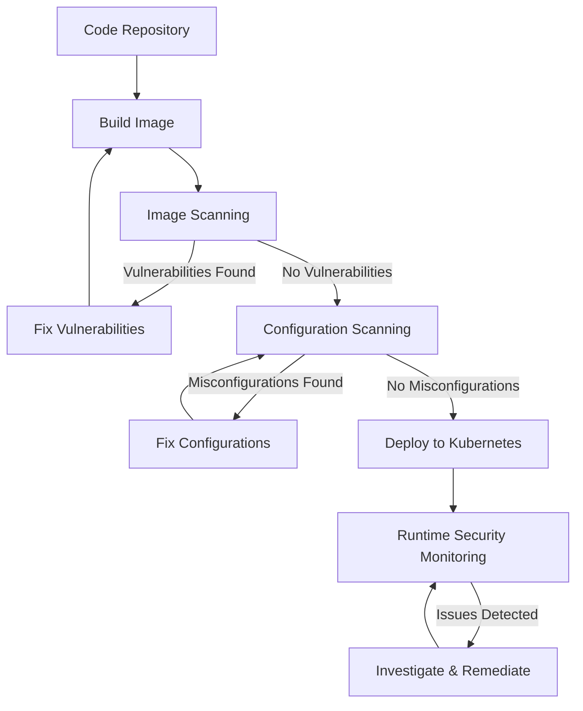

# Kubernetes Security Scanning

## Introduction

Security scanning is a critical component of maintaining a secure Kubernetes environment. As organizations increasingly adopt Kubernetes for container orchestration, the need to identify and address security vulnerabilities becomes paramount. Kubernetes security scanning involves systematically examining your cluster configuration, container images, and workloads to detect potential security risks before they can be exploited.

In this guide, you'll learn why security scanning matters, the different types of scanning available for Kubernetes environments, how to implement scanning in your workflow, and best practices to ensure your clusters remain secure.

## Why Kubernetes Security Scanning Matters

Kubernetes environments present unique security challenges:

1. **Large attack surface** - With multiple components, APIs, and configurations
2. **Rapid deployment cycles** - Making manual security checks impractical
3. **Shared infrastructure** - Where one vulnerability can affect multiple workloads
4. **Dynamic environments** - With containers constantly being created and destroyed

Security scanning helps address these challenges by automating the detection of:

- Misconfigured Kubernetes resources
- Vulnerable container images
- Outdated components
- Non-compliant deployments
- Runtime security issues

Let's explore how to implement effective security scanning for your Kubernetes environment.

## Types of Kubernetes Security Scanning

### 1. Image Scanning

Image scanning examines container images for known vulnerabilities in the operating system packages, language dependencies, and application code.

#### Example: Scanning an Image with Trivy

```bash
# Install Trivy
brew install aquasecurity/trivy/trivy

# Scan a container image
trivy image nginx:1.19

# Output example:
# 2023-03-15T10:15:02.560Z        INFO    Detected OS: debian
# 2023-03-15T10:15:02.560Z        INFO    Detecting Debian vulnerabilities...
# 
# nginx:1.19 (debian 10.8)
# ===========================
# Total: 159 (CRITICAL: 18, HIGH: 40, MEDIUM: 91, LOW: 10, UNKNOWN: 0)
```

### 2. Configuration Scanning

Configuration scanning checks your Kubernetes YAML files and cluster settings for security misconfigurations.

#### Example: Scanning Kubernetes Resources with Kubesec

```bash
# Install kubesec
brew install kubesec/kubesec/kubesec

# Scan a deployment file
kubesec scan deployment.yaml

# Output example:
# [
#   {
#     "object": "Deployment/app.default",
#     "valid": true,
#     "message": "Passed with a score of 3 points",
#     "score": 3,
#     "scoring": {
#       "passed": [
#         {"id": "RunAsNonRoot", "points": 1},
#         {"id": "ReadOnlyRootFilesystem", "points": 1},
#         {"id": "ServiceAccountName", "points": 1}
#       ],
#       "advise": [
#         {"id": "SeccompAnyProfile", "points": 1},
#         {"id": "LimitsCPU", "points": 1},
#         {"id": "LimitsMemory", "points": 1}
#       ]
#     }
#   }
# ]
```

### 3. Compliance Scanning

Compliance scanning ensures your Kubernetes environment adheres to security standards like CIS benchmarks, PCI-DSS, or HIPAA.

#### Example: Running CIS Benchmark with kube-bench

```bash
# Install kube-bench
kubectl apply -f https://raw.githubusercontent.com/aquasecurity/kube-bench/main/job.yaml

# Check the results
kubectl logs -l app=kube-bench

# Output example:
# [INFO] 1 Control Plane Security Configuration
# [INFO] 1.1 Master Node Configuration Files
# [PASS] 1.1.1 Ensure that the API server pod specification file permissions are set to 644 or more restrictive (Automated)
# [PASS] 1.1.2 Ensure that the API server pod specification file ownership is set to root:root (Automated)
# ...
```

### 4. Runtime Security Scanning

Runtime security monitors containers during execution to detect suspicious activities and enforces security policies.

## Implementing a Kubernetes Security Scanning Workflow

Let's build a complete security scanning workflow that you can integrate into your CI/CD pipeline:



Now let's examine each step with a practical example:

### Step 1: Define a Scanning Policy

First, create a YAML file that defines your security policy requirements:

```yaml
# security-policy.yaml
apiVersion: v1
kind: ConfigMap
metadata:
  name: security-policy
data:
  maxCVSS: "7.0"  # Block images with vulnerabilities above this CVSS score
  requiredChecks:
    - "no-privileged-containers"
    - "no-root-containers"
    - "resource-limits-required"
  requiredControls:
    - "CIS-1.6"
    - "CIS-5.2.1"
```

### Step 2: Configure Your CI/CD Pipeline

Here's an example GitHub Actions workflow that includes security scanning:

```yaml
# .github/workflows/kubernetes-security.yaml
name: Kubernetes Security Scanning

on:
  push:
    branches: [ main ]
  pull_request:
    branches: [ main ]

jobs:
  security-scan:
    runs-on: ubuntu-latest
    steps:
      - uses: actions/checkout@v2
      
      - name: Build container image
        run: docker build -t my-app:${{ github.sha }} .
      
      - name: Scan container image
        uses: aquasecurity/trivy-action@master
        with:
          image-ref: 'my-app:${{ github.sha }}'
          format: 'table'
          exit-code: '1'
          ignore-unfixed: true
          severity: 'CRITICAL,HIGH'
      
      - name: Scan Kubernetes manifests
        run: |
          for file in kubernetes/*.yaml; do
            kubesec scan $file
          done
      
      - name: Check compliance with security policy
        run: |
          # Custom script to check if security requirements are met
          ./scripts/check-security-policy.sh
```

### Step 3: Integrate Into Your Deployment Process

Use a validating admission webhook to enforce security policies at deployment time:

```yaml
# admission-webhook.yaml
apiVersion: admissionregistration.k8s.io/v1
kind: ValidatingWebhookConfiguration
metadata:
  name: security-scanning-webhook
webhooks:
  - name: security-scanning.example.com
    clientConfig:
      service:
        name: security-scanning-service
        namespace: security
        path: "/validate"
      caBundle: ${CA_BUNDLE}
    rules:
      - operations: ["CREATE", "UPDATE"]
        apiGroups: ["apps", ""]
        apiVersions: ["v1"]
        resources: ["deployments", "pods"]
    failurePolicy: Fail
```

### Step 4: Implement Runtime Security

Deploy a runtime security solution like Falco to monitor for suspicious behavior:

```bash
# Install Falco using Helm
helm repo add falcosecurity https://falcosecurity.github.io/charts
helm repo update
helm install falco falcosecurity/falco
```

Configure Falco rules for your environment:

```yaml
# custom-rules.yaml
- rule: Unauthorized Process in Container
  desc: Detect unauthorized process execution in containers
  condition: container and proc.name in (unauthorized_processes)
  output: Unauthorized process detected (user=%user.name command=%proc.cmdline container=%container.id image=%container.image.repository)
  priority: WARNING
  tags: [process, container]

- macro: unauthorized_processes
  condition: (proc.name in (bash, sh, nc, netcat, ncat, ssh, scp, socat))
```

## Common Security Issues Detected by Scanning

Let's examine some common issues found by security scanning tools and how to fix them:

### 1. Running Containers as Root

**Problem:**
```yaml
# Deployment with security issues
apiVersion: apps/v1
kind: Deployment
metadata:
  name: insecure-app
spec:
  replicas: 3
  selector:
    matchLabels:
      app: insecure-app
  template:
    metadata:
      labels:
        app: insecure-app
    spec:
      containers:
      - name: app
        image: nginx:latest
        ports:
        - containerPort: 80
        # No security context defined - will run as root
```

**Solution:**
```yaml
# Secured deployment
apiVersion: apps/v1
kind: Deployment
metadata:
  name: secure-app
spec:
  replicas: 3
  selector:
    matchLabels:
      app: secure-app
  template:
    metadata:
      labels:
        app: secure-app
    spec:
      securityContext:
        runAsNonRoot: true
        runAsUser: 1000
        runAsGroup: 3000
        fsGroup: 2000
      containers:
      - name: app
        image: nginx:latest
        ports:
        - containerPort: 80
        securityContext:
          allowPrivilegeEscalation: false
          readOnlyRootFilesystem: true
```

### 2. Missing Resource Limits

**Problem:**
```yaml
# Container without resource limits
containers:
- name: unlimited-app
  image: myapp:latest
  # No resource limits - could lead to resource exhaustion
```

**Solution:**
```yaml
# Container with resource limits
containers:
- name: limited-app
  image: myapp:latest
  resources:
    limits:
      cpu: "1"
      memory: "512Mi"
    requests:
      cpu: "0.5"
      memory: "256Mi"
```

### 3. Vulnerable Dependencies

When your scanning tool identifies a vulnerable dependency:

```bash
# Example scanner output:
CVE-2022-12345: High severity - Library X version 1.2.3 is vulnerable to remote code execution
```

**Solution:**
```dockerfile
# Original Dockerfile
FROM node:14
COPY package.json .
RUN npm install
# ...rest of Dockerfile

# Fixed Dockerfile
FROM node:14
COPY package.json .
RUN npm install
RUN npm audit fix
# For more critical vulnerabilities, update the specific package:
RUN npm update vulnerable-package@latest
# ...rest of Dockerfile
```

## Best Practices for Kubernetes Security Scanning

1. **Scan Early and Often:** Integrate scanning into your CI/CD pipeline to catch issues before deployment

2. **Use Multiple Tools:** Different scanners catch different issues:
   - Trivy or Clair for image scanning
   - Kubesec or Kube-score for configuration scanning
   - Kube-bench for CIS benchmark compliance
   - Falco for runtime security

3. **Define Security Policies:** Create clear policies for what security issues must be fixed versus those that can be accepted

4. **Implement Automated Remediation:** Where possible, automate the fixing of common issues

5. **Keep Tools Updated:** Security scanners need regular updates to recognize new vulnerabilities

6. **Scan All Components:** Don't focus only on applications - scan the Kubernetes components too

7. **Track Security Metrics:** Monitor improvements in your security posture over time

## Implementing Scanning in Production

For a production environment, you'll want to consider these additional steps:

1. **Create an Exception Process:** Some vulnerabilities may need temporary exceptions

2. **Scale Your Scanning:** For large clusters, distribute scanning workloads

3. **Integrate with Alert Systems:** Send critical findings to your notification systems

4. **Regular Audit Reports:** Generate compliance and vulnerability reports for stakeholders

## Example: Complete Security Scanning Pipeline

Here's how to implement a complete scanning pipeline using popular open-source tools:

```bash
#!/bin/bash
# security-scan.sh

# 1. Build the container image
docker build -t myapp:latest .

# 2. Scan the image for vulnerabilities
echo "Scanning container image..."
trivy image --severity HIGH,CRITICAL myapp:latest

# 3. Scan Kubernetes manifests
echo "Scanning Kubernetes manifests..."
for file in k8s/*.yaml; do
  kubesec scan $file
done

# 4. Check CIS Benchmarks compliance
echo "Checking CIS Benchmarks compliance..."
kubectl apply -f kube-bench-job.yaml
sleep 30
kubectl logs job/kube-bench

# 5. Deploy with admission controller validation
echo "Deploying application..."
kubectl apply -f k8s/deployment.yaml

# 6. Enable runtime monitoring
echo "Setting up runtime monitoring..."
kubectl apply -f falco-rules.yaml
```

## Summary

Kubernetes security scanning is an essential practice for maintaining secure containerized environments. By implementing a comprehensive scanning strategy that covers images, configurations, compliance, and runtime security, you can dramatically reduce the risk of security incidents.

Remember these key points:

- Scanning should occur at multiple stages of the container lifecycle
- Different types of scanning address different security concerns
- Automation is essential to make security scanning practical
- Remediation is just as important as detection
- A layered security approach provides the most robust protection

## Additional Resources

- [Kubernetes Security Best Practices](https://kubernetes.io/docs/concepts/security/)
- [CIS Kubernetes Benchmark](https://www.cisecurity.org/benchmark/kubernetes/)
- [OWASP Container Security Verification Standard](https://github.com/OWASP/Container-Security-Verification-Standard)

## Exercises

1. Set up Trivy to scan a container image and identify at least three vulnerabilities
2. Create a Kubernetes deployment manifest and use Kubesec to improve its security score
3. Implement a GitHub Actions workflow that scans your Kubernetes manifests before deployment
4. Configure a Falco rule to detect when a container attempts to modify system files
5. Create a security policy for your organization and implement it as a validating admission webhook