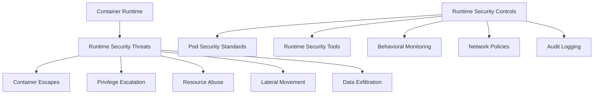

# Kubernetes Runtime Security

## Introduction

Runtime security in Kubernetes focuses on protecting your containerized applications during their execution. While other security measures like image scanning and secure configurations happen before deployment, runtime security addresses threats that emerge while your applications are running. This is a critical aspect of Kubernetes security because even with proper pre-deployment security measures, containers can still be compromised during execution.

This guide will explore the concepts, tools, and best practices for implementing effective runtime security in your Kubernetes clusters.

## Understanding Runtime Security

Runtime security encompasses all security controls that monitor and protect containers and pods during their lifecycle in a Kubernetes cluster. Let's understand why it matters:

### Why Runtime Security is Important

Container workloads face unique runtime threats:

1. **Container Escapes**: Attackers might attempt to break out of container isolation
2. **Privilege Escalation**: Exploits to gain higher privileges than intended
3. **Resource Abuse**: Cryptojacking or using resources for unauthorized purposes
4. **Lateral Movement**: Using one compromised container to access others
5. **Data Exfiltration**: Unauthorized access and extraction of sensitive data



## Pod Security Standards

The first layer of runtime security is implementing Pod Security Standards, which enforce security constraints on pod specifications.

### Understanding Pod Security Standards (PSS)

Kubernetes provides built-in Pod Security Standards at three enforcement levels:

1. **Privileged**: Unrestricted policy, providing the widest possible level of permissions
2. **Baseline**: Minimally restrictive policy that prevents known privilege escalations
3. **Restricted**: Heavily restricted policy following security best practices

Let's see how to apply Pod Security Standards using Pod Security Admission:

```yaml
# Example: Applying security standards to a namespace
apiVersion: v1
kind: Namespace
metadata:
  name: my-secure-app
  labels:
    pod-security.kubernetes.io/enforce: restricted
    pod-security.kubernetes.io/audit: restricted
    pod-security.kubernetes.io/warn: restricted
```

When you create a pod in this namespace, it will be validated against the restricted policy:

```yaml
# This pod would be rejected in the restricted namespace
apiVersion: v1
kind: Pod
metadata:
  name: privileged-pod
  namespace: my-secure-app
spec:
  containers:
  - name: nginx
    image: nginx:latest
    securityContext:
      privileged: true  # This violates the restricted policy
```

When attempting to create this pod, you'd receive an error similar to:

```
Error from server (Forbidden): error when creating "pod.yaml": pods "privileged-pod" is forbidden: violates PodSecurity "restricted:latest": privileged (container "nginx" must not set securityContext.privileged=true)
```

## Container Runtime Security Tools

Several powerful tools can be deployed in your Kubernetes cluster to provide runtime security:

### 1. Falco

Falco is a cloud-native runtime security project that can detect and alert on abnormal container behavior.

Here's how to deploy Falco using Helm:

```bash
# Add Falco Helm repository
helm repo add falcosecurity https://falcosecurity.github.io/charts
helm repo update

# Install Falco
helm install falco falcosecurity/falco --namespace falco --create-namespace
```

Falco uses rules to detect suspicious activities. Here's an example rule to detect privilege escalation:

```yaml
# Example Falco rule
- rule: Privilege Escalation
  desc: Detect privilege escalation via setuid/setgid binaries
  condition: evt.type=execve and proc.name in (setuid_binaries) and container
  output: "Privilege escalation using a setuid binary (user=%user.name command=%proc.cmdline)"
  priority: WARNING
```

### 2. Kubernetes Audit Logs

Audit logging is essential for detecting and investigating security incidents:

```yaml
# Example audit policy configuration for kube-apiserver
apiVersion: audit.k8s.io/v1
kind: Policy
rules:
- level: Metadata
  resources:
  - group: ""
    resources: ["pods", "secrets", "configmaps"]
- level: RequestResponse
  resources:
  - group: ""
    resources: ["pods/exec", "pods/portforward"]
```

### 3. Open Policy Agent (OPA) Gatekeeper

Gatekeeper allows for policy enforcement in Kubernetes:

```yaml
# Example Gatekeeper constraint to block privileged containers
apiVersion: constraints.gatekeeper.sh/v1beta1
kind: K8sNoPrivilegedContainers
metadata:
  name: no-privileged-containers
spec:
  match:
    kinds:
      - apiGroups: [""]
        kinds: ["Pod"]
```

## Runtime Behavior Monitoring

### Recognizing Abnormal Container Behavior

Understanding what constitutes abnormal container behavior is crucial:

1. **Unusual Process Execution**: Processes that shouldn't run in your containers
2. **Network Anomalies**: Unexpected connection attempts or data transfers
3. **File System Changes**: Modifications to critical files or unexpected file operations
4. **Resource Utilization Spikes**: Sudden increases in CPU, memory, or I/O usage

Let's implement basic behavior monitoring using a simple shell script:

```bash
#!/bin/bash
# Simple container behavior monitoring script

CONTAINER_ID=$1
INTERVAL=5  # Check every 5 seconds

while true; do
  # Check for unusual processes
  echo "Running processes in container $CONTAINER_ID:"
  docker exec $CONTAINER_ID ps aux
  
  # Check network connections
  echo "Network connections in container $CONTAINER_ID:"
  docker exec $CONTAINER_ID netstat -tuln
  
  # Monitor resource usage
  echo "Resource usage for container $CONTAINER_ID:"
  docker stats $CONTAINER_ID --no-stream
  
  sleep $INTERVAL
done
```

## Network Security Policies

Network policies are essential for runtime security, as they control the traffic flow between pods:

```yaml
# Example NetworkPolicy to restrict pod communication
apiVersion: networking.k8s.io/v1
kind: NetworkPolicy
metadata:
  name: api-backend-policy
  namespace: production
spec:
  podSelector:
    matchLabels:
      app: backend-api
  policyTypes:
  - Ingress
  - Egress
  ingress:
  - from:
    - podSelector:
        matchLabels:
          app: frontend
    ports:
    - protocol: TCP
      port: 8080
  egress:
  - to:
    - podSelector:
        matchLabels:
          app: database
    ports:
    - protocol: TCP
      port: 5432
```

This policy:
- Selects pods with label `app: backend-api`
- Allows incoming traffic only from pods with label `app: frontend` on port 8080
- Allows outgoing traffic only to pods with label `app: database` on port 5432

## Implementing SeccompProfiles

Security Compute Profiles (seccomp) restrict the system calls a container can make:

```yaml
# Example Pod with a seccomp profile
apiVersion: v1
kind: Pod
metadata:
  name: secure-pod
spec:
  securityContext:
    seccompProfile:
      type: Localhost
      localhostProfile: profiles/secure-profile.json
  containers:
  - name: app
    image: myapp:latest
```

Example seccomp profile (`secure-profile.json`):

```json
{
  "defaultAction": "SCMP_ACT_ERRNO",
  "architectures": [
    "SCMP_ARCH_X86_64"
  ],
  "syscalls": [
    {
      "names": [
        "accept",
        "bind",
        "close",
        "read",
        "write"
        // Add other necessary syscalls
      ],
      "action": "SCMP_ACT_ALLOW"
    }
  ]
}
```

## Real-World Implementation Example

Let's put together a comprehensive runtime security implementation for a microservices application:

```yaml
# First, define a namespace with Pod Security Standards
apiVersion: v1
kind: Namespace
metadata:
  name: secure-microservices
  labels:
    pod-security.kubernetes.io/enforce: restricted
    pod-security.kubernetes.io/audit: restricted
    pod-security.kubernetes.io/warn: restricted
---
# Define NetworkPolicy for the API service
apiVersion: networking.k8s.io/v1
kind: NetworkPolicy
metadata:
  name: api-network-policy
  namespace: secure-microservices
spec:
  podSelector:
    matchLabels:
      app: api-service
  policyTypes:
  - Ingress
  - Egress
  ingress:
  - from:
    - namespaceSelector:
        matchLabels:
          name: kube-system
    - podSelector:
        matchLabels:
          app: frontend
    ports:
    - protocol: TCP
      port: 8080
  egress:
  - to:
    - podSelector:
        matchLabels:
          app: database-service
    ports:
    - protocol: TCP
      port: 5432
---
# Define a secure API service deployment
apiVersion: apps/v1
kind: Deployment
metadata:
  name: api-service
  namespace: secure-microservices
spec:
  replicas: 3
  selector:
    matchLabels:
      app: api-service
  template:
    metadata:
      labels:
        app: api-service
    spec:
      securityContext:
        runAsNonRoot: true
        runAsUser: 10001
        seccompProfile:
          type: RuntimeDefault
      containers:
      - name: api
        image: secure-registry.example.com/api-service:v1.2.3
        imagePullPolicy: Always
        securityContext:
          allowPrivilegeEscalation: false
          capabilities:
            drop: ["ALL"]
          readOnlyRootFilesystem: true
        resources:
          limits:
            cpu: "500m"
            memory: "512Mi"
          requests:
            cpu: "100m"
            memory: "128Mi"
        ports:
        - containerPort: 8080
        volumeMounts:
        - name: tmp-volume
          mountPath: /tmp
        - name: app-logs
          mountPath: /var/log/app
      volumes:
      - name: tmp-volume
        emptyDir: {}
      - name: app-logs
        emptyDir: {}
```

This example:
1. Creates a namespace with restricted Pod Security Standards
2. Implements a network policy to limit connections
3. Deploys an application with security best practices:
   - Running as non-root
   - Using read-only filesystem
   - Dropping all capabilities
   - Setting resource limits
   - Using the default seccomp profile

## Best Practices for Kubernetes Runtime Security

Here are key best practices to follow:

1. **Apply Pod Security Standards**: Start with the restricted profile when possible
2. **Implement Network Policies**: Default to "deny all" and only allow necessary traffic
3. **Use Runtime Security Tools**: Deploy tools like Falco or Kube-bench
4. **Regular Auditing**: Check logs and alerts for suspicious activities
5. **Implement Seccomp Profiles**: Restrict system calls to the minimum required
6. **Resource Quotas**: Prevent resource exhaustion attacks
7. **Keep Components Updated**: Regularly update Kubernetes and all components
8. **Follow Principle of Least Privilege**: Only grant the minimum required permissions

## Runtime Security Testing

To validate your runtime security, you can use tools and techniques to test your defenses:

```bash
# Example: Use kube-hunter to test for vulnerabilities
kubectl run kube-hunter --restart=Never --image=aquasec/kube-hunter:latest -- --pod
```

Analyze the results to identify and fix security issues in your cluster.

## Summary

Runtime security is a critical component of a complete Kubernetes security strategy. By implementing Pod Security Standards, NetworkPolicies, runtime security tools, and following best practices, you can significantly reduce the attack surface of your Kubernetes applications during execution.

Remember that runtime security is not a one-time setup but requires ongoing monitoring, reviewing, and updating as your applications and their requirements evolve.

## Additional Resources

- [Kubernetes Security Documentation](https://kubernetes.io/docs/concepts/security/)
- [Falco Documentation](https://falco.org/docs/)
- [Kubernetes Network Policies](https://kubernetes.io/docs/concepts/services-networking/network-policies/)
- [Open Policy Agent](https://www.openpolicyagent.org/docs/latest/kubernetes-introduction/)

## Exercises

1. Deploy Falco in your Kubernetes cluster and create a custom rule to detect when a shell is executed in a container.
2. Implement network policies for an application with frontend, backend, and database components.
3. Create a seccomp profile for a specific application that restricts system calls to only those needed.
4. Set up Pod Security Standards in a namespace and try to deploy various pods to test the restrictions.
5. Use kube-hunter or kube-bench to scan your cluster for security issues and fix any findings.