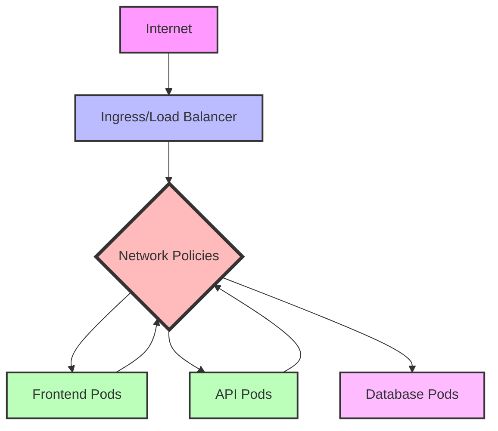

# Kubernetes Security Best Practices

## Introduction

Kubernetes has become the industry standard for container orchestration, but its complexity can introduce security challenges. This guide explores essential security best practices to help you protect your Kubernetes clusters from common vulnerabilities and threats. Whether you're running a small development environment or a production cluster, implementing these practices will significantly improve your security posture.

## Why Kubernetes Security Matters

Kubernetes manages critical workloads and infrastructure, making it an attractive target for attackers. Without proper security measures, your clusters could be vulnerable to:

- Unauthorized access to sensitive data
- Container escapes
- Crypto-mining attacks
- Denial-of-service attacks
- Data exfiltration
- Supply chain attacks

Let's explore key practices to mitigate these risks.

## 1. Secure the Kubernetes API Server

The API server is the gateway to your cluster. Limiting and monitoring access to it is crucial.

### Use TLS for All API Communications

Always enforce TLS for API server communications:

```yaml
# Example kube-apiserver configuration
apiServer:
  certFile: /path/to/cert.pem
  keyFile: /path/to/key.pem
  clientCAFile: /path/to/ca.pem
  tls-cipher-suites: TLS_ECDHE_RSA_WITH_AES_128_GCM_SHA256,TLS_ECDHE_RSA_WITH_AES_256_GCM_SHA384
```

### Implement Strong Authentication

Use a combination of authentication methods:

```yaml
# Example authentication methods in kube-apiserver
apiServer:
  authentication-token-webhook-config-file: /path/to/webhook-config
  authentication-token-webhook-cache-ttl: "10m"
  oidc-issuer-url: https://your-oidc-provider.com
  oidc-client-id: kubernetes
  oidc-username-claim: sub
  oidc-groups-claim: groups
```

### Control API Access with RBAC

Role-Based Access Control (RBAC) restricts what actions users and service accounts can perform:

```yaml
# Example RBAC configuration
apiVersion: rbac.authorization.k8s.io/v1
kind: Role
metadata:
  namespace: default
  name: pod-reader
rules:
- apiGroups: [""]
  resources: ["pods"]
  verbs: ["get", "watch", "list"]
---
apiVersion: rbac.authorization.k8s.io/v1
kind: RoleBinding
metadata:
  name: read-pods
  namespace: default
subjects:
- kind: User
  name: jane
  apiGroup: rbac.authorization.k8s.io
roleRef:
  kind: Role
  name: pod-reader
  apiGroup: rbac.authorization.k8s.io
```

## 2. Secure Cluster Components

### Use Node Hardening

Minimize the attack surface of your nodes:

- Use minimal OS images like Container-Optimized OS or CoreOS
- Enable automatic updates for security patches
- Implement host-level firewalls
- Disable unnecessary services

### Protect etcd

Etcd stores all cluster data. To protect it:

```yaml
# Example etcd security configuration
etcd:
  certFile: /path/to/server.crt
  keyFile: /path/to/server.key
  trustedCAFile: /path/to/ca.crt
  clientCertAuth: true
  autoTLS: false
```

### Secure Kubelet

Configure kubelet security settings:

```yaml
# Example kubelet security configuration
kubelet:
  authentication:
    anonymous:
      enabled: false
    webhook:
      enabled: true
    x509:
      clientCAFile: /path/to/ca.pem
  authorization:
    mode: Webhook
  readOnlyPort: 0
  protectKernelDefaults: true
```

## 3. Container Security

### Use Minimal Base Images

Start with minimal images to reduce attack surface:

```dockerfile
# Instead of this
FROM ubuntu:latest

# Use this
FROM alpine:3.17
# Or even better for certain applications
FROM gcr.io/distroless/static-debian11
```

### Scan Container Images

Implement automated scanning in your CI/CD pipeline:

```yaml
# Example GitLab CI/CD configuration for Trivy scanner
container_scanning:
  stage: test
  image: 
    name: aquasec/trivy:latest
    entrypoint: [""]
  script:
    - trivy image --exit-code 1 --severity HIGH,CRITICAL $CI_REGISTRY_IMAGE:$CI_COMMIT_SHA
```

### Run Containers as Non-Root

Enforce non-root users in your containers:

```yaml
# Example Pod security configuration
apiVersion: v1
kind: Pod
metadata:
  name: secure-pod
spec:
  securityContext:
    runAsUser: 1000
    runAsGroup: 3000
    fsGroup: 2000
  containers:
  - name: secure-container
    image: nginx:1.25
    securityContext:
      allowPrivilegeEscalation: false
      readOnlyRootFilesystem: true
      runAsNonRoot: true
```

## 4. Network Security

### Implement Network Policies

Network policies control pod-to-pod communication:

```yaml
# Example Network Policy that allows only specific pod communication
apiVersion: networking.k8s.io/v1
kind: NetworkPolicy
metadata:
  name: api-allow
  namespace: production
spec:
  podSelector:
    matchLabels:
      app: api
  ingress:
  - from:
    - podSelector:
        matchLabels:
          app: frontend
    ports:
    - protocol: TCP
      port: 8080
```

### Use mTLS Between Services

Implement mutual TLS authentication with a service mesh like Istio:

```yaml
# Example Istio PeerAuthentication for mTLS
apiVersion: security.istio.io/v1beta1
kind: PeerAuthentication
metadata:
  name: default
  namespace: istio-system
spec:
  mtls:
    mode: STRICT
```

### Visualize Network Flow

A mermaid diagram showing the ideal network security layers:



## 5. Pod Security

### Apply Pod Security Standards

Enforce Pod Security Standards using built-in admission controllers:

```yaml
# Example namespace configuration for Pod Security Standards
apiVersion: v1
kind: Namespace
metadata:
  name: secure-namespace
  labels:
    pod-security.kubernetes.io/enforce: restricted
    pod-security.kubernetes.io/audit: restricted
    pod-security.kubernetes.io/warn: restricted
```

### Use Security Contexts

Configure security contexts for your pods:

```yaml
# Example pod with security context
apiVersion: v1
kind: Pod
metadata:
  name: security-context-demo
spec:
  securityContext:
    runAsNonRoot: true
    seccompProfile:
      type: RuntimeDefault
  containers:
  - name: main-container
    image: alpine:3.17
    command: ["sh", "-c", "sleep 1h"]
    securityContext:
      readOnlyRootFilesystem: true
      allowPrivilegeEscalation: false
      capabilities:
        drop:
          - ALL
    resources:
      limits:
        cpu: "500m"
        memory: "512Mi"
      requests:
        cpu: "250m"
        memory: "256Mi"
```

### Limit Container Capabilities

Drop unnecessary Linux capabilities:

```yaml
# Example container with limited capabilities
apiVersion: v1
kind: Pod
metadata:
  name: limited-pod
spec:
  containers:
  - name: limited-container
    image: nginx:1.25
    securityContext:
      capabilities:
        drop:
        - ALL
        add:
        - NET_BIND_SERVICE  # Only if needed
```

## 6. Secrets Management

### Handle Kubernetes Secrets Properly

While Kubernetes Secrets are base64-encoded (not encrypted), use them correctly:

```yaml
# Example secret creation
apiVersion: v1
kind: Secret
metadata:
  name: api-credentials
type: Opaque
data:
  username: YWRtaW4=  # base64 encoded "admin"
  password: UEAkJHcwcmQ=  # base64 encoded "P@$$w0rd"
```

Mounting secrets in a pod:

```yaml
# Example pod using secrets
apiVersion: v1
kind: Pod
metadata:
  name: api-pod
spec:
  containers:
  - name: api-container
    image: my-api:1.0
    env:
    - name: DB_USERNAME
      valueFrom:
        secretKeyRef:
          name: api-credentials
          key: username
    - name: DB_PASSWORD
      valueFrom:
        secretKeyRef:
          name: api-credentials
          key: password
```

### Use External Secrets Managers

For production environments, consider external solutions:

```yaml
# Example using Hashicorp Vault with External Secrets Operator
apiVersion: external-secrets.io/v1beta1
kind: ExternalSecret
metadata:
  name: vault-secret
spec:
  refreshInterval: "15m"
  secretStoreRef:
    name: vault-backend
    kind: SecretStore
  target:
    name: secret-from-vault
  data:
  - secretKey: db-password
    remoteRef:
      key: database/creds/db-app
      property: password
```

## 7. Continuous Security Monitoring

### Deploy Security Tools

Implement security-focused tools:

- Falco for runtime security monitoring
- Trivy for vulnerability scanning
- Kube-bench for CIS benchmark testing
- Prometheus and Grafana for security metrics

### Example Falco Rule

```yaml
# Example Falco rule to detect privilege escalation
- rule: Detect Privilege Escalation
  desc: Detects privilege escalation attempts
  condition: >
    evt.type=execve and 
    proc.name in (sudo, su, sudoedit) and 
    not user.name=root and 
    not proc.pname in (sudo, su, sudoedit)
  output: >
    Privilege escalation attempt (user=%user.name 
    command=%proc.cmdline parent=%proc.pname)
  priority: WARNING
```

### Security Audit Logging

Enable comprehensive audit logging:

```yaml
# Example kube-apiserver audit policy
apiVersion: audit.k8s.io/v1
kind: Policy
rules:
- level: Metadata
  resources:
  - group: ""
    resources: ["secrets"]
- level: RequestResponse
  resources:
  - group: ""
    resources: ["pods"]
  verbs: ["create", "update", "patch", "delete"]
- level: Request
  resources:
  - group: "rbac.authorization.k8s.io"
    resources: ["*"]
- level: None
  users: ["system:kube-proxy"]
  resources:
  - group: ""
    resources: ["endpoints", "services"]
    verbs: ["watch"]
```

## 8. Supply Chain Security

### Sign and Verify Container Images

Use Cosign to sign and verify container images:

```bash
# Signing an image
cosign sign --key cosign.key $IMAGE_URI

# Verifying an image
cosign verify --key cosign.pub $IMAGE_URI
```

### Use Software Bill of Materials (SBOM)

Generate and store SBOMs for your containers:

```bash
# Generate SBOM with Syft
syft alpine:latest -o spdx-json > alpine-sbom.json

# Generate SBOM during build with ko
KO_DOCKER_REPO=my-registry.io/my-app ko build --sbom=spdx ./cmd/app
```

## Practical Example: Securing a Web Application

Let's apply these practices to secure a web application deployment:

```yaml
# Secure web application deployment
apiVersion: apps/v1
kind: Deployment
metadata:
  name: secure-webapp
  namespace: production
  labels:
    app: secure-webapp
spec:
  replicas: 3
  selector:
    matchLabels:
      app: secure-webapp
  template:
    metadata:
      labels:
        app: secure-webapp
      annotations:
        seccomp.security.alpha.kubernetes.io/pod: runtime/default
    spec:
      serviceAccountName: webapp-sa
      securityContext:
        runAsNonRoot: true
        seccompProfile:
          type: RuntimeDefault
        fsGroup: 2000
      containers:
      - name: webapp
        image: secure-registry.io/secure-webapp:v1.2.3@sha256:d73a1d6c23c51be64536a6acree1008c61ca471ed346e0390168ef1947c3 # Using digest for immutability
        securityContext:
          allowPrivilegeEscalation: false
          readOnlyRootFilesystem: true
          runAsUser: 1000
          capabilities:
            drop:
            - ALL
        ports:
        - containerPort: 8080
        resources:
          limits:
            cpu: "500m"
            memory: "512Mi"
          requests:
            cpu: "250m"
            memory: "256Mi"
        volumeMounts:
        - name: tmp-volume
          mountPath: /tmp
        - name: config-volume
          mountPath: /etc/webapp
          readOnly: true
        - name: secrets-volume
          mountPath: /etc/secrets
          readOnly: true
        livenessProbe:
          httpGet:
            path: /health
            port: 8080
          initialDelaySeconds: 10
          periodSeconds: 15
        readinessProbe:
          httpGet:
            path: /ready
            port: 8080
          initialDelaySeconds: 5
          periodSeconds: 10
      volumes:
      - name: tmp-volume
        emptyDir: {}
      - name: config-volume
        configMap:
          name: webapp-config
      - name: secrets-volume
        secret:
          secretName: webapp-credentials
      imagePullSecrets:
      - name: registry-credentials
---
# Network policy to restrict traffic
apiVersion: networking.k8s.io/v1
kind: NetworkPolicy
metadata:
  name: secure-webapp-network-policy
  namespace: production
spec:
  podSelector:
    matchLabels:
      app: secure-webapp
  policyTypes:
  - Ingress
  - Egress
  ingress:
  - from:
    - namespaceSelector:
        matchLabels:
          name: ingress
    ports:
    - protocol: TCP
      port: 8080
  egress:
  - to:
    - podSelector:
        matchLabels:
          app: database
    ports:
    - protocol: TCP
      port: 5432
  - to:
    - namespaceSelector:
        matchLabels:
          name: kube-system
    ports:
    - protocol: UDP
      port: 53
```

## Summary

Securing Kubernetes involves multiple layers of defense:

1. **API Server Security**: TLS, strong authentication, and RBAC
2. **Cluster Component Security**: Node hardening, etcd protection, and kubelet configuration
3. **Container Security**: Minimal images, vulnerability scanning, and non-root execution
4. **Network Security**: Network policies and service mesh
5. **Pod Security**: Pod Security Standards and security contexts
6. **Secrets Management**: Proper handling and external solutions
7. **Continuous Monitoring**: Security tools and audit logging
8. **Supply Chain Security**: Image signing and SBOMs

Remember that security is a continuous process, not a one-time implementation. Regularly update your practices as the Kubernetes ecosystem evolves and new threats emerge.

## Additional Resources

- [Kubernetes Security Cheat Sheet](https://kubernetes.io/docs/reference/access-authn-authz/rbac/)
- [CIS Kubernetes Benchmark](https://www.cisecurity.org/benchmark/kubernetes)
- [OWASP Kubernetes Top 10](https://owasp.org/www-project-kubernetes-top-ten/)
- [NSA & CISA Kubernetes Hardening Guide](https://media.defense.gov/2021/Aug/03/2002820425/-1/-1/1/CTR_KUBERNETES%20HARDENING%20GUIDANCE.PDF)

## Exercises

1. **Audit Your RBAC Permissions**: Use `kubectl auth can-i` to evaluate the permissions of your service accounts.

2. **Create a Network Policy**: Design a network policy that only allows specific communication patterns for a three-tier application.

3. **Implement Pod Security**: Apply the "restricted" Pod Security Standard to a namespace and test deployments against it.

4. **Configure Audit Logging**: Set up audit logging in your cluster and analyze the generated logs for potential security issues.

5. **Run CIS Benchmark**: Use kube-bench to run the CIS Kubernetes benchmark and address the findings.