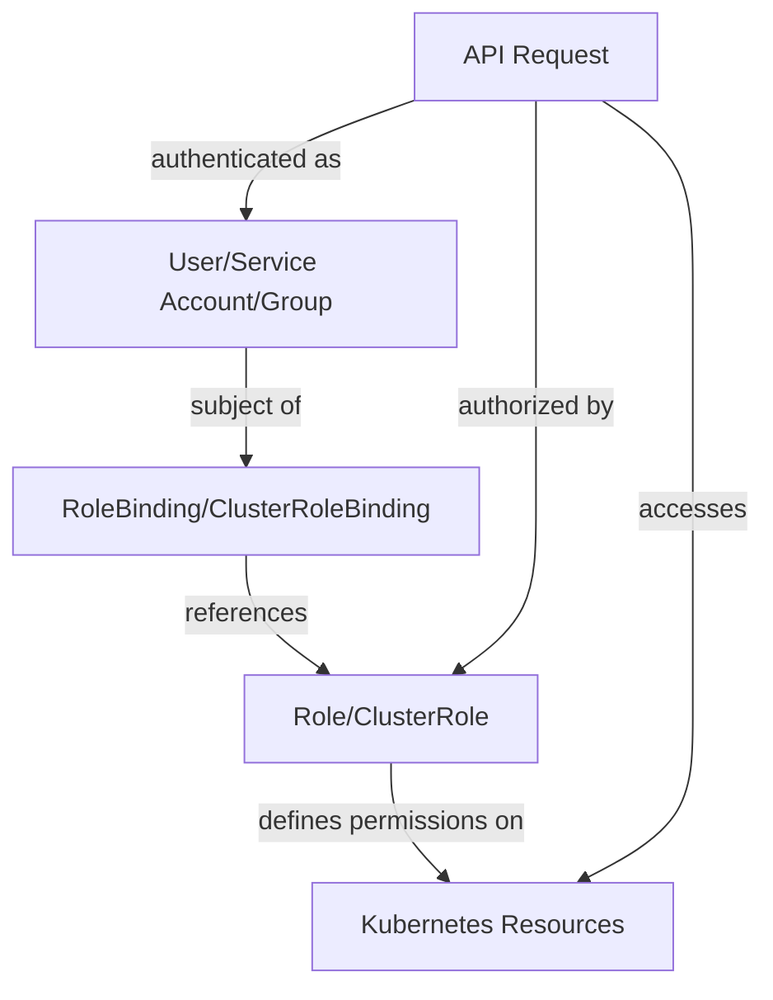

# Kubernetes RBAC

## Introduction

Role-Based Access Control (RBAC) is a crucial security mechanism in Kubernetes that helps you regulate access to your cluster resources. It works on a simple principle: define who can do what on which resources. RBAC allows administrators to dynamically configure permission policies through the Kubernetes API.

In this guide, we'll explore how RBAC works in Kubernetes, why it's important, and how to implement it effectively for your cluster security needs.

## What is RBAC?

RBAC stands for Role-Based Access Control. It's an authorization method that restricts system access to authorized users based on roles. In Kubernetes, RBAC involves several key components:

- **Roles and ClusterRoles**: Define what actions can be performed on which resources
- **RoleBindings and ClusterRoleBindings**: Connect users, groups, or service accounts to roles
- **Subjects**: The entities requesting access (users, groups, or service accounts)

The following diagram illustrates how these components work together:



## RBAC vs. Other Authorization Methods

Kubernetes supports multiple authorization modules, but RBAC has become the standard because:

1. It's more secure than Attribute-Based Access Control (ABAC)
2. It's easier to audit
3. It allows for more fine-grained permission management
4. It's directly managed through Kubernetes API

## RBAC Components in Detail

### Roles and ClusterRoles

A `Role` contains rules that represent a set of permissions. These permissions are purely additive (there are no "deny" rules). A `Role` always sets permissions within a specific namespace.

A `ClusterRole` is similar but applies cluster-wide.

Let's create a simple Role that gives read access to pods in the "development" namespace:

```yaml
apiVersion: rbac.authorization.k8s.io/v1
kind: Role
metadata:
  namespace: development
  name: pod-reader
rules:
- apiGroups: [""] # "" indicates the core API group
  resources: ["pods"]
  verbs: ["get", "watch", "list"]
```

To apply this Role:

```bash
kubectl apply -f role.yaml
```

Output:
```
role.rbac.authorization.k8s.io/pod-reader created
```

A ClusterRole looks similar but lacks a namespace specification and often includes cluster-wide resources:

```yaml
apiVersion: rbac.authorization.k8s.io/v1
kind: ClusterRole
metadata:
  name: pod-reader
rules:
- apiGroups: [""] 
  resources: ["pods"]
  verbs: ["get", "watch", "list"]
```

### RoleBindings and ClusterRoleBindings

A `RoleBinding` grants the permissions defined in a role to a user or set of users. It holds a list of subjects (users, groups, or service accounts) and a reference to the role being granted.

A `ClusterRoleBinding` grants permissions across the entire cluster.

Here's a RoleBinding that gives the "pod-reader" role to a user named "jane" in the "development" namespace:

```yaml
apiVersion: rbac.authorization.k8s.io/v1
kind: RoleBinding
metadata:
  name: read-pods
  namespace: development
subjects:
- kind: User
  name: jane
  apiGroup: rbac.authorization.k8s.io
roleRef:
  kind: Role
  name: pod-reader
  apiGroup: rbac.authorization.k8s.io
```

Apply it with:

```bash
kubectl apply -f role-binding.yaml
```

Output:
```
rolebinding.rbac.authorization.k8s.io/read-pods created
```

## Common RBAC Use Cases

### 1. Creating a Limited User

Let's say we want to create a new developer user who can only view and list pods in the "webapps" namespace.

First, create a namespace if it doesn't exist:

```bash
kubectl create namespace webapps
```

Next, create a role:

```yaml
apiVersion: rbac.authorization.k8s.io/v1
kind: Role
metadata:
  namespace: webapps
  name: pod-viewer
rules:
- apiGroups: [""]
  resources: ["pods"]
  verbs: ["get", "list", "watch"]
```

Then, create a RoleBinding for your user:

```yaml
apiVersion: rbac.authorization.k8s.io/v1
kind: RoleBinding
metadata:
  name: dev-pod-viewer
  namespace: webapps
subjects:
- kind: User
  name: developer
  apiGroup: rbac.authorization.k8s.io
roleRef:
  kind: Role
  name: pod-viewer
  apiGroup: rbac.authorization.k8s.io
```

### 2. Service Account Permissions

Service accounts are used by pods to interact with the Kubernetes API. Let's create a service account that can read ConfigMaps and Secrets:

First, create the service account:

```bash
kubectl create serviceaccount app-reader -n webapps
```

Output:
```
serviceaccount/app-reader created
```

Create a role for reading ConfigMaps and Secrets:

```yaml
apiVersion: rbac.authorization.k8s.io/v1
kind: Role
metadata:
  namespace: webapps
  name: config-reader
rules:
- apiGroups: [""]
  resources: ["configmaps", "secrets"]
  verbs: ["get", "list"]
```

Bind the role to the service account:

```yaml
apiVersion: rbac.authorization.k8s.io/v1
kind: RoleBinding
metadata:
  name: app-config-reader
  namespace: webapps
subjects:
- kind: ServiceAccount
  name: app-reader
  namespace: webapps
roleRef:
  kind: Role
  name: config-reader
  apiGroup: rbac.authorization.k8s.io
```

Now, you can use this service account in a pod:

```yaml
apiVersion: v1
kind: Pod
metadata:
  name: reader-pod
  namespace: webapps
spec:
  serviceAccountName: app-reader
  containers:
  - name: reader
    image: nginx
```

## Advanced RBAC Concepts

### Aggregated ClusterRoles

Kubernetes allows you to combine multiple ClusterRoles using aggregation rules:

```yaml
apiVersion: rbac.authorization.k8s.io/v1
kind: ClusterRole
metadata:
  name: monitoring
  labels:
    rbac.example.com/aggregate-to-monitoring: "true"
rules:
- apiGroups: [""]
  resources: ["pods", "nodes"]
  verbs: ["get", "list", "watch"]
---
apiVersion: rbac.authorization.k8s.io/v1
kind: ClusterRole
metadata:
  name: monitoring-endpoints
  labels:
    rbac.example.com/aggregate-to-monitoring: "true"
rules:
- apiGroups: [""]
  resources: ["endpoints", "services"]
  verbs: ["get", "list", "watch"]
---
apiVersion: rbac.authorization.k8s.io/v1
kind: ClusterRole
metadata:
  name: monitor
  aggregationRule:
    clusterRoleSelectors:
    - matchLabels:
        rbac.example.com/aggregate-to-monitoring: "true"
rules: [] # The controller will populate the rules
```

### Resource Names

You can restrict actions to specific resource instances by name:

```yaml
apiVersion: rbac.authorization.k8s.io/v1
kind: Role
metadata:
  namespace: default
  name: configmap-updater
rules:
- apiGroups: [""]
  resources: ["configmaps"]
  resourceNames: ["my-configmap"]
  verbs: ["update", "get"]
```

This role only allows operations on the ConfigMap named "my-configmap".

## RBAC Best Practices

1. **Follow the Principle of Least Privilege**: Grant only the permissions needed for the task at hand.

2. **Use Groups**: Assign permissions to groups rather than individual users for easier management.

3. **Separate Service Accounts**: Create separate service accounts for different components.

4. **Regularly Audit Permissions**: Use tools like `kubectl auth can-i` to check what permissions exist:

   ```bash
   kubectl auth can-i list pods --namespace development --as jane
   ```

   Output:
   ```
   yes
   ```

5. **Use Namespaces**: Isolate resources and permissions by namespace.

6. **Document Your RBAC Policies**: Keep clear documentation of who has access to what.

## Troubleshooting RBAC

If you're experiencing permission issues, here are some commands to help troubleshoot:

1. Check if a user can perform an action:

   ```bash
   kubectl auth can-i create deployments --namespace production --as bob
   ```

2. View existing roles in a namespace:

   ```bash
   kubectl get roles --namespace development
   ```

3. Describe a specific role to see its permissions:

   ```bash
   kubectl describe role pod-reader --namespace development
   ```

   Output:
   ```
   Name:         pod-reader
   Labels:       <none>
   Annotations:  <none>
   PolicyRule:
     Resources  Non-Resource URLs  Resource Names  Verbs
     ---------  -----------------  -------------  -----
     pods       []                 []             [get watch list]
   ```

4. View role bindings:

   ```bash
   kubectl get rolebindings --namespace development
   ```

## Summary

Kubernetes RBAC provides a powerful, flexible way to control access to your cluster resources. By properly implementing RBAC, you can:

- Enforce the principle of least privilege
- Create fine-grained access controls
- Improve your cluster's security posture
- Meet compliance requirements

Remember that RBAC is additive only - it grants permissions rather than denying them. Always start with minimal permissions and add more as needed.

## Additional Resources

1. [Kubernetes Official RBAC Documentation](https://kubernetes.io/docs/reference/access-authn-authz/rbac/)
2. [Using RBAC Authorization](https://kubernetes.io/docs/reference/access-authn-authz/rbac/)

## Exercises

1. Create a Role and RoleBinding that allows a user to create and list Deployments in a specific namespace.
2. Create a ClusterRole that allows reading nodes and persistent volumes, then bind it to a group of users.
3. Create a service account with permissions to create pods but not delete them.
4. Create a Role that allows full control over ConfigMaps with a specific name prefix.