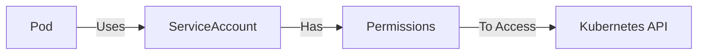

# Kubernetes ServiceAccounts

## Introduction

In Kubernetes, a ServiceAccount is an identity that processes running in a Pod can use to interact with the Kubernetes API server. Think of a ServiceAccount as a user account for Pods rather than humans. Just as users need certain permissions to access resources in a Kubernetes cluster, Pods also need similar access controls when they interact with the Kubernetes API.

ServiceAccounts are crucial for implementing the principle of least privilege in your Kubernetes clusters, ensuring that applications only have access to the resources they absolutely need to function.

## Why Do We Need ServiceAccounts?

When a Pod needs to interact with the Kubernetes API server (for example, to list resources, create deployments, or access secrets), it needs an identity and appropriate permissions. ServiceAccounts provide this identity, which can then be bound to roles and permissions using Kubernetes Role-Based Access Control (RBAC).



Without properly configured ServiceAccounts, your applications might have too much access (creating security vulnerabilities) or too little access (causing functionality issues).

## Default ServiceAccount Behavior

By default, Kubernetes automatically creates a ServiceAccount named `default` in every namespace. If you don't explicitly specify a ServiceAccount for a Pod, Kubernetes will assign the `default` ServiceAccount to it.

However, the `default` ServiceAccount typically has minimal permissions, which is a good security practice but might not be sufficient for your application's needs.

## Creating a ServiceAccount

Creating a ServiceAccount is straightforward. Here's a simple example:

```yaml
apiVersion: v1
kind: ServiceAccount
metadata:
  name: my-app-sa
  namespace: default
```

Save this to a file named `serviceaccount.yaml` and apply it:

```bash
kubectl apply -f serviceaccount.yaml
```

Output:
```
serviceaccount/my-app-sa created
```

You can verify the creation with:

```bash
kubectl get serviceaccounts
```

Output:
```
NAME        SECRETS   AGE
default     1         45d
my-app-sa   1         10s
```

## Assigning a ServiceAccount to a Pod

To use a ServiceAccount with a Pod, specify it in the Pod's specification:

```yaml
apiVersion: v1
kind: Pod
metadata:
  name: my-app-pod
spec:
  serviceAccountName: my-app-sa
  containers:
  - name: my-app
    image: my-app-image:latest
```

This tells Kubernetes to use the `my-app-sa` ServiceAccount for this Pod instead of the default one.

## ServiceAccount Tokens

When you create a ServiceAccount, Kubernetes automatically creates a secret containing a token that can be used to authenticate as that ServiceAccount. This token is automatically mounted into Pods that use the ServiceAccount.

You can view the details of a ServiceAccount using:

```bash
kubectl describe serviceaccount my-app-sa
```

Output:
```
Name:                my-app-sa
Namespace:           default
Labels:              <none>
Annotations:         <none>
Image pull secrets:  <none>
Mountable secrets:   my-app-sa-token-xyz12
Tokens:              my-app-sa-token-xyz12
Events:              <none>
```

In Kubernetes versions prior to v1.24, a secret containing the token was automatically created and linked to the ServiceAccount. However, in v1.24 and later, tokens are no longer automatically created as secrets. Instead, they are created as needed when a Pod using the ServiceAccount is created.

If you need to manually create a token for a ServiceAccount in Kubernetes v1.24+, you can use:

```bash
kubectl create token my-app-sa
```

This will output a JWT token that can be used for authentication.

## ServiceAccounts and RBAC

ServiceAccounts by themselves don't provide any additional permissions. To give a ServiceAccount access to Kubernetes resources, you need to bind it to a Role (namespace-specific) or ClusterRole (cluster-wide) using RoleBindings or ClusterRoleBindings.

Here's an example of creating a Role and binding it to a ServiceAccount:

1. Create a Role that allows reading pods:

```yaml
apiVersion: rbac.authorization.k8s.io/v1
kind: Role
metadata:
  namespace: default
  name: pod-reader
rules:
- apiGroups: [""]
  resources: ["pods"]
  verbs: ["get", "watch", "list"]
```

2. Create a RoleBinding to bind the Role to the ServiceAccount:

```yaml
apiVersion: rbac.authorization.k8s.io/v1
kind: RoleBinding
metadata:
  name: read-pods
  namespace: default
subjects:
- kind: ServiceAccount
  name: my-app-sa
  namespace: default
roleRef:
  kind: Role
  name: pod-reader
  apiGroup: rbac.authorization.k8s.io
```

Apply both with kubectl:

```bash
kubectl apply -f role.yaml
kubectl apply -f rolebinding.yaml
```

Now, any Pod using the `my-app-sa` ServiceAccount will be able to read pods in the default namespace.

## Practical Example: Pod Listing Application

Let's create a simple application that lists all pods in the current namespace using the Kubernetes API.

1. First, create a ServiceAccount with appropriate permissions:

```yaml
# sa-pod-lister.yaml
apiVersion: v1
kind: ServiceAccount
metadata:
  name: pod-lister-sa
  namespace: default
---
apiVersion: rbac.authorization.k8s.io/v1
kind: Role
metadata:
  namespace: default
  name: pod-lister-role
rules:
- apiGroups: [""]
  resources: ["pods"]
  verbs: ["get", "watch", "list"]
---
apiVersion: rbac.authorization.k8s.io/v1
kind: RoleBinding
metadata:
  name: pod-lister-binding
  namespace: default
subjects:
- kind: ServiceAccount
  name: pod-lister-sa
  namespace: default
roleRef:
  kind: Role
  name: pod-lister-role
  apiGroup: rbac.authorization.k8s.io
```

2. Apply the YAML:

```bash
kubectl apply -f sa-pod-lister.yaml
```

3. Create a Pod that uses this ServiceAccount:

```yaml
# pod-lister.yaml
apiVersion: v1
kind: Pod
metadata:
  name: pod-lister
spec:
  serviceAccountName: pod-lister-sa
  containers:
  - name: pod-lister
    image: bitnami/kubectl:latest
    command: ["sh", "-c"]
    args:
    - |
      while true; do
        echo "Listing pods at $(date):"
        kubectl get pods
        sleep 30
      done
```

4. Apply the Pod:

```bash
kubectl apply -f pod-lister.yaml
```

5. Check the logs to see if it's working:

```bash
kubectl logs pod-lister
```

Output:
```
Listing pods at Wed Sep 6 12:34:56 UTC 2023:
NAME           READY   STATUS    RESTARTS   AGE
pod-lister     1/1     Running   0          45s
my-app-pod     1/1     Running   0          2h
```

This Pod is able to list other pods because it's using the `pod-lister-sa` ServiceAccount, which has been granted the necessary permissions.

## Best Practices for ServiceAccounts

1. **Follow the Principle of Least Privilege**: Only give ServiceAccounts the permissions they absolutely need.

2. **Don't Use the Default ServiceAccount**: Create specific ServiceAccounts for different applications with tailored permissions.

3. **Use Namespaces**: Keep ServiceAccounts and their permissions isolated in appropriate namespaces.

4. **Rotate Tokens**: Regularly rotate ServiceAccount tokens, especially in production environments.

5. **Audit ServiceAccount Usage**: Regularly review which ServiceAccounts exist and their permissions.

6. **Don't Mount Unnecessary Tokens**: In Kubernetes 1.6+, you can set `automountServiceAccountToken: false` in Pod specs to prevent the automatic mounting of the ServiceAccount token if it's not needed.

   ```yaml
   apiVersion: v1
   kind: Pod
   metadata:
     name: my-pod
   spec:
     automountServiceAccountToken: false
     containers:
     # ...
   ```

7. **Consider External Identity Management**: For production environments, consider using external identity management solutions like IAM roles for service accounts in EKS or Workload Identity in GKE.

## ServiceAccounts vs. User Accounts

It's important to understand the distinction between ServiceAccounts and user accounts in Kubernetes:

| Feature | ServiceAccounts | User Accounts |
|---------|-----------------|---------------|
| Purpose | For processes running in Pods | For humans or external services |
| Namespace Scoped | Yes (belongs to a specific namespace) | No (cluster-wide) |
| Creation | Through Kubernetes API | External to Kubernetes (e.g., certificates, identity providers) |
| Storage | Stored in Kubernetes etcd | Managed externally |
| Authentication | Via mounted tokens | Via various methods (certs, tokens, OIDC, etc.) |

## Summary

ServiceAccounts are a fundamental part of Kubernetes security that allow Pods to interact with the Kubernetes API in a controlled and secure manner. By properly configuring ServiceAccounts and binding them to appropriate roles, you can ensure that your applications follow the principle of least privilege, reducing the risk of security breaches.

Remember these key points:
- ServiceAccounts provide identities for processes running in Pods
- Always create specific ServiceAccounts instead of using the default one
- Use RBAC to control what ServiceAccounts can access
- Follow best practices like the principle of least privilege and token rotation

## Additional Resources

- [Kubernetes Documentation on ServiceAccounts](https://kubernetes.io/docs/tasks/configure-pod-container/configure-service-account/)
- [Kubernetes RBAC Documentation](https://kubernetes.io/docs/reference/access-authn-authz/rbac/)
- [Kubernetes Security Best Practices](https://kubernetes.io/docs/concepts/security/overview/)

## Exercises

1. Create a ServiceAccount with permissions to list and watch deployments in a specific namespace.
2. Create a Pod that uses this ServiceAccount to periodically check for new deployments.
3. Modify the ServiceAccount to also have permission to scale deployments, and update your Pod to scale a deployment when certain conditions are met.
4. Implement a solution where multiple microservices use different ServiceAccounts with different permission levels.