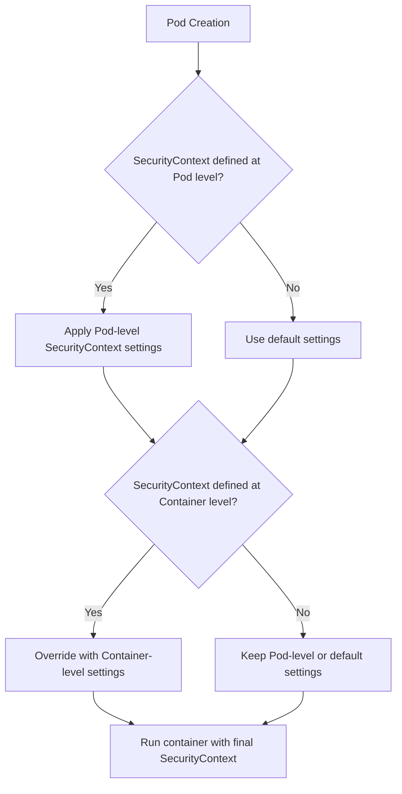

# Kubernetes SecurityContext

## Introduction

When deploying applications in Kubernetes, security should be a primary concern. Kubernetes offers a feature called **SecurityContext** that allows you to control security-related aspects of how pods and containers run. A SecurityContext defines privilege and access control settings for pods and containers, helping you implement the principle of least privilege.

In this guide, we'll explore:
- What a SecurityContext is and why it's important
- How to configure SecurityContext at both pod and container levels
- Common security settings you can control
- Real-world examples and best practices

## What is SecurityContext?

A SecurityContext in Kubernetes defines the security options for a pod or container. It includes settings related to:

- Running as a specific user or group ID
- Privilege escalation controls
- Linux capabilities
- SELinux context
- File system security settings

Think of SecurityContext as a way to set security boundaries around your workloads, similar to how you might set file permissions or user access controls in a traditional operating system.

## Why Use SecurityContext?

Without proper security controls, containers might:

- Run with excessive privileges
- Access sensitive host resources
- Modify system files
- Escalate privileges
- Interfere with other containers

SecurityContext helps mitigate these risks by allowing you to run containers with only the permissions they need.

## Pod vs. Container SecurityContext

SecurityContext can be configured at two levels:

1. **Pod level**: Settings apply to all containers in the pod
2. **Container level**: Settings apply to a specific container and override pod-level settings

Let's look at a basic example:

```yaml
apiVersion: v1
kind: Pod
metadata:
  name: security-context-demo
spec:
  securityContext:  # Pod-level security context
    runAsUser: 1000
    runAsGroup: 3000
    fsGroup: 2000
  containers:
  - name: secure-container
    image: nginx
    securityContext:  # Container-level security context
      runAsUser: 2000
      allowPrivilegeEscalation: false
```

In this example:
- All containers in the pod run as user ID 1000 and group ID 3000 by default
- Files created by any container have a group ID of 2000
- The `secure-container` specifically runs as user ID 2000 (overriding the pod-level setting)
- The `secure-container` cannot escalate its privileges

## Common SecurityContext Settings

### Run as Non-Root User

By default, many container images run as the root user, which is a security risk. Using `runAsUser` to specify a non-root user ID is a simple but effective security measure:

```yaml
securityContext:
  runAsUser: 1000  # Non-root user ID
  runAsGroup: 3000  # Non-root group ID
```

You can verify this is working by running a shell in your container:

```bash
kubectl exec -it security-context-demo -- id
```

Output:
```
uid=1000 gid=3000 groups=2000
```

### Prevent Privilege Escalation

The `allowPrivilegeEscalation` setting controls whether a process can gain more privileges than its parent process:

```yaml
securityContext:
  allowPrivilegeEscalation: false
```

This is particularly important for preventing certain types of security exploits.

### Run Containers as Non-Privileged

You can ensure containers run without elevated privileges:

```yaml
securityContext:
  privileged: false
```

### Setting File System Permissions

The `fsGroup` setting defines the group ID that will own volumes mounted to the pod:

```yaml
securityContext:
  fsGroup: 2000
```

Files created in a volume will be owned by this group ID.

### Managing Linux Capabilities

Linux capabilities provide fine-grained control over superuser permissions. Instead of giving a process full root access, you can grant specific capabilities:

```yaml
securityContext:
  capabilities:
    add: ["NET_ADMIN", "SYS_TIME"]
    drop: ["ALL"]
```

In this example:
- First, all capabilities are dropped
- Then only the specific capabilities needed (network administration and time modification) are added back

### Read-Only Root Filesystem

To prevent a container from writing to its filesystem:

```yaml
securityContext:
  readOnlyRootFilesystem: true
```

This forces application developers to explicitly mount volumes for areas that need to be writable.

## Real-World Examples

### Secure Web Server

Here's an example of a secure Nginx web server:

```yaml
apiVersion: v1
kind: Pod
metadata:
  name: secure-nginx
spec:
  securityContext:
    fsGroup: 2000
  containers:
  - name: nginx
    image: nginx
    ports:
    - containerPort: 80
    securityContext:
      runAsUser: 101  # nginx user in the container
      runAsGroup: 101
      allowPrivilegeEscalation: false
      capabilities:
        drop: ["ALL"]
        add: ["NET_BIND_SERVICE"]  # Allow binding to port 80
      readOnlyRootFilesystem: true
    volumeMounts:
    - name: nginx-data
      mountPath: /var/cache/nginx
    - name: nginx-config
      mountPath: /etc/nginx/conf.d
  volumes:
  - name: nginx-data
    emptyDir: {}
  - name: nginx-config
    configMap:
      name: nginx-config
```

This configuration:
- Runs Nginx as a non-root user (101)
- Drops all capabilities except the one needed to bind to port 80
- Makes the root filesystem read-only
- Mounts specific directories for writable storage

### Database Pod with Custom User and Group

For a database that needs specific user permissions:

```yaml
apiVersion: v1
kind: Pod
metadata:
  name: mysql-pod
spec:
  containers:
  - name: mysql
    image: mysql:5.7
    env:
    - name: MYSQL_ROOT_PASSWORD
      valueFrom:
        secretKeyRef:
          name: mysql-secret
          key: password
    securityContext:
      runAsUser: 999  # mysql user
      runAsGroup: 999
      allowPrivilegeEscalation: false
    volumeMounts:
    - name: mysql-data
      mountPath: /var/lib/mysql
  securityContext:
    fsGroup: 999  # Ensure volume is writable by mysql group
  volumes:
  - name: mysql-data
    persistentVolumeClaim:
      claimName: mysql-pvc
```

## SecurityContext Flowchart

Here's a diagram showing how SecurityContext settings are evaluated:



## Best Practices

1. **Always run containers as non-root users**
   - Specify `runAsUser` and `runAsGroup` with non-zero values

2. **Use the principle of least privilege**
   - Drop all capabilities (`capabilities.drop: ["ALL"]`) and only add back what's necessary

3. **Prevent privilege escalation**
   - Set `allowPrivilegeEscalation: false`

4. **Use read-only root filesystems where possible**
   - Set `readOnlyRootFilesystem: true` and mount volumes for writable directories

5. **Set appropriate file permissions with `fsGroup`**
   - Ensure volumes are accessible to the container's user/group

6. **Consider using Pod Security Standards or Policies**
   - Enforce SecurityContext settings at the cluster level

## Troubleshooting SecurityContext Issues

### Problem: Container fails to start with permission errors

If you see errors like "permission denied" when the container tries to start:

1. Check if the container needs to write to specific directories
2. Ensure the user specified in `runAsUser` has appropriate permissions
3. Consider mounting an `emptyDir` volume for directories that need to be writable

### Problem: Container needs a capability but isn't allowed

If your application needs specific capabilities:

1. Identify the minimal set of capabilities required
2. Add only those specific capabilities instead of running as privileged

Example fix:
```yaml
securityContext:
  capabilities:
    drop: ["ALL"]
    add: ["NET_BIND_SERVICE"]  # Only add what's needed
```

## Summary

Kubernetes SecurityContext provides powerful tools to enhance the security of your pods and containers by:

- Running containers as non-root users
- Controlling privilege escalation
- Managing Linux capabilities
- Setting file system permissions
- Enforcing read-only file systems

By properly configuring SecurityContext, you follow the principle of least privilege, reducing the attack surface of your applications and enhancing your overall security posture in Kubernetes.

## Additional Resources

- [Kubernetes Documentation on SecurityContext](https://kubernetes.io/docs/tasks/configure-pod-container/security-context/)
- [Kubernetes Pod Security Standards](https://kubernetes.io/docs/concepts/security/pod-security-standards/)
- [Linux Capabilities Documentation](https://man7.org/linux/man-pages/man7/capabilities.7.html)

## Exercises

1. Create a pod that runs with a custom user ID and group ID, then verify the settings using `kubectl exec`.

2. Modify an existing deployment to use a read-only root filesystem. Identify which directories need to be mounted as writable volumes.

3. Create a pod that needs to bind to a low port number (below 1024) without running as a privileged container. Use appropriate capabilities.

4. Set up a pod that can only write to a specific volume mount but nowhere else in the filesystem.

5. Investigate which Linux capabilities your application actually requires by starting with none and adding them until the application works correctly.