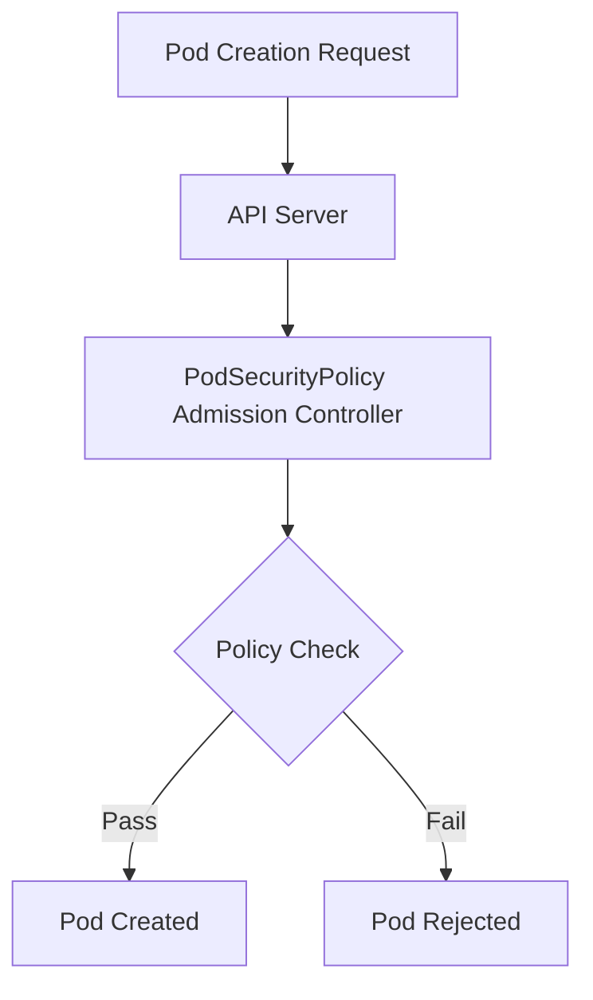

# Kubernetes PodSecurityPolicy

## Introduction

In the world of container orchestration, security is a critical concern. Kubernetes PodSecurityPolicy (PSP) is a cluster-level resource that controls security-sensitive aspects of pod specification. It allows cluster administrators to control what a pod can do and what resources it can access, significantly reducing the attack surface of your Kubernetes cluster.

:::note
As of Kubernetes v1.21, PodSecurityPolicy (PSP) has been deprecated and will be removed in a future release. It is recommended to use the [Pod Security Admission Controller](https://kubernetes.io/docs/concepts/security/pod-security-admission/) or third-party admission controllers as alternatives.
:::

Despite being deprecated, understanding PSP remains important as:
1. Many existing clusters still use PSP
2. The concepts behind PSP are fundamental to Kubernetes security
3. Alternative security mechanisms build upon similar principles

## What is PodSecurityPolicy?

PodSecurityPolicy is a built-in admission controller that governs:
- Running of privileged containers
- Usage of host namespaces, networking, and ports
- Volume types that can be mounted
- The file system group that may be used
- Linux capabilities, SELinux context, AppArmor profiles, seccomp profiles, and more

Think of PSP as a security guard that checks each pod's "credentials" before allowing it to be created in your cluster.

## How PodSecurityPolicy Works

Here's a simplified workflow of how PSP works in Kubernetes:



When a pod creation request is made:
1. The API server receives the request
2. The PSP admission controller evaluates the pod against available policies
3. If the pod complies with at least one policy, it's allowed to be created
4. If the pod violates all available policies, it's rejected

## Creating a Basic PodSecurityPolicy

Let's create a simple PSP that restricts privileged containers and requires running as a non-root user:

```yaml
apiVersion: policy/v1beta1
kind: PodSecurityPolicy
metadata:
  name: restricted
spec:
  privileged: false  # Don't allow privileged pods
  # Volumes and file systems
  volumes:
    - 'configMap'
    - 'emptyDir'
    - 'projected'
    - 'secret'
    - 'downwardAPI'
    - 'persistentVolumeClaim'
  # Users and groups
  runAsUser:
    rule: 'MustRunAsNonRoot'  # Require the container to run as non-root user
  supplementalGroups:
    rule: 'MustRunAs'
    ranges:
      - min: 1
        max: 65535
  fsGroup:
    rule: 'MustRunAs'
    ranges:
      - min: 1
        max: 65535
  # Privilege Escalation
  allowPrivilegeEscalation: false
  defaultAllowPrivilegeEscalation: false
  # Capabilities
  allowedCapabilities: []
  defaultAddCapabilities: []
  requiredDropCapabilities:
    - ALL
  # Host namespaces
  hostPID: false
  hostIPC: false
  hostNetwork: false
  hostPorts:
    - min: 0
      max: 0
  seLinux:
    rule: 'RunAsAny'
```

## Authorizing Policies with RBAC

Creating a PSP alone isn't enough. You need to authorize users or service accounts to use it via RBAC (Role-Based Access Control):

```yaml
# Create a ClusterRole that uses the PSP
apiVersion: rbac.authorization.k8s.io/v1
kind: ClusterRole
metadata:
  name: use-restricted-psp
rules:
- apiGroups: ['policy']
  resources: ['podsecuritypolicies']
  verbs: ['use']
  resourceNames: ['restricted']
---
# Bind the ClusterRole to a user or service account
apiVersion: rbac.authorization.k8s.io/v1
kind: RoleBinding
metadata:
  name: dev-use-restricted-psp
  namespace: development
subjects:
- kind: ServiceAccount
  name: developer
  namespace: development
roleRef:
  kind: ClusterRole
  name: use-restricted-psp
  apiGroup: rbac.authorization.k8s.io
```

## PSP Example: Restricting Capabilities

Linux capabilities provide fine-grained control over privileged operations. Let's create a policy that drops all capabilities and only allows specific ones:

```yaml
apiVersion: policy/v1beta1
kind: PodSecurityPolicy
metadata:
  name: capabilities-demo
spec:
  privileged: false
  # The rest of the policy...
  allowedCapabilities:
    - NET_BIND_SERVICE  # Allow binding to privileged ports
  requiredDropCapabilities:
    - ALL  # Drop all capabilities by default
  # Other specifications...
```

This policy:
1. Drops ALL capabilities by default
2. Only allows the NET_BIND_SERVICE capability, which lets containers bind to ports below 1024

## Testing PodSecurityPolicy

Let's test our policies with some pod examples:

### Example 1: A Pod That Violates Our Policy

```yaml
apiVersion: v1
kind: Pod
metadata:
  name: privileged-pod
spec:
  containers:
  - name: nginx
    image: nginx
    securityContext:
      privileged: true  # This violates our policy
```

Trying to create this pod with our restricted PSP will result in an error:

```
Error from server (Forbidden): error when creating "privileged-pod.yaml": pods "privileged-pod" is forbidden: 
PodSecurityPolicy: unable to admit pod: [spec.containers[0].securityContext.privileged: Invalid value: true: Privileged containers are not allowed]
```

### Example 2: A Pod That Complies With Our Policy

```yaml
apiVersion: v1
kind: Pod
metadata:
  name: compliant-pod
spec:
  containers:
  - name: nginx
    image: nginx
    securityContext:
      runAsNonRoot: true
      runAsUser: 1000
      allowPrivilegeEscalation: false
      capabilities:
        drop:
          - ALL
```

This pod should be successfully created because it complies with our policy.

## Real-World Scenario: Multi-Tenant Kubernetes Cluster

Imagine you're managing a Kubernetes cluster used by multiple teams. You want to ensure that:
- Production pods have stricter security requirements 
- Development pods have more flexibility but still maintain basic security

### Production PSP

```yaml
apiVersion: policy/v1beta1
kind: PodSecurityPolicy
metadata:
  name: production-psp
spec:
  privileged: false
  allowPrivilegeEscalation: false
  requiredDropCapabilities:
    - ALL
  volumes:
    - 'configMap'
    - 'secret'
    - 'persistentVolumeClaim'
  hostNetwork: false
  hostIPC: false
  hostPID: false
  runAsUser:
    rule: 'MustRunAsNonRoot'
  seLinux:
    rule: 'RunAsAny'
  supplementalGroups:
    rule: 'MustRunAs'
    ranges:
      - min: 1
        max: 65535
  fsGroup:
    rule: 'MustRunAs'
    ranges:
      - min: 1
        max: 65535
  readOnlyRootFilesystem: true
```

### Development PSP

```yaml
apiVersion: policy/v1beta1
kind: PodSecurityPolicy
metadata:
  name: development-psp
spec:
  privileged: false
  allowPrivilegeEscalation: false
  volumes:
    - '*'
  hostNetwork: false
  hostIPC: false
  hostPID: false
  runAsUser:
    rule: 'RunAsAny'
  seLinux:
    rule: 'RunAsAny'
  supplementalGroups:
    rule: 'RunAsAny'
  fsGroup:
    rule: 'RunAsAny'
  readOnlyRootFilesystem: false
```

Then bind these policies to the appropriate service accounts using RBAC as shown earlier.

## Advanced PodSecurityPolicy Features

### SELinux

Security-Enhanced Linux (SELinux) provides additional security controls. You can enforce SELinux contexts with PSP:

```yaml
seLinux:
  rule: 'MustRunAs'
  seLinuxOptions:
    level: 's0:c123,c456'
```

### AppArmor

AppArmor is a Linux security module that restricts program capabilities. You can enforce AppArmor profiles using annotations:

```yaml
apiVersion: v1
kind: Pod
metadata:
  name: apparmor-pod
  annotations:
    container.apparmor.security.beta.kubernetes.io/nginx: 'runtime/default'
spec:
  containers:
  - name: nginx
    image: nginx
```

### Seccomp

Seccomp (secure computing mode) restricts the system calls that a process can make. You can enforce seccomp profiles with annotations:

```yaml
apiVersion: v1
kind: Pod
metadata:
  name: seccomp-pod
  annotations:
    seccomp.security.alpha.kubernetes.io/pod: 'runtime/default'
spec:
  containers:
  - name: nginx
    image: nginx
```

## Migrating from PSP

Since PSP is being deprecated, here are some migration options:

1. **Pod Security Admission (PSA)**: The built-in replacement for PSP that uses three predefined security levels (Privileged, Baseline, and Restricted)

2. **OPA Gatekeeper**: A policy engine that extends Kubernetes with custom resource definitions for policies

3. **Kyverno**: A policy engine designed specifically for Kubernetes with no programming language required

4. **Security Vendors**: Various security vendors provide advanced Kubernetes security solutions

## Summary

PodSecurityPolicy is a powerful tool for enforcing security standards in your Kubernetes cluster. Although it's being deprecated, understanding its concepts is vital for Kubernetes security. Key takeaways:

1. PSP controls security-sensitive aspects of pod specifications
2. It works as an admission controller that validates pods before creation
3. RBAC must be configured to authorize the use of policies
4. PSP can restrict privileged containers, host resources, volumes, and more
5. Alternatives like Pod Security Admission and OPA Gatekeeper are the future

## Exercises

1. Create a PSP that allows containers to use the NET_ADMIN capability but no others
2. Create a policy that requires all containers to run with a read-only root filesystem
3. Implement different policies for different namespaces in your cluster
4. Try to set up a policy that allows certain pods to access hostPath volumes but only specific paths
5. Explore migrating a PSP to the new Pod Security Admission standard

## Additional Resources

- [Kubernetes Documentation on PSP](https://kubernetes.io/docs/concepts/security/pod-security-policy/)
- [Pod Security Admission Documentation](https://kubernetes.io/docs/concepts/security/pod-security-admission/)
- [OPA Gatekeeper](https://github.com/open-policy-agent/gatekeeper)
- [Kyverno Policy Engine](https://kyverno.io/)
- [Kubernetes Security Best Practices](https://kubernetes.io/docs/concepts/security/security-best-practices/)