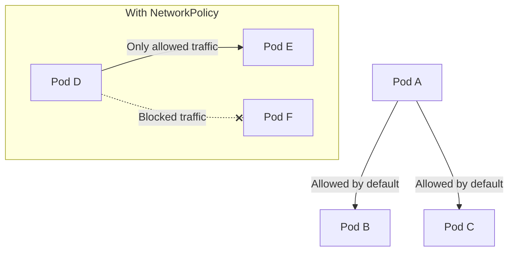
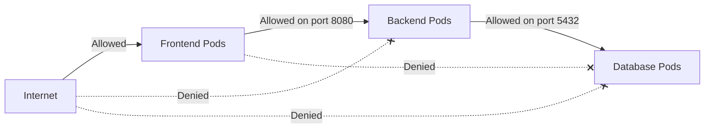

# Kubernetes NetworkPolicy

## Introduction

When running applications in Kubernetes, pods can communicate with any other pod by default - even across namespace boundaries. This open communication model is convenient for development but can pose significant security risks in production environments. This is where **Kubernetes NetworkPolicy** comes into play.

A NetworkPolicy is a specification that defines how groups of pods are allowed to communicate with each other and with other network endpoints. Think of it as a firewall for your Kubernetes pods, allowing you to define precise rules about which traffic is allowed and which should be blocked.

In this guide, we'll explore how NetworkPolicy works, why it's crucial for securing your Kubernetes clusters, and how to implement it effectively in your environments.

## Why Use NetworkPolicy?

Before diving into the implementation details, let's understand why NetworkPolicy is essential:

1. **Security Isolation**: Limit communication between pods to reduce the attack surface
2. **Compliance Requirements**: Many security standards require network segmentation
3. **Multi-tenancy**: Create secure boundaries between different teams or applications
4. **Defense in Depth**: Add an additional layer of security beyond other measures

Without NetworkPolicy, a compromised pod could potentially communicate with any other pod in your cluster, increasing the risk of lateral movement by attackers.

## Prerequisites

To work with NetworkPolicy effectively, you need:

1. A Kubernetes cluster with a networking solution that supports NetworkPolicy (e.g., Calico, Cilium, Weave Net)
2. Basic understanding of Kubernetes concepts (pods, namespaces, labels)
3. `kubectl` command-line tool configured to communicate with your cluster

:::note
Not all Kubernetes network providers support NetworkPolicy. Notable examples that **do** support it include Calico, Cilium, Weave Net, and Antrea. The default Kubernetes network provider, kubenet, does **not** support NetworkPolicy.
:::

## NetworkPolicy Basics

### What NetworkPolicy Controls

A NetworkPolicy can control:

- **Ingress traffic**: Incoming connections to pods
- **Egress traffic**: Outgoing connections from pods

Each NetworkPolicy applies to a set of pods that match a label selector and defines a set of rules that specify what traffic is allowed to or from those pods.

### Default Deny vs Default Allow

Kubernetes operates on a **default allow** model when no NetworkPolicies are applied. Once you create any NetworkPolicy that selects a pod, that pod will reject all connections that aren't allowed by any NetworkPolicy.

Let's explore this concept with a diagram:



## Your First NetworkPolicy

Let's create a simple NetworkPolicy that denies all ingress traffic to pods in a namespace:

```yaml
apiVersion: networking.k8s.io/v1
kind: NetworkPolicy
metadata:
  name: default-deny-ingress
  namespace: your-namespace
spec:
  podSelector: {}  # Empty selector matches all pods in the namespace
  policyTypes:
  - Ingress
```

This policy selects all pods in `your-namespace` and creates a rule that denies all incoming traffic. The empty `podSelector` matches all pods in the namespace.

To apply this policy:

```bash
kubectl apply -f default-deny-ingress.yaml
```

After applying, all pods in the namespace will be unable to receive incoming connections from any source. This is often a good starting point for implementing a zero-trust security model.

## Allowing Specific Traffic

Let's create a more practical example. Suppose we have a three-tier application with frontend, backend, and database components. We want to:

1. Allow the frontend to receive traffic from outside the cluster
2. Allow the backend to receive traffic only from the frontend
3. Allow the database to receive traffic only from the backend

### Example: Backend Service NetworkPolicy

```yaml
apiVersion: networking.k8s.io/v1
kind: NetworkPolicy
metadata:
  name: backend-policy
  namespace: your-namespace
spec:
  podSelector:
    matchLabels:
      app: backend
  policyTypes:
  - Ingress
  ingress:
  - from:
    - podSelector:
        matchLabels:
          app: frontend
    ports:
    - protocol: TCP
      port: 8080
```

This policy:
- Applies to pods with the label `app: backend`
- Allows ingress traffic only from pods with the label `app: frontend`
- Only permits TCP traffic on port 8080

Let's visualize our three-tier application network policy:



## Advanced NetworkPolicy Examples

### Allowing Traffic Based on Namespace

You can allow traffic from pods in a specific namespace:

```yaml
apiVersion: networking.k8s.io/v1
kind: NetworkPolicy
metadata:
  name: allow-from-monitoring
  namespace: your-namespace
spec:
  podSelector:
    matchLabels:
      app: backend
  policyTypes:
  - Ingress
  ingress:
  - from:
    - namespaceSelector:
        matchLabels:
          purpose: monitoring
```

This policy allows all pods in namespaces labeled `purpose: monitoring` to connect to backend pods in `your-namespace`.

### Combining Pod and Namespace Selectors

You can create more specific rules by combining selectors:

```yaml
apiVersion: networking.k8s.io/v1
kind: NetworkPolicy
metadata:
  name: specific-access
  namespace: your-namespace
spec:
  podSelector:
    matchLabels:
      app: backend
  policyTypes:
  - Ingress
  ingress:
  - from:
    - namespaceSelector:
        matchLabels:
          purpose: monitoring
      podSelector:
        matchLabels:
          role: prometheus
```

:::caution
Note the position of the dash (-) in the `from` array! The above example uses a single `from` entry with both namespace and pod selectors, meaning traffic must come from pods that match **both** conditions (AND logic). If you place the `podSelector` in a separate `from` entry (with its own dash), it becomes an OR condition.
:::

### Controlling Egress Traffic

To control outbound traffic from your pods:

```yaml
apiVersion: networking.k8s.io/v1
kind: NetworkPolicy
metadata:
  name: limit-outbound
  namespace: your-namespace
spec:
  podSelector:
    matchLabels:
      app: frontend
  policyTypes:
  - Egress
  egress:
  - to:
    - podSelector:
        matchLabels:
          app: backend
    ports:
    - protocol: TCP
      port: 8080
  - to:
    - namespaceSelector: {}
      podSelector:
        matchLabels:
          k8s-app: kube-dns
    ports:
    - protocol: UDP
      port: 53
    - protocol: TCP
      port: 53
```

This policy:
- Applies to frontend pods
- Allows outbound connections only to backend pods on port 8080
- Also allows DNS resolution via kube-dns (essential for most applications)

## Testing NetworkPolicy

To test whether your NetworkPolicy is working as expected, you can:

1. Try to establish connections between pods
2. Use network utilities inside pods to test connectivity

Example test using a temporary pod:

```bash
# Run a temporary pod in the namespace
kubectl run --namespace=your-namespace test-pod --rm -it --image=alpine -- sh

# Inside the pod, try to connect to your service
wget -qO- --timeout=2 http://backend-service:8080

# If the NetworkPolicy is working, the connection should be blocked
# if this pod isn't explicitly allowed
```

## Common Patterns and Best Practices

1. **Start with default deny policies**: Begin by blocking all traffic and then selectively allow what's needed.

```yaml
apiVersion: networking.k8s.io/v1
kind: NetworkPolicy
metadata:
  name: default-deny-all
  namespace: your-namespace
spec:
  podSelector: {}
  policyTypes:
  - Ingress
  - Egress
```

2. **Label pods consistently**: Develop a consistent labeling strategy to make NetworkPolicy targeting simpler.

3. **Create namespace isolation**: For multi-tenant clusters, isolate namespaces from each other.

```yaml
apiVersion: networking.k8s.io/v1
kind: NetworkPolicy
metadata:
  name: deny-other-namespaces
  namespace: your-namespace
spec:
  podSelector: {}
  policyTypes:
  - Ingress
  ingress:
  - from:
    - podSelector: {}
```

This policy allows traffic only from within the same namespace.

4. **Don't forget DNS access**: Always allow egress to your cluster's DNS service.

5. **Audit regularly**: Periodically review and test your NetworkPolicies to ensure they provide the intended protection.

## Troubleshooting NetworkPolicy

If your NetworkPolicy doesn't work as expected:

1. **Verify network plugin support**: Ensure your Kubernetes network plugin supports NetworkPolicy.

2. **Check policy selection**: Confirm your policies select the correct pods using labels:

```bash
# List pods with their labels
kubectl get pods -n your-namespace --show-labels
```

3. **Inspect the policies**: Check what policies are applied:

```bash
kubectl get networkpolicies -n your-namespace
kubectl describe networkpolicy policy-name -n your-namespace
```

4. **Network debugging tools**: Use tools like `netshoot` to diagnose network connectivity:

```bash
kubectl run tmp-shell --rm -i --tty --image nicolaka/netshoot -- /bin/bash
```

## Summary

Kubernetes NetworkPolicy provides a powerful way to secure pod-to-pod communications within your cluster. By implementing NetworkPolicy, you can:

- Define precise rules for allowed traffic
- Create security boundaries between different parts of your application
- Reduce the attack surface of your Kubernetes workloads
- Meet compliance requirements for network segmentation

Remember that NetworkPolicy operates at the pod level, using labels and selectors to identify which pods the policies apply to. Starting with a default deny policy and then selectively allowing required traffic is generally the best approach to securing your cluster.

## Additional Resources

- [Kubernetes NetworkPolicy Documentation](https://kubernetes.io/docs/concepts/services-networking/network-policies/)
- [Network Policy Recipes](https://github.com/ahmetb/kubernetes-network-policy-recipes)

## Exercises

1. Create a default deny policy for both ingress and egress in a test namespace, then add exceptions for DNS and specific application traffic.

2. Set up a three-tier application (frontend, backend, database) and create NetworkPolicies that enforce proper segmentation.

3. Create a policy that allows specific external IPs to access your service while blocking all other external traffic.

4. Implement namespace isolation, allowing pods to communicate only within their namespace except for shared services.