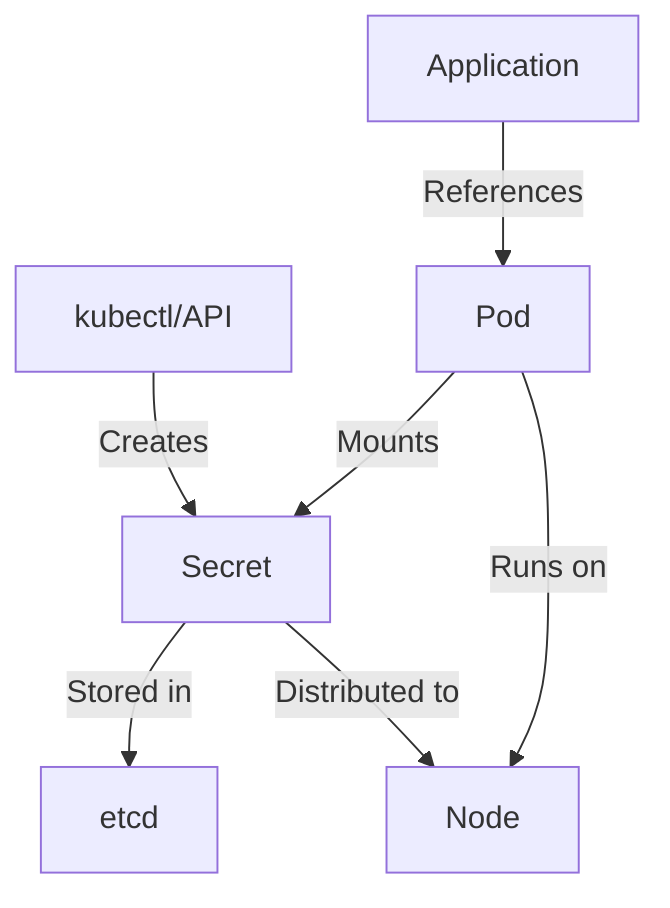

# Kubernetes Secrets Management

## Introduction

When deploying applications in Kubernetes, you'll often need to use sensitive information such as passwords, API keys, and tokens. Storing this information directly in your configuration files or container images creates security vulnerabilities. Kubernetes Secrets provide a solution to this problem by offering a secure way to store and manage sensitive information.

In this guide, we'll explore how Kubernetes Secrets work, how to create and use them, and best practices for managing sensitive information in your Kubernetes clusters.

## What are Kubernetes Secrets?

Kubernetes Secrets are objects that store sensitive data such as passwords, OAuth tokens, and SSH keys. By using Secrets, you can separate your sensitive information from your application code and configuration, reducing the risk of accidental exposure.

Secrets are similar to ConfigMaps but are specifically intended for confidential data. Kubernetes provides additional safeguards for Secret objects:

1. Secrets are stored in a temporary file-system (tmpfs) rather than on disk
2. Secrets are only distributed to nodes that run pods requiring them
3. Secrets are encoded in base64 by default (though this is not encryption)

Let's visualize how Secrets fit into the Kubernetes ecosystem:



## Creating Secrets

There are several ways to create Secrets in Kubernetes:

### 1. Creating from literal values

You can create a Secret directly from the command line:

```bash
kubectl create secret generic db-credentials \
  --from-literal=username=admin \
  --from-literal=password=mysecretpassword
```

### 2. Creating from files

If you have sensitive data stored in files, you can create a Secret from them:

```bash
# First, create files containing your secret data
echo -n 'admin' > ./username.txt
echo -n 'mysecretpassword' > ./password.txt

# Then, create a secret from these files
kubectl create secret generic db-credentials \
  --from-file=username=./username.txt \
  --from-file=password=./password.txt
```

### 3. Creating from YAML

You can also define a Secret in a YAML file. However, you'll need to encode your sensitive data in base64 first:

```bash
echo -n 'admin' | base64
# Output: YWRtaW4=

echo -n 'mysecretpassword' | base64
# Output: bXlzZWNyZXRwYXNzd29yZA==
```

Then create a YAML file:

```yaml
apiVersion: v1
kind: Secret
metadata:
  name: db-credentials
type: Opaque
data:
  username: YWRtaW4=
  password: bXlzZWNyZXRwYXNzd29yZA==
```

Apply the YAML file:

```bash
kubectl apply -f secret.yaml
```

## Using Secrets in Pods

There are two main ways to use Secrets in your pods:

### 1. As environment variables

```yaml
apiVersion: v1
kind: Pod
metadata:
  name: my-app
spec:
  containers:
  - name: my-app-container
    image: my-app:1.0
    env:
    - name: DB_USERNAME
      valueFrom:
        secretKeyRef:
          name: db-credentials
          key: username
    - name: DB_PASSWORD
      valueFrom:
        secretKeyRef:
          name: db-credentials
          key: password
```

### 2. As mounted volumes

```yaml
apiVersion: v1
kind: Pod
metadata:
  name: my-app
spec:
  containers:
  - name: my-app-container
    image: my-app:1.0
    volumeMounts:
    - name: secret-volume
      mountPath: /etc/secrets
      readOnly: true
  volumes:
  - name: secret-volume
    secret:
      secretName: db-credentials
```

When using volume mounts, each key in the Secret becomes a file in the mounted directory. For example, with the above configuration:

- `/etc/secrets/username` will contain `admin`
- `/etc/secrets/password` will contain `mysecretpassword`

## Real-world Example: Deploying a Database with Secrets

Let's walk through a complete example of deploying a PostgreSQL database that uses Secrets for authentication:

### Step 1: Create a Secret for database credentials

```bash
kubectl create secret generic postgres-credentials \
  --from-literal=POSTGRES_USER=myuser \
  --from-literal=POSTGRES_PASSWORD=mysecretpassword \
  --from-literal=POSTGRES_DB=mydb
```

### Step 2: Deploy PostgreSQL using the Secret

```yaml
apiVersion: apps/v1
kind: Deployment
metadata:
  name: postgres
spec:
  replicas: 1
  selector:
    matchLabels:
      app: postgres
  template:
    metadata:
      labels:
        app: postgres
    spec:
      containers:
      - name: postgres
        image: postgres:13
        ports:
        - containerPort: 5432
        envFrom:
        - secretRef:
            name: postgres-credentials
        volumeMounts:
        - name: postgres-storage
          mountPath: /var/lib/postgresql/data
      volumes:
      - name: postgres-storage
        emptyDir: {}
```

### Step 3: Deploy an application that connects to the database

```yaml
apiVersion: apps/v1
kind: Deployment
metadata:
  name: my-app
spec:
  replicas: 1
  selector:
    matchLabels:
      app: my-app
  template:
    metadata:
      labels:
        app: my-app
    spec:
      containers:
      - name: my-app
        image: my-app:1.0
        env:
        - name: DB_HOST
          value: "postgres"
        - name: DB_PORT
          value: "5432"
        - name: DB_USER
          valueFrom:
            secretKeyRef:
              name: postgres-credentials
              key: POSTGRES_USER
        - name: DB_PASSWORD
          valueFrom:
            secretKeyRef:
              name: postgres-credentials
              key: POSTGRES_PASSWORD
        - name: DB_NAME
          valueFrom:
            secretKeyRef:
              name: postgres-credentials
              key: POSTGRES_DB
```

## Best Practices for Kubernetes Secrets

While Secrets provide a way to manage sensitive information, they're not completely secure by default. Here are some best practices:

### 1. Enable Encryption at Rest

By default, Secrets are stored unencrypted in etcd. Enable encryption at rest to add an extra layer of security:

```yaml
apiVersion: apiserver.config.k8s.io/v1
kind: EncryptionConfiguration
resources:
  - resources:
      - secrets
    providers:
      - aescbc:
          keys:
            - name: key1
              secret: <base64-encoded-key>
      - identity: {}
```

### 2. Use RBAC to control access to Secrets

Limit who can read or modify Secrets using Role-Based Access Control:

```yaml
apiVersion: rbac.authorization.k8s.io/v1
kind: Role
metadata:
  namespace: default
  name: secret-reader
rules:
- apiGroups: [""]
  resources: ["secrets"]
  verbs: ["get", "list"]
```

### 3. Implement Pod Security Policies

Restrict which pods can mount specific Secrets:

```yaml
apiVersion: policy/v1beta1
kind: PodSecurityPolicy
metadata:
  name: restrict-secrets
spec:
  volumes:
    - 'secret'
  # Other settings...
```

### 4. Consider external Secret management solutions

For production environments, consider using external secrets management tools like:

- HashiCorp Vault
- AWS Secrets Manager
- Azure Key Vault
- Google Secret Manager

These solutions offer additional features like automatic rotation, versioning, and audit trails.

## External Secrets Management Integration

Let's look at a brief example of integrating with HashiCorp Vault using the Vault Agent Injector:

1. Install the Vault Helm chart:

```bash
helm repo add hashicorp https://helm.releases.hashicorp.com
helm install vault hashicorp/vault
```

2. Annotate your pods to use Vault secrets:

```yaml
apiVersion: apps/v1
kind: Deployment
metadata:
  name: vault-example
spec:
  replicas: 1
  selector:
    matchLabels:
      app: vault-example
  template:
    metadata:
      labels:
        app: vault-example
      annotations:
        vault.hashicorp.com/agent-inject: "true"
        vault.hashicorp.com/agent-inject-secret-database-config.txt: "database/creds/db-role"
        vault.hashicorp.com/role: "db-app"
    spec:
      containers:
      - name: app
        image: app:1.0
```

This will inject a file at `/vault/secrets/database-config.txt` with credentials from Vault.

## Common Pitfalls and Troubleshooting

### Base64 is not encryption

Remember that base64 encoding is not encryption—it's just an encoding format:

```bash
# You can easily decode base64
echo "bXlzZWNyZXRwYXNzd29yZA==" | base64 --decode
# Output: mysecretpassword
```

### Secret size limitations

Secrets are limited to 1MB in size. For larger files, consider using encrypted volumes instead.

### Secret immutability

Secrets are immutable—you can't update them directly. Instead, you need to:

1. Create a new Secret
2. Update your deployments to use the new Secret
3. Delete the old Secret (once nothing references it)

## Summary

Kubernetes Secrets provide a way to store and manage sensitive information separately from your application code. They can be consumed as environment variables or mounted as volumes, giving flexibility in how your applications access confidential data.

Remember these key points:
- Secrets are not encrypted by default—implement encryption at rest
- Base64 encoding is not a security measure
- Use RBAC to control access to Secrets
- Consider external solutions for additional security features

By following best practices for Secrets management, you can significantly improve the security posture of your Kubernetes applications.

## Further Resources

- [Kubernetes Documentation on Secrets](https://kubernetes.io/docs/concepts/configuration/secret/)
- [HashiCorp Vault Kubernetes Integration](https://www.vaultproject.io/docs/platform/k8s)
- [Sealed Secrets for Kubernetes](https://github.com/bitnami-labs/sealed-secrets)

## Exercises

1. Create a Secret with multiple key-value pairs and consume it in a Pod both as environment variables and as mounted files.

2. Set up encryption at rest for Secrets in a test cluster.

3. Create a role and role binding that allows a service account to read only specific Secrets.

4. Install and configure an external secrets manager (like HashiCorp Vault) and integrate it with your Kubernetes cluster.

5. Create a deployment that uses Secrets for database credentials, then update the Secret with new credentials, and finally update the deployment to use the new Secret.