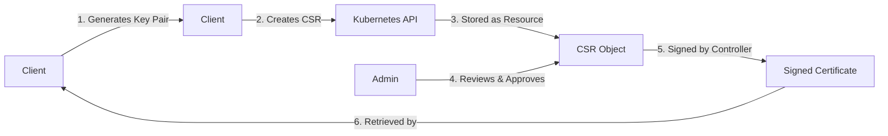

# Kubernetes CertificateSigningRequests

## Introduction

In Kubernetes, security is a critical concern, especially in production environments. One important aspect of Kubernetes security is managing certificates for authentication. Kubernetes uses X.509 certificates for authenticating API requests, and the `CertificateSigningRequest` (CSR) resource provides a mechanism to request and manage these certificates within the cluster.

This guide will walk you through what CSRs are, why they matter, and how to use them effectively in your Kubernetes security strategy.

## What is a CertificateSigningRequest?

A `CertificateSigningRequest` is a Kubernetes resource that allows a client to request a signed certificate from the Kubernetes API. It's part of the certificate lifecycle management in Kubernetes and plays a crucial role in the cluster's security.

Here's a simple explanation of how it works:

1. A user or system component generates a private key and a certificate signing request
2. This request is submitted to the Kubernetes API as a `CertificateSigningRequest` resource
3. An authorized approver reviews and approves the request
4. The Kubernetes controller manager signs the certificate
5. The signed certificate is made available to the requester



## Why Use CertificateSigningRequests?

CSRs in Kubernetes provide several benefits:

- **Security**: They allow for secure, certificate-based authentication
- **Automation**: They enable automated certificate provisioning and renewal
- **Auditability**: Certificate requests and approvals can be tracked and audited
- **Integration**: They work well with existing PKI (Public Key Infrastructure) systems

## Working with CertificateSigningRequests

Let's walk through the process of creating and managing CSRs in Kubernetes.

### Prerequisites

- `kubectl` installed and configured
- Access to a Kubernetes cluster
- Appropriate RBAC permissions to work with CSRs

### Step 1: Generate a Private Key and CSR

First, we need to generate a private key and create a certificate signing request. Let's create a key for a new user named "developer":

```bash
# Generate a private key
openssl genrsa -out developer.key 2048

# Create a certificate signing request
openssl req -new -key developer.key -out developer.csr -subj "/CN=developer/O=development"
```

### Step 2: Encode the CSR in Base64

To include the CSR in a Kubernetes resource, we need to encode it in base64:

```bash
# Encode the CSR
CSR_BASE64=$(cat developer.csr | base64 | tr -d '
')
```

### Step 3: Create a CertificateSigningRequest Resource

Now, we'll create a YAML file for our CertificateSigningRequest:

```yaml
apiVersion: certificates.k8s.io/v1
kind: CertificateSigningRequest
metadata:
  name: developer-csr
spec:
  request: ${CSR_BASE64}
  signerName: kubernetes.io/kube-apiserver-client
  expirationSeconds: 86400  # One day
  usages:
  - client auth
```

Let's create this resource:

```bash
# Create a CSR manifest (alternative to using environment variables)
cat <<EOF | kubectl apply -f -
apiVersion: certificates.k8s.io/v1
kind: CertificateSigningRequest
metadata:
  name: developer-csr
spec:
  request: $(cat developer.csr | base64 | tr -d '
')
  signerName: kubernetes.io/kube-apiserver-client
  expirationSeconds: 86400  # One day
  usages:
  - client auth
EOF
```

### Step 4: View Pending CSRs

We can check the status of our CSR:

```bash
kubectl get csr
```

Example output:

```
NAME            AGE   SIGNERNAME                            REQUESTOR          CONDITION
developer-csr   10s   kubernetes.io/kube-apiserver-client   kubernetes-admin   Pending
```

### Step 5: Approve the CSR

A cluster administrator needs to approve the CSR:

```bash
kubectl certificate approve developer-csr
```

Example output:

```
certificatesigningrequest.certificates.k8s.io/developer-csr approved
```

### Step 6: Get the Signed Certificate

After approval, we can retrieve the signed certificate:

```bash
kubectl get csr developer-csr -o jsonpath='{.status.certificate}' | base64 --decode > developer.crt
```

Now we have our signed certificate in `developer.crt`.

## Understanding the CSR Specification

Let's break down the key fields in a CertificateSigningRequest:

- **apiVersion**: `certificates.k8s.io/v1` (use this for Kubernetes 1.19+)
- **kind**: `CertificateSigningRequest`
- **metadata.name**: A unique name for the CSR
- **spec.request**: The base64-encoded CSR
- **spec.signerName**: Identifies which controller should sign the certificate
- **spec.expirationSeconds**: How long the certificate should be valid (optional)
- **spec.usages**: What the certificate can be used for

### Common signerNames

Here are some commonly used signerNames:

- `kubernetes.io/kube-apiserver-client`: For client certificates used to authenticate to the API server
- `kubernetes.io/kube-apiserver-client-kubelet`: For kubelet client certificates
- `kubernetes.io/kubelet-serving`: For kubelet serving certificates
- `kubernetes.io/legacy-unknown`: For backwards compatibility

### Common usages

Common values for the `usages` field include:

- `client auth`: For client authentication
- `server auth`: For server authentication
- `digital signature`: For signing operations
- `key encipherment`: For encrypting keys

## Real-World Applications

### 1. Setting Up Mutual TLS for Microservices

One common use case for CSRs is setting up mutual TLS authentication between microservices in your cluster.

```yaml
apiVersion: certificates.k8s.io/v1
kind: CertificateSigningRequest
metadata:
  name: service-a-csr
spec:
  request: ${CSR_BASE64}
  signerName: kubernetes.io/kube-apiserver-client
  usages:
  - client auth
  - server auth
```

### 2. Creating Certificates for New Team Members

When onboarding new team members, you can use CSRs to create their client certificates:

```yaml
apiVersion: certificates.k8s.io/v1
kind: CertificateSigningRequest
metadata:
  name: new-developer-csr
  annotations:
    team: "frontend"
    email: "dev@example.com"
spec:
  request: ${CSR_BASE64}
  signerName: kubernetes.io/kube-apiserver-client
  usages:
  - client auth
```

### 3. Automated Certificate Renewal

You can create a controller that monitors certificate expiration and automatically creates new CSRs:

```python
# Pseudocode for a certificate renewal controller
def check_certificates():
    certificates = list_all_certificates()
    for cert in certificates:
        if is_expiring_soon(cert):
            create_renewal_csr(cert)
            notify_administrators()
```

## Best Practices

When working with CSRs in Kubernetes, follow these best practices:

1. **Limit CSR Approvers**: Use RBAC to restrict who can approve CSRs
2. **Audit CSR Activities**: Enable auditing for all CSR operations
3. **Set Appropriate Lifetimes**: Don't make certificates valid for too long
4. **Use Descriptive Names**: Name CSRs clearly to identify their purpose
5. **Implement Automation**: Automate certificate rotation and renewal
6. **Validate CSR Contents**: Verify the details in CSRs before approving them

## Common Issues and Troubleshooting

### Certificate Not Found After Approval

If you can't retrieve a certificate after approval, check if:
- The CSR was actually approved (`kubectl get csr`)
- The controller manager is functioning properly
- The signer name is valid

### Permission Denied When Creating a CSR

If you receive a permission error, ensure you have the necessary RBAC permissions:

```yaml
kind: ClusterRole
apiVersion: rbac.authorization.k8s.io/v1
metadata:
  name: csr-creator
rules:
- apiGroups: ["certificates.k8s.io"]
  resources: ["certificatesigningrequests"]
  verbs: ["create", "get", "list", "watch"]
```

### Automating CSR Approval

For certain scenarios, you might want to automate CSR approvals. Here's a simple script example:

```bash
#!/bin/bash
# Warning: Only use automation for well-defined, secure scenarios

# Watch for CSRs with a specific label
kubectl get csr -l "auto-approve=true" -o json | jq -r '.items[] | select(.status.certificate == null) | .metadata.name' | xargs -r -I {} kubectl certificate approve {}
```

## Summary

Kubernetes CertificateSigningRequests provide a powerful mechanism for managing certificates within your cluster. They allow for secure authentication, automated certificate management, and integration with your existing security practices.

In this guide, we've covered:
- What CSRs are and why they're important
- How to create, review, and approve CSRs
- The structure and important fields of CSR resources
- Real-world applications of CSRs
- Best practices for working with certificates in Kubernetes

By properly managing certificates through CSRs, you can significantly enhance the security posture of your Kubernetes applications.

## Additional Resources

Here are some exercises to help you practice working with CSRs:

1. Create a CSR for a new service account and use the signed certificate to authenticate to the API server
2. Write a script that monitors CSRs and sends notifications when new ones are created
3. Implement a certificate rotation strategy for your application using CSRs

For more information, you can explore:
- The official Kubernetes documentation on Certificate Signing Requests
- The `certificates.k8s.io` API documentation
- Kubernetes security best practices guides