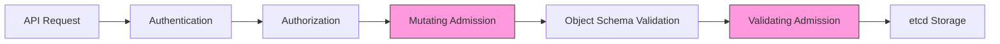

# Kubernetes Admission Controllers

## Introduction

Kubernetes Admission Controllers are plugins that govern and enforce how the Kubernetes API server processes requests. They act as gatekeepers that intercept requests to the Kubernetes API server before the persistence of the object, but after the request is authenticated and authorized.

Think of admission controllers like security guards at the entrance of a building. Before anyone enters, the guards check their credentials (authentication) and verify they have permission to enter (authorization). Then, before allowing them in, the guards might perform additional checks like inspecting bags or ensuring proper dress code (admission control).

## Why Admission Controllers Matter

In Kubernetes security, admission controllers provide a crucial layer of defense by allowing you to:

- Enforce security policies across your cluster
- Validate that resources meet specific requirements
- Modify resource requests to conform with cluster standards
- Prevent misconfigured workloads from being deployed
- Implement organizational governance and compliance requirements

## How Admission Controllers Work

Admission controllers process requests in two phases:

1. **Mutating Admission**: Controllers can modify the resource being requested
2. **Validating Admission**: Controllers can approve or reject the request based on specific rules



## Types of Admission Controllers

Kubernetes supports two types of admission controllers:

### 1. Built-in Admission Controllers

These are compiled into the `kube-apiserver` binary and can be enabled or disabled via the `--enable-admission-plugins` and `--disable-admission-plugins` flags.

Some common built-in admission controllers include:

- **PodSecurityPolicy**: Validates pod specifications against security policies
- **ResourceQuota**: Enforces resource consumption limits per namespace
- **LimitRanger**: Sets default resource requests and limits for pods
- **NamespaceLifecycle**: Prevents creation of resources in terminating namespaces
- **ServiceAccount**: Automates service account management for pods

### 2. Dynamic Admission Controllers

Also known as admission webhooks, these are external services that can be developed and deployed by cluster administrators:

- **ValidatingWebhookConfiguration**: For validation without modification
- **MutatingWebhookConfiguration**: For modifying and validating requests

## Viewing Enabled Admission Controllers

To see which admission controllers are currently enabled in your cluster:

```bash
kubectl exec -it kube-apiserver-minikube -n kube-system -- kube-apiserver -h | grep enable-admission-plugins
```

Output (example):
```
--enable-admission-plugins strings   admission plugins that should be enabled in addition to default enabled ones (NamespaceLifecycle, LimitRanger, ServiceAccount, TaintNodesByCondition, Priority, DefaultTolerationSeconds, DefaultStorageClass, StorageObjectInUseProtection, PersistentVolumeClaimResize, RuntimeClass, CertificateApproval, CertificateSigning, ClusterTrustBundleAttest, CertificateSubjectRestriction, DefaultIngressClass, MutatingAdmissionWebhook, ValidatingAdmissionWebhook, ResourceQuota)
```

## Key Built-in Admission Controllers for Security

Let's examine some important admission controllers that enhance security:

### PodSecurityPolicy

> Note: PodSecurityPolicy has been deprecated in Kubernetes 1.21 and removed in 1.25. Its functionality is now replaced by Pod Security Admission.

The PodSecurityPolicy admission controller enforces security-related requirements for pods:

```yaml
apiVersion: policy/v1beta1
kind: PodSecurityPolicy
metadata:
  name: restricted
spec:
  privileged: false
  allowPrivilegeEscalation: false
  requiredDropCapabilities:
    - ALL
  volumes:
    - 'configMap'
    - 'emptyDir'
    - 'persistentVolumeClaim'
  hostNetwork: false
  hostIPC: false
  hostPID: false
  runAsUser:
    rule: 'MustRunAsNonRoot'
  seLinux:
    rule: 'RunAsAny'
  supplementalGroups:
    rule: 'MustRunAs'
    ranges:
      - min: 1
        max: 65535
  fsGroup:
    rule: 'MustRunAs'
    ranges:
      - min: 1
        max: 65535
  readOnlyRootFilesystem: true
```

### Pod Security Admission

The replacement for PodSecurityPolicy uses predefined security profiles:

```yaml
apiVersion: v1
kind: Namespace
metadata:
  name: secure-namespace
  labels:
    pod-security.kubernetes.io/enforce: restricted
    pod-security.kubernetes.io/audit: restricted
    pod-security.kubernetes.io/warn: restricted
```

### OPA Gatekeeper

While not a built-in admission controller, OPA Gatekeeper is a popular dynamic admission controller that uses the Open Policy Agent for policy enforcement:

```yaml
apiVersion: templates.gatekeeper.sh/v1
kind: ConstraintTemplate
metadata:
  name: k8srequiredlabels
spec:
  crd:
    spec:
      names:
        kind: K8sRequiredLabels
      validation:
        openAPIV3Schema:
          properties:
            labels:
              type: array
              items: string
  targets:
    - target: admission.k8s.gatekeeper.sh
      rego: |
        package k8srequiredlabels
        
        violation[{"msg": msg, "details": {"missing_labels": missing}}] {
          provided := {label | input.review.object.metadata.labels[label]}
          required := {label | label := input.parameters.labels[_]}
          missing := required - provided
          count(missing) > 0
          msg := sprintf("you must provide labels: %v", [missing])
        }
```

## Creating Your Own Dynamic Admission Controller

Let's build a simple validating webhook in Go that ensures all pods have a `team` label:

```go
package main

import (
    "encoding/json"
    "fmt"
    "io/ioutil"
    "log"
    "net/http"

    admission "k8s.io/api/admission/v1"
    corev1 "k8s.io/api/core/v1"
    metav1 "k8s.io/apimachinery/pkg/apis/meta/v1"
    "k8s.io/apimachinery/pkg/runtime"
    "k8s.io/apimachinery/pkg/runtime/serializer"
)

var (
    deserializer = serializer.NewCodecFactory(runtime.NewScheme()).UniversalDeserializer()
)

// WebhookServer contains server configuration
type WebhookServer struct {
    server *http.Server
}

// HandleValidate handles validation webhook requests
func (ws *WebhookServer) HandleValidate(w http.ResponseWriter, r *http.Request) {
    var body []byte
    if r.Body != nil {
        if data, err := ioutil.ReadAll(r.Body); err == nil {
            body = data
        }
    }

    // Verify the content type
    contentType := r.Header.Get("Content-Type")
    if contentType != "application/json" {
        log.Printf("Content-Type=%s, expected application/json", contentType)
        http.Error(w, "invalid Content-Type, expected `application/json`", http.StatusUnsupportedMediaType)
        return
    }

    // Parse AdmissionReview request
    var admissionReviewReq admission.AdmissionReview
    if _, _, err := deserializer.Decode(body, nil, &admissionReviewReq); err != nil {
        log.Printf("Can't decode body: %v", err)
        http.Error(w, "can't decode body", http.StatusBadRequest)
        return
    }

    // Get pod object
    var pod corev1.Pod
    err := json.Unmarshal(admissionReviewReq.Request.Object.Raw, &pod)
    if err != nil {
        log.Printf("Could not unmarshal pod JSON: %v", err)
        http.Error(w, "could not unmarshal pod JSON", http.StatusBadRequest)
        return
    }

    // Create response
    admissionReviewResponse := admission.AdmissionReview{
        TypeMeta: metav1.TypeMeta{
            Kind:       "AdmissionReview",
            APIVersion: "admission.k8s.io/v1",
        },
        Response: &admission.AdmissionResponse{
            UID: admissionReviewReq.Request.UID,
        },
    }

    // Validate that pod has a team label
    _, hasTeamLabel := pod.Labels["team"]
    if !hasTeamLabel {
        admissionReviewResponse.Response.Allowed = false
        admissionReviewResponse.Response.Result = &metav1.Status{
            Message: "Pod must have a 'team' label",
        }
    } else {
        admissionReviewResponse.Response.Allowed = true
    }

    // Return response
    resp, err := json.Marshal(admissionReviewResponse)
    if err != nil {
        log.Printf("Could not marshal response: %v", err)
        http.Error(w, "could not marshal response", http.StatusInternalServerError)
        return
    }
    log.Printf("Ready to write response...")
    if _, err := w.Write(resp); err != nil {
        log.Printf("Could not write response: %v", err)
        http.Error(w, "could not write response", http.StatusInternalServerError)
    }
}

func main() {
    ws := &WebhookServer{
        server: &http.Server{
            Addr: ":8443",
        },
    }

    mux := http.NewServeMux()
    mux.HandleFunc("/validate", ws.HandleValidate)
    ws.server.Handler = mux

    log.Printf("Starting webhook server...")
    if err := ws.server.ListenAndServeTLS("/etc/webhook/certs/tls.crt", "/etc/webhook/certs/tls.key"); err != nil {
        log.Fatalf("Failed to listen and serve: %v", err)
    }
}
```

### Registering Your Webhook

After deploying your admission webhook service, register it with the Kubernetes API:

```yaml
apiVersion: admissionregistration.k8s.io/v1
kind: ValidatingWebhookConfiguration
metadata:
  name: pod-label-validator
webhooks:
  - name: pod-label.k8s.io
    sideEffects: None
    admissionReviewVersions: ["v1"]
    clientConfig:
      service:
        name: pod-label-validator
        namespace: default
        path: "/validate"
      caBundle: ${CA_BUNDLE}
    rules:
      - operations: ["CREATE", "UPDATE"]
        apiGroups: [""]
        apiVersions: ["v1"]
        resources: ["pods"]
    failurePolicy: Fail
```

## Implementing OPA Gatekeeper

OPA Gatekeeper is a popular solution for implementing policy-as-code in Kubernetes:

1. Install Gatekeeper:

```bash
kubectl apply -f https://raw.githubusercontent.com/open-policy-agent/gatekeeper/release-3.7/deploy/gatekeeper.yaml
```

2. Create a constraint template:

```yaml
apiVersion: templates.gatekeeper.sh/v1
kind: ConstraintTemplate
metadata:
  name: requireprobes
spec:
  crd:
    spec:
      names:
        kind: RequireProbes
  targets:
    - target: admission.k8s.gatekeeper.sh
      rego: |
        package requireprobes
        
        violation[{"msg": msg}] {
          container := input.review.object.spec.containers[_]
          not container.livenessProbe
          msg := sprintf("Container %v must have a liveness probe", [container.name])
        }
        
        violation[{"msg": msg}] {
          container := input.review.object.spec.containers[_]
          not container.readinessProbe
          msg := sprintf("Container %v must have a readiness probe", [container.name])
        }
```

3. Apply the constraint:

```yaml
apiVersion: constraints.gatekeeper.sh/v1beta1
kind: RequireProbes
metadata:
  name: require-probes
spec:
  match:
    kinds:
      - apiGroups: [""]
        kinds: ["Pod"]
    namespaces:
      - "production"
```

## Best Practices for Admission Controllers

1. **Layer your defenses**: Use both built-in and dynamic admission controllers
2. **Start with audit mode**: Before enforcing policies, monitor violations without blocking
3. **Create targeted policies**: Apply constraints only to namespaces that need them
4. **Document your policies**: Ensure developers understand requirements
5. **Monitor performance**: Admission controllers can impact API server latency
6. **Plan for failure**: Configure appropriate `failurePolicy` settings
7. **Test thoroughly**: Validate policies before applying them to production

## Troubleshooting Admission Controllers

If you're having issues with admission controllers:

1. Check if the admission controller is enabled:
```bash
kubectl exec -it kube-apiserver-minikube -n kube-system -- kube-apiserver -h | grep enable-admission-plugins
```

2. Verify the webhook configuration:
```bash
kubectl get validatingwebhookconfigurations
kubectl get mutatingwebhookconfigurations
```

3. Check webhook logs:
```bash
kubectl logs -n mynamespace -l app=my-webhook-service
```

4. Try creating a test resource with detailed output:
```bash
kubectl apply -f test-pod.yaml --v=8
```

## Summary

Kubernetes Admission Controllers provide a powerful mechanism for enforcing security policies and governance in your cluster. They act as gatekeepers that can validate and modify resources before they are persisted to etcd.

Key takeaways:
- Admission controllers operate after authentication and authorization
- They come in two types: built-in and dynamic (webhooks)
- They can both validate and mutate resources
- They're essential for implementing security policies at scale
- Tools like OPA Gatekeeper make policy-as-code implementation easier

By leveraging admission controllers effectively, you can ensure your Kubernetes clusters remain secure, compliant, and consistent with your organization's policies.

## Additional Resources

To deepen your understanding of Kubernetes Admission Controllers:

- Experiment with different built-in admission controllers
- Implement a simple webhook in your development cluster
- Try OPA Gatekeeper with various policy templates
- Explore policy enforcement across multiple namespaces

## Practice Exercises

1. Enable the `PodSecurityPolicy` (or Pod Security Admission in newer versions) and create a policy that prevents privileged containers
2. Build a mutating webhook that adds resource limits to pods without them
3. Create a validating webhook that enforces naming conventions for your resources
4. Implement OPA Gatekeeper and write a constraint that requires specific labels on all deployments
5. Configure a webhook that validates pod image sources to ensure they come from approved registries