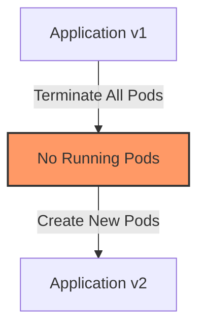
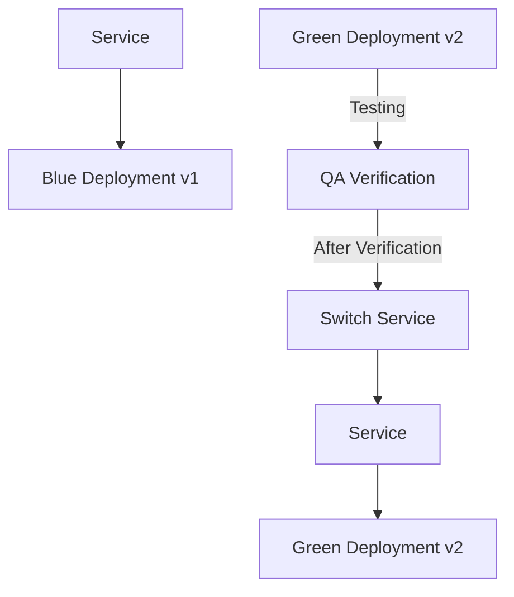
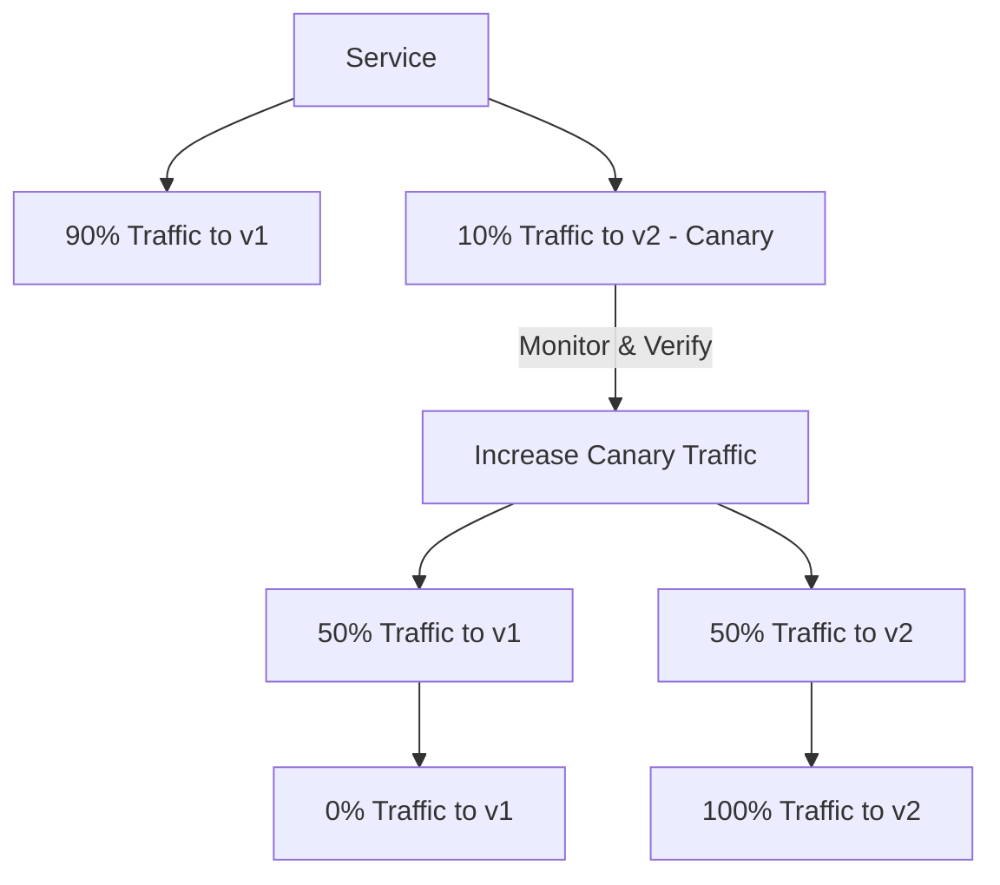
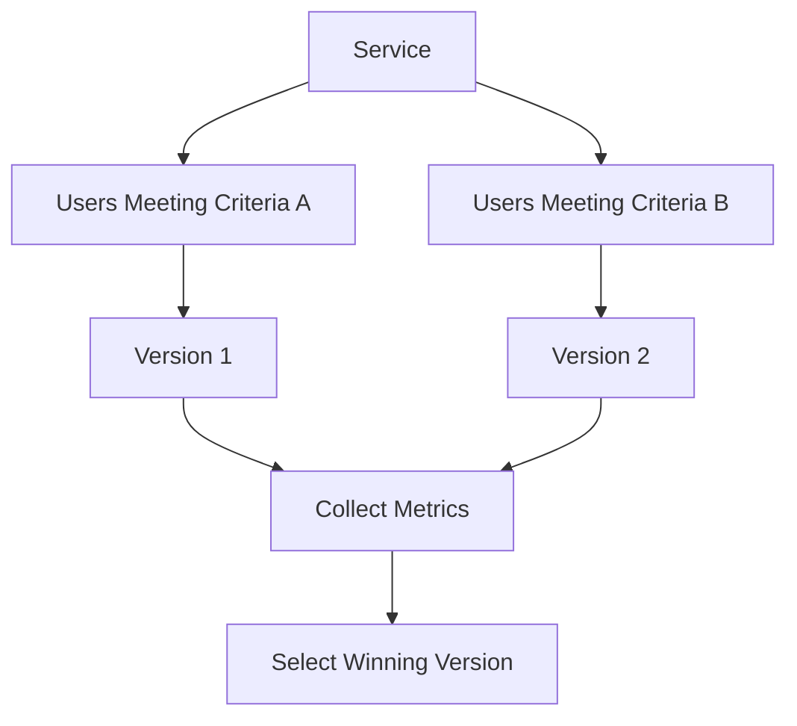
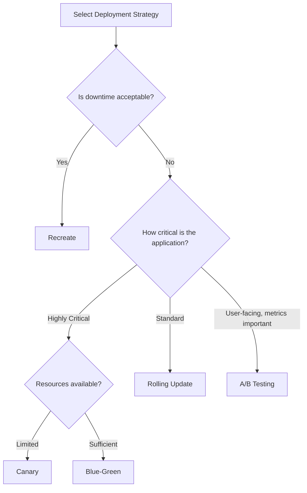

# Kubernetes Strategies

## Introduction

Deployment strategies in Kubernetes determine how your application updates are rolled out to your cluster. Choosing the right deployment strategy is crucial for maintaining application availability, ensuring smooth updates, and minimizing downtime. In this guide, we'll explore various Kubernetes deployment strategies, their advantages, and when to use each one.

As containerized applications evolve, you need reliable methods to deploy new versions while maintaining service reliability. Kubernetes offers several built-in and custom deployment strategies to address different requirements around risk management, resource constraints, and business needs.

## Understanding Deployment Strategies

Deployment strategies define the process of replacing old instances of your application with new ones. Let's explore the most common strategies:

### 1. Recreate Strategy

The Recreate strategy is the simplest approach, where all existing pods are terminated before new ones are created.



#### How It Works

1. Terminate all running instances of the application
2. Once all instances are terminated, deploy the new version

#### Example YAML Configuration

```yaml
apiVersion: apps/v1
kind: Deployment
metadata:
  name: example-recreate
spec:
  replicas: 3
  strategy:
    type: Recreate
  selector:
    matchLabels:
      app: example
  template:
    metadata:
      labels:
        app: example
    spec:
      containers:
      - name: app
        image: example/app:v2
        ports:
        - containerPort: 8080
```

#### When to Use

- Development or staging environments
- When your application doesn't support running multiple versions simultaneously
- When downtime is acceptable

#### Advantages and Disadvantages

**Advantages:**
- Simple implementation
- Ensures clean state between versions
- No version overlap

**Disadvantages:**
- Causes downtime
- No gradual rollout
- Not suitable for production critical applications

### 2. Rolling Update Strategy

The Rolling Update strategy gradually replaces pods with new versions, maintaining availability throughout the update process.


#### How It Works

1. Create a new pod with the updated version
2. Wait for the pod to become ready (passing readiness probes)
3. Direct traffic to the new pod
4. Remove an old pod
5. Repeat until all pods are updated

#### Example YAML Configuration

```yaml
apiVersion: apps/v1
kind: Deployment
metadata:
  name: example-rolling
spec:
  replicas: 4
  strategy:
    type: RollingUpdate
    rollingUpdate:
      maxUnavailable: 25%
      maxSurge: 25%
  selector:
    matchLabels:
      app: example
  template:
    metadata:
      labels:
        app: example
    spec:
      containers:
      - name: app
        image: example/app:v2
        ports:
        - containerPort: 8080
        readinessProbe:
          httpGet:
            path: /health
            port: 8080
          initialDelaySeconds: 5
          periodSeconds: 10
```

#### Key Parameters

- `maxUnavailable`: Maximum number of pods that can be unavailable during the update
- `maxSurge`: Maximum number of pods that can be created over the desired number of pods

#### When to Use

- Production environments where downtime is not acceptable
- Applications that support multiple versions running simultaneously

#### Advantages and Disadvantages

**Advantages:**
- Zero downtime deployment
- Control over the rate of rollout
- Automatic rollout and health checking

**Disadvantages:**
- Multiple versions running simultaneously
- Slower than recreate strategy
- Requires careful configuration of health checks

### 3. Blue-Green Deployment

Blue-Green deployment maintains two identical environments, switching traffic from the old (blue) environment to the new (green) environment all at once.



#### How It Works

1. Deploy a new version (green) alongside the current version (blue)
2. Test the green environment
3. Switch traffic from blue to green
4. Keep blue deployment for potential rollback
5. Eventually decommission the blue deployment

#### Example Implementation

Create two deployments:

```yaml
# Blue deployment (current version)
apiVersion: apps/v1
kind: Deployment
metadata:
  name: app-blue
spec:
  replicas: 3
  selector:
    matchLabels:
      app: example
      version: blue
  template:
    metadata:
      labels:
        app: example
        version: blue
    spec:
      containers:
      - name: app
        image: example/app:v1
        ports:
        - containerPort: 8080
---
# Green deployment (new version)
apiVersion: apps/v1
kind: Deployment
metadata:
  name: app-green
spec:
  replicas: 3
  selector:
    matchLabels:
      app: example
      version: green
  template:
    metadata:
      labels:
        app: example
        version: green
    spec:
      containers:
      - name: app
        image: example/app:v2
        ports:
        - containerPort: 8080
```

Initially, the service routes to the blue deployment:

```yaml
apiVersion: v1
kind: Service
metadata:
  name: app-service
spec:
  selector:
    app: example
    version: blue
  ports:
  - port: 80
    targetPort: 8080
```

To switch to the green deployment, update the service selector:

```yaml
apiVersion: v1
kind: Service
metadata:
  name: app-service
spec:
  selector:
    app: example
    version: green
  ports:
  - port: 80
    targetPort: 8080
```

#### When to Use

- Production environments requiring predictable cutover
- Applications with critical transactions
- When extensive testing is needed before releasing to users

#### Advantages and Disadvantages

**Advantages:**
- Instant rollout/rollback
- Complete testing possible in the new environment
- Minimal risk - if green fails, traffic stays on blue

**Disadvantages:**
- Resource intensive (requires double the resources)
- Complex setup
- More manual intervention required

### 4. Canary Deployment

Canary deployment involves releasing a new version to a small subset of users before rolling it out to the entire user base.



#### How It Works

1. Deploy a small number of instances with the new version
2. Direct a small percentage of traffic to these new instances
3. Monitor for issues
4. Gradually increase traffic to the new version
5. Complete the rollout when confident

#### Example Implementation Using Kubernetes and Istio

First, deploy both versions:

```yaml
apiVersion: apps/v1
kind: Deployment
metadata:
  name: app-v1
spec:
  replicas: 9
  selector:
    matchLabels:
      app: example
      version: v1
  template:
    metadata:
      labels:
        app: example
        version: v1
    spec:
      containers:
      - name: app
        image: example/app:v1
---
apiVersion: apps/v1
kind: Deployment
metadata:
  name: app-v2
spec:
  replicas: 1
  selector:
    matchLabels:
      app: example
      version: v2
  template:
    metadata:
      labels:
        app: example
        version: v2
    spec:
      containers:
      - name: app
        image: example/app:v2
```

Then, use Istio to control traffic distribution:

```yaml
apiVersion: networking.istio.io/v1alpha3
kind: VirtualService
metadata:
  name: app-route
spec:
  hosts:
  - example.com
  http:
  - route:
    - destination:
        host: app-service
        subset: v1
      weight: 90
    - destination:
        host: app-service
        subset: v2
      weight: 10
```

#### When to Use

- Production environments with real user traffic
- New features that need testing with real users
- Critical applications where risk must be minimized

#### Advantages and Disadvantages

**Advantages:**
- Risk mitigation - only affects a small portion of users
- Gradual rollout with real user feedback
- Easier to detect and address issues

**Disadvantages:**
- Requires additional infrastructure for traffic splitting
- Monitoring complexity
- More complex to set up than basic strategies

### 5. A/B Testing Deployment

A/B testing is similar to canary deployment but focuses on user experience or business metrics rather than just technical stability.



#### How It Works

1. Deploy two versions of your application
2. Route users to different versions based on specific criteria (e.g., geographical location, user agent)
3. Collect metrics to determine which version performs better
4. Roll out the winning version to all users

#### Example Implementation with Istio

```yaml
apiVersion: networking.istio.io/v1alpha3
kind: VirtualService
metadata:
  name: app-route
spec:
  hosts:
  - example.com
  http:
  - match:
    - headers:
        user-agent:
          regex: ".*Mobile.*"
    route:
    - destination:
        host: app-service
        subset: v2
  - route:
    - destination:
        host: app-service
        subset: v1
```

#### When to Use

- Testing UI/UX changes
- Feature comparison
- Business metric optimization (conversion rates, engagement)

#### Advantages and Disadvantages

**Advantages:**
- Data-driven decisions
- Targeted user segmentation
- Business metric focus

**Disadvantages:**
- Complex infrastructure requirements
- Requires sophisticated monitoring
- May need specialized tools beyond basic Kubernetes

## Implementation Considerations

### Health Checks

Proper health checks are crucial for any deployment strategy. Kubernetes uses two types of health probes:

1. **Readiness Probe**: Determines if a pod can receive traffic
2. **Liveness Probe**: Determines if a pod should be restarted

Example of probe configuration:

```yaml
readinessProbe:
  httpGet:
    path: /health
    port: 8080
  initialDelaySeconds: 10
  periodSeconds: 5
  failureThreshold: 3
livenessProbe:
  httpGet:
    path: /health
    port: 8080
  initialDelaySeconds: 15
  periodSeconds: 20
```

### Resource Management

Ensure you have sufficient cluster resources, especially for strategies that require running multiple versions simultaneously (like Blue-Green).

```yaml
resources:
  requests:
    memory: "128Mi"
    cpu: "100m"
  limits:
    memory: "256Mi"
    cpu: "200m"
```

### Rollback Strategy

Always plan for rollbacks in case deployments encounter issues. Kubernetes allows quick rollback with:

```bash
kubectl rollout undo deployment/your-deployment
```

## Real-World Example: E-commerce Application Deployment

Let's walk through deploying a microservice-based e-commerce application:

### Scenario

You need to update the product catalog service that handles product listings and searches.

### Strategy Selection

For the catalog service, we'll use a canary deployment to minimize risk while introducing a significant search algorithm improvement.

### Implementation

1. First, deploy both versions with 90/10 traffic split:

```yaml
apiVersion: apps/v1
kind: Deployment
metadata:
  name: catalog-v1
spec:
  replicas: 9
  selector:
    matchLabels:
      app: catalog
      version: v1
  template:
    metadata:
      labels:
        app: catalog
        version: v1
    spec:
      containers:
      - name: catalog
        image: ecommerce/catalog:v1
---
apiVersion: apps/v1
kind: Deployment
metadata:
  name: catalog-v2
spec:
  replicas: 1
  selector:
    matchLabels:
      app: catalog
      version: v2
  template:
    metadata:
      labels:
        app: catalog
        version: v2
    spec:
      containers:
      - name: catalog
        image: ecommerce/catalog:v2
```

2. Create a service:

```yaml
apiVersion: v1
kind: Service
metadata:
  name: catalog-service
spec:
  selector:
    app: catalog
  ports:
  - port: 80
    targetPort: 8080
```

3. Use Istio for traffic splitting:

```yaml
apiVersion: networking.istio.io/v1alpha3
kind: VirtualService
metadata:
  name: catalog-route
spec:
  hosts:
  - catalog-service
  http:
  - route:
    - destination:
        host: catalog-service
        subset: v1
      weight: 90
    - destination:
        host: catalog-service
        subset: v2
      weight: 10
---
apiVersion: networking.istio.io/v1alpha3
kind: DestinationRule
metadata:
  name: catalog-destinations
spec:
  host: catalog-service
  subsets:
  - name: v1
    labels:
      version: v1
  - name: v2
    labels:
      version: v2
```

4. Monitor metrics for both versions:
   - Response time
   - Error rates
   - Search relevance scores
   - User engagement metrics

5. Gradually increase traffic to v2 as confidence builds:

```yaml
# Update weights to 50/50
apiVersion: networking.istio.io/v1alpha3
kind: VirtualService
metadata:
  name: catalog-route
spec:
  hosts:
  - catalog-service
  http:
  - route:
    - destination:
        host: catalog-service
        subset: v1
      weight: 50
    - destination:
        host: catalog-service
        subset: v2
      weight: 50
```

6. Finally, shift 100% traffic to v2 once confident:

```yaml
# Update weights to 0/100
apiVersion: networking.istio.io/v1alpha3
kind: VirtualService
metadata:
  name: catalog-route
spec:
  hosts:
  - catalog-service
  http:
  - route:
    - destination:
        host: catalog-service
        subset: v2
      weight: 100
```

## Strategy Comparison and Selection Guide

| Strategy | Downtime | Resource Usage | Complexity | Risk Level | Use Case |
|----------|----------|---------------|------------|------------|----------|
| Recreate | High | Low | Low | High | Development, staging, batch systems |
| Rolling Update | None | Medium | Low | Medium | General production workloads |
| Blue-Green | None | High | Medium | Low | Critical systems, transaction-heavy applications |
| Canary | None | Medium-High | High | Very Low | High-traffic production services, algorithm changes |
| A/B Testing | None | Medium-High | Very High | Low | UI changes, feature optimization |

### Decision Tree



## Summary

Kubernetes offers various deployment strategies to match different operational requirements and risk profiles:

1. **Recreate**: Simple but has downtime
2. **Rolling Update**: No downtime, gradual rollout
3. **Blue-Green**: Full environment swap with instant rollback
4. **Canary**: Gradual exposure to minimize risk
5. **A/B Testing**: User-segmented deployments for feature testing

The right choice depends on your application's requirements, available resources, and business needs. Most organizations use a combination of these strategies for different services based on criticality and characteristics.

## Exercises and Next Steps

### Exercises

1. Configure a rolling update deployment for a simple web application and experiment with different `maxSurge` and `maxUnavailable` settings.
2. Implement a blue-green deployment using a service switch for a stateless application.
3. Build a canary deployment pipeline using Istio, gradually increasing traffic to a new version.
4. Create a deployment plan for a microservice architecture, selecting appropriate strategies for each service.

### Additional Resources

- Official Kubernetes documentation on [Deployments](https://kubernetes.io/docs/concepts/workloads/controllers/deployment/)
- Istio documentation on [Traffic Management](https://istio.io/latest/docs/concepts/traffic-management/)
- [Kubernetes Patterns](https://www.oreilly.com/library/view/kubernetes-patterns/9781492050278/) book
- [Kubernetes in Action](https://www.manning.com/books/kubernetes-in-action) book
- Join the Kubernetes community on [Slack](https://kubernetes.slack.com/)

Remember, the most effective deployment strategy is one that balances your technical requirements, business needs, and operational capabilities. Start simple and evolve your approach as your Kubernetes expertise grows.