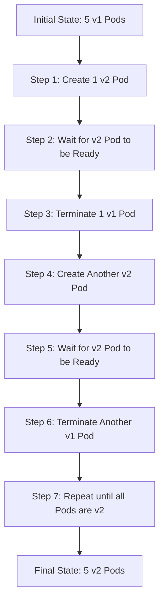

# Kubernetes RollingUpdate

## Introduction

When running applications in a production environment, you need a way to update your applications without causing downtime. This is where Kubernetes RollingUpdate comes into play. A RollingUpdate is a deployment strategy that gradually replaces pods of the previous version of an application with pods of the new version, ensuring your application remains available during the update process.

In this guide, we'll explore how RollingUpdate works in Kubernetes, why it's beneficial, and how to implement it in your own deployments.

## What is a RollingUpdate?

A RollingUpdate is Kubernetes' default deployment strategy that updates pods in a controlled manner. When you apply a new version of your application, Kubernetes doesn't replace all pods at once. Instead, it:

1. Creates new pods with the updated version
2. Waits until they're ready (passing health checks)
3. Gradually terminates old pods

This ensures that your application remains available throughout the update process, providing zero-downtime deployments.

## Why Use RollingUpdates?

RollingUpdates offer several advantages:

- **Zero-downtime deployments**: Your application remains available during updates
- **Gradual rollout**: Changes are implemented incrementally, making it easier to catch issues
- **Automatic rollback**: If new pods fail to start, Kubernetes won't proceed with the update
- **Traffic control**: You can control how many pods can be updated simultaneously

## RollingUpdate Configuration

In Kubernetes, RollingUpdate behavior is controlled by two key parameters:

- **maxUnavailable**: The maximum number of pods that can be unavailable during the update
- **maxSurge**: The maximum number of pods that can be created over the desired number of pods

Let's see how to configure these in a Deployment manifest:

```yaml
apiVersion: apps/v1
kind: Deployment
metadata:
  name: example-app
spec:
  replicas: 5
  strategy:
    type: RollingUpdate
    rollingUpdate:
      maxSurge: 1
      maxUnavailable: 1
  selector:
    matchLabels:
      app: example-app
  template:
    metadata:
      labels:
        app: example-app
    spec:
      containers:
      - name: example-app
        image: example-app:1.0
        ports:
        - containerPort: 8080
```

In this example:

- `maxSurge: 1` means Kubernetes can create at most 1 extra pod over the desired count (so 6 total pods during the update)
- `maxUnavailable: 1` means at most 1 pod can be unavailable during the update

You can specify these values as absolute numbers or percentages (e.g., `25%`).

## How RollingUpdate Works: Step by Step

Let's visualize how a RollingUpdate works with a 5-replica deployment:



This gradual replacement ensures that:

1. The application remains available throughout the update
2. Any issues with the new version are detected early
3. The system maintains stability during transitions

## Real-World Example: Updating a Web Application

Let's walk through a practical example of updating a web application from version 1.0 to 2.0 using RollingUpdate.

### Initial Deployment (Version 1.0):

```yaml
apiVersion: apps/v1
kind: Deployment
metadata:
  name: web-app
spec:
  replicas: 4
  strategy:
    type: RollingUpdate
    rollingUpdate:
      maxSurge: 1
      maxUnavailable: 1
  selector:
    matchLabels:
      app: web-app
  template:
    metadata:
      labels:
        app: web-app
        version: "1.0"
    spec:
      containers:
      - name: web-app
        image: mycompany/web-app:1.0
        ports:
        - containerPort: 80
        readinessProbe:
          httpGet:
            path: /health
            port: 80
          initialDelaySeconds: 5
          periodSeconds: 5
```

### Updating to Version 2.0:

To update the application, you would modify the YAML file to use the new image version and apply it:

```yaml
apiVersion: apps/v1
kind: Deployment
metadata:
  name: web-app
spec:
  replicas: 4
  strategy:
    type: RollingUpdate
    rollingUpdate:
      maxSurge: 1
      maxUnavailable: 1
  selector:
    matchLabels:
      app: web-app
  template:
    metadata:
      labels:
        app: web-app
        version: "2.0"
    spec:
      containers:
      - name: web-app
        image: mycompany/web-app:2.0
        ports:
        - containerPort: 80
        readinessProbe:
          httpGet:
            path: /health
            port: 80
          initialDelaySeconds: 5
          periodSeconds: 5
```

Apply the updated configuration:

```bash
kubectl apply -f deployment.yaml
```

### Monitoring the Update:

You can watch the progress of your rolling update using:

```bash
kubectl rollout status deployment/web-app
```

The output would look like:

```
Waiting for deployment "web-app" rollout to finish: 1 out of 4 new replicas have been updated...
Waiting for deployment "web-app" rollout to finish: 1 out of 4 new replicas have been updated...
Waiting for deployment "web-app" rollout to finish: 2 out of 4 new replicas have been updated...
Waiting for deployment "web-app" rollout to finish: 2 out of 4 new replicas have been updated...
Waiting for deployment "web-app" rollout to finish: 3 out of 4 new replicas have been updated...
Waiting for deployment "web-app" rollout to finish: 3 out of 4 new replicas have been updated...
Waiting for deployment "web-app" rollout to finish: 3 out of 4 new replicas have been updated...
Waiting for deployment "web-app" rollout to finish: 4 out of 4 new replicas have been updated...
deployment "web-app" successfully rolled out
```

## Rollback: When Things Go Wrong

One of the powerful features of Kubernetes Deployments is the ability to roll back if a deployment doesn't go as planned.

### Checking Deployment History:

```bash
kubectl rollout history deployment/web-app
```

Output:

```
deployments "web-app"
REVISION  CHANGE-CAUSE
1         <none>
2         <none>
```

### Rolling Back to a Previous Version:

```bash
kubectl rollout undo deployment/web-app
```

Or to a specific revision:

```bash
kubectl rollout undo deployment/web-app --to-revision=1
```

## Best Practices for RollingUpdates

1. **Always include readiness probes**: Ensure your application has proper readiness probes so Kubernetes knows when a new pod is ready to serve traffic.

2. **Use resource limits**: Set appropriate CPU and memory limits to ensure your application has the resources it needs during the update.

3. **Configure appropriate maxSurge and maxUnavailable**: Adjust these values based on your application's requirements:
   - For critical applications, use lower `maxUnavailable` values
   - For faster deployments, increase `maxSurge`

4. **Use deployment annotations**: Add annotations like `kubernetes.io/change-cause` to document what changed in each deployment:

```yaml
metadata:
  annotations:
    kubernetes.io/change-cause: "Update to version 2.0 with new login feature"
```

5. **Consider canary deployments**: For critical applications, consider a canary deployment strategy before doing a full RollingUpdate.

## RollingUpdate vs. Other Deployment Strategies

Kubernetes supports several deployment strategies:

1. **RollingUpdate** (Default): Updates pods gradually, as we've been discussing
2. **Recreate**: Terminates all existing pods before creating new ones (causes downtime)
3. **Blue/Green**: Deploys new version alongside old version, then switches traffic
4. **Canary**: Routes a small percentage of traffic to the new version first

Here's a comparison:

| Strategy | Downtime | Resource Usage | Rollback | Complexity |
|----------|----------|---------------|----------|------------|
| RollingUpdate | No | Medium | Automatic | Low |
| Recreate | Yes | Low | Manual | Very Low |
| Blue/Green | No | High | Quick | Medium |
| Canary | No | Medium | Complex | High |

## Summary

Kubernetes RollingUpdate provides a powerful way to update your applications with zero downtime. By gradually replacing old pods with new ones, you can ensure your services remain available during the update process. The `maxSurge` and `maxUnavailable` parameters give you fine-grained control over the update process.

Key takeaways:

- RollingUpdate is Kubernetes' default deployment strategy
- It provides zero-downtime deployments
- Configure `maxSurge` and `maxUnavailable` to control the update pace
- Always include readiness probes for smooth transitions
- Use `kubectl rollout` commands to monitor and manage updates

## Exercises

1. Create a simple web application deployment with 3 replicas and configure a RollingUpdate strategy.
2. Update the application to a new version and monitor the rollout process.
3. Intentionally deploy a broken version and practice a rollback.
4. Experiment with different `maxSurge` and `maxUnavailable` values and observe how they affect the update process.
5. Implement a readiness probe for your application and see how it impacts the RollingUpdate behavior.

## Additional Resources

- [Kubernetes Deployments Documentation](https://kubernetes.io/docs/concepts/workloads/controllers/deployment/)
- [Kubernetes Rolling Update Strategy](https://kubernetes.io/docs/tutorials/kubernetes-basics/update/update-intro/)
- [Kubernetes Rollout Commands](https://kubernetes.io/docs/reference/generated/kubectl/kubectl-commands#rollout)
- [Best Practices for Kubernetes Deployments](https://kubernetes.io/docs/concepts/configuration/overview/)