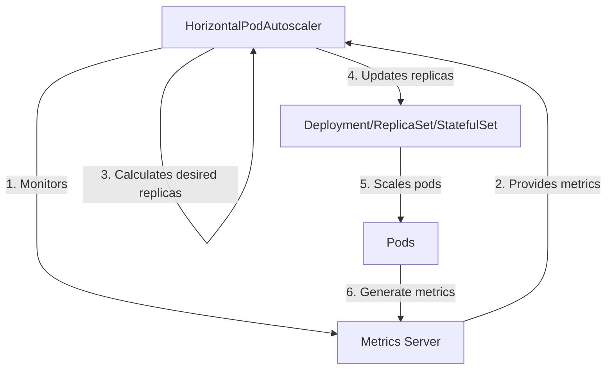

# Kubernetes HorizontalPodAutoscaler

## Introduction

The HorizontalPodAutoscaler (HPA) is a Kubernetes resource that automatically scales the number of pod replicas in a deployment, replicaset, or statefulset based on observed resource utilization. This helps ensure your application has enough resources to handle varying workloads while optimizing cluster resource usage.

Think of HPA as an automatic adjustment system that:
- Adds more pod instances when your application is under heavy load
- Removes unnecessary pod instances when demand decreases
- Helps maintain performance without manual intervention

In this guide, we'll explore how HPA works, how to set it up, and see real-world examples of its application.

## How HorizontalPodAutoscaler Works

HPA operates on a simple feedback loop:

1. It continuously monitors the specified metrics (typically CPU or memory usage)
2. It calculates the desired number of replicas based on current usage vs target usage
3. It adjusts the number of replicas to match the calculated value



## Prerequisites

To use HPA effectively, your Kubernetes cluster needs:

1. A metrics server installed (provides resource metrics like CPU and memory)
2. Resources and requests defined for your pods
3. A controller (like Deployment) that can be scaled

## Basic HPA Configuration

Let's start with a simple example. First, we need a deployment with resource requests defined:

```yaml
apiVersion: apps/v1
kind: Deployment
metadata:
  name: my-app
spec:
  replicas: 1
  selector:
    matchLabels:
      app: my-app
  template:
    metadata:
      labels:
        app: my-app
    spec:
      containers:
      - name: my-app
        image: nginx:latest
        resources:
          requests:
            cpu: 100m
            memory: 128Mi
          limits:
            cpu: 200m
            memory: 256Mi
```

Now, let's create an HPA that will automatically scale this deployment based on CPU usage:

```yaml
apiVersion: autoscaling/v2
kind: HorizontalPodAutoscaler
metadata:
  name: my-app-hpa
spec:
  scaleTargetRef:
    apiVersion: apps/v1
    kind: Deployment
    name: my-app
  minReplicas: 1
  maxReplicas: 10
  metrics:
  - type: Resource
    resource:
      name: cpu
      target:
        type: Utilization
        averageUtilization: 50
```

This HPA configuration:
- Targets our `my-app` deployment
- Sets a minimum of 1 replica and a maximum of 10 replicas
- Aims to maintain average CPU utilization at 50%
- Will add more pods if CPU usage exceeds 50%
- Will remove pods if CPU usage falls below 50%

## Creating and Managing HPA

You can create an HPA using the YAML above with:

```bash
kubectl apply -f hpa.yaml
```

Alternatively, use the kubectl autoscale command:

```bash
kubectl autoscale deployment my-app --cpu-percent=50 --min=1 --max=10
```

### Checking HPA Status

To see the current status of your HPA:

```bash
kubectl get hpa
```

Output might look like:

```
NAME         REFERENCE               TARGETS   MINPODS   MAXPODS   REPLICAS   AGE
my-app-hpa   Deployment/my-app      7%/50%    1         10        1          5m
```

For more detailed information:

```bash
kubectl describe hpa my-app-hpa
```

## Advanced HPA Configuration

### Multiple Metrics

HPA can scale based on multiple metrics simultaneously:

```yaml
apiVersion: autoscaling/v2
kind: HorizontalPodAutoscaler
metadata:
  name: my-app-hpa
spec:
  scaleTargetRef:
    apiVersion: apps/v1
    kind: Deployment
    name: my-app
  minReplicas: 1
  maxReplicas: 10
  metrics:
  - type: Resource
    resource:
      name: cpu
      target:
        type: Utilization
        averageUtilization: 50
  - type: Resource
    resource:
      name: memory
      target:
        type: Utilization
        averageUtilization: 60
```

This will scale based on whichever metric requires more replicas.

### Custom Metrics

With a custom metrics adapter, you can scale based on application-specific metrics:

```yaml
apiVersion: autoscaling/v2
kind: HorizontalPodAutoscaler
metadata:
  name: my-app-hpa
spec:
  scaleTargetRef:
    apiVersion: apps/v1
    kind: Deployment
    name: my-app
  minReplicas: 1
  maxReplicas: 10
  metrics:
  - type: Pods
    pods:
      metric:
        name: requests_per_second
      target:
        type: AverageValue
        averageValue: 1000
```

### External Metrics

You can even use metrics from external systems:

```yaml
apiVersion: autoscaling/v2
kind: HorizontalPodAutoscaler
metadata:
  name: my-app-hpa
spec:
  scaleTargetRef:
    apiVersion: apps/v1
    kind: Deployment
    name: my-app
  minReplicas: 1
  maxReplicas: 10
  metrics:
  - type: External
    external:
      metric:
        name: queue_messages_ready
        selector:
          matchLabels:
            queue: worker_tasks
      target:
        type: AverageValue
        averageValue: 30
```

## HPA Behavior Configuration

In newer Kubernetes versions, you can fine-tune how aggressively HPA scales up or down:

```yaml
apiVersion: autoscaling/v2
kind: HorizontalPodAutoscaler
metadata:
  name: my-app-hpa
spec:
  scaleTargetRef:
    apiVersion: apps/v1
    kind: Deployment
    name: my-app
  minReplicas: 1
  maxReplicas: 10
  metrics:
  - type: Resource
    resource:
      name: cpu
      target:
        type: Utilization
        averageUtilization: 50
  behavior:
    scaleUp:
      stabilizationWindowSeconds: 0
      policies:
      - type: Percent
        value: 100
        periodSeconds: 15
    scaleDown:
      stabilizationWindowSeconds: 300
      policies:
      - type: Percent
        value: 10
        periodSeconds: 60
```

This configuration:
- Allows rapid scaling up (100% increase every 15 seconds)
- Implements conservative scaling down (10% decrease every 60 seconds)
- Uses a 5-minute stabilization window before scaling down to prevent "flapping"

## Real-World Example: Web Application with HPA

Let's implement HPA for a web application that needs to handle varying traffic levels.

### 1. Define the Deployment

```yaml
apiVersion: apps/v1
kind: Deployment
metadata:
  name: webapp
spec:
  replicas: 2
  selector:
    matchLabels:
      app: webapp
  template:
    metadata:
      labels:
        app: webapp
    spec:
      containers:
      - name: webapp
        image: mywebapp:1.0
        ports:
        - containerPort: 8080
        resources:
          requests:
            cpu: 200m
            memory: 256Mi
          limits:
            cpu: 500m
            memory: 512Mi
---
apiVersion: v1
kind: Service
metadata:
  name: webapp-service
spec:
  selector:
    app: webapp
  ports:
  - port: 80
    targetPort: 8080
  type: ClusterIP
```

### 2. Configure HPA

```yaml
apiVersion: autoscaling/v2
kind: HorizontalPodAutoscaler
metadata:
  name: webapp-hpa
spec:
  scaleTargetRef:
    apiVersion: apps/v1
    kind: Deployment
    name: webapp
  minReplicas: 2
  maxReplicas: 20
  metrics:
  - type: Resource
    resource:
      name: cpu
      target:
        type: Utilization
        averageUtilization: 60
  behavior:
    scaleUp:
      stabilizationWindowSeconds: 30
      policies:
      - type: Percent
        value: 100
        periodSeconds: 15
    scaleDown:
      stabilizationWindowSeconds: 300
      policies:
      - type: Percent
        value: 10
        periodSeconds: 60
```

### 3. Testing the Autoscaler

To test your HPA, you can generate artificial load:

```bash
# Create a pod to generate load
kubectl run -i --tty load-generator --rm --image=busybox --restart=Never -- /bin/sh -c "while sleep 0.01; do wget -q -O- http://webapp-service; done"
```

Watch the HPA respond:

```bash
kubectl get hpa webapp-hpa --watch
```

You should see the number of replicas increase as CPU utilization rises.

## Common Issues and Troubleshooting

### Metrics Not Available

If HPA shows "unknown" metrics:

```
NAME         REFERENCE               TARGETS      MINPODS   MAXPODS   REPLICAS   AGE
my-app-hpa   Deployment/my-app      <unknown>/50%   1         10        1          5m
```

Check that:
- The metrics server is installed and running
- Pods have resource requests defined
- The metrics API is accessible: `kubectl get --raw "/apis/metrics.k8s.io/v1beta1/namespaces/default/pods"`

### Scaling Not Working As Expected

If your HPA doesn't scale as expected:

1. Check current resource utilization:
   ```bash
   kubectl top pods
   ```

2. Verify that your target utilization is appropriate
3. Check HPA events for clues:
   ```bash
   kubectl describe hpa my-app-hpa
   ```

## Best Practices

1. **Set Appropriate Resource Requests**:
   - The accuracy of HPA depends on correctly defined resource requests
   - Set reasonable values based on application needs

2. **Choose Target Utilization Wisely**:
   - Lower values (like 50%) provide more headroom but use more resources
   - Higher values (like 80%) are more efficient but provide less buffer

3. **Configure Scaling Behavior**:
   - Tune scaling policies based on your application's characteristics
   - Use longer stabilization windows for applications that don't handle scaling well

4. **Ensure Services Have Readiness Probes**:
   - Prevents traffic from being sent to pods that aren't ready yet

5. **Use Pod Disruption Budgets**:
   - Ensures high availability during scale-down operations
   ```yaml
   apiVersion: policy/v1
   kind: PodDisruptionBudget
   metadata:
     name: webapp-pdb
   spec:
     minAvailable: 1
     selector:
       matchLabels:
         app: webapp
   ```

## Summary

The HorizontalPodAutoscaler is a powerful Kubernetes resource that helps:

- Automatically adjust application scale based on workload
- Optimize resource utilization
- Ensure application performance under varying loads
- Reduce operational overhead

By properly configuring HPA, you can ensure your applications have the right amount of resources at the right time, saving costs during low-traffic periods and maintaining performance during high-traffic periods.

## Exercises

1. Set up an HPA for a simple web application that scales based on CPU usage
2. Configure an HPA that uses both CPU and memory metrics
3. Experiment with different behavior configurations and observe how they affect scaling operations
4. Create an HPA that scales down very conservatively but scales up quickly
5. Use a load testing tool to test your HPA configuration under realistic conditions

## Additional Resources

- [Kubernetes HPA Documentation](https://kubernetes.io/docs/tasks/run-application/horizontal-pod-autoscale/)
- [Metrics Server GitHub Repository](https://github.com/kubernetes-sigs/metrics-server)
- [HPA Algorithm Details](https://kubernetes.io/docs/tasks/run-application/horizontal-pod-autoscale/#algorithm-details)
- [Custom Metrics Adapter](https://github.com/kubernetes-sigs/custom-metrics-apiserver)