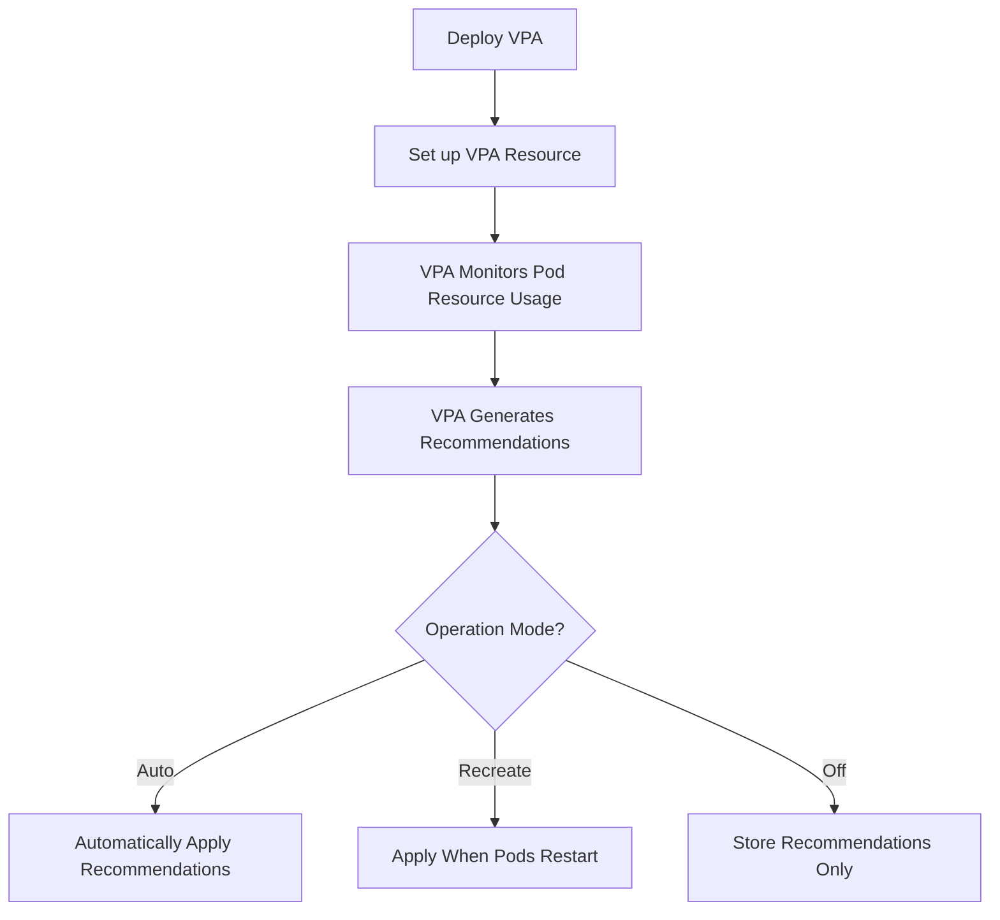

# Kubernetes VerticalPodAutoscaler

## Introduction

Resource management is one of the most challenging aspects of running applications in Kubernetes. Allocate too few resources, and your application might crash or perform poorly. Allocate too many, and you're wasting money on unused capacity.

The Kubernetes VerticalPodAutoscaler (VPA) solves this problem by automatically adjusting the CPU and memory resource requests and limits for containers in your pods. Unlike the HorizontalPodAutoscaler (HPA) which scales the number of pod replicas, VPA focuses on right-sizing the resources for each individual pod.

## How VerticalPodAutoscaler Works

VPA continuously monitors the resource usage of your containers and automatically updates the resource requests based on the observed usage patterns. It can operate in three different modes:

1. **Auto**: VPA automatically applies resource recommendations by deleting and recreating pods
2. **Recreate**: Similar to Auto mode, but VPA will only apply changes when you restart your pods
3. **Off**: VPA generates recommendations but doesn't apply them automatically (useful for monitoring)

Let's visualize the VPA workflow:



## Prerequisites

Before you start using VPA, make sure:

1. You have a running Kubernetes cluster (v1.11+)
2. You've installed the VPA components using the official manifests
3. Your application can handle being restarted (for Auto/Recreate modes)

## Installing VPA in Your Cluster

First, let's install the VPA components:

```bash
# Clone the VPA repository
git clone https://github.com/kubernetes/autoscaler.git

# Navigate to the VPA directory
cd autoscaler/vertical-pod-autoscaler

# Deploy VPA components
./hack/vpa-up.sh
```

This script installs several components:
- The Vertical Pod Autoscaler Admission Controller
- The Vertical Pod Autoscaler Recommender
- The Vertical Pod Autoscaler Updater

Verify the installation:

```bash
kubectl get pods -n kube-system | grep vpa
```

Example output:
```
vpa-admission-controller-7868f65bcf-tp8gx    1/1     Running   0          2m
vpa-recommender-5c67c49ddb-2k7hc             1/1     Running   0          2m
vpa-updater-5c88bd5d58-ptxx2                 1/1     Running   0          2m
```

## Creating Your First VPA Resource

Let's create a VPA resource for a sample application:

```yaml
apiVersion: apps/v1
kind: Deployment
metadata:
  name: sample-app
spec:
  replicas: 3
  selector:
    matchLabels:
      app: sample-app
  template:
    metadata:
      labels:
        app: sample-app
    spec:
      containers:
      - name: sample-app
        image: nginx:latest
        resources:
          requests:
            cpu: "100m"
            memory: "100Mi"
          limits:
            cpu: "200m"
            memory: "200Mi"
---
apiVersion: "autoscaling.k8s.io/v1"
kind: VerticalPodAutoscaler
metadata:
  name: sample-app-vpa
spec:
  targetRef:
    apiVersion: "apps/v1"
    kind: Deployment
    name: sample-app
  updatePolicy:
    updateMode: "Auto"
  resourcePolicy:
    containerPolicies:
    - containerName: "*"
      minAllowed:
        cpu: "50m"
        memory: "50Mi"
      maxAllowed:
        cpu: "500m"
        memory: "500Mi"
      controlledResources: ["cpu", "memory"]
```

Save this as `sample-app-with-vpa.yaml` and apply it:

```bash
kubectl apply -f sample-app-with-vpa.yaml
```

## Exploring VPA Modes

### Auto Mode

In Auto mode, VPA will:
- Monitor your pods
- Generate recommendations
- Delete and recreate pods with updated resource requests
- Pods are recreated one at a time to ensure availability

```yaml
updatePolicy:
  updateMode: "Auto"
```

### Recreate Mode

Recreate mode is useful when you want more control over when pods are restarted:

```yaml
updatePolicy:
  updateMode: "Recreate"
```

With this setting, VPA generates recommendations but only applies them when pods are restarted manually or by another controller.

### Off Mode (Recommendation-Only)

Sometimes you just want to see recommendations without automatic updates:

```yaml
updatePolicy:
  updateMode: "Off"
```

This mode is excellent for:
- Initial monitoring of applications
- Auditing resource usage
- Integrating with custom controllers

## Getting VPA Recommendations

You can view VPA recommendations using kubectl:

```bash
kubectl describe vpa sample-app-vpa
```

Example output:
```
Name:         sample-app-vpa
Namespace:    default
Labels:       <none>
Annotations:  <none>
API Version:  autoscaling.k8s.io/v1
Kind:         VerticalPodAutoscaler
...
Status:
  Recommendation:
    Container Recommendations:
      Container Name:  sample-app
      Lower Bound:
        Cpu:     50m
        Memory:  50Mi
      Target:
        Cpu:     120m
        Memory:  170Mi
      Uncapped Target:
        Cpu:     120m
        Memory:  170Mi
      Upper Bound:
        Cpu:     500m
        Memory:  500Mi
...
```

In this output:
- **Lower Bound**: Minimum recommended resources
- **Target**: Optimal recommended resources
- **Upper Bound**: Maximum recommended resources
- **Uncapped Target**: Recommended resources without min/max constraints

## Advanced VPA Configuration

### Setting Resource Policy

You can configure minimum and maximum resource bounds:

```yaml
resourcePolicy:
  containerPolicies:
  - containerName: "*"  # Apply to all containers
    minAllowed:
      cpu: "50m"
      memory: "50Mi"
    maxAllowed:
      cpu: "2"  # 2 CPU cores
      memory: "4Gi"
```

### Controlling Individual Resources

You can specify which resources VPA should manage:

```yaml
controlledResources: ["cpu", "memory"]
```

### Container-Specific Policies

You can apply different policies to different containers in the same pod:

```yaml
resourcePolicy:
  containerPolicies:
  - containerName: "app-container"
    minAllowed:
      cpu: "100m"
      memory: "100Mi"
  - containerName: "sidecar-container"
    minAllowed:
      cpu: "10m"
      memory: "50Mi"
```

## Real-World VPA Use Cases

### Use Case 1: Java Application with Memory Spikes

Java applications often need careful memory tuning. Consider an application with gradual memory growth and occasional garbage collection:

```yaml
apiVersion: "autoscaling.k8s.io/v1"
kind: VerticalPodAutoscaler
metadata:
  name: java-app-vpa
spec:
  targetRef:
    apiVersion: "apps/v1"
    kind: Deployment
    name: java-app
  updatePolicy:
    updateMode: "Auto"
  resourcePolicy:
    containerPolicies:
    - containerName: "*"
      minAllowed:
        memory: "256Mi"
      maxAllowed:
        memory: "2Gi"
      controlledResources: ["memory"]
```

This VPA focuses only on memory scaling, which is the main concern for this Java application.

### Use Case 2: Batch Processing Jobs

For batch processing jobs with varying resource needs:

```yaml
apiVersion: "autoscaling.k8s.io/v1"
kind: VerticalPodAutoscaler
metadata:
  name: batch-job-vpa
spec:
  targetRef:
    apiVersion: "batch/v1"
    kind: Job
    name: data-processing-job
  updatePolicy:
    updateMode: "Off"  # Only recommend, don't adjust running jobs
```

This setup helps you analyze completed jobs and adjust resource requests for future jobs based on data from previous runs.

### Use Case 3: Combining VPA with HPA

You can use VPA for resource sizing and HPA for replica scaling:

```yaml
# VPA resource for per-pod resource optimization
apiVersion: "autoscaling.k8s.io/v1"
kind: VerticalPodAutoscaler
metadata:
  name: webservice-vpa
spec:
  targetRef:
    apiVersion: "apps/v1"
    kind: Deployment
    name: webservice
  updatePolicy:
    updateMode: "Auto"
  resourcePolicy:
    containerPolicies:
    - containerName: "*"
      controlledResources: ["cpu", "memory"]
---
# HPA resource for scaling replicas
apiVersion: autoscaling/v2
kind: HorizontalPodAutoscaler
metadata:
  name: webservice-hpa
spec:
  scaleTargetRef:
    apiVersion: apps/v1
    kind: Deployment
    name: webservice
  minReplicas: 2
  maxReplicas: 10
  metrics:
  - type: Resource
    resource:
      name: cpu
      target:
        type: Utilization
        averageUtilization: 80
```

**Important note**: When using VPA with HPA, make sure they don't conflict. For example, don't use VPA to adjust CPU while using HPA to scale based on CPU utilization, as this can cause oscillations.

## Best Practices

1. **Start with "Off" mode** to understand recommendations before applying them automatically

2. **Set reasonable min/max boundaries** to prevent extreme scaling that could cause issues

3. **Use container-specific policies** when pods contain multiple containers with different needs

4. **Be aware of pod disruption** in Auto mode - pods will be restarted to apply new settings

5. **Consider application-specific requirements**:
   - Stateful applications may need careful handling
   - Batch jobs may benefit from analysis without automatic updates

6. **Monitor VPA behavior** to ensure it's making appropriate decisions

## Limitations and Considerations

1. **Pod disruption** - VPA recreates pods to apply changes in Auto mode

2. **No support for DaemonSets** - VPA doesn't work with DaemonSets as they require exactly one pod per node

3. **Limited history** - VPA uses recent history to make recommendations, which may not capture seasonal patterns

4. **Update frequency** - VPA doesn't update instantly, so rapid changes in workload patterns might not be addressed immediately

5. **Resource limits** - VPA primarily focuses on resource requests but can be configured to adjust limits as well

## Summary

The Kubernetes VerticalPodAutoscaler is a powerful tool for optimizing resource allocation in your cluster. By automatically adjusting CPU and memory requests based on actual usage, VPA helps you:

- Improve resource utilization efficiency
- Reduce resource-related application failures
- Optimize cloud costs
- Free up operator time from manual resource tuning

Remember that VPA works best as part of a comprehensive resource management strategy that may also include Horizontal Pod Autoscaling and careful monitoring.

## Additional Resources

- [Kubernetes Official VPA Documentation](https://github.com/kubernetes/autoscaler/tree/master/vertical-pod-autoscaler)
- [Kubernetes Resource Management](https://kubernetes.io/docs/concepts/configuration/manage-resources-containers/)
- [VPA Design Proposal](https://github.com/kubernetes/design-proposals-archive/blob/main/autoscaling/vertical-pod-autoscaler.md)

## Exercises

1. Install VPA in your Kubernetes cluster and create a VPA resource in "Off" mode for an existing deployment.

2. Compare the VPA recommendations with your current resource settings.

3. Try different VPA modes (Auto, Recreate, Off) and observe how they affect your application.

4. Configure a VPA resource with custom min/max bounds and observe how recommendations change.

5. Create a scenario where you use both VPA and HPA together for an application with variable load.