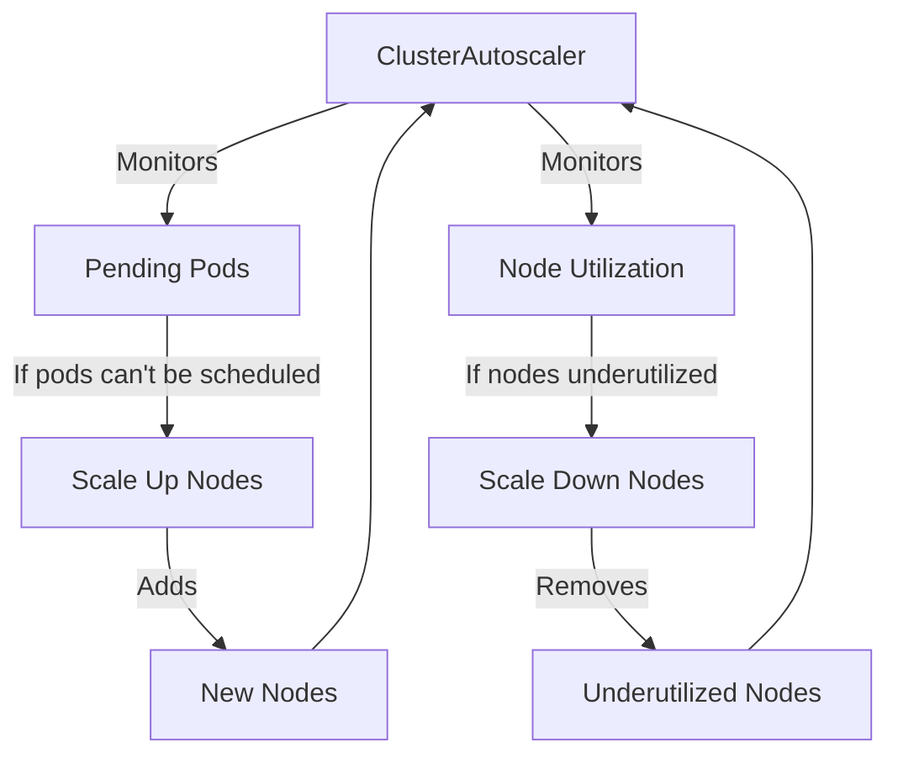

# Kubernetes ClusterAutoscaler

## Introduction

The Kubernetes ClusterAutoscaler is a powerful component that automatically adjusts the size of your Kubernetes cluster based on resource demands. If you have pods that can't be scheduled because of insufficient resources, the ClusterAutoscaler adds new nodes. Conversely, if nodes are underutilized for an extended period, it removes them to save costs.

This automatic scaling capability is particularly valuable in production environments where workloads can fluctuate, allowing you to maintain application availability while optimizing resource usage and controlling costs.

## How ClusterAutoscaler Works

The ClusterAutoscaler operates on a simple but effective principle:

1. It regularly checks for pods that cannot be scheduled due to resource constraints
2. When it finds such pods, it increases the number of nodes in the cluster
3. It periodically checks for nodes that have been underutilized for an extended period
4. It removes these underutilized nodes if it can safely relocate their pods



## Prerequisites

Before implementing the ClusterAutoscaler, ensure you have:

- A Kubernetes cluster (version 1.8+)
- Access to node management for your cluster (usually in a cloud provider)
- `kubectl` configured to communicate with your cluster
- Appropriate RBAC permissions to deploy cluster-level resources

## Setting Up ClusterAutoscaler

The setup process varies depending on your cloud provider. We'll cover the most common providers below.

### For AWS (Amazon Web Services)

For EKS (Elastic Kubernetes Service), start by creating an IAM policy that allows the autoscaler to make the necessary API calls:

```json
{
  "Version": "2012-10-17",
  "Statement": [
    {
      "Effect": "Allow",
      "Action": [
        "autoscaling:DescribeAutoScalingGroups",
        "autoscaling:DescribeAutoScalingInstances",
        "autoscaling:DescribeLaunchConfigurations",
        "autoscaling:DescribeTags",
        "autoscaling:SetDesiredCapacity",
        "autoscaling:TerminateInstanceInAutoScalingGroup",
        "ec2:DescribeLaunchTemplateVersions"
      ],
      "Resource": "*"
    }
  ]
}
```

Next, deploy the ClusterAutoscaler with the correct configuration:

```yaml
apiVersion: apps/v1
kind: Deployment
metadata:
  name: cluster-autoscaler
  namespace: kube-system
  labels:
    app: cluster-autoscaler
spec:
  replicas: 1
  selector:
    matchLabels:
      app: cluster-autoscaler
  template:
    metadata:
      labels:
        app: cluster-autoscaler
    spec:
      serviceAccountName: cluster-autoscaler
      containers:
        - image: k8s.gcr.io/autoscaling/cluster-autoscaler:v1.23.0
          name: cluster-autoscaler
          resources:
            limits:
              cpu: 100m
              memory: 300Mi
            requests:
              cpu: 100m
              memory: 300Mi
          command:
            - ./cluster-autoscaler
            - --v=4
            - --stderrthreshold=info
            - --cloud-provider=aws
            - --skip-nodes-with-local-storage=false
            - --expander=least-waste
            - --node-group-auto-discovery=asg:tag=k8s.io/cluster-autoscaler/enabled,k8s.io/cluster-autoscaler/YOUR_CLUSTER_NAME
          volumeMounts:
            - name: ssl-certs
              mountPath: /etc/ssl/certs/ca-certificates.crt
              readOnly: true
      volumes:
        - name: ssl-certs
          hostPath:
            path: "/etc/ssl/certs/ca-bundle.crt"
```

Remember to replace `YOUR_CLUSTER_NAME` with your actual EKS cluster name.

### For GCP (Google Cloud Platform)

GKE (Google Kubernetes Engine) has ClusterAutoscaler built in, so you can simply enable it when creating a cluster or update an existing one:

```bash
gcloud container clusters update YOUR_CLUSTER_NAME \
    --enable-autoscaling \
    --min-nodes=1 \
    --max-nodes=10 \
    --zone=YOUR_ZONE
```

### For Azure (Microsoft Azure)

AKS (Azure Kubernetes Service) also supports built-in autoscaling:

```bash
az aks update \
    --resource-group YOUR_RESOURCE_GROUP \
    --name YOUR_CLUSTER_NAME \
    --enable-cluster-autoscaler \
    --min-count 1 \
    --max-count 10
```

## Configuring ClusterAutoscaler

The ClusterAutoscaler offers several configuration options to fine-tune its behavior. Here are the most important ones:

### Scaling Speed

You can adjust how quickly the autoscaler responds to changes in resource demands:

```yaml
spec:
  template:
    spec:
      containers:
      - command:
        - ./cluster-autoscaler
        # Other args...
        - --max-node-provision-time=15m  # Max time to wait for node provisioning
        - --scale-down-delay-after-add=10m  # Wait time after scaling up before considering scale down
        - --scale-down-unneeded-time=10m  # How long a node should be unneeded before scaling down
```

### Node Selection Strategies

The ClusterAutoscaler uses an expander to decide which node group to scale up when multiple options are available:

```yaml
spec:
  template:
    spec:
      containers:
      - command:
        - ./cluster-autoscaler
        # Other args...
        - --expander=least-waste  # Choose the node group that would be least wasted
```

Common expanders include:
- `random`: Selects a node group randomly
- `most-pods`: Selects the node group that can schedule the most pods
- `least-waste`: Selects the node group that will have the least amount of unused resources
- `price`: Selects the node group with the lowest price (requires cloud provider support)

## Practical Examples

### Example 1: Handling Batch Processing Jobs

Imagine your application needs to process thousands of images periodically. Instead of maintaining a large cluster all the time, you can use the ClusterAutoscaler to scale up when needed:

```yaml
apiVersion: batch/v1
kind: Job
metadata:
  name: image-processor
spec:
  parallelism: 100  # Run 100 pods in parallel
  template:
    spec:
      containers:
      - name: processor
        image: image-processor:latest
        resources:
          requests:
            memory: "1Gi"
            cpu: "500m"
          limits:
            memory: "2Gi"
            cpu: "1000m"
      restartPolicy: Never
```

When this job is submitted, the ClusterAutoscaler will recognize that there aren't enough resources to schedule all 100 pods and will automatically add more nodes. After the job completes, if the nodes become underutilized, they'll be removed.

### Example 2: Handling Traffic Spikes

For web applications with variable traffic, you can use the Horizontal Pod Autoscaler (HPA) together with the ClusterAutoscaler:

```yaml
apiVersion: autoscaling/v2
kind: HorizontalPodAutoscaler
metadata:
  name: webapp
spec:
  scaleTargetRef:
    apiVersion: apps/v1
    kind: Deployment
    name: webapp
  minReplicas: 5
  maxReplicas: 50
  metrics:
  - type: Resource
    resource:
      name: cpu
      target:
        type: Utilization
        averageUtilization: 80
```

In this scenario:
1. The HPA creates more pods when CPU usage increases
2. If there are not enough resources in the cluster, the ClusterAutoscaler adds more nodes
3. When traffic decreases, the HPA reduces the number of pods
4. If nodes become underutilized, the ClusterAutoscaler removes them

This combination provides both pod-level and cluster-level scaling to handle variable workloads efficiently.

## Best Practices

### 1. Set Resource Requests Appropriately

The ClusterAutoscaler relies on resource requests to make scaling decisions. If pods don't specify accurate resource requests, the autoscaler won't make optimal decisions:

```yaml
apiVersion: v1
kind: Pod
metadata:
  name: resource-demo
spec:
  containers:
  - name: resource-demo-ctr
    image: nginx
    resources:
      requests:
        memory: "64Mi"
        cpu: "250m"
      limits:
        memory: "128Mi"
        cpu: "500m"
```

### 2. Use Pod Disruption Budgets

To ensure high availability during scaling operations, use Pod Disruption Budgets (PDBs):

```yaml
apiVersion: policy/v1
kind: PodDisruptionBudget
metadata:
  name: webapp-pdb
spec:
  minAvailable: 90%  # Ensure at least 90% of pods are available
  selector:
    matchLabels:
      app: webapp
```

### 3. Configure Scale-Down Appropriately

Be careful with scale-down settings, especially in production environments:

```yaml
spec:
  template:
    spec:
      containers:
      - command:
        - ./cluster-autoscaler
        # Other args...
        - --scale-down-unneeded-time=30m  # Node must be underutilized for 30 minutes
        - --scale-down-delay-after-delete=10m  # Wait 10 minutes after a node deletion
        - --max-graceful-termination-sec=600  # Give pods 10 minutes to terminate gracefully
```

### 4. Label Nodes That Shouldn't Be Scaled Down

For critical nodes that should never be removed, add a special label:

```yaml
kubectl label nodes <node-name> cluster-autoscaler.kubernetes.io/scale-down-disabled=true
```

## Troubleshooting

### Checking ClusterAutoscaler Logs

The first step in troubleshooting is to check the autoscaler logs:

```bash
kubectl logs -n kube-system -l app=cluster-autoscaler
```

### Common Issues and Solutions

1. **Pods remain pending and no scale-up occurs**
   - Check if the autoscaler has the correct permissions
   - Verify that node groups are properly configured
   - Examine resource requests to ensure they're not too large for available node types

2. **Nodes don't scale down despite being underutilized**
   - Check for pods without controllers (they block scale-down)
   - Look for pods with local storage (they may block scale-down)
   - Verify PodDisruptionBudgets aren't too restrictive

3. **Scaling is too slow**
   - Check the configuration parameters for scale-up/down delays
   - Ensure your cloud provider can provision nodes quickly

## Summary

The Kubernetes ClusterAutoscaler is an essential tool for managing dynamic workloads efficiently. By automatically adjusting your cluster size based on actual resource demands, it helps maintain application availability while optimizing costs. Key points to remember:

- The ClusterAutoscaler adds nodes when pods can't be scheduled due to resource constraints
- It removes nodes when they've been underutilized for an extended period
- Setup varies by cloud provider, with some offering built-in support
- Configuring resource requests accurately is critical for effective autoscaling
- Use it in combination with the Horizontal Pod Autoscaler for comprehensive scaling

## Additional Resources

- [Official Kubernetes ClusterAutoscaler Documentation](https://github.com/kubernetes/autoscaler/tree/master/cluster-autoscaler)
- [Cloud Provider Specific Documentation](https://github.com/kubernetes/autoscaler/tree/master/cluster-autoscaler/cloudprovider)

## Exercises

1. Set up a test cluster with ClusterAutoscaler and deploy a batch job that requires more resources than initially available. Observe how the cluster scales up.

2. Create a deployment with a Horizontal Pod Autoscaler and use a load testing tool to increase traffic. Observe how both the HPA and ClusterAutoscaler respond.

3. Experiment with different expander strategies (random, most-pods, least-waste) and observe how they affect node selection during scale-up.

4. Implement Pod Disruption Budgets for a critical application and observe how they affect scale-down operations.

5. Configure the ClusterAutoscaler with different scale-down delay settings and observe the impact on resource utilization and cost.