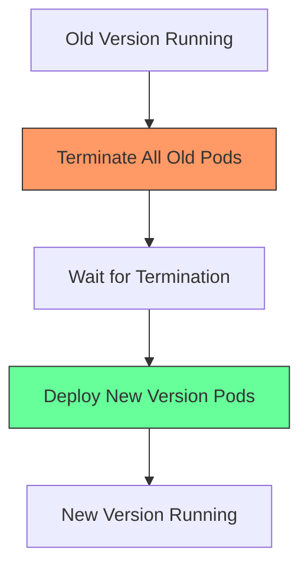
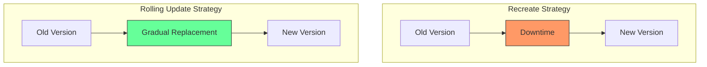
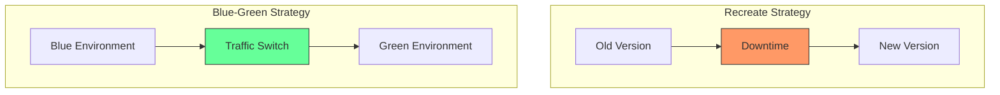

# Kubernetes Recreate Deployment

## Introduction

The Recreate deployment strategy is one of several deployment strategies available in Kubernetes. It's a straightforward approach that terminates all existing pods before creating new ones. While simple, this strategy results in downtime between the termination of old pods and the creation of new ones, making it suitable for specific scenarios but not for applications requiring high availability.

In this guide, we'll explore the Recreate deployment strategy in detail, understand its advantages and limitations, and learn how to implement it in your Kubernetes environment.

## Understanding the Recreate Strategy

### What is the Recreate Strategy?

The Recreate strategy follows a simple process:

1. Terminate all running instances of the application (old version)
2. Wait until all instances are properly terminated
3. Deploy all new instances of the application (new version)



### Key Characteristics

- **Downtime**: This strategy inherently causes downtime during the transition.
- **Simplicity**: It's the simplest deployment strategy to understand and implement.
- **Resource Efficiency**: It requires fewer resources compared to other strategies since there's no period where both old and new versions run simultaneously.
- **All-or-Nothing**: The switch between versions is complete, with no partial rollout.

## When to Use the Recreate Strategy

The Recreate deployment strategy is best suited for:

1. **Development and Testing Environments**: Where downtime is acceptable and doesn't impact users.
2. **Database Schema Updates**: When an application update requires database changes incompatible with the previous version.
3. **Legacy Applications**: That aren't designed to run multiple versions simultaneously.
4. **Resource-Constrained Environments**: Where you can't afford to have both versions running at the same time.
5. **Complete Resets**: When you want to ensure a clean state between versions.

## Implementing Recreate Deployment

### YAML Configuration

To use the Recreate strategy, you need to specify it in your Deployment manifest:

```yaml
apiVersion: apps/v1
kind: Deployment
metadata:
  name: my-app
spec:
  replicas: 3
  strategy:
    type: Recreate
  selector:
    matchLabels:
      app: my-app
  template:
    metadata:
      labels:
        app: my-app
    spec:
      containers:
      - name: my-app
        image: my-app:1.0
        ports:
        - containerPort: 8080
```

The key part of this configuration is the `strategy.type: Recreate` field, which tells Kubernetes to use the Recreate deployment strategy.

### Practical Example: Application Update

Let's walk through a real-world example of updating an application from version 1.0 to 2.0 using the Recreate strategy:

1. Start with a deployment of version 1.0:

```yaml
apiVersion: apps/v1
kind: Deployment
metadata:
  name: web-app
spec:
  replicas: 3
  strategy:
    type: Recreate
  selector:
    matchLabels:
      app: web-app
  template:
    metadata:
      labels:
        app: web-app
    spec:
      containers:
      - name: web-app
        image: my-company/web-app:1.0
        ports:
        - containerPort: 80
```

2. Update the image to version 2.0:

```bash
kubectl set image deployment/web-app web-app=my-company/web-app:2.0
```

3. Observe the deployment process:

```bash
kubectl rollout status deployment/web-app
```

Output:
```
Waiting for deployment "web-app" rollout to finish: 0 of 3 updated replicas are available...
Waiting for deployment "web-app" rollout to finish: 0 of 3 updated replicas are available...
Waiting for deployment "web-app" rollout to finish: 1 of 3 updated replicas are available...
Waiting for deployment "web-app" rollout to finish: 2 of 3 updated replicas are available...
deployment "web-app" successfully rolled out
```

Notice that during the deployment process, the old pods are terminated first, resulting in a period where 0 replicas are available.

## Step-by-Step Breakdown of Recreate Deployment Process

1. **Initial State**: The application is running with the old version.

```bash
kubectl get pods
```

Output:
```
NAME                       READY   STATUS    RESTARTS   AGE
web-app-7d9fd56cb8-2lnxb   1/1     Running   0          10m
web-app-7d9fd56cb8-5dhvz   1/1     Running   0          10m
web-app-7d9fd56cb8-9wq2v   1/1     Running   0          10m
```

2. **Update Triggered**: You update the deployment to use a new image version.

3. **Termination Phase**: Kubernetes terminates all existing pods.

```bash
kubectl get pods
```

Output:
```
NAME                       READY   STATUS        RESTARTS   AGE
web-app-7d9fd56cb8-2lnxb   0/1     Terminating   0          11m
web-app-7d9fd56cb8-5dhvz   0/1     Terminating   0          11m
web-app-7d9fd56cb8-9wq2v   0/1     Terminating   0          11m
```

4. **Downtime Period**: During this phase, no pods are available to serve requests.

```bash
kubectl get pods
```

Output:
```
No resources found in default namespace.
```

5. **Creation Phase**: New pods are created with the updated version.

```bash
kubectl get pods
```

Output:
```
NAME                       READY   STATUS              RESTARTS   AGE
web-app-6f5d8b7f45-a3b7c   0/1     ContainerCreating   0          5s
web-app-6f5d8b7f45-b2c8d   0/1     ContainerCreating   0          5s
web-app-6f5d8b7f45-x9y0z   0/1     ContainerCreating   0          5s
```

6. **Final State**: All new pods are running with the updated version.

```bash
kubectl get pods
```

Output:
```
NAME                       READY   STATUS    RESTARTS   AGE
web-app-6f5d8b7f45-a3b7c   1/1     Running   0          30s
web-app-6f5d8b7f45-b2c8d   1/1     Running   0          30s
web-app-6f5d8b7f45-x9y0z   1/1     Running   0          30s
```

## Comparing Recreate with Other Deployment Strategies

### Recreate vs. Rolling Update



| Feature | Recreate | Rolling Update |
|---------|----------|---------------|
| Downtime | Yes | No |
| Resource Usage | Lower | Higher |
| Complexity | Simple | Moderate |
| Suitable for | Dev environments, database changes | Production applications |
| Transition | Abrupt | Gradual |

### Recreate vs. Blue-Green



| Feature | Recreate | Blue-Green |
|---------|----------|------------|
| Downtime | Yes | No |
| Resource Usage | Lower | Highest |
| Complexity | Simple | Complex |
| Testing | Limited | Full testing before switch |
| Rollback | Slower | Instant |

## Best Practices for Recreate Deployments

1. **Schedule During Low-Traffic Periods**: Since this strategy causes downtime, schedule updates during periods of minimal user activity.

2. **Set Appropriate Health Checks**: Ensure your application has proper readiness and liveness probes to verify the new version is functioning correctly.

```yaml
spec:
  containers:
  - name: web-app
    image: my-company/web-app:2.0
    ports:
    - containerPort: 80
    readinessProbe:
      httpGet:
        path: /health
        port: 80
      initialDelaySeconds: 5
      periodSeconds: 10
    livenessProbe:
      httpGet:
        path: /health
        port: 80
      initialDelaySeconds: 15
      periodSeconds: 20
```

3. **Implement Proper Logging**: Comprehensive logging helps diagnose issues that might occur during deployment.

4. **Use Maintenance Pages**: For user-facing applications, consider setting up a maintenance page during the deployment.

5. **Automate Testing**: Run automated tests after deployment to verify the new version works as expected.

6. **Have a Rollback Plan**: Despite its simplicity, always have a plan to revert to the previous version if needed.

## Common Issues and Troubleshooting

### 1. Extended Downtime

**Problem**: The downtime period is longer than expected.

**Solution**: Check for:
- Long termination grace periods
- Issues with container startup
- Resource constraints affecting new pod scheduling

### 2. Failed New Version Deployment

**Problem**: The new version pods fail to start properly.

**Solution**:
- Check pod logs: `kubectl logs <pod-name>`
- Describe pods for events: `kubectl describe pod <pod-name>`
- Verify image exists and is accessible: `kubectl describe deployment <deployment-name>`

### 3. Unable to Rollback

**Problem**: Need to quickly revert to the previous version.

**Solution**:
```bash
kubectl rollout undo deployment/web-app
```

## Summary

The Recreate deployment strategy in Kubernetes offers a straightforward approach to application updates with these key characteristics:

- Terminates all existing pods before creating new ones
- Results in downtime during the deployment process
- Simple to understand and implement
- Ideal for development environments and applications that require a clean slate between versions
- Not suitable for production applications requiring high availability

While it's the simplest deployment strategy, it's important to consider the downtime impact and use it only in appropriate scenarios. For production applications with high availability requirements, consider alternatives like Rolling Update or Blue-Green deployment strategies.

## Exercise: Implementing a Recreate Deployment

Try implementing a Recreate deployment with these steps:

1. Create a simple web application deployment with 3 replicas using the Recreate strategy
2. Verify that all pods are running
3. Update the application to a new version
4. Observe and document the deployment process
5. Consider how you might minimize the impact of downtime for a real-world application

## Additional Resources

- [Kubernetes Official Documentation on Deployments](https://kubernetes.io/docs/concepts/workloads/controllers/deployment/)
- [Kubernetes API Reference for Deployments](https://kubernetes.io/docs/reference/generated/kubernetes-api/v1.28/#deployment-v1-apps)
- [Kubernetes Patterns: Recreate Deployment](https://kubernetes.io/docs/concepts/workloads/controllers/deployment/#recreate-deployment)
- [Comparing Kubernetes Deployment Strategies](https://kubernetes.io/docs/concepts/workloads/controllers/deployment/#strategy)