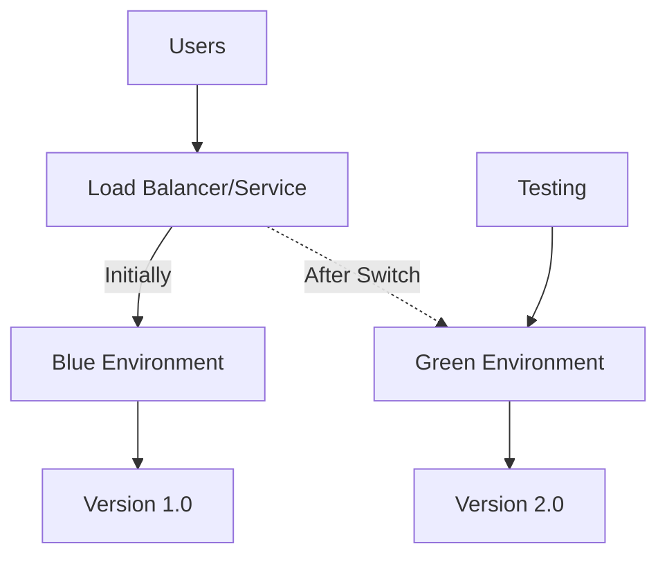

# Kubernetes Blue-Green Deployments

## Introduction

Blue-Green deployment is a powerful release strategy that enables zero-downtime updates to your applications running in Kubernetes. This technique works by maintaining two identical environments (blue and green) and switching traffic between them when deploying new versions. This approach significantly reduces risk and eliminates downtime during deployments.

In this guide, we'll explore how Blue-Green deployments work in Kubernetes, compare them with other deployment strategies, and walk through a practical implementation step by step.

## What is Blue-Green Deployment?

Blue-Green deployment is a release management technique that reduces downtime and risk by running two identical production environments called Blue and Green.

- **Blue environment**: The currently active production environment serving user traffic
- **Green environment**: The new version of your application waiting to go live

<br />

Here's how the process typically works:

1. The Blue environment is running in production and handling all user traffic
2. A new Green environment is deployed with the updated application version
3. The Green environment is tested and verified
4. Traffic is switched from Blue to Green (making Green the new production)
5. The old Blue environment is kept as a backup for quick rollback if needed



## Benefits of Blue-Green Deployments

- **Zero-downtime deployments**: Users experience no interruption in service
- **Instant rollback capability**: If issues arise, traffic can be immediately routed back to the previous stable version
- **Reduced deployment risk**: The new version can be fully tested in an isolated environment before going live
- **Simplified rollback strategy**: No need to restore database backups or revert complex changes
- **Better testing in a production-like environment**: The Green environment mirrors production exactly

## Blue-Green vs. Other Deployment Strategies

Before diving deeper, let's understand how Blue-Green compares to other common Kubernetes deployment strategies:

| Strategy           | Description                                            | Pros                                             | Cons                                     |
|--------------------|--------------------------------------------------------|--------------------------------------------------|------------------------------------------|
| **Blue-Green**     | Runs two identical environments and switches traffic   | Zero downtime, instant rollback                  | Requires double the resources            |
| **Rolling Update** | Gradually replaces pods with new versions              | Built into Kubernetes, minimal resource overhead | Slower, both versions run simultaneously |
| **Canary**         | Routes a small percentage of traffic to new version    | Reduces risk by testing with limited users       | More complex to configure                |
| **Recreate**       | Terminates old version completely before deploying new | Simple, ensures only one version runs            | Causes downtime during deployment        |

## Implementing Blue-Green Deployments in Kubernetes

Now, let's walk through implementing a Blue-Green deployment strategy in Kubernetes. We'll use a simple web application as an example.

### Prerequisites

- A working Kubernetes cluster
- `kubectl` configured to communicate with your cluster
- Basic understanding of Kubernetes resources (Deployments, Services)

### Step 1: Create the Initial (Blue) Deployment

First, we'll create our initial deployment that will serve as our Blue environment.

```yaml
# blue-deployment.yaml
apiVersion: apps/v1
kind: Deployment
metadata:
  name: webapp-blue
  labels:
    app: webapp
    version: "1.0"
    deployment: blue
spec:
  replicas: 3
  selector:
    matchLabels:
      app: webapp
      version: "1.0"
      deployment: blue
  template:
    metadata:
      labels:
        app: webapp
        version: "1.0"
        deployment: blue
    spec:
      containers:
      - name: webapp
        image: mywebapp:1.0
        ports:
        - containerPort: 8080
        readinessProbe:
          httpGet:
            path: /health
            port: 8080
          initialDelaySeconds: 5
          periodSeconds: 5
```

Apply this configuration:

```bash
kubectl apply -f blue-deployment.yaml
```

### Step 2: Create a Service to Route Traffic

Now we'll create a Service that will route traffic to our Blue deployment. The key here is to use a selector that matches only the Blue deployment.

```yaml
# service.yaml
apiVersion: v1
kind: Service
metadata:
  name: webapp-service
spec:
  selector:
    app: webapp
    deployment: blue  # Initially points to the blue deployment
  ports:
  - port: 80
    targetPort: 8080
  type: LoadBalancer
```

Apply this configuration:

```bash
kubectl apply -f service.yaml
```

At this point, all user traffic is going to the Blue deployment (version 1.0 of our application).

### Step 3: Create the Green Deployment (New Version)

When you're ready to deploy a new version, create a Green deployment with the updated application:

```yaml
# green-deployment.yaml
apiVersion: apps/v1
kind: Deployment
metadata:
  name: webapp-green
  labels:
    app: webapp
    version: "2.0"
    deployment: green
spec:
  replicas: 3
  selector:
    matchLabels:
      app: webapp
      version: "2.0"
      deployment: green
  template:
    metadata:
      labels:
        app: webapp
        version: "2.0"
        deployment: green
    spec:
      containers:
      - name: webapp
        image: mywebapp:2.0
        ports:
        - containerPort: 8080
        readinessProbe:
          httpGet:
            path: /health
            port: 8080
          initialDelaySeconds: 5
          periodSeconds: 5
```

Apply this configuration:

```bash
kubectl apply -f green-deployment.yaml
```

At this point, both Blue and Green deployments are running, but all user traffic is still going to Blue.

### Step 4: Test the Green Deployment

Before switching traffic, test the Green deployment to ensure it's working correctly. You can create a temporary testing service:

```yaml
# green-test-service.yaml
apiVersion: v1
kind: Service
metadata:
  name: webapp-green-test
spec:
  selector:
    app: webapp
    deployment: green
  ports:
  - port: 80
    targetPort: 8080
  type: LoadBalancer
```

Apply and use this service to test the Green deployment:

```bash
kubectl apply -f green-test-service.yaml
```

Use the external IP of this service to perform thorough testing of the new version.

### Step 5: Switch Traffic to the Green Deployment

Once you're confident the Green deployment is working correctly, update the main service to route traffic to the Green deployment by changing the selector:

```yaml
# updated-service.yaml
apiVersion: v1
kind: Service
metadata:
  name: webapp-service
spec:
  selector:
    app: webapp
    deployment: green  # Now points to the green deployment
  ports:
  - port: 80
    targetPort: 8080
  type: LoadBalancer
```

Apply the updated service configuration:

```bash
kubectl apply -f updated-service.yaml
```

Traffic is now switched to the Green deployment (version 2.0 of the application) with zero downtime. The switch is instant and all new requests will go to the Green deployment.

### Step 6: Verify the Switch and Clean Up (Optional)

Verify that traffic is now going to the Green deployment:

```bash
kubectl get pods -l deployment=green
kubectl get service webapp-service -o yaml
```

If everything is working correctly, you can remove the testing service:

```bash
kubectl delete -f green-test-service.yaml
```

### Step 7: Keep or Remove the Blue Deployment

You have two options after a successful switch:

1. **Keep the Blue deployment** as a backup for quick rollback if issues are discovered in the Green deployment
2. **Remove the Blue deployment** to free up resources

If you decide to keep it for a while as a safety net:

```bash
# No action needed, just leave it running
```

If you decide to remove it:

```bash
kubectl delete -f blue-deployment.yaml
```

For the next deployment cycle, the current Green becomes the new Blue, and you create a new Green deployment with the next version.

## Real-World Example: E-Commerce Application

Let's consider a practical example of using Blue-Green deployments for an e-commerce website.

### Scenario:
- You're deploying a critical update to your e-commerce platform
- The update includes changes to the checkout process
- Downtime would directly impact sales

### Implementation:

1. **Initial State**: Blue deployment is running version 1.0 of the e-commerce app, handling all customer traffic.

2. **Preparation**: Deploy the Green environment with version 2.0 of the app:

```bash
kubectl apply -f ecommerce-green-deployment.yaml
```

3. **Testing**: Create a test service that points to Green, and run a suite of tests:
   - Verify the checkout process works end-to-end
   - Test payment processing
   - Test order confirmation emails
   - Check performance under load

4. **Gradual Testing with Real Users** (optional): Direct a small subset of internal users to the Green environment to verify functionality.

5. **Switch**: Update the main service to point to the Green deployment:

```bash
kubectl apply -f updated-ecommerce-service.yaml
```

6. **Monitoring**: Closely monitor error rates, performance metrics, and business KPIs after the switch.

7. **Rollback Plan**: If issues arise, immediately update the service selector back to the Blue deployment:

```bash
kubectl apply -f rollback-to-blue-service.yaml
```

This approach ensures that your critical e-commerce platform can be updated with new features without any downtime that could impact sales.

## Advanced Blue-Green Techniques

### Session Persistence

When dealing with applications that maintain user sessions, you need to consider session persistence during the Blue-Green switch. Options include:

1. **Sticky Sessions**: Configure your load balancer to maintain session affinity
2. **External Session Store**: Use Redis, Memcached, or a database for session storage
3. **Stateless Applications**: Design your application to be stateless where possible

### Database Migrations

Database schema changes add complexity to Blue-Green deployments. Approaches include:

1. **Backward-Compatible Changes**: Make schema changes that work with both versions
2. **Multiple Schemas**: Maintain separate schemas for each version
3. **Feature Toggles**: Use feature flags to control access to features requiring new schema

### Blue-Green Deployments with Helm

If you're using Helm, you can implement Blue-Green deployments with templates:

```yaml
# helm-template-example.yaml
apiVersion: apps/v1
kind: Deployment
metadata:
  name: {{ .Release.Name }}-{{ .Values.color }}
  labels:
    app: {{ .Release.Name }}
    version: "{{ .Values.version }}"
    deployment: {{ .Values.color }}
spec:
  replicas: {{ .Values.replicas }}
  selector:
    matchLabels:
      app: {{ .Release.Name }}
      version: "{{ .Values.version }}"
      deployment: {{ .Values.color }}
  template:
    metadata:
      labels:
        app: {{ .Release.Name }}
        version: "{{ .Values.version }}"
        deployment: {{ .Values.color }}
    spec:
      containers:
      - name: {{ .Release.Name }}
        image: {{ .Values.image }}:{{ .Values.version }}
        ports:
        - containerPort: {{ .Values.containerPort }}
```

## Common Challenges and Solutions

| Challenge                        | Solution                                                                      |
|----------------------------------|-------------------------------------------------------------------------------|
| **Resource Costs**               | Use namespaces to isolate environments; scale down non-production environment |
| **Configuration Management**     | Use ConfigMaps and Secrets that are versioned with your deployments           |
| **Service Discovery**            | Leverage Kubernetes DNS for service discovery between components              |
| **Automated Testing**            | Implement comprehensive automated tests to validate the Green environment     |
| **Monitoring Both Environments** | Set up monitoring for both Blue and Green with clear differentiation          |

## Summary

Blue-Green deployment is a powerful strategy for achieving zero-downtime deployments in Kubernetes. By maintaining two identical environments and switching traffic between them, you can significantly reduce risk and improve the reliability of your application updates.

Key benefits of Blue-Green deployments include:
- Zero downtime during deployments
- Easy and immediate rollback capability
- Ability to fully test new versions before exposing them to users
- Reduced deployment risk

While Blue-Green deployments require more resources than traditional strategies, the benefits in terms of reliability and user experience often outweigh the costs, especially for mission-critical applications.

## Additional Resources

- Kubernetes official documentation: [https://kubernetes.io/docs/concepts/workloads/controllers/deployment/](https://kubernetes.io/docs/concepts/workloads/controllers/deployment/)
- Kubernetes Patterns book by Bilgin Ibryam and Roland Huß
- The DevOps Toolkit series by Viktor Farcic

## Exercise: Implement a Blue-Green Deployment

Try implementing a Blue-Green deployment for a simple application:

1. Create a basic web application with two distinct versions
2. Deploy the Blue version to your Kubernetes cluster
3. Create a Service that routes traffic to the Blue version
4. Deploy the Green version alongside the Blue version
5. Test the Green version using a test service
6. Switch traffic from Blue to Green
7. Verify the switch was successful

For an added challenge, try automating the entire process using a CI/CD pipeline tool like Jenkins, GitHub Actions, or ArgoCD.