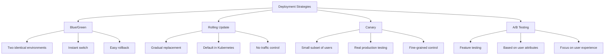

# Kubernetes Canary Deployments

## Introduction

Canary deployments are a powerful strategy for reducing risk when releasing new versions of applications in production environments. Named after the historical practice of using canaries in coal mines to detect toxic gases, canary deployments work by gradually rolling out changes to a small subset of users before making them available to everyone.

In Kubernetes, canary deployments allow you to test new versions of your application in the production environment while limiting potential negative impact. This approach provides real user feedback and allows you to monitor the performance and stability of new versions before fully deploying them.

In this guide, we'll explore:
- What canary deployments are and their benefits
- How to implement canary deployments in Kubernetes
- Tools and techniques for monitoring canary deployments
- Best practices for successful canary testing

## What are Canary Deployments?

### Core Concept

A canary deployment involves running two versions of an application simultaneously:

1. **Stable Version**: The current production version, serving most of your users
2. **Canary Version**: The new version, serving a small percentage of your traffic

By directing only a fraction of traffic to the new version, you can:
- Test new features with real users
- Monitor performance under genuine load
- Detect bugs and issues before they affect all users
- Gradually increase traffic to the new version if all metrics look good
- Quickly rollback if problems arise

### Canary vs Other Deployment Strategies



## Implementing Canary Deployments in Kubernetes

### Basic Implementation - Manual Approach

The simplest way to implement canary deployments in Kubernetes is by using multiple deployments with the same label selectors and adjusting replica counts.

#### Step 1: Create the stable deployment

```yaml
apiVersion: apps/v1
kind: Deployment
metadata:
  name: myapp-stable
  labels:
    app: myapp
    version: stable
spec:
  replicas: 9
  selector:
    matchLabels:
      app: myapp
  template:
    metadata:
      labels:
        app: myapp
        version: stable
    spec:
      containers:
      - name: myapp
        image: myapp:1.0
        ports:
        - containerPort: 8080
```

#### Step 2: Create a service to select both versions

```yaml
apiVersion: v1
kind: Service
metadata:
  name: myapp-service
spec:
  selector:
    app: myapp  # Notice this selects any pod with label app=myapp
  ports:
  - port: 80
    targetPort: 8080
```

#### Step 3: Deploy the canary version

```yaml
apiVersion: apps/v1
kind: Deployment
metadata:
  name: myapp-canary
  labels:
    app: myapp
    version: canary
spec:
  replicas: 1  # Only 1 replica for the canary (10% of total)
  selector:
    matchLabels:
      app: myapp
  template:
    metadata:
      labels:
        app: myapp
        version: canary
    spec:
      containers:
      - name: myapp
        image: myapp:2.0  # New version
        ports:
        - containerPort: 8080
```

In this example, approximately 10% of traffic will go to the canary version (1 out of 10 pods). If everything looks good, you can gradually increase the number of canary replicas and decrease the stable replicas until you've fully migrated.

### Implementation with Istio Service Mesh

For more control over traffic routing, you can use service mesh solutions like Istio:

#### Step 1: Deploy both versions

```yaml
apiVersion: apps/v1
kind: Deployment
metadata:
  name: myapp-v1
spec:
  replicas: 1
  selector:
    matchLabels:
      app: myapp
      version: v1
  template:
    metadata:
      labels:
        app: myapp
        version: v1
    spec:
      containers:
      - name: myapp
        image: myapp:1.0
        ports:
        - containerPort: 8080
---
apiVersion: apps/v1
kind: Deployment
metadata:
  name: myapp-v2
spec:
  replicas: 1
  selector:
    matchLabels:
      app: myapp
      version: v2
  template:
    metadata:
      labels:
        app: myapp
        version: v2
    spec:
      containers:
      - name: myapp
        image: myapp:2.0
        ports:
        - containerPort: 8080
```

#### Step 2: Create a Kubernetes service

```yaml
apiVersion: v1
kind: Service
metadata:
  name: myapp
spec:
  ports:
  - port: 80
    targetPort: 8080
  selector:
    app: myapp
```

#### Step 3: Define Istio routing rules

```yaml
apiVersion: networking.istio.io/v1alpha3
kind: VirtualService
metadata:
  name: myapp-virtualservice
spec:
  hosts:
  - myapp
  http:
  - route:
    - destination:
        host: myapp
        subset: v1
      weight: 90
    - destination:
        host: myapp
        subset: v2
      weight: 10
---
apiVersion: networking.istio.io/v1alpha3
kind: DestinationRule
metadata:
  name: myapp-destination
spec:
  host: myapp
  subsets:
  - name: v1
    labels:
      version: v1
  - name: v2
    labels:
      version: v2
```

With Istio, you can precisely control the traffic weight between versions and adjust it over time. This provides more granular control than the replica-based approach.

### Implementation with Flagger (Automated Canary)

Flagger is a Kubernetes operator that automates the release process for applications running on Kubernetes. It integrates with service meshes like Istio, Linkerd, or App Mesh and can automate canary deployments:

#### Step 1: Create a Canary custom resource

```yaml
apiVersion: flagger.app/v1beta1
kind: Canary
metadata:
  name: myapp
spec:
  targetRef:
    apiVersion: apps/v1
    kind: Deployment
    name: myapp
  service:
    port: 80
    targetPort: 8080
  analysis:
    interval: 30s
    threshold: 5
    maxWeight: 50
    stepWeight: 10
    metrics:
    - name: request-success-rate
      thresholdRange:
        min: 99
      interval: 1m
    - name: request-duration
      thresholdRange:
        max: 500
      interval: 1m
```

This configuration tells Flagger to:
1. Start with 10% traffic to the new version
2. Increase by 10% every 30 seconds
3. Monitor success rate (should be `>99%`)
4. Monitor request duration (should be `<500ms`)
5. If metrics stay healthy, continue increasing traffic
6. If metrics deteriorate, automatically rollback

## Monitoring Canary Deployments

Effective monitoring is crucial for canary deployments. You should monitor:

### Key Metrics to Watch

1. **Error Rates**
   - HTTP 5xx responses
   - Application exceptions
   - Failed transactions

2. **Performance Metrics**
   - Response time
   - Latency
   - Resource usage (CPU, memory)

3. **Business Metrics**
   - Conversion rates
   - User engagement
   - Completed transactions

### Monitoring Tools

- **Prometheus and Grafana**: For metrics collection and visualization
- **Jaeger or Zipkin**: For distributed tracing
- **ELK Stack**: For log aggregation and analysis
- **Custom Dashboards**: To compare stable vs. canary metrics side-by-side

### Setting Up Prometheus Monitoring

```yaml
apiVersion: monitoring.coreos.com/v1
kind: ServiceMonitor
metadata:
  name: myapp-monitor
  labels:
    release: prometheus
spec:
  selector:
    matchLabels:
      app: myapp
  endpoints:
  - port: metrics
    interval: 15s
```

## Real-World Example: Canary Deployment of a Web Application

Let's walk through a practical example of deploying a new version of a web application using the canary approach.

### Scenario
We have a web service running version 1.0, and we want to deploy version 2.0 which includes new features and performance improvements.

### Step 1: Initial State (100% v1.0)

```yaml
apiVersion: apps/v1
kind: Deployment
metadata:
  name: webservice
spec:
  replicas: 10
  selector:
    matchLabels:
      app: webservice
  template:
    metadata:
      labels:
        app: webservice
        version: v1
    spec:
      containers:
      - name: webservice
        image: mycompany/webservice:1.0
        ports:
        - containerPort: 8080
---
apiVersion: v1
kind: Service
metadata:
  name: webservice
spec:
  selector:
    app: webservice
  ports:
  - name: http
    port: 80
    targetPort: 8080
```

### Step 2: Deploy Canary (90% v1.0, 10% v2.0)

```shell
# Modify the original deployment to 9 replicas
kubectl scale deployment webservice --replicas=9
```

```yaml
# Create the canary deployment
apiVersion: apps/v1
kind: Deployment
metadata:
  name: webservice-canary
spec:
  replicas: 1
  selector:
    matchLabels:
      app: webservice
  template:
    metadata:
      labels:
        app: webservice
        version: v2
    spec:
      containers:
      - name: webservice
        image: mycompany/webservice:2.0
        ports:
        - containerPort: 8080
```

### Step 3: Monitor and Gradually Increase

Using Prometheus, we monitor both versions for:
- Error rates
- Response times
- CPU and memory usage
- Business metrics

If metrics look good, we gradually increase the canary:

```bash
# Scale up canary
kubectl scale deployment webservice-canary --replicas=3

# Scale down stable
kubectl scale deployment webservice --replicas=7
```

Continue this process until you reach 100% on the new version:

```bash
# Final step
kubectl scale deployment webservice-canary --replicas=10
kubectl scale deployment webservice --replicas=0
```

### Step 4: Clean Up

Once you're confident in the new version:

```bash
# Delete the old deployment
kubectl delete deployment webservice

# Rename the canary deployment to be the main deployment
kubectl apply -f - <<EOF
apiVersion: apps/v1
kind: Deployment
metadata:
  name: webservice
spec:
  replicas: 10
  selector:
    matchLabels:
      app: webservice
  template:
    metadata:
      labels:
        app: webservice
        version: v2
    spec:
      containers:
      - name: webservice
        image: mycompany/webservice:2.0
        ports:
        - containerPort: 8080
EOF

# Delete the canary deployment
kubectl delete deployment webservice-canary
```

## Best Practices for Canary Deployments

1. **Start Small**: Begin with a small percentage of traffic (5-10%)
2. **Define Clear Metrics**: Know what success and failure look like before you start
3. **Automate Rollbacks**: Set up automatic rollbacks if key metrics deteriorate
4. **Test in Production-like Environments First**: Use staging environments before production
5. **Monitor Everything**: Collect as much data as possible during the canary phase
6. **Plan for Failure**: Always have a rollback strategy ready
7. **Incremental Increases**: Increase traffic to the canary gradually, not all at once
8. **Use Feature Flags**: Combine canary deployments with feature flags for additional control
9. **Geographic Isolation**: Consider deploying canaries to specific regions first
10. **Keep Canary Periods Short**: The longer a canary runs, the more complex management becomes

## Potential Challenges

1. **Session Affinity**: Ensure users don't bounce between versions
2. **Database Migrations**: Handle schema changes carefully
3. **Detecting Subtle Issues**: Some problems may only appear at scale
4. **Monitoring Overhead**: Setting up proper monitoring requires investment
5. **Complexity**: Canary deployments add operational complexity

## Summary

Canary deployments provide a powerful risk-mitigation strategy for releasing new versions of applications in Kubernetes. By gradually shifting traffic from the stable version to the new version, you can:

- Test in production with real users and workloads
- Detect issues early before they affect all users
- Gain confidence in new releases
- Minimize downtime and user impact

While implementing canary deployments adds some complexity, the benefits in terms of reliability and user experience make them worth considering for any production Kubernetes environment. Start with simple approaches using replica counts, then progress to more sophisticated implementations with service meshes or specialized tools like Flagger as your needs evolve.

## Additional Resources

- **Learn More**:
  - [Kubernetes Documentation on Deployments](https://kubernetes.io/docs/concepts/workloads/controllers/deployment/)
  - [Istio Traffic Management](https://istio.io/latest/docs/concepts/traffic-management/)
  - [Flagger Documentation](https://docs.flagger.app/)

- **Practice Exercises**:
  1. Set up a basic canary deployment using the replica-count method
  2. Install Istio and implement canary deployments with traffic splitting
  3. Create a monitoring dashboard to compare metrics between stable and canary versions
  4. Implement automated canary analysis with Flagger
  5. Design a canary deployment strategy for an application with a database schema change