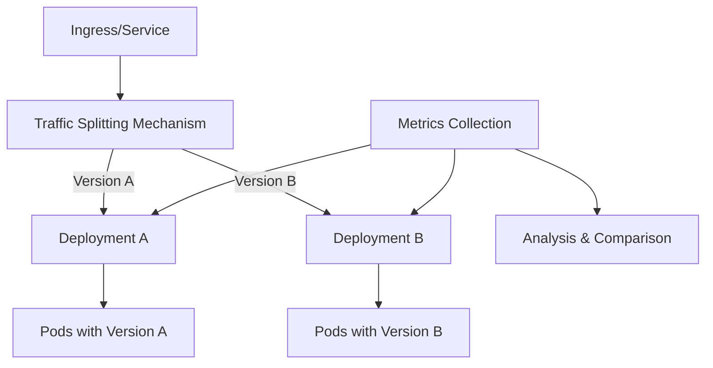

# Kubernetes A/B Testing

## Introduction

A/B testing (also known as split testing) is a methodology for comparing two versions of an application or webpage against each other to determine which one performs better. In the context of Kubernetes, A/B testing allows you to route different portions of traffic to different versions of your application, enabling you to gather real user feedback while minimizing risk.

Unlike canary deployments, which typically route a small percentage of traffic to a new version and gradually increase it, A/B testing focuses on comparing specific variations to make data-driven decisions about features, UI changes, or performance improvements.

## Prerequisites

Before diving into A/B testing with Kubernetes, you should have:

- A working Kubernetes cluster
- `kubectl` command-line tool configured
- Basic understanding of Kubernetes Deployments and Services
- Familiarity with Kubernetes resource YAML files

## How A/B Testing Works in Kubernetes

In Kubernetes, A/B testing is typically implemented through:

1. **Multiple Deployments**: Different versions of your application running simultaneously
2. **Service with Selectors**: A Service that routes traffic to both versions
3. **Traffic Splitting**: Rules that determine how traffic is distributed

Let's visualize the basic architecture:



## Implementing A/B Testing in Kubernetes

There are several ways to implement A/B testing in Kubernetes. We'll explore the most common approaches:

### 1. Using Service with Labels and Selectors

This is the simplest approach, using Kubernetes' built-in features.

#### Step 1: Create two deployments for different versions

```yaml
# version-a.yaml
apiVersion: apps/v1
kind: Deployment
metadata:
  name: myapp-v1
  labels:
    app: myapp
    version: v1
spec:
  replicas: 3
  selector:
    matchLabels:
      app: myapp
      version: v1
  template:
    metadata:
      labels:
        app: myapp
        version: v1
    spec:
      containers:
      - name: myapp
        image: myapp:v1
        ports:
        - containerPort: 8080
---
# version-b.yaml
apiVersion: apps/v1
kind: Deployment
metadata:
  name: myapp-v2
  labels:
    app: myapp
    version: v2
spec:
  replicas: 3
  selector:
    matchLabels:
      app: myapp
      version: v2
  template:
    metadata:
      labels:
        app: myapp
        version: v2
    spec:
      containers:
      - name: myapp
        image: myapp:v2
        ports:
        - containerPort: 8080
```

#### Step 2: Create a service that targets both deployments

```yaml
# service.yaml
apiVersion: v1
kind: Service
metadata:
  name: myapp-service
spec:
  selector:
    app: myapp  # Only selecting on app, not version
  ports:
  - port: 80
    targetPort: 8080
  type: ClusterIP
```

This service will route traffic to all pods with the label `app: myapp`, which includes both versions.

#### Step 3: Deploy and test

```bash
kubectl apply -f version-a.yaml
kubectl apply -f version-b.yaml
kubectl apply -f service.yaml
```

With this setup, traffic will be distributed roughly equally between both versions based on the number of replicas. To adjust the ratio, you can change the number of replicas in each deployment.

### 2. Using Istio for Advanced Traffic Splitting

For more precise control over traffic distribution, Istio (a service mesh) provides powerful features.

#### Step 1: Install Istio on your cluster

Follow the [Istio installation guide](https://istio.io/latest/docs/setup/getting-started/).

#### Step 2: Create deployments as before

Create the same deployments as in the previous example.

#### Step 3: Create an Istio VirtualService for traffic splitting

```yaml
# virtual-service.yaml
apiVersion: networking.istio.io/v1alpha3
kind: VirtualService
metadata:
  name: myapp-virtual-service
spec:
  hosts:
  - myapp-service
  http:
  - route:
    - destination:
        host: myapp-service
        subset: v1
      weight: 75
    - destination:
        host: myapp-service
        subset: v2
      weight: 25
---
apiVersion: networking.istio.io/v1alpha3
kind: DestinationRule
metadata:
  name: myapp-destination-rule
spec:
  host: myapp-service
  subsets:
  - name: v1
    labels:
      version: v1
  - name: v2
    labels:
      version: v2
```

This configuration routes 75% of traffic to version 1 and 25% to version 2.

#### Step 4: Apply the configuration

```bash
kubectl apply -f virtual-service.yaml
```

### 3. Using Argo Rollouts

Argo Rollouts provides Kubernetes-native deployment capabilities with progressive delivery features.

#### Step 1: Install Argo Rollouts

```bash
kubectl create namespace argo-rollouts
kubectl apply -n argo-rollouts -f https://github.com/argoproj/argo-rollouts/releases/latest/download/install.yaml
```

#### Step 2: Create a Rollout resource

```yaml
# rollout.yaml
apiVersion: argoproj.io/v1alpha1
kind: Rollout
metadata:
  name: myapp-rollout
spec:
  replicas: 6
  selector:
    matchLabels:
      app: myapp
  template:
    metadata:
      labels:
        app: myapp
    spec:
      containers:
      - name: myapp
        image: myapp:v1
        ports:
        - containerPort: 8080
  strategy:
    canary:
      steps:
      - setWeight: 20
      - pause: {duration: 1h}
      - setWeight: 40
      - pause: {duration: 1h}
      - setWeight: 60
      - pause: {duration: 1h}
      - setWeight: 80
      - pause: {duration: 1h}
```

This configuration gradually shifts traffic from the old version to the new version over time, allowing for comparison.

## Collecting and Analyzing Metrics

To make informed decisions from your A/B test, you need to collect relevant metrics:

### 1. Add a metrics collection solution

Popular options include:
- Prometheus for gathering performance metrics
- Fluentd for logging
- Jaeger for tracing

### 2. Deploy Prometheus and Grafana

```yaml
# prometheus.yaml (simplified)
apiVersion: apps/v1
kind: Deployment
metadata:
  name: prometheus
spec:
  replicas: 1
  selector:
    matchLabels:
      app: prometheus
  template:
    metadata:
      labels:
        app: prometheus
    spec:
      containers:
      - name: prometheus
        image: prom/prometheus:v2.30.3
        ports:
        - containerPort: 9090
---
apiVersion: v1
kind: Service
metadata:
  name: prometheus
spec:
  selector:
    app: prometheus
  ports:
  - port: 9090
  type: ClusterIP
```

### 3. Configure services to expose metrics

Add Prometheus annotations to your deployment:

```yaml
metadata:
  annotations:
    prometheus.io/scrape: "true"
    prometheus.io/port: "8080"
    prometheus.io/path: "/metrics"
```

### 4. Create custom dashboards to compare versions

For Grafana, create dashboards that show key metrics for each version side by side:
- Response time
- Error rate
- Conversion rate
- User engagement

## Real-world Example: A/B Testing a New User Interface

Let's walk through a complete example of A/B testing a new user interface for a web application.

### Scenario

Your team has developed a new UI for your web application and wants to test it with real users to see if it increases the conversion rate.

### Step 1: Prepare two versions of the application

```yaml
# original-ui.yaml
apiVersion: apps/v1
kind: Deployment
metadata:
  name: webapp-original
  labels:
    app: webapp
    version: original
spec:
  replicas: 4
  selector:
    matchLabels:
      app: webapp
      version: original
  template:
    metadata:
      labels:
        app: webapp
        version: original
    spec:
      containers:
      - name: webapp
        image: mycompany/webapp:original
        ports:
        - containerPort: 80
---
# new-ui.yaml
apiVersion: apps/v1
kind: Deployment
metadata:
  name: webapp-new
  labels:
    app: webapp
    version: new
spec:
  replicas: 4
  selector:
    matchLabels:
      app: webapp
      version: new
  template:
    metadata:
      labels:
        app: webapp
        version: new
    spec:
      containers:
      - name: webapp
        image: mycompany/webapp:new-ui
        ports:
        - containerPort: 80
```

### Step 2: Create a service for traffic distribution

```yaml
# webapp-service.yaml
apiVersion: v1
kind: Service
metadata:
  name: webapp-service
spec:
  selector:
    app: webapp
  ports:
  - port: 80
    targetPort: 80
  type: ClusterIP
```

### Step 3: Implement traffic splitting with Istio

```yaml
# webapp-split.yaml
apiVersion: networking.istio.io/v1alpha3
kind: VirtualService
metadata:
  name: webapp-virtual-service
spec:
  hosts:
  - webapp-service
  http:
  - route:
    - destination:
        host: webapp-service
        subset: original
      weight: 50
    - destination:
        host: webapp-service
        subset: new
      weight: 50
---
apiVersion: networking.istio.io/v1alpha3
kind: DestinationRule
metadata:
  name: webapp-destination-rule
spec:
  host: webapp-service
  subsets:
  - name: original
    labels:
      version: original
  - name: new
    labels:
      version: new
```

### Step 4: Deploy analytics tools and tracking

```yaml
# analytics.yaml
apiVersion: apps/v1
kind: Deployment
metadata:
  name: analytics-collector
spec:
  replicas: 1
  selector:
    matchLabels:
      app: analytics
  template:
    metadata:
      labels:
        app: analytics
    spec:
      containers:
      - name: analytics
        image: mycompany/analytics:1.0
        ports:
        - containerPort: 8080
---
apiVersion: v1
kind: Service
metadata:
  name: analytics-service
spec:
  selector:
    app: analytics
  ports:
  - port: 80
    targetPort: 8080
  type: ClusterIP
```

### Step 5: Configure client-side code to report metrics

```javascript
// Include in your application frontend
function reportConversion(version) {
  fetch('/api/analytics/conversion', {
    method: 'POST',
    headers: {
      'Content-Type': 'application/json',
    },
    body: JSON.stringify({
      version: version,
      timestamp: new Date().toISOString(),
      userAgent: navigator.userAgent,
      // Additional data
    }),
  });
}

// Call when user completes desired action
document.getElementById('signup-button').addEventListener('click', () => {
  reportConversion(document.body.getAttribute('data-version'));
});
```

### Step 6: Run the test for a statistically significant period

Typically, A/B tests should run for at least 1-2 weeks to account for daily and weekly fluctuations.

### Step 7: Analyze results and make decisions

After collecting sufficient data, analyze the metrics to determine which version performed better. Based on the results, you can:

1. Roll out the winning version to all users
2. Refine further and run additional tests
3. Revert to the original if the new version doesn't show improvements

## Best Practices for Kubernetes A/B Testing

### 1. Use consistent metrics

Define clear KPIs (Key Performance Indicators) before starting the test:
- Conversion rates
- Engagement metrics
- Performance metrics (load time, response time)
- Error rates

### 2. Ensure proper randomization

Users should be randomly assigned to either version A or B to avoid bias.

### 3. Run tests for sufficient time

Short test periods may yield unreliable results due to:
- Daily traffic patterns
- Weekly usage patterns
- External factors (marketing campaigns, etc.)

### 4. Control for external variables

Try to isolate the impact of your changes by:
- Running tests during a stable period
- Avoiding major holidays or special events
- Not making other significant changes during the test

### 5. Use feature flags for client-side A/B testing

For frontend changes, consider using feature flags in addition to routing:

```javascript
// Example of a feature flag implementation
if (userFeatureFlags.newUI === true) {
  // Show new UI components
} else {
  // Show original UI components
}
```

### 6. Set up proper monitoring and alerting

Ensure you can detect if either version experiences issues during the test:

```yaml
# alert-rule.yaml
apiVersion: monitoring.coreos.com/v1
kind: PrometheusRule
metadata:
  name: ab-test-alerts
spec:
  groups:
  - name: ab-testing
    rules:
    - alert: VersionErrorRateHigh
      expr: sum(rate(http_requests_total{status=~"5.."}[5m])) by (version) / sum(rate(http_requests_total[5m])) by (version) > 0.05
      for: 1m
      labels:
        severity: warning
      annotations:
        summary: "High error rate detected in version {{ $labels.version }}"
        description: "Error rate for version {{ $labels.version }} is above 5% for the last 5 minutes"
```

## Common Challenges and Solutions

### Challenge 1: Session persistence

**Problem**: Users might be confused if they see different versions on different visits.

**Solution**: Use session-based routing or cookies to maintain version consistency:

```yaml
# istio-session-affinity.yaml
apiVersion: networking.istio.io/v1alpha3
kind: VirtualService
metadata:
  name: webapp-virtual-service
spec:
  hosts:
  - webapp-service
  http:
  - match:
    - headers:
        cookie:
          regex: ".*version=original.*"
    route:
    - destination:
        host: webapp-service
        subset: original
  - match:
    - headers:
        cookie:
          regex: ".*version=new.*"
    route:
    - destination:
        host: webapp-service
        subset: new
  - route:
    - destination:
        host: webapp-service
        subset: original
      weight: 50
    - destination:
        host: webapp-service
        subset: new
      weight: 50
```

### Challenge 2: Statistical significance

**Problem**: Determining when you have enough data to make a decision.

**Solution**: Use statistical analysis tools and ensure sample sizes are large enough:

```python
# Example statistical analysis
from scipy import stats
import numpy as np

# Conversion data
version_a_conversions = 120
version_a_total = 1000
version_b_conversions = 150
version_b_total = 1000

# Calculate conversion rates
rate_a = version_a_conversions / version_a_total
rate_b = version_b_conversions / version_b_total

# Perform statistical test
z_score, p_value = stats.proportions_ztest(
    [version_a_conversions, version_b_conversions],
    [version_a_total, version_b_total]
)

print(f"Conversion rate A: {rate_a*100:.2f}%")
print(f"Conversion rate B: {rate_b*100:.2f}%")
print(f"p-value: {p_value:.4f}")

if p_value < 0.05:
    print("Result is statistically significant")
else:
    print("Result is not statistically significant yet")
```

### Challenge 3: Complex deployments

**Problem**: Managing multiple versions can become complex.

**Solution**: Use GitOps tools like Argo CD or Flux to manage deployment configurations:

```yaml
# argocd-application.yaml
apiVersion: argoproj.io/v1alpha1
kind: Application
metadata:
  name: ab-test-webapp
spec:
  project: default
  source:
    repoURL: https://github.com/mycompany/webapp
    targetRevision: HEAD
    path: k8s/ab-test
  destination:
    server: https://kubernetes.default.svc
    namespace: webapp
  syncPolicy:
    automated:
      prune: true
      selfHeal: true
```

## Combining A/B Testing with Other Deployment Strategies

A/B testing can be combined with other advanced deployment strategies for more sophisticated testing:

### A/B Testing + Canary Deployments

1. Use canary deployments to gradually roll out a new version to a small percentage of users
2. Once stable, use A/B testing to compare specific metrics between versions

```yaml
# combined-strategy.yaml
apiVersion: argoproj.io/v1alpha1
kind: Rollout
metadata:
  name: webapp-rollout
spec:
  replicas: 10
  selector:
    matchLabels:
      app: webapp
  template:
    metadata:
      labels:
        app: webapp
    spec:
      containers:
      - name: webapp
        image: mycompany/webapp:v2
  strategy:
    canary:
      steps:
      - setWeight: 10
      - pause: {duration: 1h}
      - setWeight: 50  # A/B testing phase
      - pause: {duration: 72h}  # Collect metrics for comparison
      - setWeight: 100  # Full rollout if successful
```

### A/B Testing + Feature Flags

Use Kubernetes for routing traffic at the service level, and feature flags for more granular testing:

```yaml
# config-map.yaml
apiVersion: v1
kind: ConfigMap
metadata:
  name: feature-flags
data:
  flags.json: |
    {
      "newCheckout": {
        "enabled": true,
        "audience": {
          "percentage": 50,
          "include": ["beta-users"]
        }
      },
      "newNavbar": {
        "enabled": true,
        "audience": {
          "percentage": 25
        }
      }
    }
```

## Summary

A/B testing in Kubernetes provides a powerful way to compare different versions of your application with real users. By leveraging Kubernetes' routing capabilities along with more advanced tools like Istio, you can implement sophisticated testing strategies to make data-driven decisions.

Key points to remember:
1. Kubernetes native resources can provide basic A/B testing capabilities
2. Service meshes like Istio offer more precise traffic control
3. Proper metrics collection and analysis are essential
4. Consider user experience during the test
5. Run tests for statistically significant periods
6. Combine with other deployment strategies for more sophisticated workflows

## Exercises

1. Set up a basic A/B test using only Kubernetes native resources (Deployments and Services).
2. Implement an A/B test using Istio, with a 70/30 traffic split.
3. Create a monitoring dashboard that compares key metrics between two versions.
4. Write a script that determines if your A/B test results are statistically significant.
5. Design an A/B testing strategy for a mobile application backend that preserves session affinity.

## Additional Resources

- [Kubernetes Documentation](https://kubernetes.io/docs/)
- [Istio Traffic Management](https://istio.io/latest/docs/concepts/traffic-management/)
- [Argo Rollouts](https://argoproj.github.io/argo-rollouts/)
- [A/B Testing Statistical Significance](https://www.optimizely.com/optimization-glossary/statistical-significance/)
- [Prometheus Monitoring](https://prometheus.io/docs/introduction/overview/)