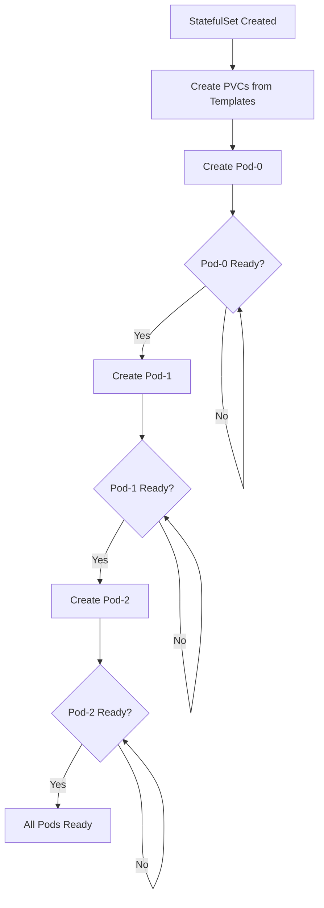

# Kubernetes StatefulSets

## Introduction

When deploying applications in Kubernetes, you may encounter scenarios where your applications need to maintain state, require stable network identities, or need orderly deployment and scaling. While Deployments work well for stateless applications, Kubernetes provides StatefulSets specifically for managing stateful applications.

StatefulSets are a workload API object used to manage stateful applications. Unlike Deployments and ReplicaSets, which are designed for stateless applications, StatefulSets maintain a sticky identity for each of their Pods. These pods are created from the same specification, but are not interchangeable: each has a persistent identifier that it maintains across any rescheduling.

## Why StatefulSets?

Before diving into the implementation details, let's understand the problems StatefulSets solve:

1. **Stable, unique network identifiers** - Each pod in a StatefulSet gets a persistent hostname with a predictable naming pattern
2. **Stable, persistent storage** - Storage volumes survive even if the pods are rescheduled or deleted
3. **Ordered, graceful deployment and scaling** - Pods are created and terminated in a predictable order
4. **Ordered, automated rolling updates** - Updates to pods follow a predictable pattern

## StatefulSets vs Deployments

Here's a quick comparison to help differentiate when to use each:

| Feature | StatefulSet | Deployment |
|---------|-------------|------------|
| Pod Identity | Stable, persistent | Random, ephemeral |
| Pod Names | Predictable (name-0, name-1) | Random (name-7f68c, name-2cp8h) |
| DNS Names | Stable, headless service provides DNS identity | Service provides random DNS identity |
| Volume Management | Creates PVCs automatically | Requires manual PVC creation |
| Scaling Order | Sequential (0, 1, 2...) | Parallel |
| Deletion Order | Sequential reverse order | Parallel |
| Use Case | Stateful applications | Stateless applications |

## Creating a StatefulSet

Let's create a simple StatefulSet to understand its components:

```yaml
apiVersion: v1
kind: Service
metadata:
  name: nginx
  labels:
    app: nginx
spec:
  ports:
  - port: 80
    name: web
  clusterIP: None
  selector:
    app: nginx
---
apiVersion: apps/v1
kind: StatefulSet
metadata:
  name: web
spec:
  selector:
    matchLabels:
      app: nginx # has to match .spec.template.metadata.labels
  serviceName: "nginx"
  replicas: 3 # by default is 1
  template:
    metadata:
      labels:
        app: nginx # has to match .spec.selector.matchLabels
    spec:
      containers:
      - name: nginx
        image: nginx:1.20
        ports:
        - containerPort: 80
          name: web
        volumeMounts:
        - name: www
          mountPath: /usr/share/nginx/html
  volumeClaimTemplates:
  - metadata:
      name: www
    spec:
      accessModes: [ "ReadWriteOnce" ]
      resources:
        requests:
          storage: 1Gi
```

Let's break down the key components:

1. **Headless Service**: The Service with `clusterIP: None` creates a headless service that provides network identity for the pods.
2. **StatefulSet Definition**: The main StatefulSet object that defines how our stateful application should be deployed.
3. **volumeClaimTemplates**: This automatically creates PersistentVolumeClaims for each pod in the StatefulSet.

## Deploying the StatefulSet

Save the above YAML to a file named `web-statefulset.yaml` and apply it:

```bash
kubectl apply -f web-statefulset.yaml
```

After deployment, you'll see pods created sequentially:

```
$ kubectl get pods
NAME    READY   STATUS    RESTARTS   AGE
web-0   1/1     Running   0          1m
web-1   1/1     Running   0          40s
web-2   1/1     Running   0          20s
```

## Pod Identity and DNS

Each pod in a StatefulSet gets a stable DNS name in the format:

```
<pod-name>.<service-name>.<namespace>.svc.cluster.local
```

For our example, these would be:

```
web-0.nginx.default.svc.cluster.local
web-1.nginx.default.svc.cluster.local
web-2.nginx.default.svc.cluster.local
```

You can verify this by running a temporary pod and using `nslookup`:

```bash
kubectl run -i --tty --image busybox:1.28 dns-test --restart=Never --rm -- nslookup web-0.nginx
```

Output:
```
Server:    10.96.0.10
Address 1: 10.96.0.10 kube-dns.kube-system.svc.cluster.local

Name:      web-0.nginx
Address 1: 172.17.0.3
```

## Scaling StatefulSets

When scaling up a StatefulSet, pods are created sequentially, in order from 0 to N-1:

```bash
kubectl scale statefulset web --replicas=5
```

When scaling down, pods are removed in reverse order:

```bash
kubectl scale statefulset web --replicas=2
```

This would remove `web-4`, then `web-3`, and finally `web-2`.

## Updating StatefulSets

StatefulSets support two update strategies:

1. **RollingUpdate** (default): Updates pods one at a time, in reverse ordinal order.
2. **OnDelete**: Provides manual update control - you must manually delete pods to trigger updates.

To update our StatefulSet, modify the YAML file and reapply it:

```yaml
spec:
  updateStrategy:
    type: RollingUpdate
  template:
    spec:
      containers:
      - name: nginx
        image: nginx:1.21  # Updated image version
```

## Persistent Storage with StatefulSets

One of the most important features of StatefulSets is how they handle persistent storage. The `volumeClaimTemplates` section creates a unique PersistentVolumeClaim for each pod.

Let's see how data persistence works:

```bash
# Write data to pod 0
kubectl exec web-0 -- sh -c 'echo "Hello from web-0" > /usr/share/nginx/html/index.html'

# Write data to pod 1
kubectl exec web-1 -- sh -c 'echo "Hello from web-1" > /usr/share/nginx/html/index.html'

# Check the data
kubectl exec web-0 -- curl localhost
# Output: Hello from web-0

kubectl exec web-1 -- curl localhost
# Output: Hello from web-1
```

Now, delete the pods and see that the data persists:

```bash
kubectl delete pod web-0 web-1
kubectl get pods # wait for pods to be recreated

# Check the data again
kubectl exec web-0 -- curl localhost
# Output: Hello from web-0

kubectl exec web-1 -- curl localhost
# Output: Hello from web-1
```

## Real-World Use Cases

### 1. Databases

StatefulSets are perfect for database deployments such as MySQL, PostgreSQL, or MongoDB. The following is a simplified example of a MongoDB replica set:

```yaml
apiVersion: apps/v1
kind: StatefulSet
metadata:
  name: mongodb
spec:
  serviceName: "mongodb"
  replicas: 3
  selector:
    matchLabels:
      app: mongodb
  template:
    metadata:
      labels:
        app: mongodb
    spec:
      containers:
      - name: mongodb
        image: mongo:4.4
        ports:
        - containerPort: 27017
          name: mongo
        command:
        - mongod
        - "--replSet"
        - rs0
        - "--bind_ip_all"
        volumeMounts:
        - name: data
          mountPath: /data/db
  volumeClaimTemplates:
  - metadata:
      name: data
    spec:
      accessModes: [ "ReadWriteOnce" ]
      resources:
        requests:
          storage: 10Gi
```

After deployment, you'd need to initialize the replica set:

```bash
kubectl exec mongodb-0 -- mongo --eval 'rs.initiate({
  _id: "rs0",
  members: [
    { _id: 0, host: "mongodb-0.mongodb:27017" },
    { _id: 1, host: "mongodb-1.mongodb:27017" },
    { _id: 2, host: "mongodb-2.mongodb:27017" }
  ]
})'
```

### 2. Distributed Systems

StatefulSets work well for distributed coordination systems like ZooKeeper or etcd:

```yaml
apiVersion: apps/v1
kind: StatefulSet
metadata:
  name: zk
spec:
  serviceName: "zookeeper"
  replicas: 3
  selector:
    matchLabels:
      app: zookeeper
  template:
    metadata:
      labels:
        app: zookeeper
    spec:
      containers:
      - name: zookeeper
        image: k8s.gcr.io/kubernetes-zookeeper:1.0-3.4.10
        ports:
        - containerPort: 2181
          name: client
        - containerPort: 2888
          name: server
        - containerPort: 3888
          name: leader-election
        volumeMounts:
        - name: data
          mountPath: /var/lib/zookeeper
  volumeClaimTemplates:
  - metadata:
      name: data
    spec:
      accessModes: [ "ReadWriteOnce" ]
      resources:
        requests:
          storage: 10Gi
```

## Advanced StatefulSet Configurations

### Pod Management Policy

By default, StatefulSets create and terminate pods sequentially. However, you can change this behavior:

```yaml
spec:
  podManagementPolicy: Parallel  # Default is OrderedReady
```

With `Parallel`, pods will be launched or terminated in parallel, which can speed up deployment but sacrifices the guarantees of ordered creation and deletion.

### Partition Updates

You can perform canary deployments by setting a partition:

```yaml
spec:
  updateStrategy:
    type: RollingUpdate
    rollingUpdate:
      partition: 2
```

With this setting, only pods with an ordinal >= 2 will be updated, allowing you to test changes on a subset of pods.

## Visualization: StatefulSet Pod Creation Flow



## Common Pitfalls and Best Practices

### 1. Deleting a StatefulSet

When you delete a StatefulSet without deleting its pods:

```bash
kubectl delete statefulset web --cascade=false
```

The pods remain, allowing you to recreate the StatefulSet without disruption or data loss.

### 2. Headless Service Is Required

Always create a headless service for your StatefulSet - it's not optional. Without it, the pods won't get their stable network identities.

### 3. Storage Class Considerations

Make sure your cluster has a StorageClass that supports the access modes required by your StatefulSet. For example, `ReadWriteOnce` is most common, but some applications might need `ReadWriteMany`.

### 4. Pod Disruption Budgets

Use Pod Disruption Budgets (PDBs) to ensure high availability during voluntary disruptions:

```yaml
apiVersion: policy/v1
kind: PodDisruptionBudget
metadata:
  name: web-pdb
spec:
  minAvailable: 2
  selector:
    matchLabels:
      app: nginx
```

## Summary

StatefulSets are a powerful Kubernetes resource for deploying stateful applications that require:

- Stable, unique network identifiers
- Stable, persistent storage
- Ordered, graceful deployment and scaling
- Ordered, automated rolling updates

They're ideal for databases, distributed systems, and any application that needs to maintain state across pod restarts or reschedules.

Remember that StatefulSets come with more complexity than Deployments. Only use them when your application truly needs the features they provide.

## Exercises

1. **Basic StatefulSet**: Deploy a 3-replica StatefulSet running a simple nginx web server with persistent storage.
2. **Database Cluster**: Deploy a MongoDB replica set using StatefulSets with 3 replicas.
3. **Rolling Updates**: Update a StatefulSet's container image version and observe the rolling update process.
4. **Scaling**: Scale a StatefulSet up and down and observe the order of pod creation and termination.
5. **Failure Recovery**: Delete a pod in a StatefulSet and observe how Kubernetes recovers it with the same identity and storage.

## Additional Resources

- [Kubernetes Documentation: StatefulSets](https://kubernetes.io/docs/concepts/workloads/controllers/statefulset/)
- [Kubernetes Tutorial: StatefulSet Basics](https://kubernetes.io/docs/tutorials/stateful-application/basic-stateful-set/)
- [Kubernetes Tutorial: Deploying Cassandra with StatefulSets](https://kubernetes.io/docs/tutorials/stateful-application/cassandra/)