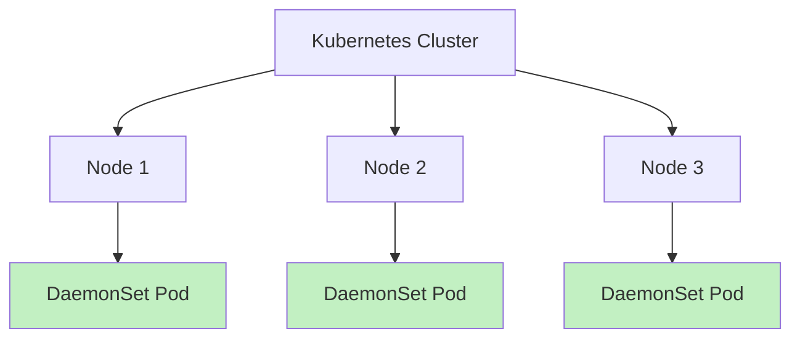

# Kubernetes DaemonSets

## Introduction

In the world of Kubernetes, different workload resources serve different purposes. While Deployments are great for stateless applications and StatefulSets handle stateful applications, there's another powerful resource called **DaemonSets** that solves a specific problem: running a copy of a pod on every node in your cluster (or a subset of nodes).

DaemonSets ensure that as nodes are added to your cluster, pods are automatically added to them, and as nodes are removed, those pods are garbage collected. They're perfect for cluster-wide operations like monitoring, logging, or network management.

## What is a DaemonSet?

A DaemonSet is a Kubernetes controller that ensures that a copy of a pod runs on all (or some) nodes in a cluster. As new nodes join the cluster, pods are added to them. As nodes are removed from the cluster, those pods are garbage collected.

DaemonSets are particularly useful for:

- Running cluster storage daemons (e.g., `ceph`, `glusterd`)
- Running logging collectors (e.g., `fluentd`, `logstash`)
- Running monitoring agents (e.g., `Prometheus Node Exporter`, `collectd`)
- Running network plugins (e.g., `Calico`, `Cilium`)

## How DaemonSets Work

Let's visualize how DaemonSets ensure that pods run on every node in a cluster:



The DaemonSet controller watches for node additions and removals, and automatically adjusts the pod count to match the number of eligible nodes.

## Creating a DaemonSet

Let's create a simple DaemonSet that runs a Prometheus Node Exporter on every node in our cluster:

```yaml
apiVersion: apps/v1
kind: DaemonSet
metadata:
  name: node-exporter
  namespace: monitoring
spec:
  selector:
    matchLabels:
      app: node-exporter
  template:
    metadata:
      labels:
        app: node-exporter
    spec:
      containers:
      - name: node-exporter
        image: prom/node-exporter:latest
        ports:
        - containerPort: 9100
          protocol: TCP
          name: metrics
        resources:
          limits:
            cpu: 100m
            memory: 100Mi
          requests:
            cpu: 50m
            memory: 50Mi
        volumeMounts:
        - name: proc
          mountPath: /host/proc
          readOnly: true
        - name: sys
          mountPath: /host/sys
          readOnly: true
      volumes:
      - name: proc
        hostPath:
          path: /proc
      - name: sys
        hostPath:
          path: /sys
      tolerations:
      - operator: Exists
```

Save this definition to a file named `node-exporter-daemonset.yaml` and apply it:

```bash
kubectl apply -f node-exporter-daemonset.yaml
```

After applying this manifest, you can check if the DaemonSet was created successfully:

```bash
kubectl get daemonsets -n monitoring
```

Expected output:

```
NAME            DESIRED   CURRENT   READY   UP-TO-DATE   AVAILABLE   NODE SELECTOR   AGE
node-exporter   3         3         3       3            3           <none>          1m
```

In this output, you'll see that the `DESIRED` number matches the number of nodes in your cluster.

## DaemonSet Scheduling

By default, DaemonSets will deploy pods to all nodes in your cluster. However, you can control this behavior using node selectors, affinity rules, or taints and tolerations.

### Node Selectors

To run your DaemonSet only on specific nodes, you can use a `nodeSelector`:

```yaml
spec:
  template:
    spec:
      nodeSelector:
        role: monitoring
```

With this configuration, the DaemonSet will only create pods on nodes that have the label `role=monitoring`.

### Using Node Affinity

For more complex scheduling rules, you can use node affinity:

```yaml
spec:
  template:
    spec:
      affinity:
        nodeAffinity:
          requiredDuringSchedulingIgnoredDuringExecution:
            nodeSelectorTerms:
            - matchExpressions:
              - key: kubernetes.io/os
                operator: In
                values:
                - linux
```

This example ensures that the DaemonSet pods only run on Linux nodes.

### Taints and Tolerations

Some nodes in your cluster might have taints to prevent regular pods from being scheduled on them. For DaemonSets to work on those nodes, you need to add tolerations:

```yaml
spec:
  template:
    spec:
      tolerations:
      - key: node-role.kubernetes.io/master
        effect: NoSchedule
        operator: Exists
```

This toleration allows the DaemonSet pods to be scheduled on master nodes, which are typically tainted with `node-role.kubernetes.io/master:NoSchedule`.

## Updating DaemonSets

Kubernetes supports rolling updates for DaemonSets, similar to Deployments. You can control the update strategy with these fields:

```yaml
spec:
  updateStrategy:
    type: RollingUpdate
    rollingUpdate:
      maxUnavailable: 1
```

There are two update strategies available:

1. **RollingUpdate**: This is the default strategy. It updates one pod at a time.
2. **OnDelete**: The DaemonSet controller will not automatically update pods when the template changes. Instead, you must manually delete old pods to trigger new pod creation.

## Real-World Examples

Let's look at some practical examples of DaemonSets in action:

### Example 1: Logging Agent

Running a logging agent like Fluentd to collect logs from all nodes:

```yaml
apiVersion: apps/v1
kind: DaemonSet
metadata:
  name: fluentd
  namespace: logging
spec:
  selector:
    matchLabels:
      app: fluentd
  template:
    metadata:
      labels:
        app: fluentd
    spec:
      containers:
      - name: fluentd
        image: fluent/fluentd:v1.14
        volumeMounts:
        - name: varlog
          mountPath: /var/log
        - name: varlibdockercontainers
          mountPath: /var/lib/docker/containers
          readOnly: true
      volumes:
      - name: varlog
        hostPath:
          path: /var/log
      - name: varlibdockercontainers
        hostPath:
          path: /var/lib/docker/containers
```

### Example 2: Network Plugin

Running a CNI network plugin like Calico on all nodes:

```yaml
apiVersion: apps/v1
kind: DaemonSet
metadata:
  name: calico-node
  namespace: kube-system
spec:
  selector:
    matchLabels:
      k8s-app: calico-node
  template:
    metadata:
      labels:
        k8s-app: calico-node
    spec:
      hostNetwork: true
      containers:
      - name: calico-node
        image: calico/node:v3.22.0
        env:
          - name: DATASTORE_TYPE
            value: "kubernetes"
        securityContext:
          privileged: true
        volumeMounts:
        - name: lib-modules
          mountPath: /lib/modules
          readOnly: true
        - name: var-run-calico
          mountPath: /var/run/calico
      volumes:
      - name: lib-modules
        hostPath:
          path: /lib/modules
      - name: var-run-calico
        hostPath:
          path: /var/run/calico
```

### Example 3: Storage Daemon

Running a GlusterFS client on nodes that need to access a distributed filesystem:

```yaml
apiVersion: apps/v1
kind: DaemonSet
metadata:
  name: glusterfs-client
  namespace: storage
spec:
  selector:
    matchLabels:
      app: glusterfs-client
  template:
    metadata:
      labels:
        app: glusterfs-client
    spec:
      nodeSelector:
        storage: "true"
      containers:
      - name: glusterfs
        image: gluster/gluster-centos:latest
        securityContext:
          privileged: true
        volumeMounts:
        - name: glusterfs-client
          mountPath: /var/lib/glusterd
      volumes:
      - name: glusterfs-client
        hostPath:
          path: /var/lib/glusterd
```

## DaemonSet Best Practices

1. **Resource Limits**: Always set CPU and memory limits for your DaemonSet pods to prevent them from consuming too many resources on the nodes.

2. **Node Affinity**: Use node affinity rather than nodeSelector for more complex scheduling requirements.

3. **Tolerations**: Add appropriate tolerations to ensure your DaemonSet pods can be scheduled on all required nodes, including tainted ones.

4. **Security Context**: Run DaemonSet pods with the minimum required privileges. Avoid using `privileged: true` unless absolutely necessary.

5. **Health Checks**: Implement liveness and readiness probes to ensure your DaemonSet pods are functioning correctly.

```yaml
spec:
  template:
    spec:
      containers:
      - name: node-exporter
        livenessProbe:
          httpGet:
            path: /metrics
            port: 9100
          initialDelaySeconds: 30
          periodSeconds: 10
        readinessProbe:
          httpGet:
            path: /metrics
            port: 9100
          initialDelaySeconds: 5
          periodSeconds: 10
```

## Common Issues and Troubleshooting

### DaemonSet Pods Not Scheduling

If your DaemonSet pods aren't being scheduled on some nodes, check:

1. Node selectors or affinity rules in your DaemonSet spec
2. Taints on the nodes and tolerations in your DaemonSet spec
3. Resource constraints - ensure nodes have enough resources

Command to check if nodes have taints:

```bash
kubectl get nodes -o json | jq '.items[].spec.taints'
```

### Updating a DaemonSet

If you're having trouble updating a DaemonSet, you can check the status of the rollout:

```bash
kubectl rollout status daemonset/node-exporter -n monitoring
```

If the rollout is stuck, you might need to force it:

```bash
kubectl rollout restart daemonset/node-exporter -n monitoring
```

## DaemonSets vs Other Workloads

Let's compare DaemonSets with other Kubernetes workload resources:

| Feature | DaemonSet | Deployment | StatefulSet |
|---------|-----------|------------|-------------|
| Purpose | Run pod on every node | Run stateless apps | Run stateful apps |
| Scaling | Automatic based on nodes | Manual or auto | Manual or auto |
| Pod identity | Node-specific | Random | Stable identity |
| Use cases | Monitoring, logging | Web servers, API | Databases, queues |

## Summary

DaemonSets are a powerful Kubernetes resource that ensures every node (or a subset of nodes) in your cluster runs a copy of a specific pod. They're perfect for background processes that need to run everywhere, such as monitoring agents, logging collectors, and networking components.

Key points to remember:

- DaemonSets automatically deploy pods to new nodes as they join the cluster
- You can use node selectors, affinity, or tolerations to target specific nodes
- DaemonSets support rolling updates, just like Deployments
- Common use cases include monitoring agents, logging collectors, and networking plugins

## Exercises

1. Create a DaemonSet that runs a simple web server on every node in your cluster and exposes it on the node's IP.

2. Modify your DaemonSet to run only on nodes with the label `role=worker`.

3. Practice updating your DaemonSet with a new container image using rolling updates.

4. Create a DaemonSet that mounts a host directory and writes some monitoring data to it.

## Additional Resources

- [Kubernetes Official Documentation on DaemonSets](https://kubernetes.io/docs/concepts/workloads/controllers/daemonset/)
- [Managing DaemonSets with kubectl](https://kubernetes.io/docs/tasks/manage-daemon/update-daemon-set/)
- [Understanding Kubernetes Node Affinity](https://kubernetes.io/docs/concepts/scheduling-eviction/assign-pod-node/)