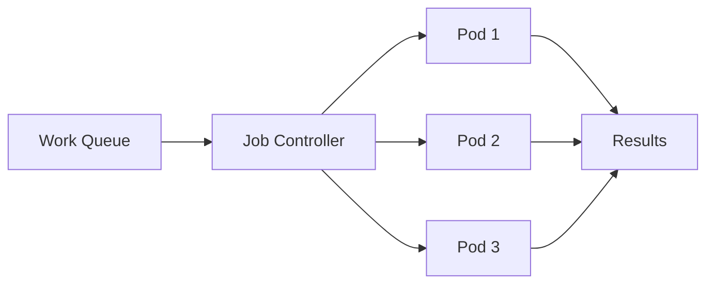

# Kubernetes Jobs

## Introduction

In Kubernetes, most workloads are designed to run continuously (like web servers or databases), but there are scenarios where you need to run a task that completes and terminates. This is where **Kubernetes Jobs** come in.

A Job creates one or more Pods that run until they successfully complete their assigned tasks. Jobs are perfect for batch processing, data migrations, sending emails, or any task that needs to run once to completion rather than continuously.

Unlike regular Pods or Deployments that restart when they complete, a Job tracks task completion and ensures the specified number of successful completions is achieved before considering the Job done.

## Basic Job Concepts

Before diving into examples, let's understand the core concepts of Kubernetes Jobs:

1. **One-time execution**: Jobs run tasks that complete and terminate, rather than running indefinitely
2. **Completion tracking**: A Job tracks the successful completion of Pods
3. **Parallelism**: Jobs can run multiple Pods in parallel
4. **Retries**: Jobs can automatically retry failed Pods
5. **Completion count**: Jobs can be configured to run a specific number of completions

## Creating Your First Job

Let's start with a simple Job that runs a Pod to print a message and then exits.

```yaml
apiVersion: batch/v1
kind: Job
metadata:
  name: hello-job
spec:
  template:
    spec:
      containers:
      - name: hello
        image: busybox
        command: ["echo", "Hello from Kubernetes Job!"]
      restartPolicy: Never
```

Let's save this file as `hello-job.yaml` and apply it to our cluster:

```bash
kubectl apply -f hello-job.yaml
```

You can check the status of your Job using:

```bash
kubectl get jobs
```

Output:
```
NAME        COMPLETIONS   DURATION   AGE
hello-job   1/1           8s         12s
```

To see the logs from the Pod created by the Job:

```bash
kubectl get pods --selector=job-name=hello-job
```

Output:
```
NAME              READY   STATUS      RESTARTS   AGE
hello-job-abcd1   0/1     Completed   0          2m
```

And to see the output of the Job:

```bash
kubectl logs $(kubectl get pods --selector=job-name=hello-job -o jsonpath='{.items[0].metadata.name}')
```

Output:
```
Hello from Kubernetes Job!
```

## Job Completion and Parallelism

Jobs can be configured to run multiple times or in parallel. This is useful for batch processing tasks that can be parallelized.

```yaml
apiVersion: batch/v1
kind: Job
metadata:
  name: parallel-job
spec:
  completions: 5      # Run 5 successful pods
  parallelism: 2      # Run up to 2 pods in parallel
  template:
    spec:
      containers:
      - name: worker
        image: busybox
        command: ["sh", "-c", "echo Processing item $RANDOM && sleep 5"]
      restartPolicy: Never
```

In this example:
- `completions: 5` means the Job will create Pods until 5 of them have successfully completed
- `parallelism: 2` means the Job will run up to 2 Pods at the same time

## Job Timeouts and Retries

It's a good practice to set timeouts for your Jobs to prevent them from running indefinitely if they encounter issues.

```yaml
apiVersion: batch/v1
kind: Job
metadata:
  name: job-with-timeout
spec:
  backoffLimit: 4           # Number of retries before job is considered failed
  activeDeadlineSeconds: 100 # The job can run for a maximum of 100 seconds
  template:
    spec:
      containers:
      - name: worker
        image: busybox
        command: ["sh", "-c", "echo Starting work && sleep 60 && echo Work completed"]
      restartPolicy: OnFailure
```

In this example:
- `backoffLimit: 4` specifies that the Job will retry failed Pods up to 4 times
- `activeDeadlineSeconds: 100` means the entire Job will be terminated if it runs for more than 100 seconds, regardless of its completion state
- `restartPolicy: OnFailure` tells Kubernetes to restart the Pod if it fails, rather than creating a new one

## Real-World Example: Database Migration Job

Let's look at a practical example: using a Job to run a database migration.

```yaml
apiVersion: batch/v1
kind: Job
metadata:
  name: db-migration
spec:
  template:
    spec:
      containers:
      - name: migration
        image: flyway/flyway:latest
        args:
        - -url=jdbc:postgresql://my-db-service:5432/mydb
        - -user=postgres
        - -password=secretpassword
        - migrate
        env:
        - name: FLYWAY_LOCATIONS
          value: filesystem:/flyway/sql
        volumeMounts:
        - name: migration-scripts
          mountPath: /flyway/sql
      volumes:
      - name: migration-scripts
        configMap:
          name: db-migration-scripts
      restartPolicy: Never
  backoffLimit: 2
```

This Job uses Flyway (a database migration tool) to apply migration scripts to a PostgreSQL database. The migration scripts are stored in a ConfigMap for easy management.

## Job Patterns

### 1. Work Queue Pattern

For processing items in a queue:



### 2. Indexed Job Pattern

For assigning specific indices to each pod in a batch job:

```yaml
apiVersion: batch/v1
kind: Job
metadata:
  name: indexed-job
spec:
  completions: 5
  parallelism: 3
  completionMode: Indexed
  template:
    spec:
      containers:
      - name: indexed-container
        image: busybox
        command: ["sh", "-c", "echo My index is ${JOB_COMPLETION_INDEX}"]
      restartPolicy: Never
```

In this example, each Pod gets a unique index (0-4) in the `JOB_COMPLETION_INDEX` environment variable.

## CronJobs: Scheduled Jobs

While Jobs run once, Kubernetes also offers **CronJobs** that can schedule Jobs to run at specific times:

```yaml
apiVersion: batch/v1
kind: CronJob
metadata:
  name: hello-cron
spec:
  schedule: "*/5 * * * *"  # Run every 5 minutes
  jobTemplate:
    spec:
      template:
        spec:
          containers:
          - name: hello
            image: busybox
            command: ["echo", "Hello from scheduled job!"]
          restartPolicy: OnFailure
```

This CronJob runs a new Job every 5 minutes.

## Job Best Practices

1. **Always set a backoffLimit** to control the number of retries
2. **Set appropriate timeouts** (`activeDeadlineSeconds`) to prevent infinite runs
3. **Use labels** for easy identification and filtering of Jobs
4. **Clean up completed Jobs** to avoid cluster clutter:

```bash
kubectl delete jobs --field-selector status.successful=1
```

5. **Use CronJobs** for recurring tasks rather than manually creating Jobs
6. **Set appropriate resource requests and limits** to ensure your Jobs get the resources they need

## TTL Controller for Automatic Cleanup

Kubernetes provides TTL controller for cleaning up finished Jobs:

```yaml
apiVersion: batch/v1
kind: Job
metadata:
  name: cleanup-example
spec:
  ttlSecondsAfterFinished: 100  # Delete job 100 seconds after it finishes
  template:
    spec:
      containers:
      - name: hello
        image: busybox
        command: ["echo", "This job will be auto-deleted after completion"]
      restartPolicy: Never
```

## Practical Exercises

1. **Exercise 1**: Create a Job that processes a list of URLs and checks if they are reachable
2. **Exercise 2**: Create a Job that generates a report by processing data from a persistent volume
3. **Exercise 3**: Implement a CronJob that performs regular database backups

## Summary

Kubernetes Jobs provide a powerful way to run batch processes, one-time tasks, or any workload that needs to run to completion. Key points to remember:

- Jobs manage the execution of Pods that run to completion
- They track successful completions and can retry failed Pods
- Jobs can run multiple Pods in parallel for faster processing
- CronJobs allow scheduling Jobs to run at specific times
- Setting proper timeouts and cleanup policies is essential for production use

## Additional Resources

- [Kubernetes Jobs Official Documentation](https://kubernetes.io/docs/concepts/workloads/controllers/job/)
- [Kubernetes CronJobs Documentation](https://kubernetes.io/docs/concepts/workloads/controllers/cron-jobs/)
- [Batch Processing with Kubernetes](https://kubernetes.io/docs/tasks/job/automated-tasks-with-cron-jobs/)
- [Kubernetes API Reference for Batch/v1](https://kubernetes.io/docs/reference/generated/kubernetes-api/v1.26/#job-v1-batch)