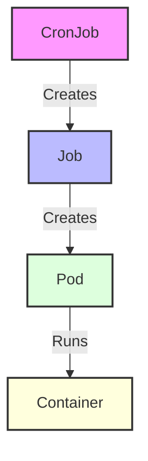

# Kubernetes CronJobs

## Introduction

In the world of container orchestration, automation is key to maintaining efficient systems. **Kubernetes CronJobs** provide a powerful way to schedule recurring tasks within your Kubernetes cluster, similar to the traditional Unix cron jobs many developers are already familiar with.

CronJobs are part of Kubernetes' batch workload API and enable you to run jobs (one-time or periodic tasks) on a time-based schedule. This is particularly useful for:

- Database backups
- Report generation
- Email sending
- Data cleanup tasks
- Periodic data processing
- Health checks

This guide will walk you through understanding, creating, and managing CronJobs in Kubernetes, with practical examples to help you implement them in your own applications.

## Understanding CronJobs

### What is a CronJob?

A CronJob creates Jobs on a repeating schedule, specified using the standard cron format. Each Job created by the CronJob controller runs a container that performs a specific task and then terminates.

### CronJob vs Job vs Pod

To understand where CronJobs fit in the Kubernetes ecosystem:



- **CronJob**: Schedules Jobs to run at specific times
- **Job**: Creates one or more Pods and ensures they run to completion
- **Pod**: The smallest deployable unit in Kubernetes that runs your containers

## Cron Schedule Syntax

CronJobs use the standard cron schedule syntax:

```
┌───────────── minute (0 - 59)
│ ┌───────────── hour (0 - 23)
│ │ ┌───────────── day of month (1 - 31)
│ │ │ ┌───────────── month (1 - 12)
│ │ │ │ ┌───────────── day of week (0 - 6) (Sunday to Saturday)
│ │ │ │ │
│ │ │ │ │
* * * * *
```

Common examples:

- `*/5 * * * *`: Every 5 minutes
- `0 * * * *`: Every hour, at minute 0
- `0 0 * * *`: Every day at midnight
- `0 0 * * 0`: Every Sunday at midnight
- `0 0 1 * *`: First day of every month at midnight

## Creating a Basic CronJob

Let's create a simple CronJob that prints the current date and time every minute.

```yaml
apiVersion: batch/v1
kind: CronJob
metadata:
  name: hello-cronjob
spec:
  schedule: "*/1 * * * *"   # Run every minute
  concurrencyPolicy: Allow  # Allow concurrent job executions
  jobTemplate:
    spec:
      template:
        spec:
          containers:
          - name: hello
            image: busybox:1.28
            imagePullPolicy: IfNotPresent
            command:
            - /bin/sh
            - -c
            - date; echo "Hello from Kubernetes CronJob!"
          restartPolicy: OnFailure
```

Save this as `hello-cronjob.yaml` and apply it to your cluster:

```bash
kubectl apply -f hello-cronjob.yaml
```

### Checking CronJob Status

To check if your CronJob has been created:

```bash
kubectl get cronjobs
```

Output:
```
NAME            SCHEDULE      SUSPEND   ACTIVE   LAST SCHEDULE   AGE
hello-cronjob   */1 * * * *   False     0        30s             2m
```

To see the jobs created by your CronJob:

```bash
kubectl get jobs
```

Output:
```
NAME                       COMPLETIONS   DURATION   AGE
hello-cronjob-1626172860   1/1           5s         1m40s
hello-cronjob-1626172920   1/1           4s         40s
```

To check the output of a job pod:

```bash
# First, find the pod name
kubectl get pods

# Then check its logs
kubectl logs hello-cronjob-1626172860-abcde
```

Output:
```
Mon Jul 13 12:01:00 UTC 2021
Hello from Kubernetes CronJob!
```

## Important CronJob Parameters

### Concurrency Policy

The `concurrencyPolicy` field controls how concurrent executions of a job are handled:

- `Allow` (default): Allows concurrent Jobs to run
- `Forbid`: Prevents concurrent runs; skips the next run if previous hasn't finished
- `Replace`: Cancels the currently running job and replaces it with a new one

Example with `Forbid`:

```yaml
apiVersion: batch/v1
kind: CronJob
metadata:
  name: long-running-job
spec:
  schedule: "*/1 * * * *"
  concurrencyPolicy: Forbid  # Don't start a new job if previous is still running
  jobTemplate:
    spec:
      template:
        spec:
          containers:
          - name: long-process
            image: busybox:1.28
            command:
            - /bin/sh
            - -c
            - "echo Starting; sleep 90; echo Completed"
          restartPolicy: OnFailure
```

### Job History Limits

You can control how many completed and failed jobs are kept with:

- `successfulJobsHistoryLimit`: How many completed jobs to keep (default: 3)
- `failedJobsHistoryLimit`: How many failed jobs to keep (default: 1)

```yaml
apiVersion: batch/v1
kind: CronJob
metadata:
  name: cleanup-job
spec:
  schedule: "0 0 * * *"
  successfulJobsHistoryLimit: 5  # Keep 5 successful jobs
  failedJobsHistoryLimit: 2      # Keep 2 failed jobs
  jobTemplate:
    # Job spec here
```

### Starting Deadline

The `startingDeadlineSeconds` field sets the deadline for starting the job if it misses its scheduled time:

```yaml
apiVersion: batch/v1
kind: CronJob
metadata:
  name: deadline-example
spec:
  schedule: "*/1 * * * *"
  startingDeadlineSeconds: 60  # Must start within 60 seconds of scheduled time
  jobTemplate:
    # Job spec here
```

If a CronJob cannot be scheduled within this deadline (for example, due to resource constraints), it will be marked as "Failed".

## Practical Examples

### Example 1: Database Backup CronJob

This example creates a daily backup of a PostgreSQL database:

```yaml
apiVersion: batch/v1
kind: CronJob
metadata:
  name: postgres-backup
spec:
  schedule: "0 1 * * *"  # Every day at 1:00 AM
  concurrencyPolicy: Forbid
  jobTemplate:
    spec:
      template:
        spec:
          containers:
          - name: backup
            image: postgres:13
            env:
            - name: PGHOST
              value: "postgres-service"
            - name: PGUSER
              valueFrom:
                secretKeyRef:
                  name: postgres-secret
                  key: username
            - name: PGPASSWORD
              valueFrom:
                secretKeyRef:
                  name: postgres-secret
                  key: password
            command:
            - /bin/sh
            - -c
            - |
              BACKUP_FILE="/backups/db_$(date +%Y%m%d_%H%M%S).sql"
              echo "Starting backup to $BACKUP_FILE..."
              pg_dump -U $PGUSER -h $PGHOST mydb > $BACKUP_FILE
              echo "Backup completed successfully"
            volumeMounts:
            - name: backup-volume
              mountPath: /backups
          restartPolicy: OnFailure
          volumes:
          - name: backup-volume
            persistentVolumeClaim:
              claimName: backup-pvc
```

### Example 2: Log Rotation & Cleanup

This example cleans up old log files every week:

```yaml
apiVersion: batch/v1
kind: CronJob
metadata:
  name: log-cleanup
spec:
  schedule: "0 0 * * 0"  # Every Sunday at midnight
  jobTemplate:
    spec:
      template:
        spec:
          containers:
          - name: cleanup
            image: busybox:1.28
            command:
            - /bin/sh
            - -c
            - |
              echo "Starting log cleanup job..."
              find /logs -type f -name "*.log" -mtime +7 -delete
              echo "Deleted old log files"
            volumeMounts:
            - name: logs-volume
              mountPath: /logs
          restartPolicy: OnFailure
          volumes:
          - name: logs-volume
            persistentVolumeClaim:
              claimName: logs-pvc
```

### Example 3: Health Check & Notification

This example performs a health check and sends a notification on failure:

```yaml
apiVersion: batch/v1
kind: CronJob
metadata:
  name: service-health-check
spec:
  schedule: "*/10 * * * *"  # Every 10 minutes
  jobTemplate:
    spec:
      template:
        spec:
          containers:
          - name: health-check
            image: curlimages/curl:7.78.0
            command:
            - /bin/sh
            - -c
            - |
              if ! curl -s --fail http://my-service:8080/health; then
                # In a real scenario, you would send an alert using a notification service
                echo "ALERT: Health check failed at $(date)"
              else
                echo "Health check passed at $(date)"
              fi
          restartPolicy: OnFailure
```

## Best Practices for Using CronJobs

### 1. Set Resource Limits

Always set appropriate resource requests and limits for your CronJob pods:

```yaml
spec:
  jobTemplate:
    spec:
      template:
        spec:
          containers:
          - name: my-cronjob
            resources:
              requests:
                memory: "64Mi"
                cpu: "100m"
              limits:
                memory: "128Mi"
                cpu: "200m"
```

### 2. Add Labels for Organization

Labels help you organize and filter your CronJobs:

```yaml
metadata:
  name: my-cronjob
  labels:
    app: my-app
    type: batch
    component: cleanup
```

### 3. Set Appropriate Time Zones

Kubernetes CronJobs use UTC time by default. Be aware of this when scheduling jobs, especially if your team works in different time zones.

### 4. Keep Jobs Idempotent

Design your CronJobs to be idempotent (can be run multiple times without issues), as they might run more than once in certain failure scenarios.

### 5. Use Suspending for Maintenance

You can temporarily suspend a CronJob without deleting it:

```bash
kubectl patch cronjob my-cronjob -p '{"spec":{"suspend":true}}'
```

To resume:

```bash
kubectl patch cronjob my-cronjob -p '{"spec":{"suspend":false}}'
```

## Debugging CronJobs

If your CronJob isn't working as expected, try these debugging steps:

1. **Check the CronJob status**:
   ```bash
   kubectl describe cronjob my-cronjob
   ```

2. **View the job history**:
   ```bash
   kubectl get jobs --selector=job-name=my-cronjob
   ```

3. **Examine the pod logs**:
   ```bash
   kubectl logs job/my-cronjob-1234567890
   ```

4. **Check for pod events**:
   ```bash
   kubectl get events --field-selector involvedObject.name=my-cronjob-1234567890-abcde
   ```

5. **Validate your cron schedule**:
   Use online cron validators to ensure your schedule is correct.

## Cleaning Up CronJobs

To delete a CronJob and all its associated Jobs:

```bash
kubectl delete cronjob my-cronjob
```

To delete just the CronJob while keeping existing Jobs:

```bash
kubectl delete cronjob my-cronjob --cascade=orphan
```

## Summary

Kubernetes CronJobs provide a powerful way to schedule recurring tasks within your cluster, similar to traditional Unix cron jobs. They are particularly useful for routine maintenance, backups, reporting, and many other automated tasks.

Key points to remember:
- CronJobs use standard cron syntax for scheduling
- Each CronJob creates Jobs which create Pods to run containers
- Concurrency policies control how simultaneous Jobs are handled
- CronJobs can be suspended, resumed, and cleaned up as needed
- Best practices include setting resource limits and keeping jobs idempotent

With CronJobs, you can automate routine tasks and focus your attention on developing your application instead of worrying about maintenance operations.

## Additional Resources

- [Kubernetes Official Documentation on CronJobs](https://kubernetes.io/docs/concepts/workloads/controllers/cron-jobs/)
- [Cron Schedule Expression Editor](https://crontab.guru/) - An online editor for cron schedule expressions

## Exercises

1. Create a CronJob that prints a "Hello World" message every 5 minutes.
2. Modify the job to write the message to a persistent volume instead of just printing it.
3. Implement a CronJob that checks if a website is up and records the results.
4. Create a CronJob with a concurrency policy of "Replace" and test what happens when jobs run longer than the schedule interval.
5. Implement a CronJob that simulates database backups by creating timestamped files in a volume.