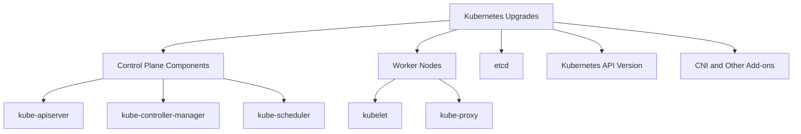

# Kubernetes Upgrades

## Introduction

Upgrading Kubernetes clusters is a critical operational task that administrators need to master. As Kubernetes evolves rapidly with new features, security patches, and bug fixes released regularly, keeping your clusters up-to-date becomes essential for maintaining security, stability, and access to the latest capabilities.

However, upgrading production Kubernetes environments requires careful planning and execution to prevent disruption to running workloads. In this guide, we'll explore the fundamentals of Kubernetes upgrade processes, best practices, and practical examples to help you navigate this crucial aspect of Kubernetes administration.

## Understanding Kubernetes Versioning

Before diving into upgrade procedures, it's important to understand how Kubernetes versioning works.

### Kubernetes Version Format

Kubernetes follows a semantic versioning format: `vX.Y.Z` where:

- **X**: Major version (rarely changes)
- **Y**: Minor version (released approximately every 3-4 months)
- **Z**: Patch version (bug fixes and security patches)

```
v1.27.3
 ↑ ↑  ↑
 │ │  └── Patch version (bug fixes and security updates)
 │ └───── Minor version (new features, released every 3-4 months)
 └─────── Major version
```

### Version Support Policy

Kubernetes typically supports the most recent three minor versions. Each minor version is supported for approximately 12 months after its initial release.

## Types of Kubernetes Upgrades

There are several components in a Kubernetes cluster that might need upgrading:



### Upgrade Strategies

The most common upgrade strategies include:

1. **In-place upgrades**: Upgrading components on existing nodes
2. **Rolling upgrades**: Upgrading one node at a time to minimize downtime
3. **Blue/Green deployments**: Creating a parallel cluster and migrating workloads
4. **Canary deployments**: Testing the upgrade on a subset of nodes first

## Planning Your Kubernetes Upgrade

### Pre-Upgrade Checklist

Before upgrading a Kubernetes cluster, it's important to complete these preparatory steps:

- ✅ Review the release notes and changelog for the target version
- ✅ Check for deprecated API versions that your applications might be using
- ✅ Backup etcd data
- ✅ Verify that your workloads can tolerate temporary disruption
- ✅ Ensure sufficient resources are available during the upgrade process
- ✅ Create a rollback plan in case issues arise

### Version Skew Policy

Kubernetes components have a strict version skew policy that defines supported version differences between components:

- **kube-apiserver**: No other component should be newer than the API server, and components can be up to two minor versions older.
- **kubelet**: Can be up to two minor versions older than the kube-apiserver.
- **kube-controller-manager, kube-scheduler, and cloud-controller-manager**: Should not be newer than the kube-apiserver, and can be up to one minor version older.
- **kubectl**: Can be one minor version newer or older than the kube-apiserver.

## Upgrading a Kubernetes Cluster

Let's explore the process of upgrading a Kubernetes cluster hosted using different methods.

### Upgrading kubeadm Clusters

[kubeadm](https://kubernetes.io/docs/setup/production-environment/tools/kubeadm/create-cluster-kubeadm/) is a popular tool for creating and managing Kubernetes clusters. Here's a step-by-step guide to upgrading a kubeadm cluster:

1. **Upgrade kubeadm itself**:

```bash
# Check the current version
kubeadm version

# Update the package list
sudo apt update

# Upgrade kubeadm
sudo apt install -y kubeadm=1.27.3-00

# Verify the new version
kubeadm version
```

2. **Plan the upgrade** to check for potential issues:

```bash
sudo kubeadm upgrade plan
```

The output will show something like:

```
Components that must be upgraded manually after you have upgraded the control plane with 'kubeadm upgrade apply':
COMPONENT   CURRENT       TARGET
kubelet     1 x v1.26.1   v1.27.3

Upgrade to the latest stable version:

COMPONENT                 CURRENT   TARGET
kube-apiserver            v1.26.1   v1.27.3
kube-controller-manager   v1.26.1   v1.27.3
kube-scheduler            v1.26.1   v1.27.3
kube-proxy                v1.26.1   v1.27.3
CoreDNS                   v1.9.3    v1.10.1
etcd                      3.5.6-0   3.5.7-0
```

3. **Apply the upgrade** on the control plane node:

```bash
# Replace with your desired version
sudo kubeadm upgrade apply v1.27.3
```

4. **Upgrade kubelet and kubectl** on the control plane node:

```bash
# Drain the control plane node
kubectl drain <control-plane-node> --ignore-daemonsets

# Upgrade kubelet and kubectl
sudo apt install -y kubelet=1.27.3-00 kubectl=1.27.3-00

# Restart kubelet
sudo systemctl daemon-reload
sudo systemctl restart kubelet

# Uncordon the node
kubectl uncordon <control-plane-node>
```

5. **Upgrade worker nodes** one at a time:

```bash
# On the control plane node, upgrade kubeadm on the worker
ssh <worker-node>
sudo apt update
sudo apt install -y kubeadm=1.27.3-00

# Upgrade the node configuration
sudo kubeadm upgrade node

# Drain the worker node from the control plane
kubectl drain <worker-node> --ignore-daemonsets

# On the worker node, upgrade kubelet and kubectl
sudo apt install -y kubelet=1.27.3-00 kubectl=1.27.3-00
sudo systemctl daemon-reload
sudo systemctl restart kubelet

# Uncordon the worker node from the control plane
kubectl uncordon <worker-node>
```

### Upgrading Managed Kubernetes Services

For managed Kubernetes services like Google Kubernetes Engine (GKE), Amazon EKS, or Azure AKS, the upgrade process is often simplified:

**Google Kubernetes Engine (GKE)**:
```bash
# List available versions
gcloud container get-server-config --region=us-central1

# Upgrade the control plane
gcloud container clusters upgrade <cluster-name> --master --region=us-central1

# Upgrade all nodes
gcloud container clusters upgrade <cluster-name> --region=us-central1
```

**Amazon EKS**:
```bash
# Update the control plane
aws eks update-cluster-version \
    --name <cluster-name> \
    --kubernetes-version 1.27

# Update a node group
aws eks update-nodegroup-version \
    --cluster-name <cluster-name> \
    --nodegroup-name <nodegroup-name>
```

**Azure AKS**:
```bash
# Check available versions
az aks get-versions --location eastus --output table

# Upgrade the cluster
az aks upgrade \
    --resource-group myResourceGroup \
    --name myAKSCluster \
    --kubernetes-version 1.27.3
```

## Handling API Deprecations During Upgrades

Kubernetes occasionally deprecates APIs. When upgrading to newer versions, you may need to update your manifests and custom resources to use the latest API versions.

### Example: Updating a Deployment API Version

**Old version using deprecated API**:
```yaml
apiVersion: extensions/v1beta1
kind: Deployment
metadata:
  name: nginx-deployment
spec:
  replicas: 3
  template:
    metadata:
      labels:
        app: nginx
    spec:
      containers:
      - name: nginx
        image: nginx:1.14.2
        ports:
        - containerPort: 80
```

**Updated version using current API**:
```yaml
apiVersion: apps/v1
kind: Deployment
metadata:
  name: nginx-deployment
spec:
  selector:
    matchLabels:
      app: nginx
  replicas: 3
  template:
    metadata:
      labels:
        app: nginx
    spec:
      containers:
      - name: nginx
        image: nginx:1.14.2
        ports:
        - containerPort: 80
```

You can identify resources using deprecated APIs with:

```bash
kubectl get all -A -o jsonpath='{range .items[*]}{.apiVersion}{"\t"}{.kind}{"\t"}{.metadata.name}{"
"}{end}' | grep -v "v1"
```

## Testing Upgrades in a Safe Environment

Before upgrading production clusters, it's best to test in a staging environment:

```bash
# Create a test cluster with the current version
kind create cluster --name test-upgrade --image kindest/node:v1.26.3

# Test your workloads on this cluster
kubectl apply -f your-workloads.yaml

# Create another cluster with the target version
kind create cluster --name test-target --image kindest/node:v1.27.3

# Test your workloads on the target version
kubectl --context kind-test-target apply -f your-workloads.yaml
```

## Best Practices for Kubernetes Upgrades

1. **Never skip minor versions**: Upgrade one minor version at a time (e.g., 1.25 → 1.26 → 1.27).
2. **Use proper Pod Disruption Budgets (PDBs)** to ensure availability during node upgrades:

```yaml
apiVersion: policy/v1
kind: PodDisruptionBudget
metadata:
  name: nginx-pdb
spec:
  minAvailable: 2
  selector:
    matchLabels:
      app: nginx
```

3. **Implement proper health checks** in your applications to ensure they can handle being rescheduled.
4. **Schedule upgrades during low-traffic periods**.
5. **Always backup etcd** before upgrading:

```bash
sudo -u etcd /usr/local/bin/etcdctl snapshot save /tmp/etcd-backup.db \
  --endpoints=https://127.0.0.1:2379 \
  --cacert=/etc/kubernetes/pki/etcd/ca.crt \
  --cert=/etc/kubernetes/pki/etcd/server.crt \
  --key=/etc/kubernetes/pki/etcd/server.key
```

6. **Monitor the cluster** during and after the upgrade:

```bash
# Watch nodes during upgrade
kubectl get nodes -w

# Check pod status
kubectl get pods -A -o wide

# Monitor system component status
kubectl get componentstatuses
```

## Troubleshooting Kubernetes Upgrades

### Common Issues and Solutions

#### Control Plane Components Not Starting After Upgrade

**Symptom**: After upgrading, control plane pods are not running.

**Solution**:
```bash
# Check pod status
kubectl get pods -n kube-system

# Check logs
kubectl logs -n kube-system kube-apiserver-<node-name>

# If necessary, retry kubeadm
sudo kubeadm init phase control-plane all
```

#### Nodes Not Joining After Upgrade

**Symptom**: Worker nodes fail to join the cluster after upgrading.

**Solution**:
```bash
# On the worker node, check kubelet status
sudo systemctl status kubelet

# Check kubelet logs
sudo journalctl -u kubelet

# Reset kubeadm if needed
sudo kubeadm reset
```

#### Workloads Using Deprecated APIs

**Symptom**: Applications failing after upgrade due to API version issues.

**Solution**: Use the Kubernetes Deprecation Checker:
```bash
# Using kube-no-trouble tool
kubectl-Doctor scan
```

## Real-World Upgrade Example: Production System

Let's walk through a complete upgrade scenario for a production system:

### Scenario: Upgrading a 5-node kubeadm cluster from v1.26.1 to v1.27.3

**1. Create an upgrade plan**:

```text
Upgrade Plan:
- Backup etcd data
- Upgrade control plane node
- Upgrade each worker node sequentially (4 nodes)
- Verify application functionality after each step
- Have a rollback plan ready
```

**2. Communicate the maintenance window**:

```text
Maintenance Notice:
We will be upgrading our Kubernetes cluster from v1.26.1 to v1.27.3
Date: March 15, 2023
Time: 22:00-02:00 UTC
Impact: Brief periods of API unavailability during control plane upgrade.
       Worker nodes will be upgraded one by one with potential pod rescheduling.
```

**3. Backup etcd data**:

```bash
sudo -u etcd /usr/local/bin/etcdctl snapshot save /backup/etcd-backup-1.26.1-$(date +%Y%m%d).db \
  --endpoints=https://127.0.0.1:2379 \
  --cacert=/etc/kubernetes/pki/etcd/ca.crt \
  --cert=/etc/kubernetes/pki/etcd/server.crt \
  --key=/etc/kubernetes/pki/etcd/server.key
```

**4. Upgrade the control plane node**:

```bash
# Run all previously described control plane upgrade steps
```

**5. Upgrade worker nodes one by one**:

```bash
# For each worker node, run all previously described worker node upgrade steps
```

**6. Verify the upgrade**:

```bash
# Check node versions
kubectl get nodes -o wide

# Verify system pods are running
kubectl get pods -n kube-system

# Run application test suite
./app-test-suite.sh
```

**7. Document the upgrade**:

```text
Upgrade Report:
- Successfully upgraded from v1.26.1 to v1.27.3
- Duration: 3 hours
- Issues encountered: None
- Next planned upgrade: September 2023 (to v1.28)
```

## Summary

Kubernetes upgrades are a necessary operational task that requires careful planning and execution. In this guide, we've covered:

- Understanding Kubernetes versioning
- Different types of upgrades
- Planning and preparation for upgrades
- Step-by-step procedures for different environments
- Handling API deprecations
- Best practices for successful upgrades
- Troubleshooting common issues
- A real-world example of a production upgrade

By following these guidelines and establishing a regular upgrade cadence, you can ensure your Kubernetes clusters remain secure, stable, and up-to-date with the latest features.

## Additional Resources

- [Official Kubernetes Upgrade Documentation](https://kubernetes.io/docs/tasks/administer-cluster/kubeadm/kubeadm-upgrade/)
- [Kubernetes Version Skew Policy](https://kubernetes.io/docs/setup/release/version-skew-policy/)
- [Managing API Deprecation](https://kubernetes.io/docs/reference/using-api/deprecation-guide/)

## Exercises

1. Set up a test cluster using kind or minikube and practice upgrading it to a newer version.
2. Create a comprehensive upgrade plan template for your organization's Kubernetes clusters.
3. Analyze your current workloads for deprecated API usage and create a migration plan.
4. Implement Pod Disruption Budgets for critical workloads to ensure availability during upgrades.
5. Set up monitoring alerts specifically for detecting issues during and after cluster upgrades.