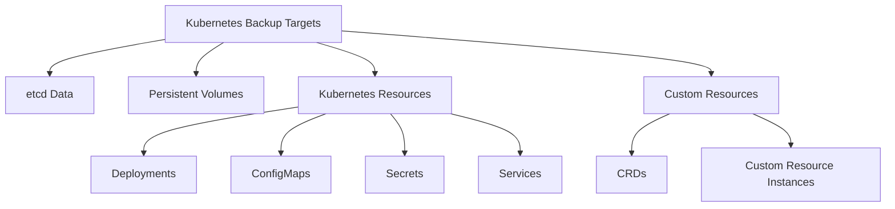

# Kubernetes Backup

## Introduction

Kubernetes has become the de facto standard for container orchestration, managing mission-critical applications across organizations of all sizes. However, even the most robust Kubernetes clusters can experience failures due to human error, infrastructure issues, or software bugs. This is where backup strategies become essential.

In this guide, we'll explore why backups are crucial for Kubernetes environments, examine different backup approaches, and walk through practical implementation steps to secure your cluster resources.

## Why Backup Kubernetes?

Kubernetes clusters store various types of critical data:

- **etcd database**: Contains all cluster state information
- **Persistent volumes**: Stores application data
- **Custom resource definitions (CRDs)**: Defines extensions to the Kubernetes API
- **ConfigMaps and Secrets**: Hold configuration and sensitive information

Without proper backups, you risk:

- **Permanent data loss**: If a cluster fails catastrophically
- **Extended downtime**: Longer recovery times without backup points
- **Configuration drift**: Loss of carefully crafted resource configurations
- **Compliance issues**: Many regulatory frameworks require backup procedures

## Kubernetes Backup Components

Let's explore what needs to be backed up in a Kubernetes environment:



### 1. etcd Backup

The etcd database is the heart of your Kubernetes cluster, storing all cluster state including resource definitions, configurations, and status information.

#### Creating an etcd Snapshot

To back up etcd, you'll create a snapshot of its database:

```bash
# For Kubernetes installed with kubeadm
sudo ETCDCTL_API=3 etcdctl snapshot save /backup/etcd-snapshot.db \
  --endpoints=https://127.0.0.1:2379 \
  --cacert=/etc/kubernetes/pki/etcd/ca.crt \
  --cert=/etc/kubernetes/pki/etcd/server.crt \
  --key=/etc/kubernetes/pki/etcd/server.key
```

Always verify your backups:

```bash
# Verify the snapshot
sudo ETCDCTL_API=3 etcdctl --write-out=table snapshot status /backup/etcd-snapshot.db

# Example output:
# +----------+----------+------------+------------+
# |   HASH   | REVISION | TOTAL KEYS | TOTAL SIZE |
# +----------+----------+------------+------------+
# | fe01cf57 |    10983 |       1024 |     1.0 MB |
# +----------+----------+------------+------------+
```

#### Restoring from an etcd Snapshot

In case of cluster failure, you can restore from a snapshot:

```bash
# Stop the kubelet and etcd services
sudo systemctl stop kubelet
sudo systemctl stop etcd

# Restore the snapshot
sudo ETCDCTL_API=3 etcdctl snapshot restore /backup/etcd-snapshot.db \
  --data-dir=/var/lib/etcd-restore \
  --name=master \
  --initial-cluster=master=https://127.0.0.1:2380 \
  --initial-cluster-token=etcd-cluster-token \
  --initial-advertise-peer-urls=https://127.0.0.1:2380

# Update etcd configuration to use the restored data
sudo mv /var/lib/etcd /var/lib/etcd.old
sudo mv /var/lib/etcd-restore /var/lib/etcd

# Restart services
sudo systemctl start etcd
sudo systemctl start kubelet
```

### 2. Resource Backup with kubectl

For a simple approach to backup specific resources, you can use `kubectl`:

```bash
# Backup all deployments in the default namespace
kubectl get deployments -o yaml > deployments-backup.yaml

# Backup all resources in the application namespace
kubectl get all -n application -o yaml > application-namespace-backup.yaml
```

While this method is straightforward, it doesn't scale well for large clusters and lacks features like incremental backups or scheduled operations.

### 3. Using Velero for Comprehensive Backup

[Velero](https://velero.io/) (formerly Heptio Ark) is a specialized tool for backing up and restoring Kubernetes cluster resources and persistent volumes.

#### Installing Velero

First, install the Velero CLI:

```bash
# Download Velero
wget https://github.com/vmware-tanzu/velero/releases/download/v1.11.0/velero-v1.11.0-linux-amd64.tar.gz

# Extract the tarball
tar -xvf velero-v1.11.0-linux-amd64.tar.gz

# Move the binary to your PATH
sudo mv velero-v1.11.0-linux-amd64/velero /usr/local/bin/
```

Next, install Velero in your cluster (this example uses AWS S3):

```bash
# Create credentials file for AWS
cat << EOF > credentials-velero
[default]
aws_access_key_id = YOUR_ACCESS_KEY
aws_secret_access_key = YOUR_SECRET_KEY
EOF

# Install Velero in the cluster
velero install \
  --provider aws \
  --plugins velero/velero-plugin-for-aws:v1.6.0 \
  --bucket velero-backup \
  --backup-location-config region=us-east-1 \
  --snapshot-location-config region=us-east-1 \
  --secret-file ./credentials-velero
```

#### Creating Backups with Velero

Velero allows you to back up entire namespaces or specific resources:

```bash
# Back up an entire namespace
velero backup create nginx-backup --include-namespaces nginx-example

# Back up specific resources
velero backup create nginx-deployment-backup \
  --include-namespaces nginx-example \
  --include-resources deployments,services
  
# Create a scheduled backup (every day at 1 AM)
velero schedule create daily-nginx-backup \
  --schedule="0 1 * * *" \
  --include-namespaces nginx-example
```

Check backup status:

```bash
velero backup get

# Example output:
# NAME                STATUS      ERRORS   WARNINGS   CREATED                         EXPIRES   STORAGE LOCATION   SELECTOR
# nginx-backup        Completed   0        0          2023-04-18 09:24:53 +0000 UTC   29d       default            <none>
```

#### Restoring from Velero Backups

When you need to restore your resources:

```bash
# List available backups
velero backup get

# Restore a specific backup
velero restore create --from-backup nginx-backup

# Restore to a different namespace
velero restore create --from-backup nginx-backup --namespace-mappings nginx-example:nginx-restored
```

Verify the restore operation:

```bash
velero restore get

# Example output:
# NAME                            BACKUP         STATUS      STARTED                         COMPLETED                       ERRORS   WARNINGS   CREATED                         SELECTOR
# nginx-backup-20230418094230     nginx-backup   Completed   2023-04-18 09:42:30 +0000 UTC   2023-04-18 09:42:35 +0000 UTC   0        0          2023-04-18 09:42:30 +0000 UTC   <none>
```

### 4. Backing up Persistent Volumes

Persistent volumes require special attention as they contain your application data. Velero supports backing up persistent volumes using volume snapshots.

#### With Velero and Cloud Provider Snapshots

```bash
# Create backup including PVs
velero backup create full-cluster-backup --include-namespaces=default,app --snapshot-volumes

# Restore with PVs
velero restore create --from-backup full-cluster-backup --restore-volumes
```

#### Persistent Volume Backup Strategy

For critical applications, consider implementing:

1. **Regular snapshots**: For quick recovery of recent state
2. **Full backups**: For complete disaster recovery
3. **Cross-region replication**: For protection against regional failures

## Implementing a Backup Strategy

A comprehensive Kubernetes backup strategy should include:

### 1. Establish Backup Policies

Define your Recovery Point Objective (RPO) and Recovery Time Objective (RTO):

- How much data can you afford to lose?
- How quickly must you recover?

Based on these requirements, determine:

- Backup frequency
- Retention periods
- Storage locations

### 2. Schedule Regular Backups

Automate your backup process:

```bash
# Daily backup of critical namespaces with 30-day retention
velero schedule create daily-critical-backup \
  --schedule="0 1 * * *" \
  --include-namespaces production,database \
  --ttl 720h \
  --snapshot-volumes
  
# Hourly backup of etcd
# Add to crontab:
# 0 * * * * sudo ETCDCTL_API=3 etcdctl snapshot save /backup/etcd-$(date +\%Y\%m\%d\%H).db --endpoints=https://127.0.0.1:2379 --cacert=/etc/kubernetes/pki/etcd/ca.crt --cert=/etc/kubernetes/pki/etcd/server.crt --key=/etc/kubernetes/pki/etcd/server.key
```

### 3. Test Restore Procedures

Regularly validate your backup and restore process:

```bash
# Create a test namespace
kubectl create namespace backup-test

# Deploy a test application
kubectl -n backup-test apply -f test-deployment.yaml

# Create a backup
velero backup create backup-test --include-namespaces backup-test

# Simulate disaster by deleting the namespace
kubectl delete namespace backup-test

# Restore from backup
velero restore create --from-backup backup-test

# Verify restoration
kubectl get all -n backup-test
```

### 4. Document the Process

Create clear documentation for both backup and restore procedures:

1. When and how backups are created
2. Where backups are stored
3. Step-by-step restore instructions
4. Escalation contacts in case of emergency

## Real-World Example: Database Backup and Recovery

Let's walk through a complete example of backing up and restoring a stateful application - a PostgreSQL database running in Kubernetes.

### Setup a PostgreSQL Database

```yaml
# postgres-deployment.yaml
apiVersion: apps/v1
kind: StatefulSet
metadata:
  name: postgres
  namespace: database
spec:
  serviceName: "postgres"
  replicas: 1
  selector:
    matchLabels:
      app: postgres
  template:
    metadata:
      labels:
        app: postgres
    spec:
      containers:
      - name: postgres
        image: postgres:14
        env:
        - name: POSTGRES_PASSWORD
          valueFrom:
            secretKeyRef:
              name: postgres-secret
              key: password
        ports:
        - containerPort: 5432
          name: postgres
        volumeMounts:
        - name: postgres-data
          mountPath: /var/lib/postgresql/data
  volumeClaimTemplates:
  - metadata:
      name: postgres-data
    spec:
      accessModes: [ "ReadWriteOnce" ]
      resources:
        requests:
          storage: 10Gi
```

Apply this configuration:

```bash
kubectl create namespace database
kubectl apply -f postgres-deployment.yaml -n database
```

### Back Up the Database

First, let's back up the entire database namespace with Velero:

```bash
# Create a backup including persistent volumes
velero backup create postgres-backup --include-namespaces database --snapshot-volumes
```

For a more database-aware backup, you might also want to use PostgreSQL's native tools:

```bash
# Run a pg_dump inside the container
kubectl -n database exec postgres-0 -- bash -c 'PGPASSWORD=$POSTGRES_PASSWORD pg_dump -U postgres > /var/lib/postgresql/data/backup.sql'
```

### Simulating a Disaster

Let's simulate a catastrophic failure by deleting the namespace:

```bash
kubectl delete namespace database
```

### Restoring the Database

Now, restore from our Velero backup:

```bash
velero restore create postgres-restore --from-backup postgres-backup
```

Verify the restoration:

```bash
kubectl get pods -n database

# Example output:
# NAME         READY   STATUS    RESTARTS   AGE
# postgres-0   1/1     Running   0          45s
```

Connect to the database to confirm data integrity:

```bash
kubectl -n database exec -it postgres-0 -- psql -U postgres

# Inside PostgreSQL, check for your tables:
# postgres=# \dt
# Should show your tables
```

## Best Practices for Kubernetes Backups

1. **Follow the 3-2-1 backup rule**:
   - Have at least 3 copies of your data
   - Store backups on 2 different storage types
   - Keep 1 backup offsite

2. **Version your backups**: Label backups with dates, environment details, and purpose

3. **Automate backup verification**: Regularly test your backups by performing restore operations

4. **Monitor backup jobs**: Set up alerts for failed backup operations

5. **Secure your backups**: Apply encryption and access controls to backup storage

6. **Backup before changes**: Create backups before major cluster changes or upgrades

## Summary

Implementing a robust backup strategy is a critical component of Kubernetes administration. By regularly backing up etcd, cluster resources, and persistent volumes, you can protect against data loss and minimize downtime in case of failures.

In this guide, we've covered:

- Why Kubernetes backups are essential
- Multiple backup methods including etcd snapshots, kubectl, and Velero
- Implementing a comprehensive backup strategy
- Testing restore procedures
- A real-world example with PostgreSQL

Remember that a backup strategy is only as good as your ability to restore from it. Regular testing of restoration procedures is just as important as creating the backups themselves.

## Additional Resources

- [Velero Documentation](https://velero.io/docs/)
- [Kubernetes etcd Documentation](https://kubernetes.io/docs/tasks/administer-cluster/configure-upgrade-etcd/)
- [Kubernetes Data Protection Working Group](https://github.com/kubernetes/community/tree/master/wg-data-protection)

## Exercises

1. Set up Velero in your test cluster and create a backup schedule for a namespace
2. Perform a backup and restore of an etcd database
3. Create a disaster recovery plan document for your Kubernetes cluster
4. Practice restoring a stateful application from a backup
5. Implement backup validation automation using a script that creates test resources, backs them up, deletes them, and verifies restoration